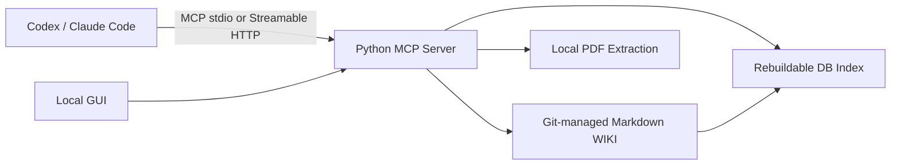

# Research MCP WIKI Tool PRD

Status: first local milestone implemented
Updated: 2026-06-01

## 1. Product Goal

Build a lab-shared research WIKI with an MCP server and local GUI. The system must help researchers and AI coding clients preserve paper knowledge, extract reusable concepts, compare related work, maintain research claims and questions, and support novelty-review workflows.

The first milestone is a locally verifiable product. It does not deploy to an external server and does not call an LLM API from the server.

## 2. Users

- Lab researchers: browse, search, edit, review, and recover shared WIKI content.
- Codex and Claude Code: use MCP resources, tools, and prompts to perform model-dependent research reasoning.
- Maintainers: run the server and GUI, configure the shared token, rebuild the index, and inspect Git history.

## 3. Product Principles

- Markdown is canonical.
- Git records history and provides recovery.
- The database is a rebuildable index, never the source of truth.
- AI-authored content starts as `draft`.
- Researchers promote confirmed content to `reviewed`.
- MCP exposes both reads and writes.
- The first server remains deterministic and does not hold LLM API credentials.

## 4. First-Milestone Architecture

## 5. Canonical WIKI Model

Supported Markdown page types:

| Type | Purpose |
| --- | --- |
| `source` | Structured paper notes with evidence anchors |
| `concept` | Reusable mechanism-level ideas across papers |
| `comparison` | Optional cross-paper synthesis |
| `claim` | User-driven research claims and prior-art risks |
| `question` | User-driven open research questions |
| `system` | WIKI operating documentation |
| `skill` | Reusable AI-agent workflow instructions |

Required metadata includes page type, title, status, updated time, confidence, sources, and tags. PDF-grounded pages record file paths and page or section anchors.

## 6. Paper Ingestion Workflow

1. User chooses a local PDF.
2. User chooses `text extraction` or `image + text screenshot` reading.
3. User chooses Korean reflection by default or explicitly requests English reflection.
4. For screenshot reading, user may choose a page range.
5. MCP server extracts deterministic PDF artifacts while preserving original text.
6. Codex or Claude Code reads the artifacts and writes `source` and `concept` reflections through MCP in the requested language.
7. The server stores Markdown changes and refreshes the derived index.
8. The GUI changes the paper state from red to blue.
9. If the user requests comparison synthesis, the client writes a `comparison` page and the GUI shows a badge.

`claim` and `question` pages are separate user-driven workflows, not automatic outputs of one paper.

## 7. MCP Surface

### Resources

- WIKI page content and metadata.
- Paper metadata and ingest status.
- Index views grouped by type, status, tag, and links.
- Prompt and workflow descriptions.

### Tools

| Tool Area | Implemented Behavior |
| --- | --- |
| WIKI search | Query derived index and return matching pages |
| WIKI read/write | Read, create, and edit canonical Markdown |
| PDF ingest | Extract local PDF text or screenshot artifacts |
| Index rebuild | Regenerate DB index from Markdown |
| Draft review | Promote `draft` pages to `reviewed` |
| Comparison | Prepare optional comparison reflection workflow |
| Claims | Create and update user-driven claim pages |
| Questions | Create and update research-question pages |
| Claim fitness | Provide client workflow inputs and persistence |
| Novelty review | Provide client workflow inputs and persistence |

### Prompts

- Paper ingest and WIKI reflection.
- Claim refinement and fitness assessment.
- Novelty review.

## 8. MCP Transports And Security

- Support `stdio` for local development and standalone use.
- Support local-verification `Streamable HTTP`.
- Require a shared token for Streamable HTTP.
- Keep token configuration outside Git.

## 9. GUI Scope

The GUI is included in the first milestone and should support:

- Paper list with ingest state.
- Red state for papers not yet ingested.
- Blue state after `source` and `concept` reflection.
- Blue state plus comparison badge after optional comparison generation.
- Search and filtered browsing.
- Markdown page viewing and editing.
- Local PDF ingest configuration.
- Reading-mode and screenshot page-range selection.
- Korean-default and English-optional reflection language selection.
- Draft-review actions.
- Derived-index rebuild action.
- MCP capability status browsing and startup-time enable or disable controls.
- A visible notice that capability setting changes apply after the MCP server restarts.
- Useful workflow detail beyond a minimal list when it supports research use.

## 10. Out Of Scope

- External server deployment.
- DOI, arXiv URL, and web URL ingest.
- Shared-folder watching.
- Per-user accounts and fine-grained permissions.
- Automatic backup beyond Git history.
- Server-side LLM API invocation.

## 11. Implementation Phases

### Phase 1: Foundations

- Python package and configuration.
- Markdown WIKI schema and repository layout.
- Git integration.
- Rebuildable database index.

### Phase 2: MCP Core

- `stdio` transport.
- Streamable HTTP transport with shared token.
- WIKI resources and read/write tools.
- Index and PDF extraction tools.

### Phase 3: Research Workflows

- Client-facing prompts.
- Paper reflection persistence.
- Optional comparison workflow.
- User-driven claim and question workflows.
- Draft-review transition.

### Phase 4: GUI

- Paper states and comparison badges.
- Search and page browser.
- Markdown editor.
- Ingest settings and page-range controls.
- Draft review and index rebuild.

### Phase 5: Verification And Documentation

- MCP connection checks for Codex and Claude Code.
- Local end-to-end smoke tests.
- Finalize `README.md` execution instructions.

## 12. Acceptance

The first milestone is accepted when the checks in `specs/acceptance.md` pass.
