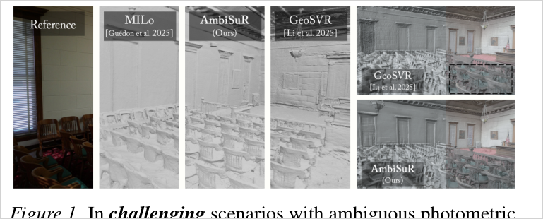
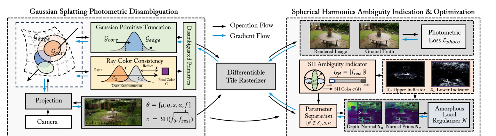
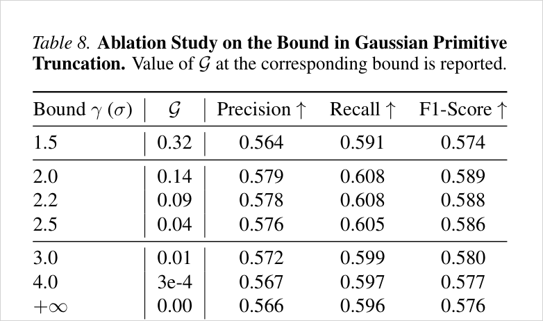
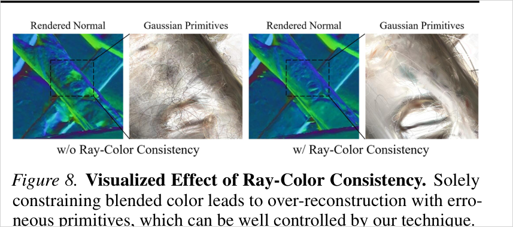
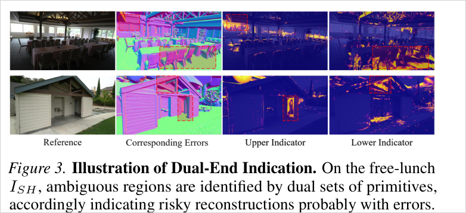
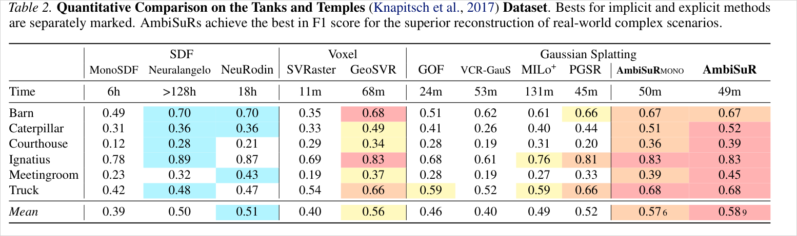
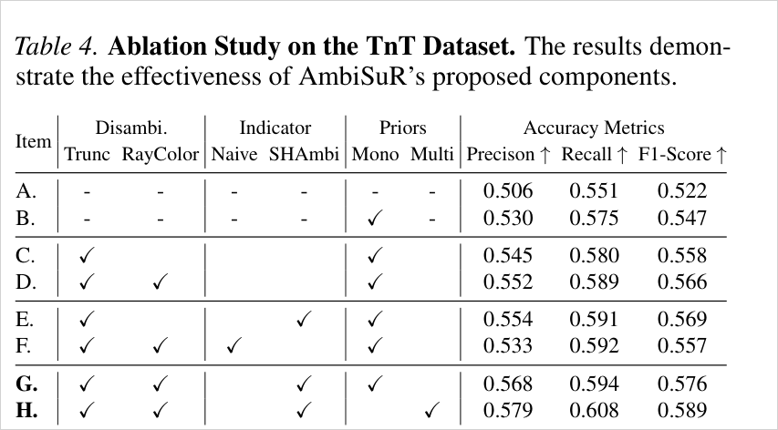
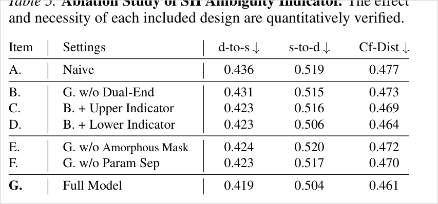

# AmbiSuR: Revisiting Photometric Ambiguity for Accurate Gaussian-Splatting Surface Reconstruction

**게재: ICML 2026 accept 확정** (arXiv:2605.12494v1, 2026-05-12 제출. arXiv Comments = `Accepted at ICML 2026`, 프로젝트 페이지 BibTeX `booktitle={International Conference on Machine Learning}, year={2026}` 확인 2026-07-20).
⚠ PDF 1페이지 각주는 `Preprint. May 13, 2026.`으로 남아 있음 — ICML 템플릿 기본 문구이며 camera-ready 전 버전. **PDF만 보고 미게재로 판단하면 안 됨.** 저자: Jiahe Li 외 (Beihang Univ. / NUS / Macquarie / Tohoku, 교신 Xiao Bai·Jin Zheng). 프로젝트 페이지: https://fictionarry.github.io/AmbiSuR-Proj/

> photometric ambiguity를 "외부 prior로 덮는" 대신 **3DGS 표현 자체의 내재적 모호성 2개**(primitive edge / color blending)를 제거하고, **SH 고차 계수의 L2 norm을 공짜 모호성 지표**로 삼아 상·하위 percentile primitive에만 normal prior를 선택 투입한다. PGSR 위에서 TnT F1 0.589(SOTA), DTU Chamfer 0.46.

## 한눈에

| 항목 | 내용 |
|---|---|
| 문제 | photometric consistency가 깨지는 영역(textureless·반사·저관측·어두움)에서 multi-view triangulation이 ill-posed → GS surface recon이 무너짐. 기존 대응은 "복잡한 ray modeling(반사 전용)" 아니면 "거친 외부 regularization"뿐 |
| 핵심 아이디어 | (a) **표현 측 disambiguation**: Gaussian 꼬리를 γσ에서 잘라내고(Truncation), ray 위 primitive들의 색 분산을 억제(Ray-Color Consistency). (b) **감독 측 indication**: `I_SH = ‖f_rest‖²`로 모호 primitive를 상·하위 양단에서 골라 그 primitive에만 normal prior 부여 |
| 입력 | multi-view 이미지 + COLMAP pose + geometry foundation model depth (metric: Depth Anything 3 / mono: DAV2) |
| 출력 | TSDF로 추출한 mesh + 렌더링. baseline은 PGSR(3DGS 계열) |
| 주요 결과 | TnT mean F1 **0.589**(GeoSVR 0.56, PGSR 0.52, MILo⁺ 0.49, GOF 0.46), DTU mean Chamfer **0.46**(GeoSVR 0.47, MILo 0.68), 학습 ~50분 |
| 한 줄 novelty | **이미 학습 중인 SH 고차 계수를 "추가 비용 0의 모호성 지표"로 재해석하고, 그 양단 5~10%에만 prior를 거는 선택적 정규화** — 균일 prior는 오히려 해롭다는 것을 ablation(F 0.557 vs D 0.566)으로 증명 |
| 안 푸는 것 | 복잡한 광전파(반사·굴절) 모델링, unbounded 주변부 mesh의 GT 평가, densification 자체 개입, 학습 **전** 예측(모든 신호가 학습 중 사후 값) |



---

## 1. 문제와 동기 (Paper Says)

### 1.1 근본 전제의 붕괴
GS surface recon의 논리는 "multi-view photometric consistency를 최소화하면 유일한 기하 해가 나온다"이다. 그러나 현실에서 consistency는 완전할 수 없다 — `insufficient, varied, or lost information`. 이때 해당 영역의 triangulation은 ill-posed가 되고, 논문 표현으로 **under-constrained reconstruction**이 남는다.

### 1.2 기존 대응의 3분류와 각각의 한계 (Related Work)
1. **local plane 확장**(Darmon'22, Geo-NeuS, PGSR, GeoSVR): photometric이 국소적으로는 매칭될 때만 작동.
2. **geometry foundation model 주입**(MonoSDF, VCR-GauS, GeoSVR 등): 강력하지만 — 저자 표현으로 —
   > 3DGS에서 **모호한 영역을 식별하는 문제가 미해결**이라 효과를 최대화하지 못한다.
   (`it's unsolved in 3DGS to identify ambiguous regions to maximize the effect`, p.2)
3. **ray tracing 기반**(Yao'25, Zhang'25b): 반사면 전용(`reflection-oriented only`).

⇒ 세 갈래 모두 **모호성의 근원(root impact)을 건드리지 않는다**는 것이 저자의 진입점. 그래서 "표현"과 "감독" 두 축으로 되짚는다(revisit).

### 1.3 중요한 전제 (읽을 때 놓치기 쉬움)
AmbiSuR은 prior-free가 아니다. §3.1 말미에서 명시적으로
> `we inherit the strong but imperfect depth priors as basic prerequisites`

즉 **depth prior 존재를 전제로 깔고**, 그 prior를 *어디에 얼마나* 넣을지를 다루는 논문이다. Table 4의 A(0.522)→B(0.547)가 prior 단독 기여이고, 논문의 실제 기여는 그 위의 0.547→0.589다.

---

## 2. 핵심 방법 (Paper Says)



### 2.1 Primitive Edge Ambiguity → Gaussian Primitive Truncation

**진단**: 투영된 Gaussian을 core `G_core`와 edge `G_edge`(≪1)로 나누면, 렌더 opacity는 두 부분의 합이다. 그런데 최적화가 **비대칭**이다 — core는 photometric을 맞추려 팽창 압력을 강하게 받는데, edge는 넓은 화면 면적을 잘못 덮고도 그것을 되돌릴 gradient가 사실상 없다.

**처방**: 렌더링 opacity 계산 시 `‖x − µ_i‖ ≤ γσ_i` 밖의 꼬리를 **버린다**(γ=2). 아키텍처 무관(architecture-agnostic)하고 비용이 없다.

> **부록 A가 이 논문에서 가장 단단한 부분.** 꼬리를 자르자는 것은 압축 계열에서 흔하지만, AmbiSuR은 **왜 2σ인지를 gradient 적분으로 유도**한다 (§3. 핵심 수식 참조). γ=1.5(임계 미만)에서 F1이 0.574로 떨어지고 2.0~2.5에서 안정적으로 높은 것이 이론과 맞아떨어진다.



### 2.2 Photometric Blending Ambiguity → Ray-Color Consistency

**진단**: `min ‖C − C_gt‖`는 **합산 결과에만** 걸리는 제약이다. 개별 primitive의 색은 미결정으로 남고, optimizer는 "여러 primitive의 복잡한 가림 관계로 view-dependent 효과를 흉내내는" 지름길을 택한다 → over-reconstruction.

**처방**: ray를 따라 blending weight `w_i`를 확률질량함수로 보면 렌더 색은 기댓값 `C = E[c]`. 그 **가중 분산**을 벌점으로 준다. `c_i` 외 모든 변수는 detach.

> 이것은 CoMe의 color-variance loss와 같은 계열이다 — 다만 CoMe는 **GT 픽셀색** 주위로 정렬시키고, AmbiSuR은 **자기 렌더 평균** 주위로 정렬시킨다. → [[per-primitive-blending-variance-loss]]



### 2.3 SH Ambiguity Indication (논문의 간판)

**핵심 재해석**: SH는 구면 위 직교 기저다. `l=0`은 view-independent 평균색, `l≥1`은 "완벽한 구 가정에서의 이탈". 따라서 **고차 계수 제곱합이 곧 view-dependent 색 에너지**이며, 이것이 그 primitive가 겪고 있는 photometric 상황을 말해준다:

```
I_SH = Σ_i β_i² = ‖f_rest‖²₂
```

추가 계산·추가 파라미터가 0이라 저자는 `free-lunch indicator`라 부른다.

**Dual-End Indication** — 위험은 양쪽 끝에 있다:

| 끝 | 선택 | 의미 (논문) |
|---|---|---|
| **Upper** (상위 η_U=5%) | `I_SH > P(1−η_U)` | 모순된 supervision을 받고 있거나, 부정확한 재구성이 색으로 흡수되고 있음 |
| **Lower** (하위 η_L=5~10%) | `I_SH < P(η_L)` | **직관과 반대 지점.** 잘 제약된 Lambertian 표면도 최적화 중 "타협 상태"로 photometric 잔차를 SH에 일부 기록하므로 `I_SH`가 0에 가깝지 않다. 따라서 **극단적으로 낮은 `I_SH`는 photometric supervision이 부족했거나 외관이 잘못 구워진 곳**을 가리킨다 |

percentile 기반 **동적** 선택인 이유: `I_SH` 분포가 iteration마다 빠르게 변해 절대 임계값이 못 버티기 때문.



### 2.4 Amorphous Local Regularizer

선택된 집합 `S = S_U ∪ S_L`에만 normal prior를 거는데, 두 겹의 "정밀 조준"이 붙는다.

1. **Parameter Separation**: `S`에 없는 primitive의 파라미터를 **freeze**(gradient 차단). 나아가 `S` 안에서도 **opacity α와 scaling s는 제외** — 표면 관련 핵심 속성(위치·회전)만 건드려 디테일이 뭉개지는 것을 막는다.
2. **Amorphous Mask**: 선택된 primitive를 α-blending 그대로 화면에 투영해 soft mask `M`을 만들고, normal loss에 곱한다. 대상 primitive가 화면상 연속 영역이 아니라 **파편적·이산적(amorphous)으로 흩어져 있기 때문**에 필요한 장치.

---

## 3. 핵심 수식

### (a) Gaussian Primitive Truncation
```
α̃_T(x) = α·G_core(x)·𝟙_core ,   𝟙_core = 𝟙(‖x − µ_i‖ ≤ γσ_i),  γ = 2
```

### (b) 부록 A — 왜 2σ인가 (이 논문의 이론 코어)
Mahalanobis 거리 `r`에 대해 covariance gradient 크기의 반응함수와, 면적 성장(2D에서 `r`에 비례)을 곱한 적분 커널:
```
g(r) = r²·e^(−r²/2)          # gradient 크기
J(r) = r·g(r) = r³·e^(−r²/2)  # 면적 가중 누적 커널

S_core(r_b) = ∫₀^{r_b} J dr = 2 − e^(−r_b²/2)(r_b² + 2)
S_edge(r_b) = ∫_{r_b}^∞ J dr =     e^(−r_b²/2)(r_b² + 2)     ← 유한! 면적은 ∞로 커져도 지수감쇠가 이김

η(r_b) = S_core/S_edge = 2e^(r_b²/2)/(r_b²+2) − 1
η(r_crit) = 1  ⇒  e^(r²/2) = r² + 2  ⇒  r_crit ≈ 1.83
```
**해석**: `r_b > 1.83`이면 core의 팽창 구동력이 edge의 교정 능력을 **구조적으로** 압도한다. 즉 꼬리의 과팽창은 튜닝 실패가 아니라 **되돌릴 수 없는 최적화 편향**이다. γ=2를 쓰는 근거가 여기서 나온다(2 > 1.83).

| r_b | S_edge : S_core | G(r_bσ) |
|---|---|---|
| 1.50 | 2.22 : 1 | 0.324 |
| **1.83** | **1.00 : 1** | 0.187 |
| 2.00 | 0.68 : 1 | 0.135 |
| 3.00 | 0.06 : 1 | 0.011 |

### (c) Ray-Color Consistency
```
C = E[c] = Σ_i w_i c_i ,   w_i = α̃_i ∏_{j<i}(1 − α̃_j)
R(r) = E[‖c − E[c]‖²] = Σ_i w_i ‖c_i − C‖²₂        # c_i 외 전부 detach
```

### (d) SH 모호성 지표 (부록 B)
```
C(d) = C̄ + C_rest(d),  C_rest(d) = Σ_i β_i Y_i(d)
E_c = ∫_{S²} |C(d) − C̄|² dω = Σ_i β_i² λ_i
```
3DGS는 정규직교 기저(λ_i = 1)를 쓰므로 `E_c ∝ I_SH = ‖f_rest‖²₂`. 구면 Parseval 정리로도 같은 결론 — **지표는 view-dependent 색 변화의 총에너지**.

### (e) 부록 C — Lower Indicator의 근거 (읽을 가치 있음)
densification이 진행 중인 대부분의 시간 동안 primitive 수 `N_t ≪ N*`(충실한 재구성에 필요한 수)이다. 그러면 view-independent 파라미터 `Θ_base`만으로는 못 없애는 **구조적 잔차 `E_struct`가 반드시 남는다**:
```
E_struct = P_gt − φ(0; Θ_base) − E_v.d ,   ‖E_struct‖ > 0
min_{Θ_rest} ‖E_struct + E_v.d − Δ_rest(d; Θ)‖
```
⇒ optimizer는 **기하로 못 푸는 오차를 view-dependent SH에 오버핏시켜 굽는다**. 그래서 정상 영역조차 `I_SH`가 0이 아니고, **비정상적으로 낮은 `I_SH`는 애초에 photometric 감독을 충분히 못 받았다는 신호**가 된다.

### (f) 목적함수
```
ℒ = ℒ_photo + τ·ℒ_geo + µ₁·N + µ₂·R      # τ=0.1, µ₁=0.1, µ₂=1e−5
N = Mean(M · (1 − N_D · N_P)),  M = Σ_i 𝟙(i∈S)·α̃_i ∏_{j<i}(1−α̃_j)
```

---

## 4. 실험 근거

### 4.1 세팅
- **baseline = PGSR**(MILo 아님), 30k iter, RTX 3090 Ti, TSDF로 mesh 추출
- **AmbiSuR**(표준) = Depth Anything 3 metric depth + L1 depth loss + depth 역투영 point cloud(상위 20% confidence)로 초기화
- **AmbiSuR-Mono** = DAV2 mono depth + patch-depth loss + 일반 SfM 초기화
- 스케줄: `ℒ_geo` 1k부터, Ray-Color는 densification 종료(15k)까지만(과정규화 회피), Amorphous Regularizer는 **7k 이후**(어느 정도 재구성이 형성된 뒤에야 지표가 의미를 가짐)

### 4.2 메인 결과



- **DTU** mean Chamfer 0.46 (AmbiSuR / Mono 동일), GeoSVR 0.47, MILo 0.68, 0.6h
- **Mip-NeRF 360 NVS**: PSNR 24.79/30.06 — SOTA는 아니고 "경쟁력 있는 수준". 저자도 `simple ray modeling`의 한계를 인정
- **시간**: 49~50분. MILo⁺ 131분 대비 빠르고, GeoSVR 68분보다도 빠름

### 4.3 ablation — 이 논문에서 가장 중요한 표



| Item | 구성 | F1 | 델타 |
|---|---|---|---|
| A | 아무것도 없음 | 0.522 | — |
| B | + Mono prior | 0.547 | +0.025 (**prior 단독 기여**) |
| C | + Truncation | 0.558 | +0.011 |
| D | + Ray-Color | 0.566 | +0.008 |
| E | Trunc + SHAmbi (RayColor 없음) | 0.569 | — |
| **F** | **Trunc + RayColor + Naive(균일 normal loss)** | **0.557** | **−0.009 (D 대비 악화)** |
| G | Trunc + RayColor + SHAmbi (Mono) | 0.576 | +0.010 |
| H | 동일 + Multi-view metric depth | **0.589** | — |

> **F vs G = 0.557 vs 0.576.** 같은 depth-normal loss를 (F) 모든 뷰에 균일하게 걸면 이미 정확한 재구성을 **훼손**하고, (G) `I_SH`가 지목한 5~10%에만 걸면 개선된다. 논문 전체의 주장이 이 한 쌍에 걸려 있다.



Table 5에서 눈에 띄는 점: **Lower Indicator 단독(0.464)이 Upper 단독(0.469)보다 좋다.** 반직관적 쪽이 더 크게 기여한다.

### 4.4 부가 ablation
- **depth prior 견고성(Table 7, DTU Chamfer)**: DepthPro 0.459 / DAV2 0.461 / DA3 0.461 / MVSAnywhere 0.463 / **VGGT 0.468**. VGGT는 dense depth 품질이 나쁜데도 이전 SOTA를 넘는다. 저자는 이를 Amorphous Local Regularizer의 **국소성 덕**이라 설명 — metric 정보 의존을 없애고 모호 primitive만 격리하므로 나쁜 prior가 전역으로 번지지 않는다.
- **η_U/η_L 견고성(Table 9)**: 90/98/95% × 5/10/15% 어느 조합이든 0.461~0.463. **2~5%만 골라도 작동**.

---

## 5. 해석 (Interpretation)

*아래는 논문 주장이 아니라 모델 측 추론이다.*

### 5.1 이 논문의 진짜 novelty는 "지표"가 아니라 "선택적 배분"
`‖f_rest‖²`가 view-dependency 에너지라는 것은 SH 직교성에서 거의 자명하다(부록 B는 두 페이지짜리 재확인에 가깝다). 새로운 것은 두 가지다:
1. 그 값을 **모호성의 대리 변수로 승격**시킨 것 (특히 *낮은* 쪽까지 위험으로 읽은 Lower Indicator — 부록 C의 논증이 이 도약을 지탱한다)
2. prior를 **전역 가중이 아니라 primitive 단위 on/off로** 배분하고, 나머지를 **freeze**한 것. Table 4 F행이 이 설계의 존재 이유다.

### 5.2 그러나 모든 신호가 사후(a posteriori)다
`I_SH`는 **학습된 파라미터**다. 그래서:
- 7k iteration 이전에는 쓸 수 없다(저자가 그렇게 설정했다).
- 지표가 가리키는 것은 "현재 최적화 상태가 남긴 흔적"이지 "입력 데이터가 이 지점을 결정하기에 충분했는가"가 아니다.
- 선택 기준이 **global percentile 휴리스틱**이라 물리적 의미가 없다 — 씬마다, iteration마다 같은 5%가 다른 것을 가리킨다. 저자 스스로 `distinct values **statistically** indicate different photometric situations`라 조심스럽게 쓴다.

→ **관측 기하(각도·track·reproj)를 학습 전에 읽는 접근과는 신호의 출처·시점·불변성이 모두 다르다.** 다만 Lower Indicator는 "photometric supervision이 부족한 영역"을 명시적으로 겨냥한다고 주장하므로, **표적 영역 자체는 겹친다.**

### 5.3 부록 C가 사실 우리 쪽 논증과 같은 방향이다
부록 C의 `E_struct` 논증은 **"기하로 못 푸는 오차가 SH로 흡수된다"**를 정면으로 쓴 것이다. 이는 photometric shortcut / shape-radiance ambiguity 서사의 3DGS 버전이며, **"SH 자유도가 기하의 일을 대신한다"**는 명제를 경쟁 논문이 수식으로 확보해준 셈이다. 인용 자산으로 쓸 수 있다. → [[geometry-faked-view-dependent-appearance]]

### 5.4 평가 무대는 여전히 표준이다
DTU(object-centric, 마스크), TnT(공식 crop), Mip-NeRF 360(NVS만). **unbounded 씬의 주변부 mesh를 GT로 잰 실험은 없다.** Table 4의 Courthouse/Meetingroom 개선폭이 크다는 것은 "복잡한 대형 씬"에서 잘 된다는 증거지, "관측이 퇴화한 구역"에서 잘 된다는 증거가 아니다 — 둘은 다른 축이다.

### 5.4b 추출 파이프라인이 주변부를 절차적으로 폐기한다 (2026-07-21 공개 코드 확인)

프로젝트 페이지 쇼케이스(garden 등)에서 배경 mesh가 없는 것은 수동 편집이 아니라 **기본값에 하드코딩된 자동 폐기**다. `mesh_extract/extract_adaptive.py` 기준: ① `max_depth = 2 × (카메라~중심 최소 반경)` — 그 밖의 depth는 0 처리로 fusion 제외 (범용판 `extract_general.py`는 `max_depth=5.0` 고정) ② `voxel_size = max_depth/1536` — TSDF 볼륨이 중심부 전용 ③ `post_process_mesh(cluster_to_keep=1)` — **최대 연결 성분 1개만 남기고 삭제** (docstring: "filter out floaters and disconnected parts"). 영상이 로드하는 것은 이 후처리판(`tsdf_fusion_post.ply`). ⇒ **주변부는 평가에서만 빠지는 게 아니라 생산 단계에서 절차적으로 폐기됨** — "주변부 mesh 부재 = 실패가 아니라 폐기"의 코드 수준 증거. 발표 오프닝 소재 후보.

### 5.5 densification에는 손대지 않는다
개입 지점이 전부 loss와 렌더 opacity다. Truncation이 렌더 경로를 바꾸므로 densification gradient에 간접 영향은 있지만, **분열/복제 규칙 자체는 건드리지 않는다.** CoMe(`τ̄_grad` 조향)와 대비되는 지점.

---

## 6. 한계

**논문이 인정한 것**
- `simple ray modeling in 3DGS` 때문에 appearance fitting이 제한적(Mip-NeRF 360에서 SOTA 아님). 부록 M limitations ①: primary-ray-only rasterization에서는 지표가 모호 영역을 짚어도 **바탕 photometric 계산 자체가 틀린 채**다 — specular 씬은 미해결.
- 부록 M limitations ②: 투명면 식별 미해결(굴절 지배 케이스는 부록 H에서도 `currently cannot well solve` 자인).
- depth prior가 **전제**다(§3.1). prior 없이 작동하는 방법이 아니다.
- **★ 부록 L의 sparse-view 자인(2026-07-20 확보)**: 9뷰 sparse 세팅에서 Upper Indicator가 dense와 일관되게 작동함을 보인 뒤, *"we note that the definitely correct reconstruction **solely from photometric constraints is much less under sparse views, which will downgrade the importance of our technique**. The results here are for an explorable discussion."* — **photometric 제약이 희박해지는 곳에서 자기 기법의 중요도가 격하됨을 명시**. 또한 Fig.19는 **Upper만** 테스트 — "감독 부족"을 겨냥한다던 **Lower Indicator는 관측 결핍 조건에서 한 번도 검증되지 않음**.

**추론된 한계 — 세션 토론 확장분 (2026-07-21)**
- **or-혼합**: 낮은 I_SH의 논문 해석은 "감독 결핍 or 정착한 위조(잘못 구워진 외관)" — 원인 특정 불가. 실제 low zone엔 {감독 결핍, 정착한 위조, 건강한 평지}가 동거(깨끗한 씬에선 강제 percentile이 건강한 primitive를 필연 선발).
- **흔적 없는 성공은 원리적 사각**: 완전 성공한 위조(거울 가상 방 — 잔차 0·색 분산 0·외관이 가상 세계 기준 "올바르게" 구워짐)는 어느 지표에도 안 걸림. "성공한 shortcut은 잔차를 안 남긴다"의 SH판. 부록 H의 투명/반사면 개선 주장은 **어설프게 정착한 위조까지**이며 증거 등급은 정성(Fig.16, GT 정량 없음).
- **진단 2종·처방전 1장**: Upper/Lower를 갈라놓고 같은 normal prior를 S 합집합에 동일 투여 — 진단 해상도가 처방에서 버려짐. Table 11도 합집합 기준이라 **끝별 분리 GT 검증 없음**.
- **오진 내성의 정체(추론)**: η_L 3배(5→15%)에도 무해한 것은 저 I_SH 건강 구역이 하필 평지(=mono prior가 무해한 곳)라는 운 좋은 정렬 덕일 가능성 — 논문 미분석.
- **F vs G는 "추가분" 대비**: 전역 ℒ_geo가 양쪽 다 깔려 있어 "prior를 선택적으로만" 조건은 실험에 없음. PGSR⁺⁺ 정량도 메인 표 부재(ablation B행·Fig.5 정성에 산재).
- **부품 델타가 오차막대 없이 노이즈 경계**: RayColor +0.007~0.008, Lower−Upper 0.005, seed 분산 미보고.

**추론된 한계 (모델 측)**
- percentile 선택은 **비율이 고정**이라, 실제 모호 영역이 5%보다 훨씬 많은 씬(대형 실외·저관측)에서는 구조적으로 부족하고, 아주 깨끗한 씬에서는 멀쩡한 primitive를 강제로 5% 뽑는다. Table 9의 "견고함"은 뒤집으면 **지표가 성능을 세밀하게 좌우하지 않는다**는 뜻도 된다.
- Truncation γ=2는 TnT F1 기준 0.589 vs 무절단 0.576 — **+0.013**. 부록 A의 이론적 무게에 비하면 실효 이득은 크지 않다.
- ~~`I_SH`와 GT 오차의 정량 상관이 없다~~ → **정정(2026-07-20, 부록 J 확인)**: Table 11이 amorphous mask 안/밖의 GT 대비 depth error를 잰다(TnT 6씬, mask 안 +14~96% vs 밖 −0~7%, mask 면적 3~28%). 단 세 가지 제한 — ① **depth error**(2D 투영)지 3D mesh 오차가 아님 ② **30k 최종 시점, 정규화 N을 끈 상태에서만** 측정 가능(저자 자인: `can only be measured where regularization is not applied and only when the optimization is finished (rather than the desired intermediate)` — 즉 **지표가 실제로 쓰이는 중간 시점의 유효성은 원리적으로 검증 불가**) ③ 이진 in/out 비교지 층화·상관곡선이 아니며 무대는 표준 TnT(공식 crop).
- 하위 지표의 근거(부록 C)는 `N_t ≪ N*`인 **최적화 중간 상태**를 가정한다. 30k 수렴 후에도 성립하는지는 논증되지 않았다.

---

## 7. Open Questions

1. `I_SH` 하위 percentile은 **관측이 적은 영역**과 실제로 얼마나 겹치는가? SfM 관측 통계(삼각측량각·track length)와의 상관을 재면 두 신호가 같은 것을 보는지 다른 것을 보는지 즉시 판정된다.
2. `I_SH`가 유효해지는 시점(7k)이 왜 그 값인가 — 더 이르면 왜 실패하는가? 이것이 "사후 신호"의 구조적 비용을 정량화한다.
3. Lower Indicator가 Upper보다 기여가 큰 이유(Table 5: 0.464 vs 0.469)는 씬 종류에 의존하는가?
4. Truncation은 아키텍처 무관하다고 주장한다 — **MILo(mesh-in-the-loop)에 그대로 얹으면** pivot/tetrahedra 추출이 어떻게 반응하는가?
5. percentile 대신 **물리적 임계값**(관측 기하)으로 `S`를 정의하면 성능이 오르는가, 아니면 percentile의 적응성이 본질인가?

---

## Evidence Anchors

- p.1: Fig. 1 티저 (MILo⁺/GeoSVR 실패 vs AmbiSuR)
- p.2: Related Work — "3DGS에서 모호 영역 식별은 미해결" 문장
- p.3: Fig. 2 전체 파이프라인 / Eq. 1–3 / §3.1 "imperfect depth priors as prerequisites"
- p.4: Eq. 4–5 Truncation, Eq. 6–7 Ray-Color Consistency
- p.5: Fig. 3 Dual-End Indication / Eq. 8–14 / Eq. 15 목적함수
- p.6: Table 1 DTU Chamfer, Fig. 4 DTU 정성
- p.7: Table 2 TnT F1 (mean 0.589), Fig. 5 TnT 정성
- p.8: Table 3 Mip-NeRF 360, **Table 4 TnT ablation(F vs G)**, Table 5 SH 지표 해부, Fig. 7 Truncation 정성, Fig. 8 Ray-Color 정성
- p.9: 결론 — 향후 방향 = 복잡한 광전파
- p.13–14: **부록 A** gradient 비대칭 유도, r_crit ≈ 1.83, Table 6
- p.14–15: 부록 B SH 지표 유도(Parseval)
- p.15: **부록 C** `E_struct` — 구조적 잔차가 SH로 구워지는 메커니즘
- p.16: Table 7 depth prior 견고성, Table 8 γ 스윕
- p.17: Table 9 η_U/η_L 견고성, Fig. 9/10 추가 정성
- p.17–18: E.1 구현 상세(스케줄: geo 1k, RayColor →15k, Amorphous 7k~)
- p.18–19: **부록 F** — GeoSVR Voxel-Uncertainty Depth Constraint가 "가장 가까운 기법"; 차별화는 구조 가정(voxel) 유무뿐. 관측 기하 기반 접근과의 비교는 어디에도 없음
- p.21: 부록 H 투명/반사면(EnvGS 데이터셋), 부록 I percentile 선택 안정성(Table 10: 업데이트 주기 1~30step 무감, densification 후에만 갱신하면 0.466로 악화)
- p.21–22: **부록 J / Table 11** — amorphous mask 안/밖 GT depth error(+14~96% vs −0~7%). 사후·정규화-off·최종 시점 한정 측정임을 저자가 명시
- p.22: 부록 K 절단이 섬세 구조를 해치지 않는 근거, **부록 L** sparse-view(9뷰) Upper 테스트 + 중요도 격하 자인
- p.23: 부록 M 확장 결론 — limitations 2개(specular ray modeling / 투명면). **관측 부족·unbounded 주변부는 limitations 목록에 없음**(부록 L에서만 스치듯 인정)

## Related WIKI Pages

- [[gaussian-primitive-truncation]] — 꼬리 절단과 gradient 비대칭 유도
- [[sh-norm-ambiguity-indicator]] — `‖f_rest‖²` 양단 지표
- [[amorphous-local-regularizer]] — primitive 단위 선택적 prior + 파라미터 동결
- [[per-primitive-blending-variance-loss]] — Ray-Color Consistency가 속한 계열 (CoMe와 비교)
- [[geometry-faked-view-dependent-appearance]] — 부록 C가 수식으로 뒷받침하는 실패 모드
- [[photometric-primary-geometry-underconstraint]] — 상위 문제 프레이밍
- [[come-confidence-based-mesh-extraction]] — 같은 "모호성 탐지 → 차등 감독" 축의 경쟁 접근
- [[milo]] — 본 논문에서 MILo⁺로 비교된 baseline
