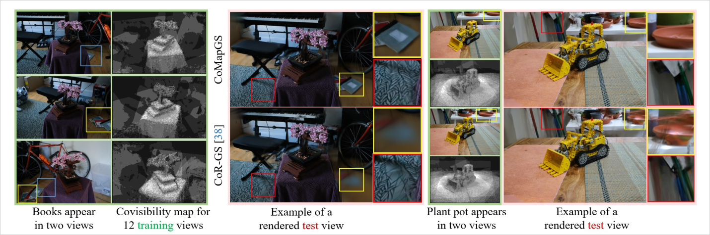
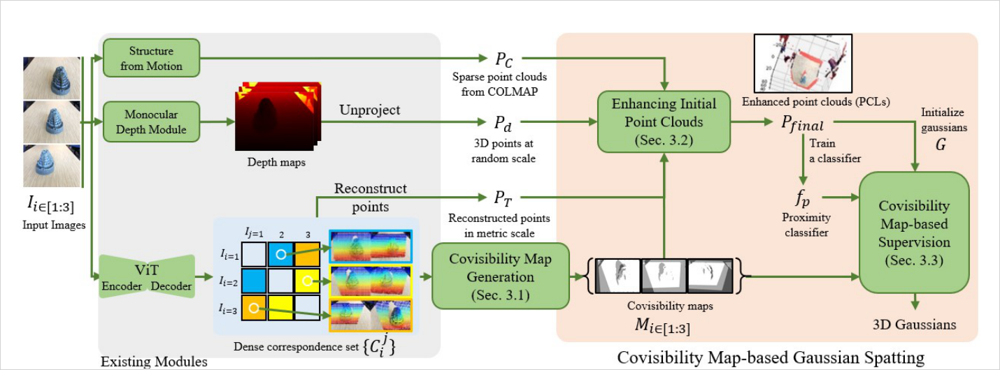
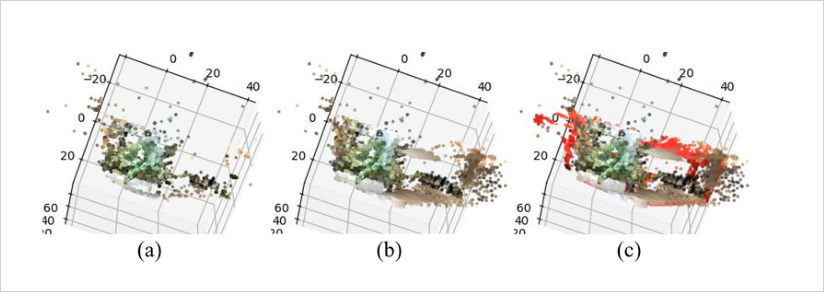
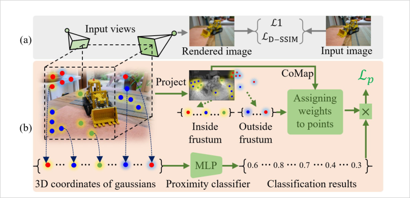
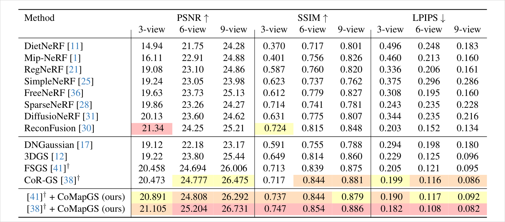
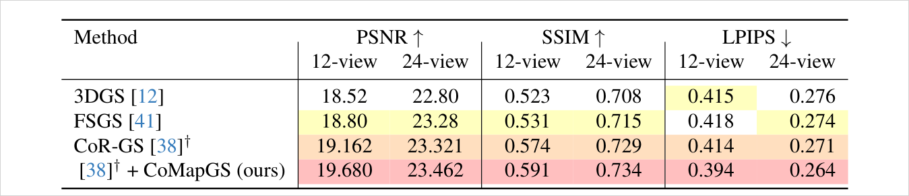
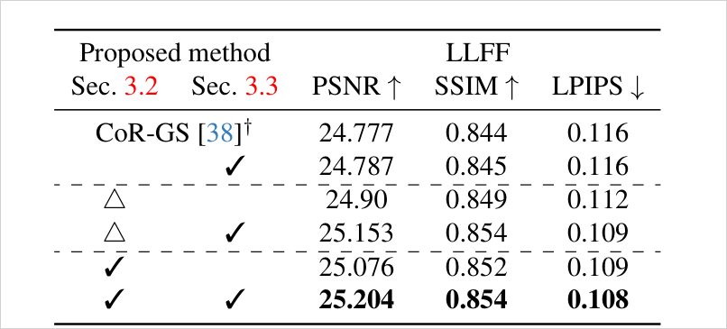
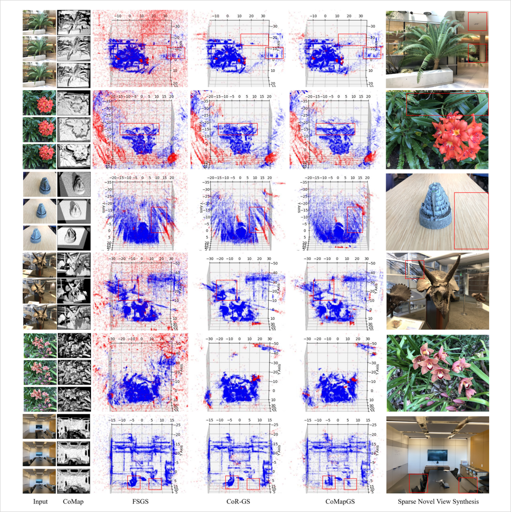

# CoMapGS: Covisibility Map-based Gaussian Splatting for Sparse Novel View Synthesis

> 픽셀별 "몇 개 뷰에서 관측되었는가"(covisibility count)를 dense correspondence로 세어 map으로 만들고, 이를 (1) 초기 point cloud 보강과 (2) 관측 빈도 역가중 supervision에 동시에 사용해 sparse NVS에서 저관측(mono-view) 영역을 복원한다. CVPR 2025, Huawei Noah's Ark Lab.

## 한눈에

| 항목 | 내용 |
| --- | --- |
| 문제 | Sparse-view 3DGS는 다수 뷰에 covisible한 영역만 강하게 supervise되어, 한두 뷰에만 보이는 영역(mono-view/high-uncertainty)이 통째로 무너짐 |
| 핵심 아이디어 | MASt3R dense correspondence로 픽셀별 covisibility count map을 만들고, 이 map으로 (a) 초기 PCL 보강(멀티뷰: 삼각측량 추가, 모노뷰: mono-depth rescale 주입), (b) count 역수 가중 proximity loss supervision |
| 입력 | posed sparse 이미지(3~24장) + COLMAP 포즈/sparse PCL + MASt3R correspondence + mono depth |
| 출력 | 3DGS (CoR-GS/FSGS 위에 add-on) |
| 주요 결과 | LLFF 3-view PSNR 21.105/LPIPS 0.182 (CoR-GS 20.473/0.199 대비 개선), Mip-NeRF360 12-view LPIPS 0.394 vs 0.414. 오버헤드 +5.36m 수준 |
| 한 줄 novelty | **binary visibility mask가 아닌 픽셀별 covisible 뷰 "개수" 필드를 supervision 가중과 초기화에 동시에 쓴 첫 sparse NVS** (저자 주장: high-uncertainty 영역을 명시적으로 "복원"하는 첫 접근) |
| 안 푸는 것 | mesh/surface 추출, dense-view 일반화, DTU류 인공/무배경 장면(명시적 한계), NeRF 계열과의 광범위 비교 |

- 저자: Youngkyoon Jang, Eduardo Pérez-Pellitero (Huawei Noah's Ark Lab, London)
- 버전: CVPR 2025 (pp. 26779–26788), arXiv:2503.20998v1 (2025-03-25)
- PDF: `C:\Users\jinsw712\Desktop\Files\Research_WIKI\raw\papers\CoMapGS.pdf`



## 1. 문제와 동기 (Paper Says)

Sparse NVS의 근본 문제는 shape-radiance ambiguity로 인한 overfit이지만, 이 논문은 그 위에 **"region-wise imbalanced supervision"**이라는 프레임을 얹는다 (p.2):

- 기존 방법은 multiview 제약이 있는 고관측 영역을 사실상 더 강하게 supervise하고, mono-view 영역은 under-supervise됨.
- COLMAP keypoint 기반 sparse PCL은 훈련 뷰가 적을수록 기하 디테일이 부족.
- Multiview geometry 의존 방법들은 다른 뷰에 안 나타나는 mono-view 영역에서 실패.

관련 연구 대비 포지셔닝 (p.3): DyCheck의 covisibility mask는 binary 가시성만 제공하고, NeRFVS의 view coverage map은 dense video 입력용, InfoNorm은 구조화 장면의 국소 covisible 영역만 다룸 — 픽셀 단위 covisibility "count"를 자연 장면 sparse NVS의 supervision에 쓰는 프레임워크는 없었다는 주장. 기존 sparse-GS 계열(CoR-GS 등)은 불확실 영역을 **무시하거나 penalize**할 뿐 "그 안의 정보를 활용해 복원"하지 않는다는 것이 핵심 차별 프레임 (p.2, 보충 A.1: CoR-GS는 mono-view 영역을 더 강하게 penalize → 불완전 재구성).

**Sparse의 재정의 (p.8, Discussion).** "몇 장이냐"(view count)가 아니라 "영역별 covisibility가 낮은가"가 진짜 sparse의 기준이라고 주장. Mip-NeRF360 12뷰처럼 뷰가 많아도 360° outward 캡처에선 외곽 영역 covisibility가 낮아 sparse 문제가 그대로 존재. DyCheck의 effective multiview factors(EMF)와 연결.

## 2. 핵심 방법 (Paper Says)

CoR-GS(ECCV 2024) 위에 두 가지를 얹는 add-on 구조: (1) 초기 PCL 보강(Sec 3.2), (2) covisibility 가중 proximity supervision(Sec 3.3). FSGS에도 동일하게 적용 가능 (p.3, p.5).



### 2.1 Covisibility Map 생성 (Sec 3.1)
각 훈련 뷰 I_i에 대해 다른 모든 뷰와의 MASt3R dense correspondence를 구하고, 픽셀별로 "매칭이 존재하는 뷰 수"를 누적해 W×H map M_i를 만든다. 값 범위는 0 ~ n−1 (n=훈련 뷰 수). erosion/dilation 등 morphological 연산으로 정제 (p.3-4). DyCheck mask와 달리 binary가 아닌 **정밀한 count**라는 점을 강조.

### 2.2 초기 Point Cloud 보강 (Sec 3.2)
두 영역을 다르게 처리:

- **저불확실성(multiview) 영역**: MASt3R correspondence를 COLMAP 포즈로 삼각측량한 P_T를 만들고, 기존 P_C에서 충분히 먼 점만 추가(중복 방지, Eq.2). COLMAP keypoint 매칭이 놓친 조밀 기하를 채움.
- **고불확실성(mono-view) 영역**: mono depth(Metric3D v2)를 unproject한 P_d는 스케일이 임의 → covisible 영역(M_i≥1)의 점들을 anchor로 **linear regression 스케일 변환 f_scale을 학습**해(Eq.3) mono-view(M_i=0) 점들에 적용(Eq.5). 같은 좌표계로 정렬된 mono-view 점들을 병합해 P_final 구성(Eq.6).



### 2.3 Covisibility 가중 Proximity Supervision (Sec 3.3)
P_final을 positive, 멀리 떨어진 random 점을 negative로 3-layer MLP proximity classifier f_p: R³→[0,1]을 학습. 각 Gaussian 위치 g에 proximity score s를 부여하고, (1−s)에 가중치를 곱한 proximity loss L_p를 photometric loss에 더한다 (Eq.7-8).

가중치가 covisibility 기반 (핵심):
- **Frustum 안**: w_in = 1/(M_i(π(g))+1) — 투영 위치의 covisibility count **역수**. 고관측 영역은 photometric loss가 이미 충분히 supervise하므로 약하게, mono-view 영역은 강하게 (Eq.10).
- **Frustum 밖**: 기존 3DGS는 frustum 밖 Gaussian을 그 iteration에서 아예 supervise 안 함 → scene 평균 covisibility S=AVG(M)가 높은 장면(S>0.7)에 한해 w_out = max(0, (S−0.7)/0.3) 가중으로 밖의 Gaussian에도 proximity loss 적용 (Eq.11).



### 2.4 목적함수 (Sec 3.4)
L = (1−λ)L1 + λL_D-SSIM + L_p (Eq.12). CoR-GS의 Co-pruning/Pseudo-view co-regularization 등 base 방법의 전략은 그대로 유지한 채 L_p만 추가.

## 3. 핵심 수식

**Eq. 1 — covisibility map**
```text
M_i(x,y) = Σ_{j=1, j≠i}^{n} δ_{(x,y)∈P(C_i^j)},  ∀(x,y)∈I_i
```
δ는 픽셀 (x,y)가 뷰 I_j와 correspondence 매칭이 있으면 1. M_i는 픽셀별 covisible 뷰 수(0~n−1). 역할: 관측 빈도의 픽셀 단위 필드. (p.3)

**Eq. 2 — multiview 영역 PCL 병합**
```text
P_u = P_C ∪ { p_T ∈ P_T | D(p_T, P_C) > ε }
```
삼각측량 점 중 기존 COLMAP 점에서 ε보다 먼 것만 추가(중복 방지). (p.4)

**Eq. 3-6 — mono-depth 스케일 정렬과 최종 PCL**
```text
f_scale(P_d^low) ≈ P_u^low                    (anchor 회귀, Eq.3)
P_u^low = { p | M_i(π(P_u, H_i)) ≥ 1 }        (covisible 영역 선택, Eq.4)
P_s^high = f_scale(P_d^high)                   (mono-view 적용, Eq.5)
P_final = P_u^low ∪ P_s^high                   (Eq.6)
```
covisible 영역을 ground truth 삼아 mono depth의 임의 스케일을 metric 스케일로 회귀 정렬 후, 그 변환을 mono-view 점에 적용. anisotropic linear regression. (p.4)

**Eq. 7-9 — proximity classifier와 loss**
```text
s = f_p(p) ∈ [0,1]                             (Eq.7)
L_p = (1/|G|) Σ_{g∈G} ( χ(g)·w_in + (1−χ(g))·w_out ) · (1−s)   (Eq.8)
χ(g) = 1 if π(g,H_i) ∈ [0,W)×[0,H) else 0      (Eq.9)
```
f_p는 P_final 기반 학습(positive=장면 점, negative=random 원거리 점). (1−s)가 크면(기하에서 멀면) penalty. χ는 frustum 내외 판별. (p.5)

**Eq. 10-11 — covisibility 가중**
```text
w_in  = 1 / ( M_i(π(g,H_i)) + 1 )
w_out = max( 0, (S − 0.7) / 0.3 ),  S = AVG(M)
```
w_in: covisibility count 역수 → mono-view 영역일수록 proximity supervision 강화. w_out: 평균 covisibility 높은 장면에서만 frustum 밖 Gaussian까지 supervise (S=1에서 1, S≤0.7에서 0). (p.5)

**Eq. 12 — 전체 목적함수**
```text
L = (1−λ)·L1(I,I*) + λ·L_D-SSIM(I,I*) + L_p
```
표준 3DGS photometric loss + proximity 항. base 방법(CoR-GS/FSGS) 전략은 보존. (p.5)

## 4. 실험 근거

### 4.1 LLFF (Table 1)
3/6/9-view, 8× downsample, 10k iter. CoR-GS와 FSGS 각각에 add-on.



- CoR-GS† 20.473 → +CoMapGS 21.105 (3-view PSNR), LPIPS 0.199 → 0.182.
- 3-view PSNR에서 ReconFusion(diffusion prior)에만 뒤지는데, 저자 해석: diffusion류는 "시각적으로 매끈한 색"을 생성해 PSNR에 유리하지만 mono-view 영역의 **원래 패턴**은 못 살림 — SSIM/LPIPS에선 CoMapGS 우위 (p.7).

### 4.2 Mip-NeRF360 (Table 2)
12/24-view, 4× downsample, 30k iter. 360° outward 캡처라 영역별 covisibility 격차가 큰 무대.



24-view에서 PSNR 개선폭이 작아 보이는 건 test 뷰에 unseen 영역이 존재하기 때문이고, LPIPS 개선(0.271→0.264)이 텍스처 복원 효과를 더 잘 보여준다고 주장 (p.8).

### 4.3 Ablation (Table 3, LLFF 6-view)


읽는 법 (p.8):
- **Supervision 단독은 거의 무효** (24.777→24.787): sparse COLMAP PCL 상태에선 3DGS가 기존 점 근처에만 densify하므로 proximity loss가 끌어줄 대상 자체가 없음.
- 저불확실 영역 PCL 보강(△, MASt3R 점 단순 주입)만으로 24.90 — dense 초기화 자체의 기여가 큼.
- mono-view 점까지 + supervision 결합 시 최대 (25.204). **초기화 보강과 가중 supervision은 시너지 관계** — 이 논문의 실질적 주장.

### 4.4 기하 정합성 검증 (보충 A, Fig. 7-8)
학습 후 Gaussian 위치를 9-view 학습 proximity classifier로 분류(파랑=기하 근접, 빨강=이탈, threshold 0.5).



### 4.5 비용 (보충 D, Table 4)
Fern 3-view 기준: 전처리 +72.22s(CoMap 11.51s, multiview PCL 23.20s, mono 0.24s, classifier 데이터 8.41s + 학습 28.06s), 훈련 CoR-GS 8.16m → 13.27m (+5.36m, f_p를 매 iter 실행). 렌더 3.30ms/img로 실시간 유지. RegNeRF(NeRF 기반, 307.1m) 대비 압도적으로 효율적.

## 5. 해석 (Interpretation)

**(모델 추론) 본질은 "관측 빈도 필드를 supervision 가중으로 쓰는 a-priori 접근".** CoMapGS의 covisibility map은 결국 픽셀별 관측 카운트 필드다. 내 메인 연구(Observation-Confidence-Guided Supervision for GS Mesh Recon)의 H1a "SfM observation field"와 발상 구조가 거의 동일하다 — 차이는:
- **무대**: CoMapGS는 sparse NVS 화질(PSNR/LPIPS), 내 연구는 dense-view mesh 기하 품질. CoMapGS는 mesh/surface를 전혀 안 다룸.
- **신호원**: MASt3R dense correspondence 카운트 vs SfM/렌더링 기반 관측 통계.
- **개입 지점**: proximity loss 가중(+PCL 초기화) vs mesh recon supervision 가중.
- **방향**: CoMapGS는 저관측 영역을 **더 강하게** supervise(복원 지향). CoMe처럼 저신뢰 영역을 discount하는 방향과 정반대 부호라는 점이 중요 — "관측이 적은 곳에 prior를 더 주입"과 "관측이 적은 곳의 photometric 주장을 덜 믿음"은 양립 가능(전자는 기하 prior, 후자는 appearance 신뢰).

**(모델 추론) 위협표 관점.** First-to-X 위협이라기보다 **인접 무대의 정황 증거**: "region-wise covisibility 불균형이 실제 성능 병목"이라는 motivation 인용원으로 유용하다. 특히 Discussion의 "sparse는 뷰 개수가 아니라 영역별 covisibility의 문제"(p.8) 프레임과 DyCheck EMF 연결은 내 배경 붕괴 가설(background mesh collapse)의 논거로 직접 인용 가능. 단, "covisibility 기반 가중 supervision" 자체는 이 논문이 sparse NVS에서 선점했으므로, 내 novelty 서술은 (a) mesh reconstruction 무대, (b) dense-view에서도 나타나는 배경 저관측 문제, (c) supervision 부호/메커니즘 차이로 각을 세워야 함.

**(모델 추론) Ablation의 전이 가능한 교훈.** "가중 supervision 단독은 초기 기하가 빈약하면 무효"(Table 3 첫 두 행)는 내 실험 설계에 직접 전이됨 — observation-confidence 가중을 mesh recon에 넣을 때도 배경 영역에 앵커(초기 기하/점)가 없으면 가중치만으로는 효과가 안 나올 수 있다. H1 실험에서 초기화 조건을 통제 변수로 둘 것.

**(모델 추론) frustum 밖 supervision(Eq.11)은 조용하지만 흥미로운 기여.** photometric loss는 구조적으로 "보이는 것"만 만지므로, MLP 기반 기하 prior는 가시성과 독립적으로 전 Gaussian에 작용 가능. 이는 배경/외곽처럼 프레임에 잘 안 잡히는 영역의 규제 수단으로 mesh recon에도 이식 가능한 패턴.

## 6. 한계

논문 명시 (보충 E):
- **MASt3R/mono-depth 의존**: 오류 전파 가능. 완화책으로 재투영 오차 ≤2px 검증으로 삼각측량 점을 필터링하고, scene-level covisibility로 proximity 가중 조정 (보충 E.1).
- **DTU 실패**: 인공적·검은 배경·무구조 환경에선 depth 예측과 COLMAP 포즈 추정이 모두 취약. 배경이 하늘(무한대 투영)인 장면도 취약. DTU 부분 장면에서 CoR-GS와 비슷한 수준에 그침, full DTU는 COLMAP 실패로 재현 불가 (보충 E.2).
- NeRF 계열과의 정성 비교는 대표 예시 1개(Fig. 11)뿐 (보충 E.3).

추론 한계 (모델 추론):
- covisibility "count"는 관측 **품질**(각도 다양성, 거리, 블러)을 구분 못 함 — count 높아도 baseline이 좁으면 기하는 여전히 미정. DyCheck EMF를 인용하면서도 실제 map은 순수 카운트.
- w_out의 0.7/0.3 상수는 hand-tuned; scene 통계에 대한 민감도 분석 없음.
- 가중이 Gaussian의 **투영 위치** 기준이므로, 잘못 위치한 Gaussian이 우연히 고covisibility 영역에 투영되면 약한 supervision을 받는 순환 문제 가능.
- add-on 설계라 base 방법(CoR-GS)의 pseudo-view 전략과의 상호작용 분석 부재.

## 7. Open Questions

- covisibility count를 dense-view mesh recon에 옮기면 어떤 신호가 될까? count 자체보다 "count의 공간 gradient"(관측 절벽)가 배경 붕괴 위치와 상관될 가능성.
- proximity classifier를 mesh 기반(SDF/occupancy) prior로 바꾸면 어디까지 가는가? MILo의 mesh-in-the-loop과 결합 지점이 있는가?
- 관측 빈도 가중의 부호 문제: 어떤 조건에서 저관측 영역을 "강화"해야 하고 어떤 조건에서 "불신"해야 하는가? (CoMapGS vs CoMe의 부호 대립을 정리하는 이론 프레임)
- MASt3R 대신 SfM track 길이/재투영 오차로 covisibility map을 근사하면 성능이 얼마나 유지되는가? (전처리 비용·의존성 절감)

## Evidence Anchors

- p.1: Fig. 1 — covisibility map과 mono-view 영역 소실/복원 대비
- p.2: region-wise imbalanced supervision 3개 challenge 정리, 기여 3항
- p.3: Fig. 2 파이프라인, Sec 3.1 covisibility map 정의(Eq.1), DyCheck/NeRFVS/InfoNorm 대비
- p.4: Sec 3.2 PCL 보강(Eq.2-6), Fig. 3 Fern PCL 단계별 보강
- p.5: Sec 3.3 proximity loss(Eq.7-11), Fig. 4, Sec 3.4 목적함수(Eq.12)
- p.6: Table 1 LLFF, Fig. 5 정성 비교
- p.7: Table 2 Mip-NeRF360, Fig. 6, ReconFusion PSNR 논의
- p.8: Table 3 ablation, Sec 4.4 Discussion(sparse 재정의, DyCheck EMF), 결론
- 보충 p.1-2: A. 기하 정합성 분석, Fig. 7 (FSGS 증식/CoR-GS penalize/CoMapGS 균형)
- 보충 p.3: Fig. 8 Mip-NeRF360 Gaussian 분포
- 보충 p.4: C. proximity loss ablation 시각화(Fig. 9), D. classifier 구조(3-layer MLP), Table 4 시간 비용
- 보충 p.5: E. 한계(MASt3R 의존, DTU, NeRF 비교)

## Related WIKI Pages

- [covisibility-count-weighted-supervision](../concepts/covisibility-count-weighted-supervision.md) — 이 논문의 핵심 메커니즘 개념화
- [proximity-classifier-geometry-prior](../concepts/proximity-classifier-geometry-prior.md) — frustum 독립 기하 prior
- [monocular-depth-covisible-anchor-scaling](../concepts/monocular-depth-covisible-anchor-scaling.md) — mono depth 스케일 정렬
- [come-confidence-based-mesh-extraction](come-confidence-based-mesh-extraction.md) — a-posteriori residual 기반 confidence와의 부호 대립
- [ambisur-photometric-ambiguity](ambisur-photometric-ambiguity.md) — photometric ambiguity 진단 계열
- [photometric-primary-geometry-underconstraint](../concepts/photometric-primary-geometry-underconstraint.md) — under-constrained 문제의 상위 개념
- [learned-confidence-photometric-geometric-balancing](../concepts/learned-confidence-photometric-geometric-balancing.md) — 학습형 confidence와의 비교축
