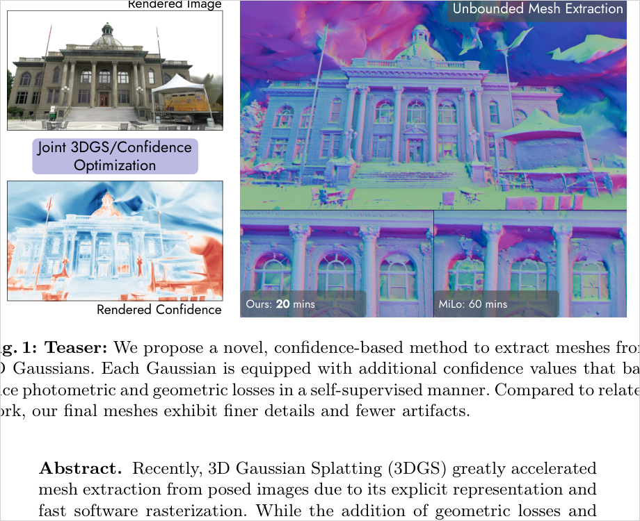
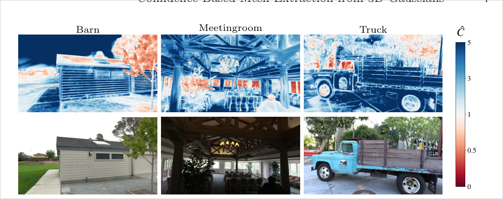
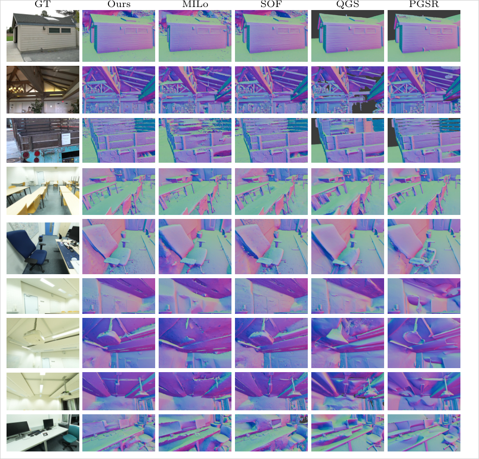
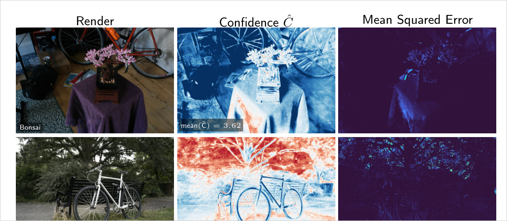

# CoMe: Confidence-Based Mesh Extraction from 3D Gaussians

> 각 Gaussian에 **학습되는 confidence 값**을 달아, photometric loss와 geometric loss의 균형을 self-supervised로 픽셀마다 조절한다(`ℒ_conf = ℒ_rgb·Ĉ − β·logĈ`). prior·대형 사전학습 모델·mesh-in-the-loop 같은 무거운 장치 없이 색/normal variance loss·D-SSIM decoupling만 더해, Tanks&Temples unbounded mesh에서 F1 0.521(MILo 0.485)을 18분에 달성.

## 한눈에

| 항목 | 내용 |
| --- | --- |
| 문제 | 3DGS는 geometry와 appearance가 결합돼 있어, view-dependent 효과가 강한 영역에서 photometric loss를 줄이는 유일한 길이 geometry를 왜곡하는 것("반투명 표면 뒤 불투명 Gaussian")임. 기존 해법(multi-view constraint·monocular prior·mesh-aware 최적화)은 3DGS의 속도 이점을 희생 |
| 핵심 아이디어 | primitive마다 학습 스칼라 confidence를 두고, 이를 alpha-blending해 얻은 confidence map `Ĉ`로 **photometric loss만** 재가중(geometric loss는 불변) → 어려운 영역에서 photometric을 "포기"하고 불확실성으로 치환. 여기에 densification 조향 + per-primitive color/normal variance loss + D-SSIM luminance decoupling을 결합 |
| 입력 | posed multi-view images (**moderately dense capture** 가정), SfM 초기화 |
| 출력 | unbounded triangle mesh (opacity field + Marching Tetrahedra with binary search, SOF 백엔드) |
| 주요 결과 | T&T unbounded F1 **0.521**(SOF 0.474·MILo 0.485·PGSR 0.496 대비 최고), 최적화 **18min**(MILo 60min). ScanNet++ F1 0.668(전 씬 1위) |
| 한 줄 novelty | **학습된 per-primitive confidence로 photometric supervision을 self-supervised·픽셀별로 재가중하고 densification까지 조향 — prior 없이 unbounded mesh SOTA** |
| 안 푸는 것 | sparse-view / 심하게 가려지거나 미관측 영역(holes·cavities 잔존), **distant background(insufficient densification)** — "moderately dense capture" 가정에 의존 |

- 저자: Lukas Radl, Felix Windisch, Andreas Kurz, Thomas Köhler, Michael Steiner, Markus Steinberger (Graz University of Technology / Huawei Austria)
- 버전: arXiv:2603.24725v2 (2026-04-22) · 프로젝트: https://r4dl.github.io/CoMe/
- PDF: `C:\Users\jinsw712\Desktop\Files\Research_WIKI\raw\papers\CoMe - Confidence-Based Mesh Extraction from 3D Gaussians.pdf`



## 전체 과정 (7단계)

> 논문 구조(§3.1→§3.4)보다 이 흐름이 복구가 빠르다. ★ = CoMe의 개입, 나머지는 SOF/GOF 상속.

```text
1. multi-view image + SfM point로 초기화 (3DGS와 동일)

2. ray-GS intersection으로 alpha-blending 가중치 w를 구하고,
   그 w로 color / normal / confidence map을 각각 그림
   ← confidence는 w를 재활용해서 공짜로 딸려나옴  ★

3. "학습 중에만" 카메라 보정을 씌움  ★

4. 보정된 렌더 vs GT 비교
   · confidence를 가중해 어려운 곳에서는 색상을 부분 포기, geometry 제약만 남김  ★
   · 개별 GS에 대해서도 variance loss로 매김 (trick 방지용)  ★
   · 기존 SOF geometric 제약은 그대로 — confidence조차 안 건드림
     ← ★ CoMe 전체에서 가장 중요한 설계 결정. 여기를 안 건드렸기 때문에
        Ĉ가 "색이냐 기하냐"의 저울이 된다. geometric까지 곱했으면
        그냥 "어려운 데는 학습 덜 하기"가 되어 무의미했을 것.

5. back-prop (GS + confidence 값 + 보정모듈 동시 업데이트)

6. densification에서 confidence 기반으로 threshold를 높여
   저신뢰 GS의 불필요한 densify 억제  ⇒ trick 재료 차단  ★

7. 끝나면 카메라 보정 모듈 버림 + mesh 추출은 SOF와 동일
   (opacity field → Marching Tetrahedra + binary search)
```

**개입은 딱 두 군데 — loss(4)와 densification(6).** 표현·렌더러·mesh 추출기는 전부 상속. 그게 abstract의 "simple and efficient alternative"이자 18분(MILo 60분)의 정체다.

## 1. 문제와 동기 (Paper Says)

**근본 원인 = geometry-appearance 결합.** 3DGS는 geometric primitive에 appearance feature(SH)를 얹으므로, geometry를 갱신하면 appearance가 직·간접으로 바뀐다. 고주파 view-dependent 외관이 있는 장면에서는 photometric error를 진짜로 최소화하는 유일한 길이 geometry를 바꾸는 것이 되기도 한다 — 특히 현재 SH는 저주파 성분에 국한되기 때문. 그 결과 "특정 시점에서만 보이는, 반투명 표면 뒤의 매우 불투명한 Gaussian" 형태로 고주파 효과가 표현되고, 이것이 표면 추출을 망친다. (p.2)

**기존 해법의 대가.** 선행 연구는 ① multi-view geometric/photometric constraint(PGSR·VA-GS류), ② 대형 사전학습 monocular normal/depth 모델(VCR-GauS·GeoSVR류), ③ mesh-aware 양방향 일관성(MILo) 으로 ambiguity를 눌렀지만, 모두 계산 오버헤드를 더해 3DGS의 효율을 깎는다. 저자의 질문: **"이런 장치를 하나도 쓰지 않고 표면 추출을 어디까지 밀 수 있는가?"** (p.2)

## 2. 핵심 방법 (Paper Says)

네 조각이 최종 loss(Eq.15)로 합쳐진다: `ℒ = ℒ_conf + ℒ_geom + λ_cv·ℒ_color-var + λ_nv·ℒ_normal-var`. 베이스라인은 **SOF**(Sorted Opacity Fields, SIGGRAPH Asia'25) 코드베이스이며 mesh는 opacity field에 Marching Tetrahedra + binary search로 추출한다. (p.9)

### 2.1 Confidence-aware Gaussian Splatting (핵심)
primitive마다 학습 스칼라 `γ_i`(init 0)를 두고 `γ̃_i = exp(γ_i)`(init 1)로 양수화한 뒤, alpha-blending으로 픽셀별 confidence map `Ĉ`를 렌더한다(Eq.11). 이 `Ĉ`로 photometric loss만 재가중한다(Eq.9). `Ĉ=1`이면 원래 `ℒ_rgb`로 환원되고, `Ĉ<1`이면 photometric 잔차를 불확실성으로 "교환"할 수 있다. **geometric loss는 이 공식에 손대지 않으므로, Ĉ가 곧 photometric↔geometric 균형자**가 된다. β는 두 항을 저울질하는 유일 핵심 하이퍼파라미터(β=0.075). (p.6-7)



### 2.2 Confidence-steered Densification
confidence 재가중은 loss 크기를 바꾸므로(심지어 음수도 가능), gradient 크기에 의존하는 densification을 그대로 두면 왜곡된다. 저자는 positional gradient 임계값을 confidence로 나눠(Eq.12) **저신뢰 Gaussian의 분열을 억제**한다: `τ̄_grad = τ_grad / min(γ̃_i, 1)`. min으로 1에서 clamp해 고신뢰 Gaussian은 과분열되지 않게 한다. 이는 "어려운 영역에서 작은 Gaussian이 반복 복제되는 over-densification"을 정확히 막는 장치다. Ablation: 이 조향을 끄면 F1 소폭 하락 + primitive 수 20%↑. (p.7, p.20)

### 2.3 Variance-reducing Losses (blending)
alpha-blending은 blended 최종 색만 loss에 쓰므로 개별 primitive가 올바른 radiance를 모델링할 유인이 없다 — 이것이 "표면 뒤 불투명 Gaussian" 트릭을 허용한다. 저자는 per-primitive **color variance loss**(Eq.13, GT 픽셀색과의 가중 L2 = blended 색 분산 최소화)와 **normal variance loss**(Eq.14, blended normal과의 가중 L2)를 추가해 개별 Gaussian을 실제 표면에 색·방향 모두 정렬시킨다. (p.8)



### 2.4 Decoupled Appearance (D-SSIM luminance decoupling)
VastGaussian식 appearance embedding은 보정 이미지 `Î_app`를 L1 항에만 쓰고 D-SSIM엔 원본을 쓴다("SSIM은 구조적"이라는 논리). 저자는 D-SSIM의 **luminance 항 `l(·)`이 실은 조명 변화에 지배되는 비구조적 항**임을 Fig.2로 보이고, luminance에만 `Î_app`를 투입한다(Eq.8). contrast·structure는 조명 불변이라 원본 렌더를 써야 appearance 모델이 오보정하지 않는다. 이 조각 하나만으로도 MILo를 능가(Table 3). (p.5-6, p.13)

## 3. 핵심 수식

**Eq. 9 — Confidence-weighted photometric loss (핵심)**
```text
ℒ_conf = ℒ_rgb · Ĉ − β · log Ĉ
∂ℒ_conf/∂Ĉ = ℒ_rgb − β/Ĉ      (Eq.18)
```
`Ĉ<1`이면 photometric 잔차를 불확실성으로 교환; `−β·logĈ`는 confidence를 무작정 낮추지 못하게 하는 penalty. 최적 `Ĉ*=β/ℒ_rgb`에서 균형(잔차 큰 곳=저신뢰). geometric loss는 재가중 대상이 아님. Ĉ는 [0.001, 5.0]로 clamp, Eq.11의 w_i는 detach(confidence gradient가 opacity를 바꾸지 못하게). (p.6, p.19)

**Eq. 11 — Confidence 렌더링**
```text
γ̃_i = exp(γ_i),   γ_i init 0  →  γ̃_i init 1
Ĉ(r) = Σ_i w_i(r) · γ̃_i          (w_i = 표준 alpha-blending 가중)
```

**Eq. 12 — Confidence-steered densification 임계값**
```text
τ̄_grad = τ_grad / min(γ̃_i, 1)
```
저신뢰(γ̃_i<1) → 임계값 상승 → 분열 억제. 고신뢰는 min으로 1 clamp → 과분열 방지. (p.7)

**Eq. 13 / 14 — Variance losses**
```text
ℒ_color-var  = Σ_i w_i(r) · ||sh(θ_i, d) − I||²        (I = GT 픽셀색)
ℒ_normal-var = Σ_i w_i(r) · ||n_i − N||²,   N = Σ_i w_i(r) n_i (blended normal)
```
개별 primitive를 blended 결과가 아닌 GT색/blended normal에 직접 정렬 → "표면 뒤 불투명 Gaussian" 억제. depth distortion loss도 blended depth의 variance loss로 해석 가능. (p.8)

**Eq. 8 — Decoupled D-SSIM**
```text
ℒ_D-SSIM^dec = 1 − l(I, Î_app) · c(I, Î) · s(I, Î)
```
luminance에만 appearance-보정 `Î_app`, contrast·structure는 원본 렌더 `Î`. (p.6)

## 4. 실험 근거

### 4.1 Unbounded mesh — Tanks & Temples (Table 1, main)
F1-score(↑), RTX 4090, multi-view constraint 미사용 unbounded 계열에서 최고 평균.

| Method | Barn | Caterpillar | Courthouse | Ignatius | Meetingroom | Truck | **Avg** | Runtime |
| --- | --- | --- | --- | --- | --- | --- | --- | --- |
| PGSR (bounded) | 0.548 | 0.437 | 0.238 | 0.728 | 0.367 | 0.658 | 0.496 | 28min |
| QGS (bounded) | 0.536 | 0.374 | 0.183 | 0.733 | 0.374 | 0.645 | 0.474 | 41min |
| GOF | 0.484 | 0.402 | 0.288 | 0.674 | 0.275 | 0.596 | 0.453 | 40min |
| SOF (baseline) | 0.535 | 0.408 | 0.297 | 0.736 | 0.309 | 0.558 | 0.474 | 17min |
| MILo | 0.541 | 0.389 | 0.322 | 0.757 | 0.281 | 0.617 | 0.485 | 60min |
| **Ours** | 0.534 | **0.472** | **0.333** | **0.782** | 0.372 | 0.634 | **0.521** | 18min |

주목: Caterpillar·Ignatius는 decoupled appearance가 조명 변화를 잡아 최고점, Courthouse(>1100장)는 confidence+variance loss의 robustness가 작동. Meetingroom·Truck의 textureless floor 같은 under-constrained 영역에서 bounded baseline은 무거운 multi-view 제약으로 정규화하지만 Ours는 그 없이 unbounded 최고. (p.9-10)

### 4.2 ScanNet++ 실내 (Table 2)
6개 씬 F1 평균 **0.668**로 전 씬 1위(MILo 0.624·PGSR 0.631). 노출 변화·조명 불일치·blur가 있는 실내에서 decoupled appearance가 특히 유효. (p.10)

### 4.3 Ablation — 기여 분해 (Table 3)
누적 F1(TnT / ScanNet++):

| 구성 | T&T F1 | ScanNet++ F1 |
| --- | --- | --- |
| SOF (baseline) | 0.474 | 0.615 |
| + Improved Appearance | 0.493 | 0.625 |
| + ℒ_conf | 0.509 | 0.655 |
| + ℒ_color-var | 0.519 | 0.658 |
| + ℒ_normal-var | 0.521 | 0.668 |

appearance 모듈 단독으로 이미 MILo 초과. `ℒ_conf`가 ScanNet++에서 +0.03(실내 ambiguity), `ℒ_color-var`는 고주파 많은 TnT에서, `ℒ_normal-var`는 평면 많은 ScanNet++에서 특히 기여. (p.11)

### 4.4 Confidence ↔ 오차 상관 (Fig.12, NVS 분석)
실내 평균 confidence 3.22 vs 실외 1.66. confidence map이 MSE error map과 직접 상관 → **under-reconstructed 영역을 탐지**. 실외 배경은 저신뢰로 예측되어 spurious geometry가 가지치기되고 primitive 26%↓(4.38M→2.58M), PSNR 손실 0.02dB. (p.31)



### 4.5 β·densification·DTU (보조)
- β-ablation(Fig.7): β=0이면 Ĉ↑ 유인 없어 under-reconstruction, β=0.2면 penalty 과해 over-densification. β=0.075 최적, β=0.05는 primitive 적은 경량 변형. (p.13)
- 확장 ablation(Table 5): confidence-steered densification 끄면 primitive 20%↑. `ℒ_conf`는 iter 500(densification 시작)부터 켬. (p.20)
- DTU(Table 7): unbounded 계열 중 최저 Chamfer 0.65지만, 단일 객체 bounded 소규모 씬에선 multi-view prior(PGSR 0.55)가 우위. (p.30)
- prior-dependent 비교(Table 6): GeoSVR(monocular depth+multi-view)가 F1 0.546으로 높지만 42min(Ours 18min)이고 TSDF·GT point cloud 의존; 공정한 QGS eval에선 0.525로 하락. (p.25-26)

## 5. 해석 (Interpretation, model-side)

### 진짜 새로운 지점
"불확실성으로 loss를 재가중한다"는 아이디어 자체는 Kendall&Gal(aleatoric uncertainty)·DUSt3R(feed-forward confidence) 계보지만, **CoMe의 delta는 그 confidence를 (a) per-primitive 학습 스칼라로 두어 alpha-blending으로 렌더하고, (b) photometric 항만 재가중해 geometric supervision과의 균형자로 재해석하며, (c) 그 confidence를 densification 임계값에까지 밀어넣어** unbounded mesh 추출 전용으로 특화한 점이다. prior/사전학습 모델 없이 SOTA를 낸 것이 실용적 무게.

### confidence의 정체 = "a posteriori, residual-driven"
`ℒ_conf = ℒ_rgb·Ĉ − β·logĈ`의 최적점은 `Ĉ*=β/ℒ_rgb`. 즉 **Ĉ는 학습이 진행되며 photometric 잔차 `ℒ_rgb`가 실제로 발생하는 곳에서만 낮아진다.** Fig.3에서 반사·foliage·"드물게 관측된 Barn 지붕"이 저신뢰로 잡히는 것도, 그 영역들이 "잔차를 남기는" 곳이기 때문이다. 저자 스스로 "저신뢰 영역도 여전히 잘 재구성된다"고 명시 — Ĉ는 **재구성 실패의 지도가 아니라, 최적화 중 photometric으로 설명하기 어려운 곳의 지도**다.

### 내 연구(Observation-Confidence-Guided Supervision)와의 관계 — 경쟁·차별화
> 아래는 model-side 정리이며, 메모리 `background-mesh-collapse-hypothesis`의 위협표 CoMe 항목과 일치한다.

- **충돌 지점**: CoMe도 (i) under-constrained/어려운 영역에서 photometric 가중을 축소하고 (ii) densification을 억제한다. 개입 수단(lever①·lever④)이 형태상 겹친다.
- **핵심 차별 = a priori vs a posteriori**: CoMe의 Ĉ는 **학습된(a posteriori) 값**으로 "현재 모델이 잘 재구성했는가/잔차가 있는가"를 사후에 읽는다. 내 field는 **SfM 관측 통계(각도·track·reproj)에서 학습 전(a priori)** 에 "애초에 관측이 충분했는가"를 읽는다 — optimizer 상태와 무관하게 고정.
- **구조적 사각지대(케이스 ②)**: 성공한 photometric shortcut은 잔차를 남기지 않는다. 관측이 부족하지만 색·opacity로 오차를 흡수해 낮은 잔차에 도달한 영역은 `ℒ_rgb`가 작아 `Ĉ`가 낮아지지 않는다 → **residual 기반 신호가 원리적으로 탐지 불가**. Fig.3/Fig.12의 상관은 모두 "잔차가 실제 발생하는" 케이스에 한정된 증거다(방어: 경계는 E6 gating 실험으로 실측).
- **CoMe가 스스로 증언하는 진입점(§5 limitations, 인용 확정)**: "our method struggles to reconstruct detailed geometry for **distant background regions**. Due to the insufficient view density ... the 3DGS reconstruction is **insufficiently densified** in these areas" + "relies on the assumption of a **moderately dense capture setting**". 즉 CoMe의 confidence는 관측 밀도가 낮은 주변부를 회복하지 못하고, 저자는 그 처방으로 multi-view diffusion·전용 densification recipe를 제안한다 — 내 연구가 겨냥하는 바로 그 영역이 CoMe의 한계로 명시됨.
- **densification 관점의 대비**: CoMe는 confidence로 densification을 **억제**(저신뢰=분열 억제)한다. 내 prevention 논리(floater 적층을 표현 불가하게 만드는 gating)와 방향은 같으나, CoMe의 신호가 "잔차 기반 사후"인 반면 내 신호는 "관측 기하 기반 사전"이라 severe under-constrained에서의 거동이 갈린다(E8: 이진 visibility vs count vs 품질 등급).

관련 개념: [[photometric-primary-geometry-underconstraint]], [[learned-confidence-photometric-geometric-balancing]], [[confidence-steered-densification]], [[per-primitive-blending-variance-loss]]

## 6. 한계 (Paper-stated + 추론)

- (저자 명시) **moderately dense capture 가정**. severely occluded·unobserved 영역에는 holes/cavities 잔존 → multi-view constraint·monocular prior 권장. (p.14)
- (저자 명시) **distant background의 detailed geometry 실패** — view density 부족·close-up 부재로 insufficiently densified. multi-view diffusion + 전용 densification recipe를 future work로 제안. (p.14)
- (추론) Ĉ가 잔차 구동이라, 관측이 부족해도 shortcut으로 저잔차에 도달한 영역은 저신뢰로 잡히지 않음 — confidence의 커버리지가 "photometric으로 티 나는 실패"에 국한(§본 페이지 해석 참조).
- (추론) SOF opacity-field 백엔드·Marching Tetrahedra에 종속 — 다른 mesh 추출 파이프라인으로의 이식성은 미검증.
- (평가) unbounded mesh는 GT point cloud의 결손 때문에 precision에서 오히려 불리(Fig.9); TnT F1은 완전성이 높을수록 손해 보는 구조라 수치 해석에 주의. (p.26)

## 7. Open Questions

- confidence의 잔차-구동 특성상, "관측이 부족하지만 잔차가 낮은" under-constrained 영역을 얼마나 놓치는가? (내 E6: CoMe Ĉ맵 vs SfM field vs GT 오류맵 gating 실험의 직접 대상)
- confidence β를 densification의 유일 손잡이로 쓰는 "heuristic-free densification"(저자 가설)이 일반 3DGS에서 성립하는가?
- color/normal variance loss가 severe view-dependent(거울·물) 에서 과도한 평활화를 유발하지 않는가?
- decoupled D-SSIM의 luminance-only 보정이 chromaticity가 심하게 변하는 in-the-wild 데이터에서도 유지되는가?
- distant background에 대해 CoMe가 제안한 multi-view diffusion 처방과, 관측 기하 기반 사전 라우팅(내 접근)의 결합 가능성?

## Evidence Anchors

- p.1: 제목/저자, Fig.1 teaser(20min vs 60min)
- p.2: 문제 정의(geometry-appearance 결합, 반투명 뒤 불투명 Gaussian), "얼마나 멀리 밀 수 있나" 질문, 3해법 계보
- p.3: 3가지 기여, Related Work(radiance field·uncertainty·appearance)
- p.5-6: Preliminaries(Eq.1-7), decoupled appearance(Eq.8), Fig.2 luminance 지배성
- p.6-7: ℒ_conf(Eq.9), confidence 렌더(Eq.10-11), Fig.3 confidence maps, densification(Eq.12)
- p.8: variance losses(Eq.13-14), Fig.4 first-hit 정렬
- p.9-10: 구현(SOF 백엔드·MarchingTetrahedra), Table 1 T&T, Table 2 ScanNet++
- p.11-13: Table 3 ablation, Fig.5 mesh 비교, Table 4 appearance ablation, Fig.7 β-ablation
- p.14: §5 Discussion/Limitations(moderately dense·distant background insufficiently densified)
- p.19-20: 구현 상세(exp activation·detach), Eq.18 gradient, Table 5 확장 ablation
- p.25-26: GeoSVR 비교(Table 6), bounded 비교·완전성(Fig.9)
- p.30: DTU Chamfer(Table 7)
- p.31: Fig.12 confidence-error 상관, 실내3.22/실외1.66

## Related WIKI Pages

- [Geometry-Faked View-Dependent Appearance (SH Frequency Limit)](../concepts/geometry-faked-view-dependent-appearance.md)
- [Learned Confidence Balancing of Photometric and Geometric Loss](../concepts/learned-confidence-photometric-geometric-balancing.md)
- [Confidence-Steered Densification](../concepts/confidence-steered-densification.md)
- [Per-Primitive Blending Variance Loss](../concepts/per-primitive-blending-variance-loss.md)
- [D-SSIM Luminance-Decoupled Appearance](../concepts/dssim-luminance-decoupled-appearance.md)
- [SSIM Three-Term Decomposition (Luminance / Contrast / Structure)](../concepts/ssim-three-term-decomposition.md)
- [Photometric-Primary Geometry Underconstraint](../concepts/photometric-primary-geometry-underconstraint.md)
- [MILo: Mesh-In-the-Loop Gaussian Splatting](./milo.md)
- [Gaussian Opacity Fields (GOF)](./gaussian-opacity-fields.md)
