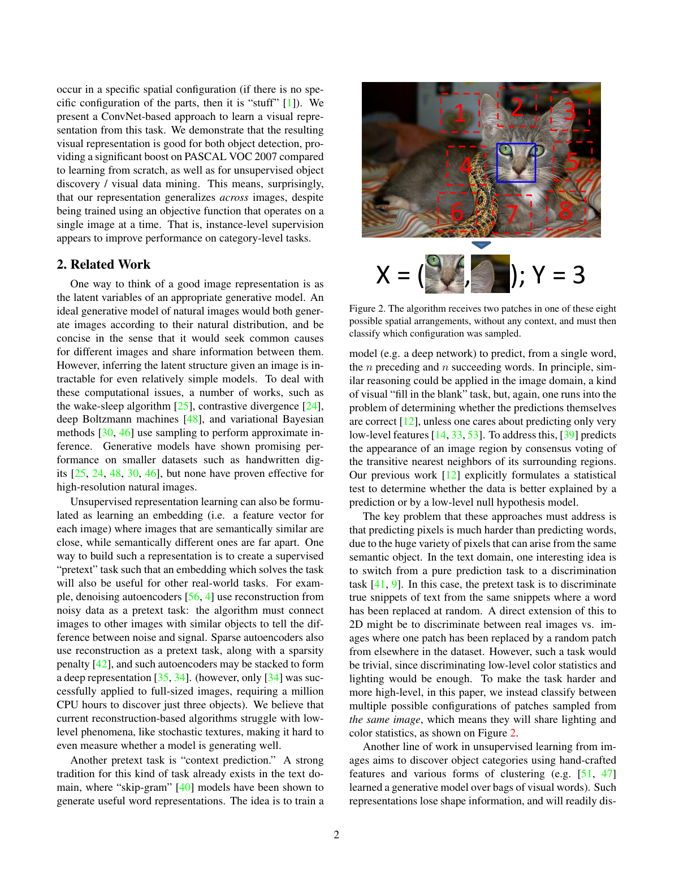
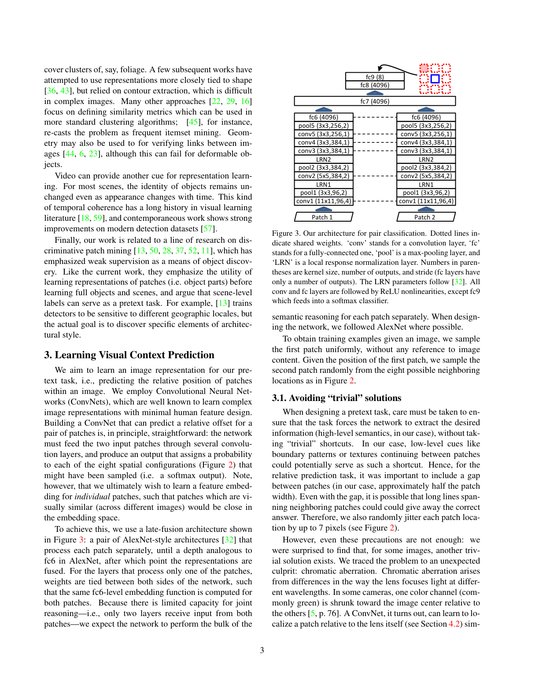
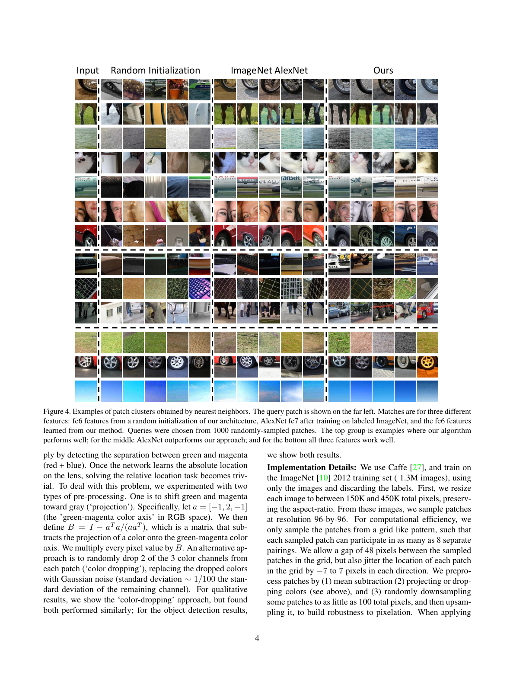
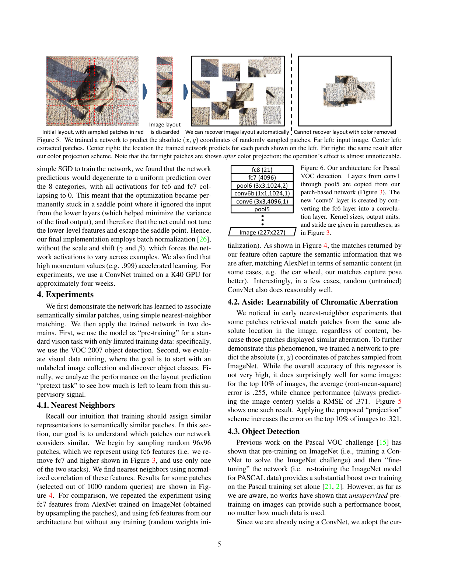
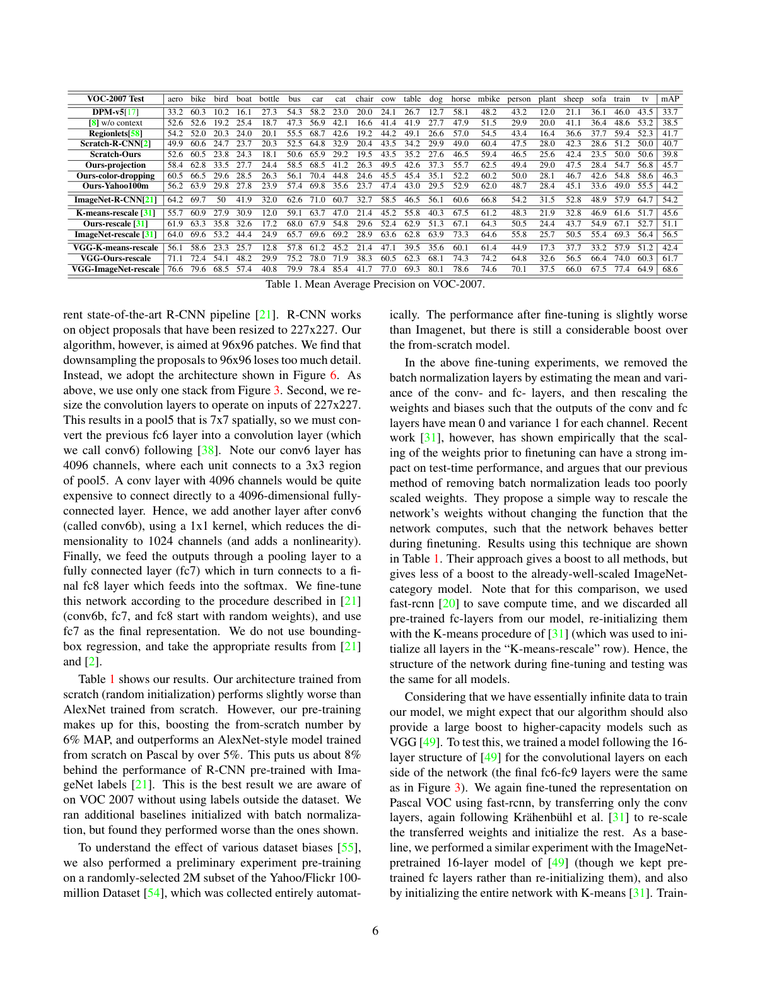
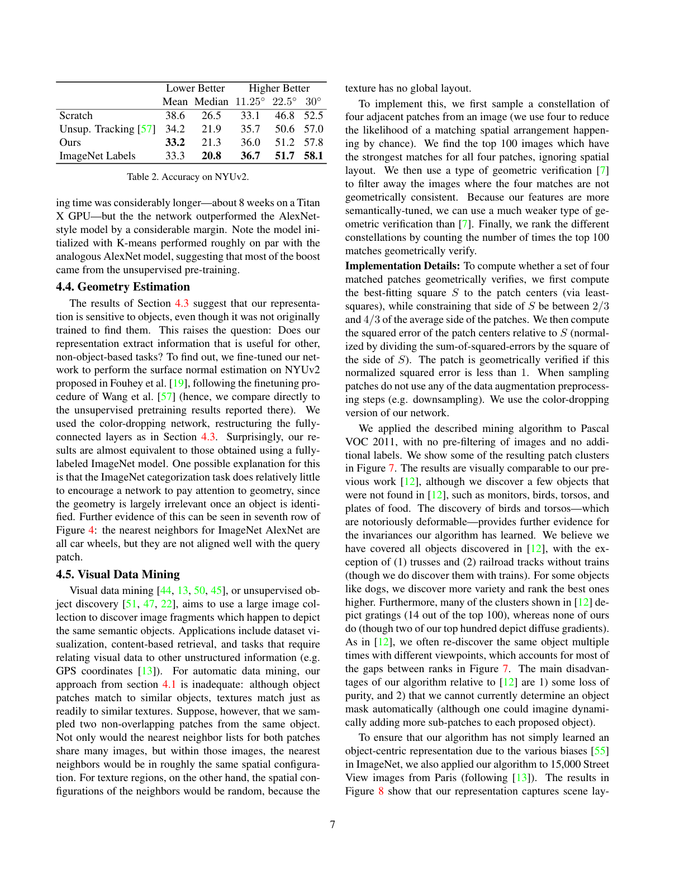
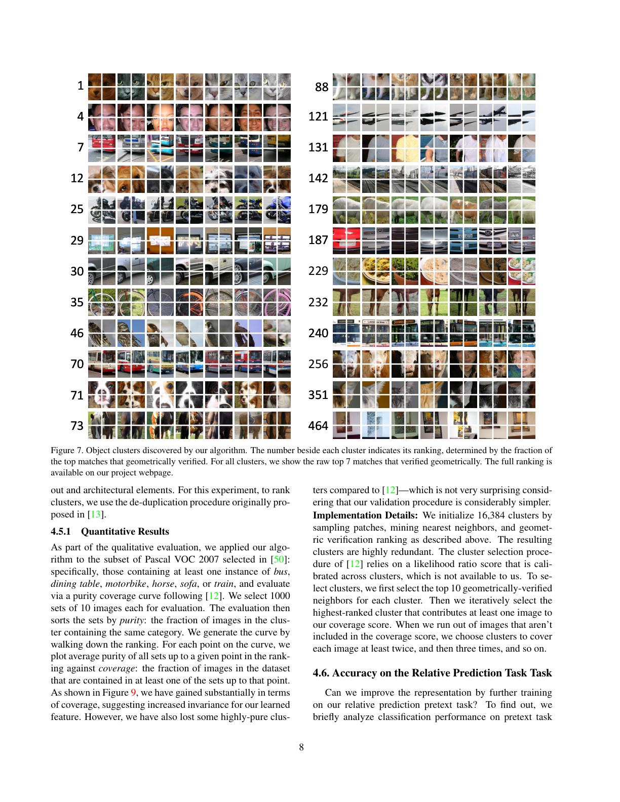
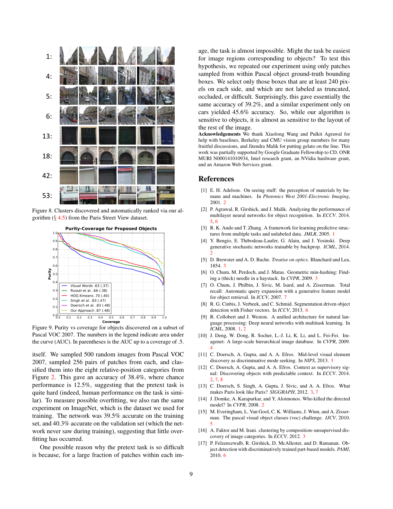

# Unsupervised Visual Representation Learning by Context Prediction

## Paper
- 저자: Carl Doersch, Abhinav Gupta, Alexei A. Efros
- PDF 버전: arXiv:1505.05192v3, 2016-01-16로 표시됨
- 주제: 이미지 내부 패치 쌍의 상대 위치 예측을 이용한 자기지도 시각 표현 학습
- PDF: `raw/papers/Unsupervised Visual Representation Learning by Context Prediction.pdf`
- 실제 로컬 경로: `C:\Users\jinsw712\Desktop\Files\Research_WIKI\raw\papers\Unsupervised Visual Representation Learning by Context Prediction.pdf`

## Main Claim
라벨 없는 이미지에서 두 패치의 상대적 공간 배치를 맞히도록 ConvNet을 학습시키면, 모델은 단순 픽셀 복원이 아니라 물체와 부품의 공간적 관계를 써야 하므로 전이 가능한 시각 표현을 얻을 수 있다. 이 표현은 패치 nearest neighbor에서 의미적 유사성을 보이고, VOC 2007 detection, NYUv2 surface normal, visual data mining으로 전이되며, 특히 기존 random initialization보다 뚜렷한 성능 향상을 보인다.

## Paper Says: Motivation and Previous Work
### 왜 context인가
논문은 텍스트의 skip-gram류 학습에서 주변 단어 예측이 좋은 word embedding을 만든다는 점을 이미지로 옮긴다. 이미지에서는 픽셀 자체를 예측하면 가능한 appearance가 너무 많고 저수준 현상에 매달리기 쉽다. 그래서 이 논문은 픽셀 값을 맞히지 않고, 같은 이미지에서 뽑은 두 패치가 8개 상대 위치 중 어디에 놓였는지를 분류하게 만든다. 같은 이미지에서 온 패치들은 조명과 색 통계를 공유하므로, 무작위 패치 치환 판별보다 더 고수준 구조를 요구한다. (p.1-2, Fig. 1-2)

### 기존 비지도 학습과의 차이
생성 모델, reconstruction-based autoencoder, sparse coding류는 고해상도 자연 이미지에서 저수준 texture와 pixel variability를 처리하기 어렵다고 본다. hand-crafted feature clustering 기반 object discovery는 shape 정보를 잃거나 deformable object에 약하다. 이 논문은 라벨을 만들지 않고도 supervised classification 형태의 pretext task를 구성하고, ConvNet이 patch-level embedding을 학습하게 한다. (p.2-3)

### 핵심 가정
물체는 독립적으로 감지될 수 있는 여러 부분이 특정 공간 구성으로 놓인 구조다. 따라서 상대 위치를 맞히려면 패치 내부의 부품, 물체, 장면 배치를 어느 정도 알아야 한다. 논문은 이 가정을 nearest neighbor, object detection, geometry estimation, object discovery 결과로 검증한다. (p.1, p.5-9)

## Paper Says: Method
### 8-way relative position prediction
첫 번째 `96x96` patch를 이미지에서 샘플링하고, 두 번째 patch를 주변 8개 위치 중 하나에서 샘플링한다. 모델은 두 패치만 보고 두 번째 패치가 첫 번째 패치 기준 어느 위치인지 분류한다. 위치 label은 사람이 붙이지 않고 crop 위치에서 자동 생성된다. (p.1-3, Fig. 1-2)



### Late-fusion tied-weight architecture
두 패치는 각각 AlexNet-style branch를 통과한다. 두 branch는 fc6에 해당하는 깊이까지 weight를 공유하고, 이후 fc7-fc9에서 fuse되어 8-way softmax를 낸다. 논문은 joint reasoning capacity를 fusion 뒤 두 층으로 제한하면, 각 patch branch가 개별 patch에 대한 의미 표현을 더 많이 담당할 것이라고 기대한다. (p.3, Fig. 3)



### Shortcut 방지 설계
패치 경계나 texture continuation만으로 답을 맞히지 못하게 두 패치 사이에 patch width의 약 절반인 `48` pixel gap을 둔다. 긴 선분 같은 저수준 연속성도 줄이기 위해 각 patch 위치를 `-7`에서 `7` pixel까지 jitter한다. 그러나 이것만으로 부족했고, chromatic aberration이 카메라 렌즈 기준 절대 위치를 드러내는 shortcut임을 발견한다. (p.3-5)

### 색 shortcut 제거
논문은 두 가지 전처리를 제안한다. 첫째, green-magenta color axis를 제거하는 projection이다. 둘째, 각 patch에서 3개 color channel 중 2개를 무작위로 버리고 남은 channel 기반 Gaussian noise로 대체하는 color dropping이다. qualitative result에는 color dropping을 쓰고, detection 결과에는 projection과 color dropping을 모두 보고한다. (p.4, Table 1)

## Visual Evidence
### Fig. 1: 물체 인식이 상대 위치 예측을 쉽게 만든다
p.1의 Fig. 1은 파란 patch와 빨간 patch 쌍을 제시하고 상대 위치를 맞히게 한다. 독자가 물체를 알아보면 문제가 쉬워진다는 점을 시각적으로 보여준다. 이는 pretext task가 단순 좌표 문제가 아니라 object/part reasoning을 유도한다는 논문의 직관적 출발점이다.

### Fig. 2: 8개 상대 위치 label space
p.2의 Fig. 2는 두 패치가 가질 수 있는 8개 공간 구성을 보여준다. 이 그림은 전체 objective의 label 생성 규칙이다. label은 사람이 붙인 semantic class가 아니라 crop geometry에서 자동으로 나온다.

### Fig. 3: tied-weight late fusion 구조
p.3의 Fig. 3은 두 패치가 각각 conv1-pool5-fc6까지 공유 가중치 branch로 처리되고, 이후 fc7-fc9에서 결합되는 구조를 보여준다. 점선은 shared weights를 뜻한다. 이 구조 덕분에 학습된 fc6 feature를 단일 patch embedding으로 재사용할 수 있다.

### Fig. 4: nearest neighbor patch cluster
p.4-5의 Fig. 4는 random initialization, ImageNet AlexNet, 논문 방법의 feature로 patch nearest neighbor를 비교한다. 논문 방법은 일부 예시에서 ImageNet feature와 비슷한 의미적 매칭을 만들고, car wheel처럼 pose alignment가 더 좋은 경우도 보인다. 단, random ConvNet도 일부 query에서 괜찮은 nearest neighbor를 낼 수 있어, qualitative evidence만으로는 충분하지 않다는 경계도 같이 준다.



### Fig. 5: chromatic aberration shortcut의 실증
p.5의 Fig. 5는 patch의 절대 `(x, y)` 좌표를 예측하는 네트워크가 일부 이미지에서 카메라 렌즈 기반 색수차를 이용해 원래 image layout을 복원할 수 있음을 보여준다. color projection 후에는 같은 layout 복원이 어려워진다. 이 그림은 shortcut avoidance가 단순 예방 조치가 아니라 실제로 성능을 왜곡할 수 있는 통로를 막는 작업임을 증명한다.



### Fig. 6 and Table 1: VOC detection transfer
p.5-6의 Fig. 6은 patch network를 R-CNN/Fast R-CNN detection으로 옮기는 구조다. conv1-pool5를 가져오고 fc6를 `conv6`으로 바꾸며, `1x1` conv6b로 차원을 줄인다. p.6 Table 1에서 scratch-ours는 `39.8` mAP, projection은 `45.7`, color-dropping은 `46.3`, Yahoo100M pretrain은 `44.2`를 보인다. ImageNet-R-CNN `54.2`에는 못 미치지만, label 없는 pretraining이 random initialization을 의미 있게 넘는다는 주장에는 충분한 근거가 된다.



### Table 2: NYUv2 geometry estimation
p.7 Table 2에서 surface normal estimation 결과는 scratch mean error `38.6`, unsupervised tracking `34.2`, 논문 방법 `33.2`, ImageNet labels `33.3`이다. 논문은 ImageNet category 학습이 물체 식별에는 강하지만 geometry를 직접 요구하지 않으므로, context prediction이 geometry-aware representation을 만들 수 있다고 해석한다. (p.7)



### Fig. 7-9: visual data mining과 purity-coverage
p.8 Fig. 7은 Pascal VOC 2011에서 label 없이 발견한 object cluster를 보여준다. p.9 Fig. 8은 Paris Street View에서 scene layout과 architectural element cluster가 나온다는 점을 보여준다. p.9 Fig. 9의 purity-coverage curve는 Pascal VOC 2007 subset에서 AUC `0.87`, coverage `.5`까지 AUC `.48`을 보고한다. coverage는 늘었지만 이전 방법보다 일부 highly pure cluster를 잃었다고 논문이 인정한다. (p.7-9)





## Key Equations
### 8-way softmax classification objective
논문은 명시적 번호 수식으로 loss를 정리하지 않지만, 방법상 각 patch pair `(x_1, x_2)`와 상대 위치 label `y in {1, ..., 8}`에 대해 softmax cross-entropy를 최소화한다.

```text
p(y | x_1, x_2) = softmax(f_theta(x_1, x_2))_y
L(theta) = - log p(y | x_1, x_2)
```

여기서 `f_theta`는 Fig. 3의 tied-weight late-fusion ConvNet이고, `y`는 crop geometry에서 자동 생성된 8-way label이다. 핵심은 label이 semantic class가 아니라 spatial relation이라는 점이다. (p.2-3)

### Green-magenta projection
p.4에서 색수차 shortcut을 줄이기 위해 green-magenta axis를 제거한다.

```text
a = [-1, 2, -1]
B = I - a^T a / (a a^T)
x'_pixel = B x_pixel
```

`a`는 RGB 공간의 green-magenta color axis다. `B`는 해당 축으로의 projection 성분을 빼는 행렬이며, 모든 pixel에 곱해진다. 목적은 patch의 절대 렌즈 위치를 드러내는 색 분리 단서를 제거하는 것이다. (p.4-5)

### Geometric verification for object discovery
p.7의 mining 절차에서 네 patch 중심에 가장 잘 맞는 정사각형 `S`를 least squares로 찾고, patch center의 squared error를 `S`의 side length squared로 정규화한다.

```text
normalized_error = SSE(patch_centers, S) / side(S)^2
verified if normalized_error < 1
```

`side(S)`는 patch 평균 side의 `2/3`에서 `4/3` 사이로 제한된다. 이 검증은 네 패치가 다른 이미지에서도 비슷한 공간 구성을 유지하는지를 본다. texture는 nearest neighbor가 많아도 global layout이 무작위라 이 검증에서 걸러진다. (p.7)

## Implementation
- Framework: Caffe
- Pretraining data: ImageNet 2012 training set 약 `1.3M` images, labels discarded
- Image resize: aspect ratio 유지, 총 pixel 수 `150K`-`450K`
- Patch resolution: `96x96`
- Patch sampling: grid-like pattern으로 계산 효율 확보, 각 patch가 최대 8개 pairing에 참여 가능
- Gap: `48` pixels
- Jitter: 각 방향 `-7` to `7` pixels
- Preprocessing: mean subtraction, color projection 또는 color dropping, 일부 patch를 `100` total pixels까지 downsample 후 upsample하여 pixelation robustness 부여
- Optimization issue: plain SGD에서 fc6/fc7 activation이 0으로 collapse하고 8 category uniform prediction saddle point에 갇힘
- Fix: scale/shift 없는 batch normalization으로 activation이 example 간 변하도록 강제
- Momentum: 높은 momentum, 예시 `.999`, 학습 가속
- Compute: K40 GPU 약 4주, VGG-style 확장은 Titan X 약 8주
- Detection transfer: patch network의 한 branch를 사용하고 R-CNN/Fast R-CNN pipeline에 맞게 conv/fc 구조 변환

## Experiments
### Nearest Neighbors
`96x96` random query patch의 fc6 feature로 normalized correlation nearest neighbor를 찾는다. 논문 방법은 일부 query에서 semantic match와 pose alignment를 만든다. 하지만 random ConvNet도 일부 잘 맞는 예시가 있어, nearest neighbor는 보조 증거로 해석해야 한다. (p.5, Fig. 4)

### Chromatic Aberration Learnability
patch의 absolute `(x, y)` 좌표를 예측하는 별도 네트워크를 학습한다. 상위 10% 이미지에서 RMSE가 `.255`이고, 항상 image center를 예측하는 chance baseline은 `.371`이다. projection 적용 후 RMSE는 `.321`로 악화된다. 이는 색수차가 실제 shortcut임을 보여준다. (p.5, Fig. 5)

### VOC 2007 Object Detection
Scratch-ours `39.8` mAP에서 projection `45.7`, color-dropping `46.3`으로 올라간다. Yahoo/Flickr 100M subset pretraining도 `44.2`로 scratch보다 높다. ImageNet supervised R-CNN `54.2`에는 뒤지지만, label 없는 pretraining으로 상당한 transfer boost를 보인다는 점이 핵심이다. rescale 기법과 VGG conv 구조에서는 VGG-ours-rescale `61.7`까지 상승한다. (p.6, Table 1)

### NYUv2 Surface Normal
논문 방법은 mean error `33.2`로 ImageNet labels `33.3`과 거의 같다. 저자는 category classification이 geometry를 강하게 요구하지 않는 반면 context prediction은 부품 배치와 scene layout을 요구하므로 geometry task에 강할 수 있다고 해석한다. (p.7, Table 2)

### Visual Data Mining
네 개 adjacent patch constellation을 샘플링하고, 각 patch의 nearest neighbor가 강한 top 100 images를 찾은 뒤, spatial arrangement가 맞는지 geometric verification으로 필터링한다. Pascal VOC 2011에서는 cats, people, birds, torsos, food plates 같은 cluster를 발견한다. Paris Street View에서도 architectural element와 scene layout cluster가 나온다. (p.7-9, Fig. 7-8)

### Pretext Task Accuracy
Pascal VOC 2007의 500 random images에서 각 256 patch pair를 뽑아 8-way classification을 평가하면 `38.4%`다. chance는 `12.5%`이고, human performance도 비슷하다고 언급한다. ImageNet train `39.5%`, validation `40.3%`로 overfitting은 작아 보인다. Object bounding box 내부 patch만 쓰면 `39.2%`, car만 쓰면 `45.6%`다. 즉 task는 어렵고, object뿐 아니라 전체 scene layout에도 민감하다. (p.9)

## Interpretation
이 논문은 초기 self-supervised vision에서 중요한 전환점이다. 목표는 이미지를 잘 복원하는 것이 아니라, 사람이 설계한 자동 label이 의미 구조를 요구하도록 만드는 것이다. 현대 관점에서 보면 contrastive learning, masked image modeling, joint-embedding prediction보다 훨씬 직접적인 pretext task지만, 세 가지 교훈은 여전히 살아 있다.

첫째, 좋은 자기지도 과제는 라벨 자동 생성보다 shortcut analysis가 더 중요하다. chromatic aberration 사례는 pretext accuracy가 높아도 표현이 의미적이라는 보장이 없다는 점을 선명하게 보여준다.

둘째, spatial context는 category뿐 아니라 geometry와 dense representation에 연결된다. NYUv2 결과는 object category supervision과 spatial reasoning supervision이 서로 다른 inductive bias를 가진다는 좋은 증거다.

셋째, patch-level representation은 object discovery로 확장될 수 있다. 단일 patch nearest neighbor는 texture에 속기 쉽지만, 여러 patch의 constellation과 geometric verification을 결합하면 global layout을 가진 object-like pattern을 찾을 수 있다.

## Limitations
- 논문 방법은 pretext task가 handcrafted되어 있으며, 8-way relative position이라는 제한된 label space에 의존한다.
- 색수차, boundary continuation, texture continuation 같은 shortcut 제거가 과제 설계의 큰 부분을 차지한다.
- 학습 비용이 당시 기준으로 크다. AlexNet-style 모델도 K40 GPU 약 4주, VGG-style 모델은 Titan X 약 8주가 걸린다.
- VOC detection에서는 supervised ImageNet pretraining보다 낮다.
- Visual data mining은 이전 방법보다 coverage는 좋아지지만 일부 highly pure cluster를 잃고, 자동 object mask를 제공하지 못한다.
- 논문 자체는 representation이 어떤 semantic factor를 얼마나 분리했는지 현대식 linear probing/segmentation probing 기준으로 세밀하게 분석하지 않는다.

## Open Questions
- chromatic aberration처럼 보이지 않는 dataset-specific shortcut은 다른 pretext task에서 어떻게 체계적으로 찾을 수 있는가?
- 상대 위치 예측이 object category, geometry, texture 중 무엇을 얼마나 학습하는지 layer별로 분리해 측정할 수 있는가?
- patch constellation + geometric verification은 modern self-supervised ViT feature와 결합하면 object discovery purity와 mask 품질을 동시에 개선할 수 있는가?
- context prediction은 masked image modeling이나 I-JEPA식 joint embedding prediction과 비교할 때 어떤 spatial inductive bias를 남기는가?
- pretext task accuracy가 낮은데 transfer가 좋은 경우, 과제 난이도와 표현 품질 사이의 관계를 어떻게 해석해야 하는가?

## Evidence Anchors
- p.1: Abstract, Fig. 1, self-supervised visual context motivation
- p.2: Fig. 2, 8-way relative position classification, related work comparison
- p.3: Fig. 3, tied-weight late-fusion architecture, gap/jitter shortcut discussion begins
- p.4: Fig. 4, nearest neighbor qualitative evidence, green-magenta projection formula, implementation setup
- p.5: Fig. 5, chromatic aberration shortcut evidence, batch normalization fix, detection transfer setup
- p.6: Fig. 6 and Table 1, VOC 2007 detection transfer results
- p.7: Table 2, NYUv2 surface normal, visual data mining algorithm
- p.8: Fig. 7, Pascal VOC object clusters and purity/coverage procedure
- p.9: Fig. 8-9, Paris Street View clusters, purity-coverage AUC, pretext task accuracy analysis
- p.10: References only

## Related WIKI Pages
- [[self-supervised-pretext-tasks]]
- [[shortcut-avoidance-in-self-supervision]]
- [[spatial-context-and-part-reasoning]]
- [[geometric-verification-for-object-discovery]]
