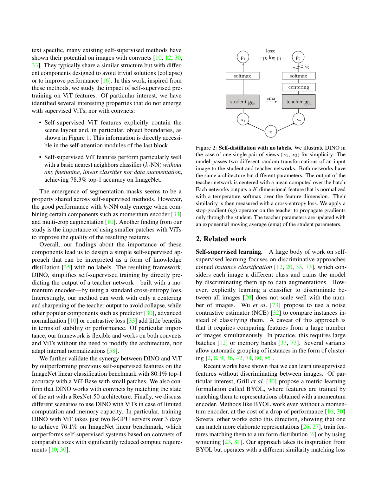
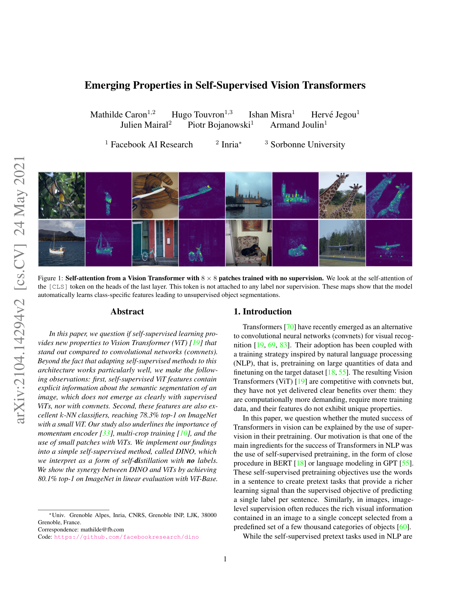
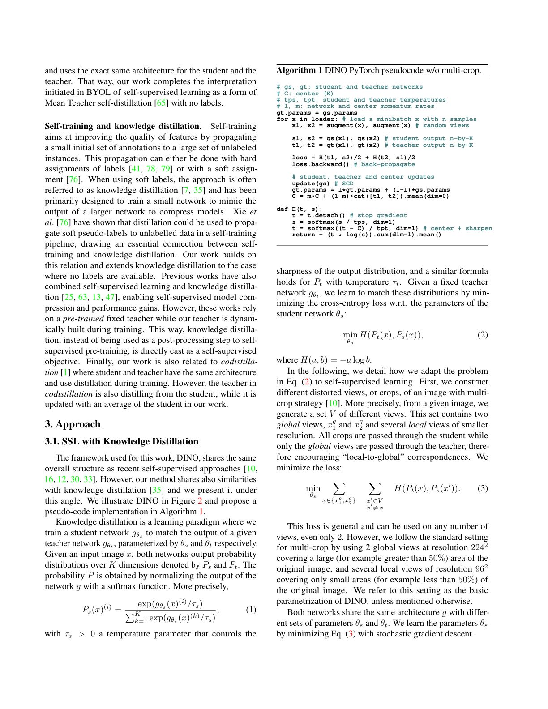
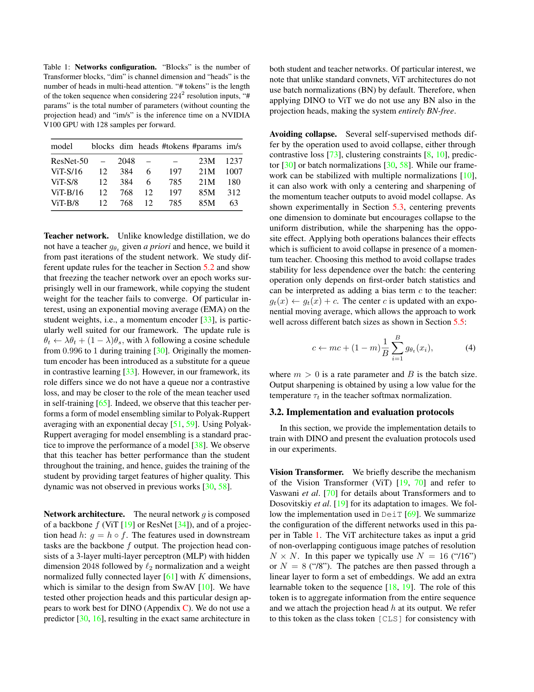
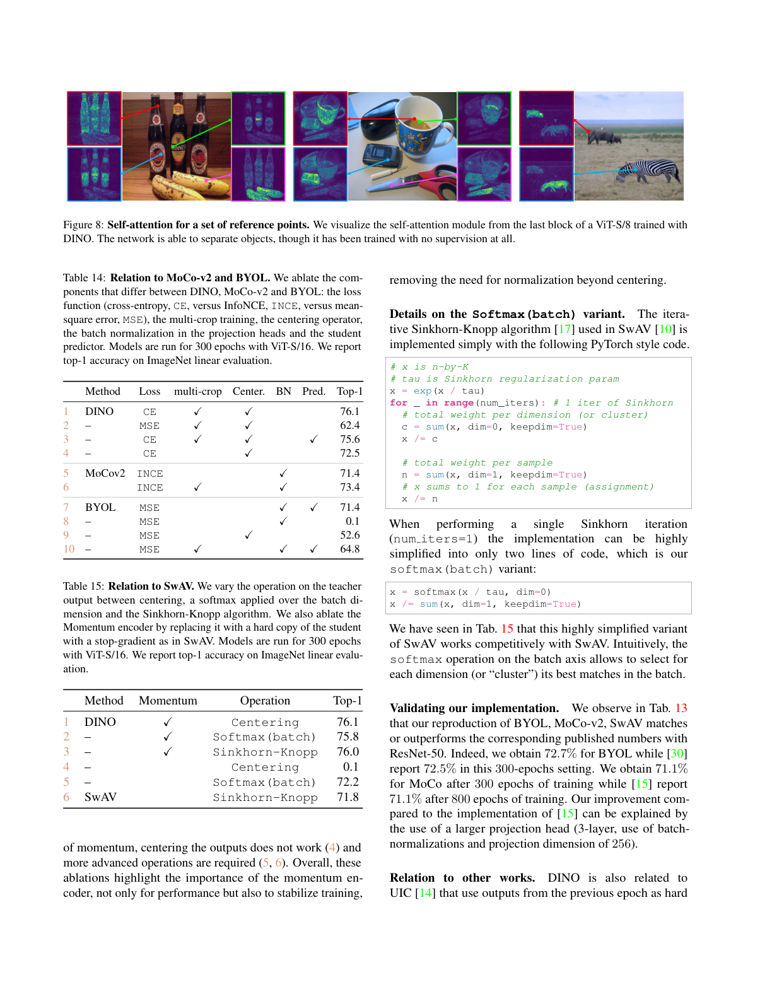
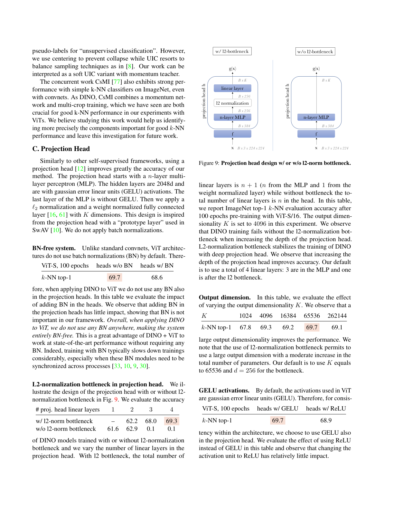

# Emerging Properties in Self-Supervised Vision Transformers

## Paper
- 저자: Mathilde Caron, Hugo Touvron, Ishan Misra, Herve Jegou, Julien Mairal, Piotr Bojanowski, Armand Joulin
- 버전: arXiv:2104.14294v2, 2021-05-24
- 주제: 라벨 없는 self-distillation으로 Vision Transformer를 학습할 때 나타나는 emergent object segmentation, k-NN 친화적 feature, DINO 학습 구성요소 분석
- PDF: `raw/papers/DINO-Emerging Properties in Self-Supervised Vision Transformers.pdf`

## Main Claim
DINO는 라벨 없이 student가 momentum teacher의 sharpened probability target을 cross-entropy로 예측하도록 학습하는 단순한 self-distillation 프레임워크다. 핵심 주장은 이 objective가 ViT와 결합될 때 단순한 ImageNet 성능 향상을 넘어서, 마지막 블록 [CLS] self-attention에 object boundary와 scene layout이 명시적으로 드러나고, frozen feature가 linear classifier 없이도 k-NN에서 강하게 작동하는 성질을 만든다는 것이다. 논문은 이 성질이 momentum encoder, multi-crop local-to-global matching, 작은 patch 크기, centering+sharpening collapse 방지의 조합에서 특히 강해진다고 주장한다.

## Paper Says: Motivation and Previous Work
### 문제 설정
ViT는 supervised pretraining으로도 convnet과 경쟁 가능하지만, 더 많은 데이터와 계산을 요구하고 convnet 대비 뚜렷한 고유 이점을 보여주지 못했다. 논문은 이 한계가 vision transformer 자체의 문제가 아니라 image-level label supervision이 이미지의 풍부한 공간 정보를 하나의 category label로 압축하기 때문일 수 있다고 본다. NLP에서 Transformer 성공의 중요한 축이 self-supervised pretraining이었다는 점을 vision에도 대응시키려 한다. (p.1)

### 기존 SSL과의 관계
논문은 instance discrimination, MoCo, SwAV, BYOL, Mean Teacher, knowledge distillation의 흐름을 연결한다. DINO는 BYOL처럼 momentum target을 쓰지만, student와 teacher의 architecture가 완전히 같고 predictor를 쓰지 않으며, output distribution을 softmax temperature로 정규화한 뒤 cross-entropy로 맞춘다. contrastive queue, negative pair, Sinkhorn assignment, batch normalization 없이도 ViT에서 작동하도록 centering과 sharpening을 사용한다. (p.2-4)

## Paper Says: Method
### DINO student-teacher pipeline


Fig. 2는 DINO의 가장 압축된 구조다. 같은 이미지 `x`에서 두 개 이상의 random view를 만들고, student `g_theta_s`와 teacher `g_theta_t`가 각각 K차원 output을 만든다. teacher branch에는 stop-gradient가 걸리며, teacher parameter는 student parameter의 exponential moving average로 갱신된다. teacher output은 batch center를 빼고 낮은 temperature로 sharpened target distribution이 된다. student는 자기 view의 softmax distribution을 teacher target에 맞춘다.

### Multi-crop local-to-global matching
DINO는 한 이미지에서 두 개의 global crop과 여러 개의 local crop을 만든다. 모든 crop은 student에 들어가지만, teacher에는 global crop만 들어간다. 그래서 loss는 global view teacher output을 local/global student view가 맞추게 하는 local-to-global correspondence로 작동한다. 이 구조는 단순히 augmentation 수를 늘리는 것이 아니라, 작은 부분 crop이 이미지 전체의 semantic target과 정렬되도록 압력을 준다. (p.3, Appendix E p.18)

### Teacher construction
teacher는 외부 pretrained model이 아니라 학습 중인 student의 과거 상태를 평균한 모델이다. update는 `theta_t <- lambda theta_t + (1 - lambda) theta_s`이고, `lambda`는 0.996에서 1로 가는 cosine schedule을 따른다. 논문은 이 teacher를 contrastive queue 대체물이 아니라 Polyak-Ruppert averaging과 유사한 online ensemble로 해석한다. Fig. 6에서는 momentum teacher가 학습 내내 student보다 높은 k-NN 성능을 보여, 더 좋은 target이 student를 다시 끌어올리는 순환을 만든다고 설명한다. (p.4, p.9)

### Collapse prevention
DINO의 collapse 방지는 teacher output의 centering과 sharpening의 균형이다. centering은 특정 dimension이 지배하는 collapse를 막지만 uniform output collapse를 유도할 수 있고, sharpening은 그 반대 효과를 가진다. 둘을 같이 쓰면 한쪽 dimension domination과 uniform distribution collapse가 모두 완화된다. momentum teacher가 없는 경우 단순 centering만으로는 collapse가 발생한다. (p.4, p.9)

## Visual Evidence
### Fig. 1: 라벨 없이 생기는 object segmentation


Fig. 1은 ViT-S/8 DINO 모델의 마지막 layer [CLS] token self-attention head를 시각화한다. [CLS] token은 어떤 segmentation label이나 object mask supervision도 받지 않았지만, attention map은 새, 동물, 배경과 같은 semantic object 단위에 가깝게 모인다. 논문이 말하는 emergent property는 바로 이 지점이다. feature vector만 좋은 것이 아니라 ViT 내부 attention에 object boundary 정보가 노출된다. (p.1)

### Fig. 2와 Algorithm 1: DINO가 실제로 단순한 이유


Algorithm 1은 multi-crop을 제외한 최소 DINO pseudo-code다. 핵심은 `(1) 두 random view 생성`, `(2) student와 teacher forward`, `(3) teacher stop-gradient`, `(4) center+sharpen 후 CE`, `(5) student SGD`, `(6) teacher EMA`, `(7) center EMA`다. 이 pseudo-code는 DINO가 별도 clustering assignment나 negative sample machinery 없이 self-supervised target을 만드는 방식을 보여준다. (p.3)

### Table 1: 작은 patch의 계산 비용


Table 1은 ViT-S/16과 ViT-S/8이 parameter 수는 둘 다 21M이지만 token 수가 197에서 785로 늘고 throughput이 1007 im/s에서 180 im/s로 떨어진다는 점을 보여준다. 작은 patch는 parameter를 늘리지 않고 dense spatial information을 개선하지만, token sequence가 길어져 계산량과 메모리가 커진다. (p.4)

### Table 2-5: k-NN, retrieval, dense tracking evidence
- Table 2: ViT-S DINO는 ImageNet에서 linear 77.0, k-NN 74.5를 달성하고, ViT-S/8은 k-NN 78.3, ViT-B/8은 linear 80.1 및 k-NN 77.4를 기록한다. k-NN 성능이 linear와 가까운 것이 DINO+ViT의 중요한 특징이다. (p.5-6)
- Table 3: GLDv2에서 라벨 없이 pretrain한 DINO ViT-S/16 feature는 ROx/RPar retrieval에서 off-the-shelf supervised feature보다 강한 결과를 낸다. (p.6)
- Table 4: Copydays strong subset copy detection에서 DINO ViT-B/8은 85.5 mAP를 보여, distortion이 있는 instance retrieval에도 유용함을 보인다. (p.6)
- Table 5: DAVIS-2017 video object segmentation에서 frozen DINO ViT-B/8은 `(J&F)m 71.4`를 기록한다. 별도 dense task fine-tuning 없이 patch token feature가 spatial correspondence를 보존한다는 증거다. (p.7)

### Fig. 3-4: attention map은 supervised ViT보다 mask에 가깝다
Fig. 3은 서로 다른 attention head가 object나 object part에 분화되어 집중하는 예시를 보여준다. Fig. 4는 supervised ViT와 DINO ViT의 thresholded attention mask를 비교하고, PASCAL VOC12에서 Jaccard similarity가 DINO 쪽이 훨씬 높음을 보인다. 논문은 attention map이 mask 생성 목적에 최적화된 것은 아니지만, self-supervised ViT에서는 scene layout이 직접 읽힌다는 점이 중요하다고 본다. (p.7-8)

### Fig. 5-7과 Tables 7-8: 무엇이 성능과 안정성을 만든다
- Fig. 5: patch size를 16, 8, 5로 줄이면 k-NN 성능이 올라가지만 throughput이 급감한다. 작은 patch는 dense information과 classification feature를 함께 개선한다. (p.8)
- Fig. 6: momentum teacher는 student보다 학습 내내 더 좋은 validation k-NN을 보이며, student copy와 previous iteration teacher는 collapse한다. previous epoch teacher는 작동하지만 momentum보다 낮다. (p.9)
- Fig. 7: centering 또는 sharpening 하나만 빠지면 KL이 0으로 가는 collapse가 관찰된다. 둘의 균형이 필요하다. (p.9)
- Table 8: multi-crop은 시간이 늘어나는 단순 비용이 아니라 accuracy/time tradeoff를 개선한다. 300 epoch 기준 2 global crop만 쓰면 72.5 top-1, `2x224^2 + 10x96^2`는 76.1 top-1이다. (p.9-10)

### Appendix visual and ablation evidence


Appendix Table 14-15는 DINO, BYOL, MoCo-v2, SwAV의 차이를 분해한다. CE + multi-crop + centering + momentum이 DINO의 핵심 조합이고, momentum이 없으면 centering만으로는 0.1 top-1 collapse가 난다. Appendix Fig. 8은 reference point별 self-attention이 object를 분리하는 사례를 추가로 보여준다. (p.14-15)



Appendix C는 projection head의 세부 설계를 설명한다. DINO head는 3-layer MLP, GELU, l2 normalization bottleneck, weight-normalized FC layer를 쓰며, BN-free ViT 시스템으로 유지된다. l2 bottleneck이 없으면 깊은 projection head에서 collapse가 날 수 있다. (p.16)

## Key Equations
### Eq. 1: student softmax distribution
```text
P_s(x)(i) = exp(g_theta_s(x)(i) / tau_s) / sum_{k=1}^K exp(g_theta_s(x)(k) / tau_s)
```
`g_theta_s(x)`는 student network output, `tau_s`는 student temperature다. teacher도 같은 형태의 `P_t`를 갖지만 teacher temperature `tau_t`를 사용한다. 낮은 temperature는 distribution을 더 sharp하게 만든다. (p.3)

### Eq. 2: fixed teacher distillation objective
```text
min_{theta_s} H(P_t(x), P_s(x))
H(a, b) = - a log b
```
student는 teacher distribution을 cross-entropy로 맞춘다. DINO의 차이는 teacher가 고정 pretrained model이 아니라 student의 EMA로 온라인 생성된다는 점이다. (p.3)

### Eq. 3: multi-crop local-to-global DINO loss
```text
min_{theta_s} sum_{x in {x_g1, x_g2}} sum_{x' in V, x' != x} H(P_t(x), P_s(x'))
```
`V`는 두 global view와 여러 local view를 포함한다. teacher는 global view만 보고, student는 local/global view를 모두 본다. 따라서 local crop representation이 global semantic target과 맞춰진다. (p.3)

### EMA teacher update
```text
theta_t <- lambda theta_t + (1 - lambda) theta_s
```
`lambda`는 0.996에서 1까지 증가하는 cosine schedule이다. 논문은 이 업데이트를 학습 중 online model ensemble로 해석한다. (p.4)

### Eq. 4: center update
```text
c <- m c + (1 - m) (1 / B) sum_{i=1}^B g_theta_t(x_i)
```
center `c`는 teacher output의 batch mean에 대한 EMA다. teacher logit에서 center를 빼면 특정 dimension domination을 줄인다. (p.4)

### Eq. 5: collapse analysis decomposition
```text
H(P_t, P_s) = h(P_t) + D_KL(P_t | P_s)
```
KL이 0으로 가면 teacher와 student output이 입력과 무관하게 같아지는 collapse를 의미한다. Fig. 7은 centering과 sharpening 중 하나만 쓰면 서로 다른 형태의 collapse가 발생하고, 둘을 함께 써야 균형이 잡힌다고 해석한다. (p.9)

## Implementation
### Architecture
- backbone: ViT 또는 ResNet. downstream feature는 projection head가 아니라 backbone output을 사용한다.
- ViT input: non-overlapping patch grid, `N=16` 또는 `N=8`; [CLS] token을 추가하고 projection head는 [CLS] output에 붙인다.
- projection head: 3-layer MLP hidden dim 2048, GELU, l2 normalization, weight-normalized FC, output dimension 기본 `K=65536`.
- DINO+ViT는 projection head까지 BN-free로 설계된다. 논문은 ViT에서 BN이 필수적이지 않고, synchronized BN 비용을 피할 수 있다고 본다. (p.4, p.16)

### Training details
- pretraining data: ImageNet labels 없이 사용.
- optimizer: AdamW.
- batch size: ViT-S/16 기준 16 GPU에 1024.
- learning rate: 첫 10 epoch warmup 후 cosine decay, base rule `lr = 0.0005 * batchsize / 256`.
- weight decay: cosine schedule `0.04 -> 0.4`.
- temperatures: student `tau_s = 0.1`; teacher `tau_t`는 첫 30 epoch 동안 `0.04 -> 0.07` warmup.
- augmentation: BYOL의 color jittering, Gaussian blur, solarization에 multi-crop을 결합. position embedding은 bicubic interpolation으로 crop scale에 맞춘다. (p.5)

### Evaluation protocols
- k-NN: pretrained model frozen, train set feature를 저장하고 weighted k-NN으로 label voting. 논문은 `k=20`, contribution weight temperature `0.07`을 사용한다. hyperparameter tuning이나 data augmentation 없이 feature 품질을 빠르게 본다는 장점이 있다. (p.5, p.18)
- linear eval: projection head 제거 후 frozen feature 위에 linear classifier를 학습한다. ViT-S는 BERT식 feature probing처럼 마지막 `l=4`개 [CLS] token을 concat하면 최적이다. (p.19)
- dense/video: DAVIS-2017에서 consecutive frame nearest-neighbor correspondence로 frozen patch token 품질을 평가한다. (p.7)

## Experiments
### ImageNet linear and k-NN
DINO는 ResNet-50에서는 기존 SSL 방법과 유사한 수준이지만, ViT-S에서는 같은 ViT-S architecture의 BYOL, MoCo-v2, SwAV를 크게 앞선다. 특히 k-NN에서 차이가 크다. Table 2에서 DINO ViT-S는 linear 77.0, k-NN 74.5이고, ViT-S/8은 k-NN 78.3, ViT-B/8은 linear 80.1 및 k-NN 77.4를 기록한다. 논문은 k-NN 친화성이 DINO+ViT feature의 geometry가 label 없이도 semantic neighborhood를 잘 만든다는 신호라고 본다. (p.5-6)

### Retrieval and copy detection
DINO feature는 landmark retrieval과 copy detection에도 잘 맞는다. GLDv2로 라벨 없이 pretrain한 ViT-S/16은 revisited Oxford/Paris retrieval에서 강하고, Copydays strong subset에서는 ViT-B/8이 85.5 mAP를 기록한다. 이는 DINO feature가 category classification뿐 아니라 instance-level matching에도 쓸 수 있음을 보여준다. (p.6)

### Object layout and video segmentation
DINO의 가장 독특한 증거는 attention과 dense correspondence다. Fig. 1, Fig. 3, Fig. 4는 마지막 self-attention head가 object boundary와 part에 대응하는 모습을 보여주고, Table 5의 DAVIS-2017 결과는 frozen feature만으로 video object segmentation이 가능함을 보인다. 작은 patch(`/8`)가 dense task에서 특히 중요하다. (p.7-8)

### Transfer and low-shot
Table 6은 DINO pretrained ViT가 ImageNet supervised pretraining보다 CIFAR, iNaturalist, Flowers, Cars, ImageNet fine-tuning에서 대체로 더 잘 transfer됨을 보인다. Appendix Table 12는 1%/10% ImageNet label에서 frozen ViT-S/16 feature와 logistic regression만으로 각각 64.5/72.2 top-1을 달성한다고 보고한다. (p.8, p.14)

### Component ablations
Table 7과 Appendix Table 14-15는 핵심 구성요소를 분해한다. momentum이 없으면 CE+multi-crop+centering 설정이 0.1로 collapse하고, multi-crop을 빼면 성능이 떨어지며, CE를 MSE로 바꾸면 큰 하락이 난다. Sinkhorn-Knopp는 momentum이 없을 때 필요하지만, momentum teacher가 있으면 centering만으로도 충분히 안정화된다. (p.8, p.14-15)

## Interpretation
### What is genuinely new
DINO의 novelty는 완전히 새로운 loss 하나라기보다, ViT에서 self-supervised distillation을 매우 단순한 형태로 작동시키고 그 결과가 attention-level spatial structure로 드러난다는 경험적 발견에 있다. 즉, `negative 없는 SSL`, `online EMA teacher`, `multi-crop local-to-global`, `teacher centering+sharpening`, `small-patch ViT`가 결합될 때 분류 feature와 dense object layout이 동시에 살아난다.

### Modern perspective
DINO는 이후 self-supervised foundation vision model의 중요한 중간 지점이다. contrastive learning의 instance discrimination과 BYOL식 non-contrastive target matching을 잇고, DINOv2 같은 대규모 robust visual feature learning으로 이어질 수 있는 teacher-student SSL 계열의 출발점으로 읽힌다. 특히 attention map object discovery는 segmentation label 없이 object-centric inductive bias가 생길 수 있음을 보여주어, weakly supervised localization, object discovery, dense correspondence 연구와 연결된다.

### Research reuse
- feature geometry가 k-NN에 강하다는 것은 representation이 class prototype 주변으로 잘 조직된다는 의미로 재사용 가능하다.
- [CLS] attention map이 object mask처럼 보이는 현상은 segmentation supervision 없이 objectness prior를 추출하는 연구 아이디어로 쓸 수 있다.
- centering+sharpening은 collapse 방지를 batch-level first-order statistics와 entropy control로 나눠 생각하게 해 준다.
- multi-crop local-to-global은 작은 crop이 global semantics를 예측하게 하는 방식이므로, patch-level generative 또는 predictive representation learning에도 응용 가능하다.

## Limitations
- emergent attention segmentation은 qualitative하게 강하지만, mask generation을 목적으로 학습된 것은 아니므로 boundary quality와 instance separation이 task-specific supervised segmentation보다 제한적일 수 있다. (p.7-8)
- 작은 patch(`/8`, `/5`)는 성능과 dense 정보가 좋아지지만 token 수 때문에 throughput과 memory 비용이 크게 증가한다. (p.4, p.8)
- collapse 방지는 centering, sharpening, momentum teacher의 균형에 민감하다. teacher temperature가 너무 높거나 center smoothing이 너무 느리면 collapse가 발생한다. (p.9, p.17)
- k-NN 친화성은 ViT+DINO에서 강하게 나타나지만, 논문은 왜 이 geometry가 생기는지에 대한 이론적 설명보다는 경험적 ablation에 의존한다.
- self-attention map이 scene layout을 보존하는 성질은 self-supervised ViT 전반에서 관찰되지만, 좋은 k-NN 성능은 DINO의 특정 구성요소 조합에 더 의존한다. 이 둘을 구분해야 한다. (p.2, p.17)

## Open Questions
- DINO attention map의 object boundary 성질은 teacher target의 entropy, patch size, multi-crop scale 중 어느 요인에 가장 민감한가?
- k-NN 친화적 feature geometry는 class-level semantic clustering 때문인가, augmentation-induced invariance 때문인가, 또는 ViT token mixing 구조 때문인가?
- centering+sharpening 대신 더 명시적인 entropy regularization이나 prototype balancing을 쓰면 DINO의 단순성을 유지하면서 안정성을 높일 수 있는가?
- local-to-global crop matching을 image-only가 아니라 video, 3D, multimodal patch prediction으로 확장하면 dense correspondence가 더 좋아지는가?
- DINO attention map을 downstream segmentation pseudo-label로 사용할 때 어떤 filtering, head selection, thresholding이 가장 안전한가?

## Evidence Anchors
- p.1: Fig. 1 attention segmentation, abstract의 두 핵심 관찰, DINO와 ViT synergy 주장
- p.2: DINO overview, Fig. 2, self-supervised ViT의 scene layout 및 k-NN claim
- p.3: Algorithm 1, Eq. 1-3, multi-crop local-to-global loss
- p.4: Table 1, EMA teacher, projection head, centering/sharpening, Eq. 4
- p.5: implementation details, k-NN evaluation protocol, Table 2 시작
- p.6: Table 2 continuation, retrieval Table 3, copy detection Table 4
- p.7: DAVIS Table 5, Fig. 3 attention heads, segmentation probing description
- p.8: Fig. 4 supervised vs DINO masks, transfer Table 6, Table 7 component ablation, Fig. 5 patch size
- p.9: Fig. 6 teacher analysis, Fig. 7 collapse study, Eq. 5, Table 8 compute requirements
- p.13: Appendix Table 10 k-NN/linear across datasets, Table 11 supervised ViT pretraining
- p.14: Table 12 low-shot, Table 13 methodology comparison
- p.15: Appendix Fig. 8 attention reference points, Table 14-15 BYOL/MoCo/SwAV relation
- p.16: projection head, BN-free system, l2 bottleneck, output dimension
- p.17: centering/sharpening hyperparameters, longer training, self-attention across SSL frameworks
- p.18: multi-crop scale ranges and framework-specific multi-crop effect
- p.19: k-NN and linear evaluation details, final t-SNE class representation note

## Related WIKI Pages
- [Self-Distillation Without Labels](../concepts/self-distillation-without-labels.md)
- [Momentum Target Encoders](../concepts/momentum-target-encoders.md)
- [Attention Map Object Discovery](../concepts/attention-map-object-discovery.md)
- [Multi-Crop Local-to-Global Training](../concepts/multi-crop-local-to-global-training.md)
- [Instance Discrimination](../concepts/instance-discrimination.md)
- [Self-Supervised Pretext Tasks](../concepts/self-supervised-pretext-tasks.md)
- [Spatial Context and Part Reasoning](../concepts/spatial-context-and-part-reasoning.md)
