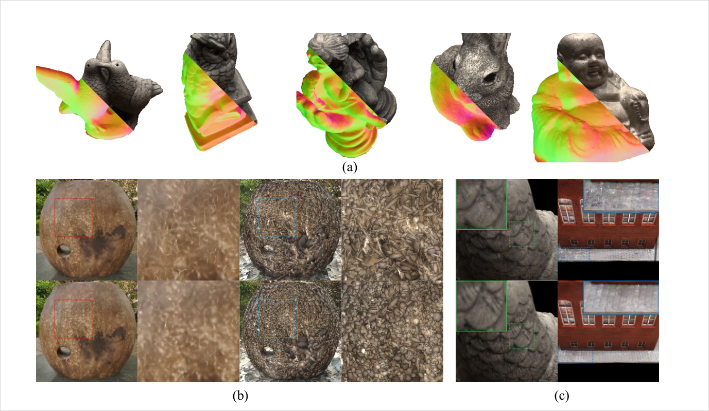
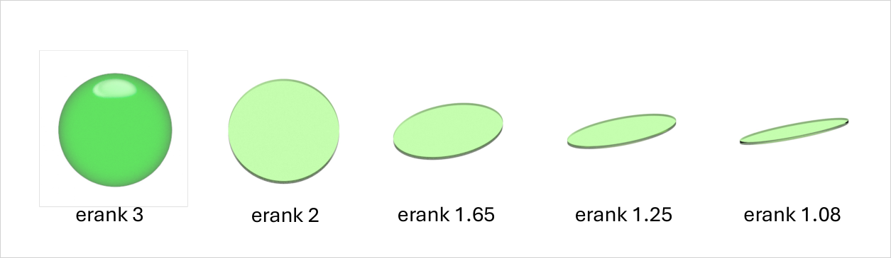
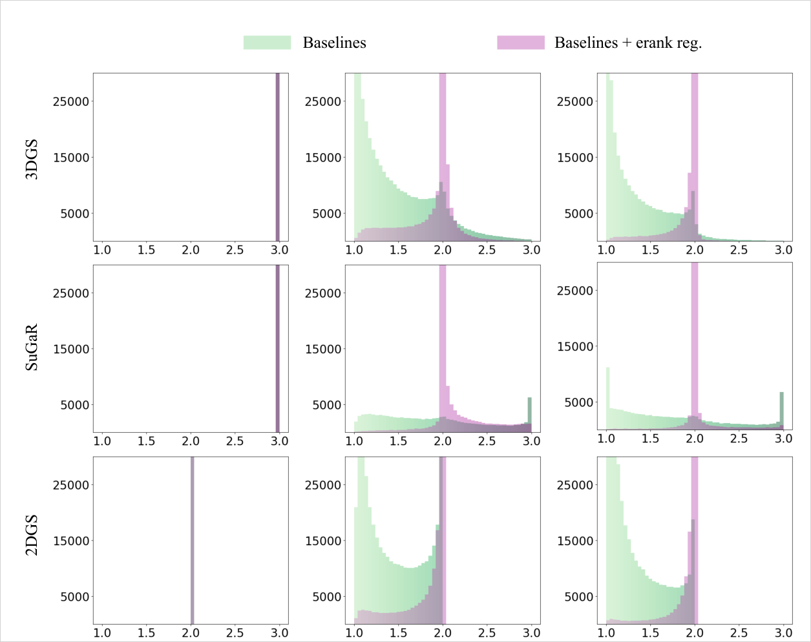
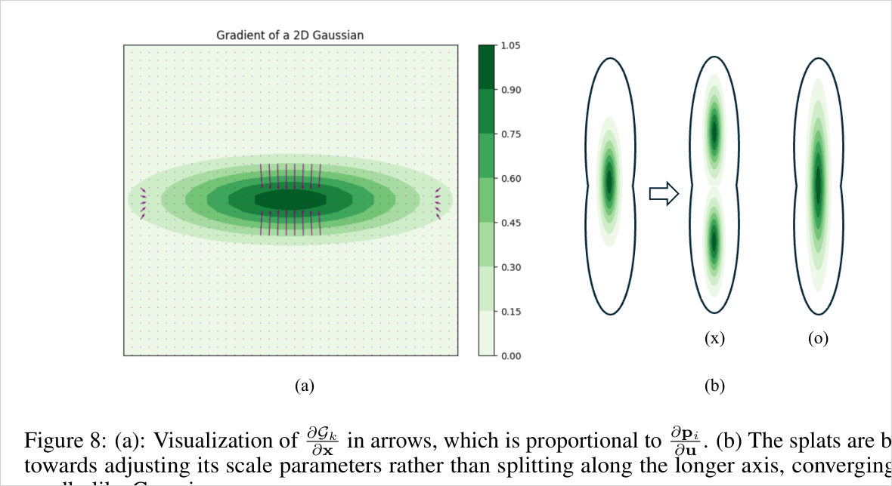
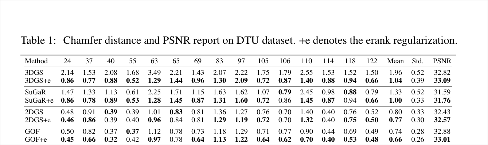
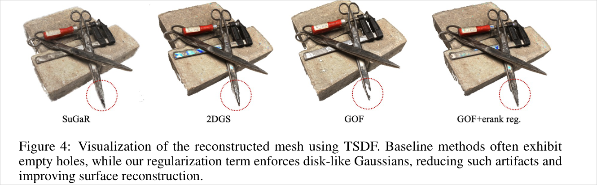
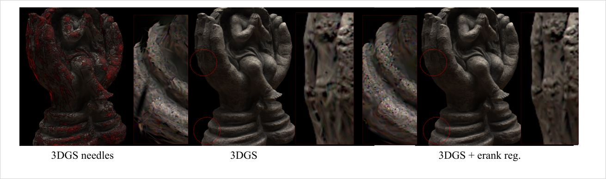

# Effective Rank Analysis and Regularization for Enhanced 3D Gaussian Splatting

> 3DGS의 geometry 실패는 Gaussian이 flat하지 않아서가 아니라, flat해 보이는 것 중 상당수가 surface를 덮는 disk가 아니라 한 축만 지배하는 needle로 수렴하기 때문이다. covariance singular value의 entropy로 정의한 effective rank로 이 현상을 측정하고, `erank ~= 1`을 강하게 벌주되 `erank < 2` surface flatness는 허용하는 regularizer를 add-on으로 붙인다. 3DGS/SuGaR/2DGS/GOF에 얹어 DTU Chamfer를 크게 줄이면서 PSNR은 유지.

## 한눈에

| 항목 | 내용 |
| --- | --- |
| 문제 | 3DGS는 primitive geometry constraint가 약해 novel/extreme view에서 spiky·needle-like artifact가 생기고, surface reconstruction 계열의 "flat하게 만들기"만으로는 disk와 needle을 구분하지 못함 |
| 핵심 아이디어 | covariance singular value spectrum의 Shannon entropy exponent(effective rank)로 Gaussian shape를 continuous하게 측정하고, `erank ~= 1`(needle)을 강하게 벌주는 regularizer + disk가 split되게 하는 densification fix를 add-on으로 결합 |
| 입력 | posed multi-view images + COLMAP point cloud (baseline별 원 설정 그대로) |
| 출력 | 같은 renderer로 학습된, needle이 억제되고 disk-like가 유도된 Gaussian set (renderer 자체는 변경 없음) |
| 주요 결과 | DTU Chamfer mean 3DGS `1.96 -> 1.04`, SuGaR `1.33 -> 1.00`, 2DGS `0.80 -> 0.77`, GOF `0.74 -> 0.66`. PSNR 유지/소폭↑, storage↓(fewer Gaussians) |
| 한 줄 novelty | "anisotropy가 좋다/나쁘다"가 아니라, **covariance spectrum entropy로 disk(rank 2)와 needle(rank 1)을 분리해 needle collapse만 골라서 억제** |
| 안 푸는 것 | renderer/representation은 그대로(새 rendering equation 아님), local/global scene structure는 직접 안 봄, `lambda_erank`는 manual, hybrid primitive selection 아님 |

- 저자: Junha Hyung, Susung Hong, Sungwon Hwang, Jaeseong Lee, Jaegul Choo, Jin-Hwa Kim
- 버전: NeurIPS 2024, arXiv:2406.11672v3 (2024-12-08)
- PDF: `C:\Users\jinsw712\Desktop\Files\Research_WIKI\raw\papers\Effective Rank GS.pdf`



## 1. 문제와 동기 (Paper Says)

3DGS는 NeRF식 MLP query 없이 learnable 3D Gaussian primitive와 tile-based splatting으로 빠른 novel view synthesis를 만든다. 그러나 primitive마다 명시적 geometry constraint가 약해 training view에는 맞아도 novel/extreme view에서 spiky, noisy, needle-like artifact가 생긴다. (p.1)

**flatness만으로는 부족하다.** surface reconstruction 계열은 density가 surface 근처에 집중돼야 한다는 관점에서 Gaussian을 flat하게 만들려 했다. SuGaR는 3D Gaussian을 surface-aligned하게 regularize하고, 2DGS는 2D disk primitive를 직접 쓴다. 하지만 논문은 flatness가 필요조건일 뿐이라고 주장한다. `s3` 하나만 거의 0인 disk-like Gaussian과 `s2`, `s3` 둘이 작고 `s1`만 큰 needle-like Gaussian은 둘 다 flat해 보이지만, 전자는 surface area를 덮고 후자는 surface에서 무시할 만큼 작은 면적만 덮는다. 기존 방법은 이 둘을 구분하지 못한다. (p.2)

**경험적 관찰.** 저자들은 대부분의 Gaussian이 최적화가 진행되면 두 축이 작아지는 needle-like로 수렴한다고 관찰한다. 이 shape statistic을 직접 보기 위해 integer rank의 real-valued·differentiable 확장인 effective rank를 도입한다. (p.2)

## 2. 핵심 방법 (Paper Says)

### 2.1 Effective rank analysis
각 Gaussian covariance `Sigma_k = R_k S_k S_k^T R_k^T`의 singular value spectrum을 본다. scale을 내림차순으로 두면 `s1^2 >= s2^2 >= s3^2 > 0`이고, normalized spectrum `q_i = s_i^2 / sum_j s_j^2`에 Shannon entropy를 적용한다. effective rank는 `exp(H(q))`이므로 세 축이 비슷하면 3, 두 축이 의미 있게 남으면 2, 한 축만 지배하면 1에 가까워진다. rotation `R_k`는 singular value를 바꾸지 않으므로 scale spectrum만으로 shape의 intrinsic dimensionality를 잰다. (p.5-6)

아래 Fig. 3은 이 값이 shape intuition과 정확히 대응함을 보인다: `erank 3`=sphere/volumetric, `erank 2`=planar disk, `erank 1.x`=점점 line/needle. 즉 rank를 discrete label이 아니라 continuous shape statistic으로 읽는다.



이 분석으로 저자들은 3DGS, SuGaR, 2DGS가 training 후반에 `erank ~= 1` Gaussian을 대량 생성함을 histogram으로 보인다. 특히 2DGS는 초기에 정확히 rank 2 disk로 시작하지만 최적화가 진행되면 needle-like 2D Gaussian으로 무너지는 경우가 많다.



### 2.2 Effective rank regularization (핵심 기여)
regularizer의 목표는 Gaussian을 surface-friendly flat으로 유지하면서 needle collapse만 막는 것이다. `erank(G_k)`가 1에 가까워질 때 급증하는 `-log(erank(G_k) - 1 + eps)` 형태를 쓰고, 여기에 가장 작은 scale `s3`를 더해 flatness를 유지한다. concave logarithmic 항이 안정적 gradient를 주기 때문에 continuous optimization에 직접 들어간다. `lambda_erank = 0.01`, `eps = 1e-5`이며 **7000 iteration 이후** 적용한다 — early stage에 `erank > 2`인 coarse Gaussian이 안정적으로 shape를 잡을 시간을 주는 coarse-to-fine schedule이다. (p.6)

의도는 모든 anisotropy 제거가 아니라 불필요한 `rank ~= 1` collapse 제한이다. thin object(§Fig.7)에 필요한 elongated Gaussian은 보존한다.

### 2.3 Densification fix (필수 결합 요소)
기존 Adaptive Density Control(ADC)은 pixel gradient들을 합친 뒤 norm을 취한다. disk-like Gaussian은 더 넓은 pixel 영역을 덮어 서로 다른 방향 signal이 cancel되므로 split criterion을 못 만족할 수 있다. 논문은 Revising Densification / GOF식으로 각 pixel gradient norm을 먼저 계산해 합산하는 기준을 채택한다. 이 fix가 없으면 regularizer로 disk를 만들어도 densification이 long axis를 split하지 못해 다시 나쁜 shape로 흐른다. (p.7, Appendix A.4 p.12)

아래 Fig. 8이 그 failure mode의 원인이다: long axis 방향 gradient가 작아 기존 split 기준이 long-axis split을 유도하지 못하고, Gaussian이 split 대신 scale 조절로 대응하면서 needle로 수렴한다.



## 3. 핵심 수식

**Eq. 1 — 3D Gaussian primitive**
```text
G_k(x) = exp(-1/2 (x - mu_k)^T Sigma_k^{-1} (x - mu_k))
Sigma_k = R_k S_k S_k^T R_k^T
```
primitive는 mean, covariance, opacity, SH color. 이 논문은 renderer를 바꾸지 않고 covariance spectrum에 shape prior만 넣는다. (p.4)

**Eq. 2 — alpha compositing (변경 없음)**
```text
c(u) = sum_k c_k alpha_k prod_{j=1}^{k-1} (1 - alpha_j G_j^{2D}(u))
```
기존 depth-ordered alpha blending을 유지 → 기여는 새 rendering equation이 아니라 representation/optimization regularization 쪽. (p.5)

**Eq. 4-6 — effective rank**
```text
q_i = sigma_i / ||sigma||_1
H(q) = - sum_i q_i log q_i
erank(A) = exp(H(q))
```
singular value distribution의 entropy exponent. integer rank와 달리 real-valued·differentiable이라 gradient 기반 optimization에 직접 들어간다. (p.5)

**Eq. 8-9 — Gaussian covariance의 effective rank**
```text
q = (s1^2 / S, s2^2 / S, s3^2 / S),   S = sum_i s_i^2
erank(G_k) = exp(H(G_k))
```
rotation은 singular value를 안 바꾸므로 scale spectrum만으로 intrinsic dimensionality 측정. (p.6)

**Eq. 10 — effective rank regularizer**
```text
L_erank = sum_k lambda_erank * max(-log(erank(G_k) - 1 + eps), 0) + s3
```
`-log(erank - 1 + eps)`는 erank→1에서 급증 → needle을 강하게 벌준다. `s3` 항은 가장 작은 축을 줄여 surface-aligned flatness 유지. `lambda_erank = 0.01`, `eps = 1e-5`, 7000 iter 이후. (p.6-7)

**Eq. 11-13 — structure-aware reg.와 ADC fix**
Appendix는 optional depth distortion loss·normal regularization을 소개하고, ADC fix를 pixel별 gradient norm 합산으로 쓴다.
```text
sum_{i in P} || dL/dp_i * dp_i/du ||_2 > tau
```
disk-like Gaussian의 gradient cancellation을 줄여 split을 유도. erank regularizer가 개별 Gaussian shape prior라면, depth distortion/normal loss는 ray·local surface 구조를 보는 보완 prior. (p.12)

## 4. 실험 근거

### 4.1 DTU geometry reconstruction (Table 1)
+e는 모든 baseline의 Chamfer mean을 개선한다: 3DGS `1.96 -> 1.04`, SuGaR `1.33 -> 1.00`, 2DGS `0.80 -> 0.77`, GOF `0.74 -> 0.66`. PSNR도 3DGS `32.82 -> 33.09`, GOF `32.88 -> 33.01`처럼 유지 또는 소폭 개선 — geometry regularization이 visual quality를 망치는 흔한 trade-off를 보이지 않는다.



### 4.2 Ablation (Table 2)
3DGS baseline에서 fixed ADC만 넣으면 Chamfer mean `1.96 -> 1.26`, ADC+erank면 `1.03`, optional depth distortion/normal까지 결합하면 `0.66`. 즉 성능은 ADC fix와 erank regularization 둘 다에 의존한다(둘 중 하나만으로는 부족). (Table 2, p.7)

### 4.3 mesh hole과 normal artifact 감소 (Fig. 4-5)
baseline은 TSDF mesh extraction에서 빈 hole을 만들고, erank는 disk-like Gaussian을 유도해 surface reconstruction을 개선한다(Fig. 4). Fig. 5의 pear normal에서는 needle-like Gaussian이 transparent/hollow region을 만들고 GOF+e가 이를 완화한다. (p.8)



### 4.4 needle 위치 시각화와 thin object 보존 (Fig. 6-7)
Fig. 6은 `erank(G_k) < 1.02` Gaussian을 red로 표시해 needle 위치를 직접 보여준다(scale ratio 약 20:1 이상). regularizer는 red needle과 novel-view artifact를 줄인다. Fig. 7은 Mip-NeRF360 thin object에서 필요한 elongated Gaussian은 보존함을 보여 — 모든 anisotropy 제거가 아니라 불필요한 collapse만 제한한다는 의도를 재확인한다. (p.8-9)



### 4.5 Efficiency와 needle-overfitting 근거 (Table 3-5)
Table 3(Mip-NeRF360): 3DGS+e가 outdoor PSNR/SSIM/LPIPS를 `24.64/0.731/0.234 -> 24.93/0.757/0.221`, indoor도 `31.13/0.920/0.189 -> 31.16/0.953/0.181`로 개선. Table 4: storage DTU `113MB -> 98MB`, Mip-NeRF360 `734MB -> 646MB`(fewer Gaussians)로 runtime overhead 거의 없음. Table 5(scene 37): vanilla 3DGS needle count가 15k `3170개` → 30k `16320개`로 증가하지만 PSNR은 `27.00 -> 26.98`로 plateau. 3DGS+e는 30k에서 needle `23개`, PSNR `27.21`. **needle 증가는 표현력 개선이 아니라 overfitting에 가깝다**는 직접 근거. (p.13-14)

## 5. 해석 (Interpretation, model-side)

### 진짜 새로운 지점
"anisotropy가 좋다/나쁘다"가 아니라, **Gaussian shape를 single-axis flatness나 pairwise variance ratio가 아니라 covariance spectrum 전체의 entropy로 읽어야 disk와 needle을 분리할 수 있다**는 관점이 핵심이다.
```text
기존 flat prior:  s3 -> 0 만 강제 -> disk/needle 구분 불가 -> needle collapse 방치
Effective Rank:   erank(spectrum) -> 1에서 급증하는 penalty -> needle만 골라 억제 + disk 유지
```

### adaptive-rank primitive 아이디어와의 경계
이 논문은 rank를 continuous scalar로 다루지만 목표는 주로 `rank ~= 1` collapse 억제와 `rank ~= 2` 유도다. 여러 primitive를 동시에 선택하는 hybrid renderer는 아니다. 다만 covariance spectrum을 differentiable하게 제어한다는 점은 adaptive-rank primitive splatting의 강한 선행 경계선이다. 새 아이디어가 이 논문과 구별되려면 단순히 erank regularizer를 쓰는 게 아니라, region별로 line/surface/volume/residual support를 다르게 허용하고 그것이 어떤 failure mode를 줄이는지 보여야 한다. → [[adaptive-rank-primitive-splatting]]와 대비.

### densification fix가 중요한 이유
regularizer만으로 disk를 만들어도, densification이 disk의 long axis를 못 split하면 optimization이 다시 나쁜 shape로 흐른다(Fig. 8). loss regularization과 optimizer-side primitive lifecycle(특히 split criterion)이 함께 설계돼야 한다는 좋은 사례다.

## 6. 한계
- regularizer는 개별 Gaussian만 constraint하고 local/global scene structure를 직접 안 본다 → depth distortion loss 같은 structure-aware prior와 결합이 유리(논문도 optional로 사용). (p.9, p.12)
- `lambda_erank`는 manual hyperparameter. thin object가 많은 extreme scene에서 최적값이 달라질 수 있다. (p.10)
- needle 원인을 분석하지만 dilation, shrinkage bias, split rule, post-split scale 유지 중 무엇이 얼마나 지배적인지 완전히 분해하진 않는다. (p.13-14)
- 모델 측 추론: erank는 surface reconstruction에는 유리하지만 hair/foliage/fuzzy volume처럼 실제로 elongated/volumetric support가 필요한 region에서는 과도한 disk prior가 표현을 제한할 수 있다. Fig. 7이 thin object 보존을 보이지만 scene category별 failure boundary는 더 필요하다.

## 7. Open Questions
- effective rank target을 고정된 `below 2 but away from 1`이 아니라 scene region별로 adaptive하게 학습할 수 있는가?
- `erank ~= 1` Gaussian 중 진짜 thin structure와 overfitting needle을 자동 구분하려면 어떤 signal이 필요한가?
- densification/pruning/opacity reset/scale init 같은 primitive lifecycle 전체를 rank-aware하게 재설계하면 regularizer보다 더 근본적으로 needle collapse를 줄일 수 있는가?
- surface component와 fuzzy/volumetric residual을 분리하는 hybrid representation에서 erank는 selector, loss, diagnostic 중 무엇에 가장 적합한가?
- structure-aware loss(depth distortion, normal consistency)와 effective-rank loss 사이의 conflict를 어떻게 조율하는가?

## Evidence Anchors
- p.1: abstract, problem definition, needle-like artifact motivation, NeurIPS/arXiv metadata
- p.2: Fig. 1, flatness vs disk-like/needle-like distinction, effective rank motivation
- p.3: Fig. 2, 3DGS/SuGaR/2DGS histogram, contribution list
- p.4: Fig. 3 shape↔rank, 3DGS representation·covariance 정의 Eq. 1
- p.5: alpha compositing Eq. 2, ADC, effective rank Definition Eq. 4-6
- p.6: Gaussian erank Eq. 8-9, needle convergence 분석, erank regularizer Eq. 10
- p.7: Table 1-2, ADC fix, implementation, datasets, baselines
- p.8: Fig. 4-5 mesh holes·normal artifacts
- p.9: Fig. 6-7 novel-view needles·thin object preservation, limitations 시작
- p.12: depth distortion/normal reg. Eq. 11-12, ADC fix Eq. 13
- p.13: Table 3-4 Mip-NeRF360·storage/runtime
- p.14: Table 5-6 needle count over training·PSNR plateau, needle 원인
- p.15: Fig. 8 gradient visualization·densification failure mode

## Related WIKI Pages
- [Anisotropy-Regularized Gaussian Reconstruction](../concepts/anisotropy-regularized-gaussian-reconstruction.md)
- [Effective Rank Gaussian Shape Analysis](../concepts/effective-rank-gaussian-shape-analysis.md)
- [Needle-Like Gaussian Artifacts](../concepts/needle-like-gaussian-artifacts.md)
- [Rank-Aware Gaussian Densification](../concepts/rank-aware-gaussian-densification.md)
- [Adaptive Rank Primitive Splatting](../claims/adaptive-rank-primitive-splatting.md)
