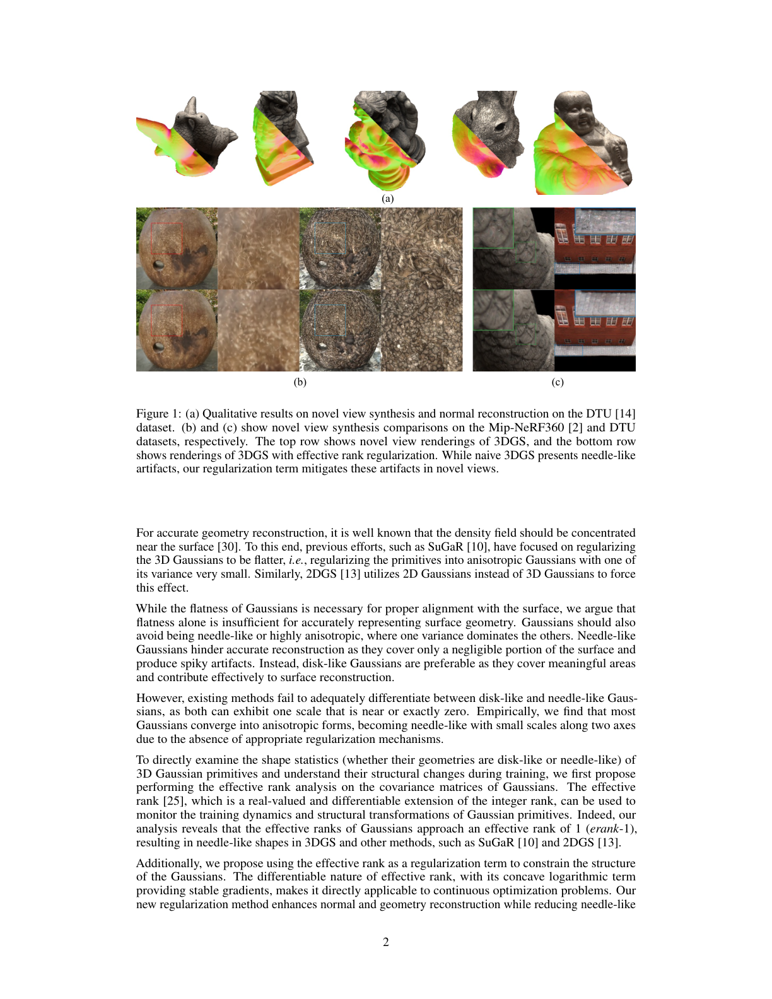
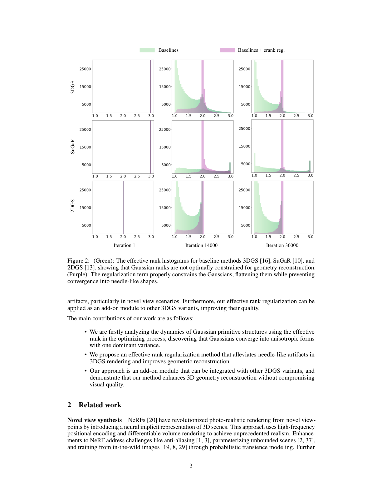
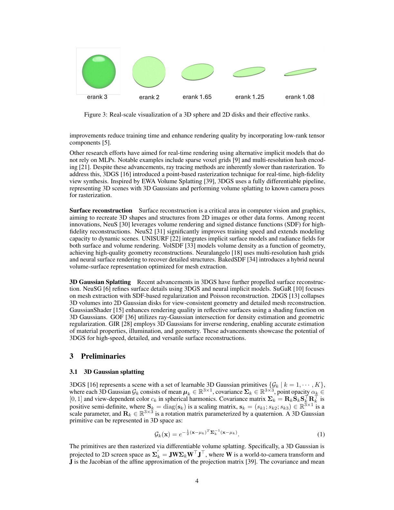
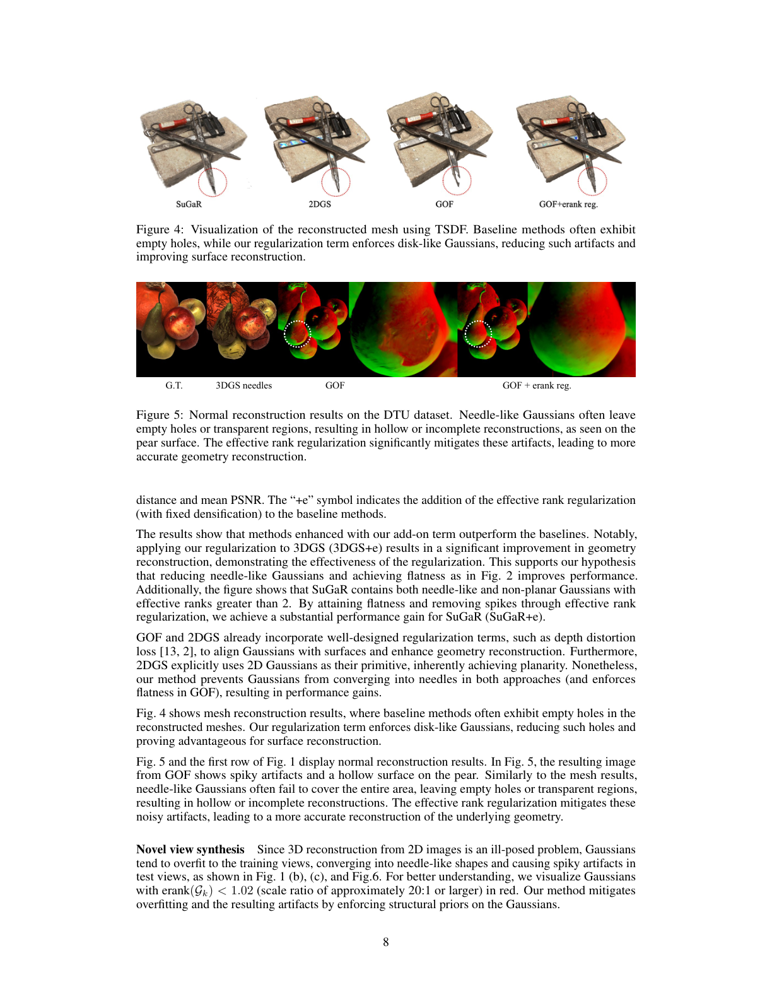
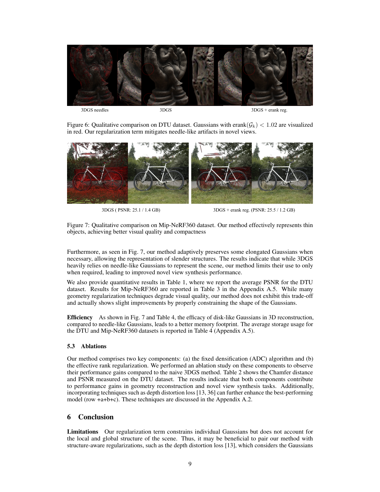
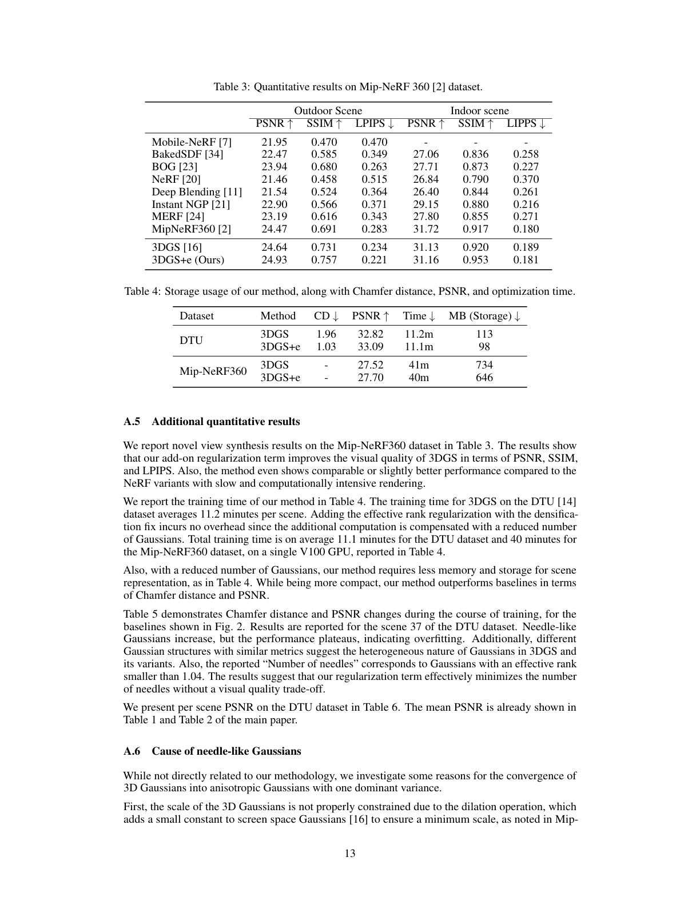
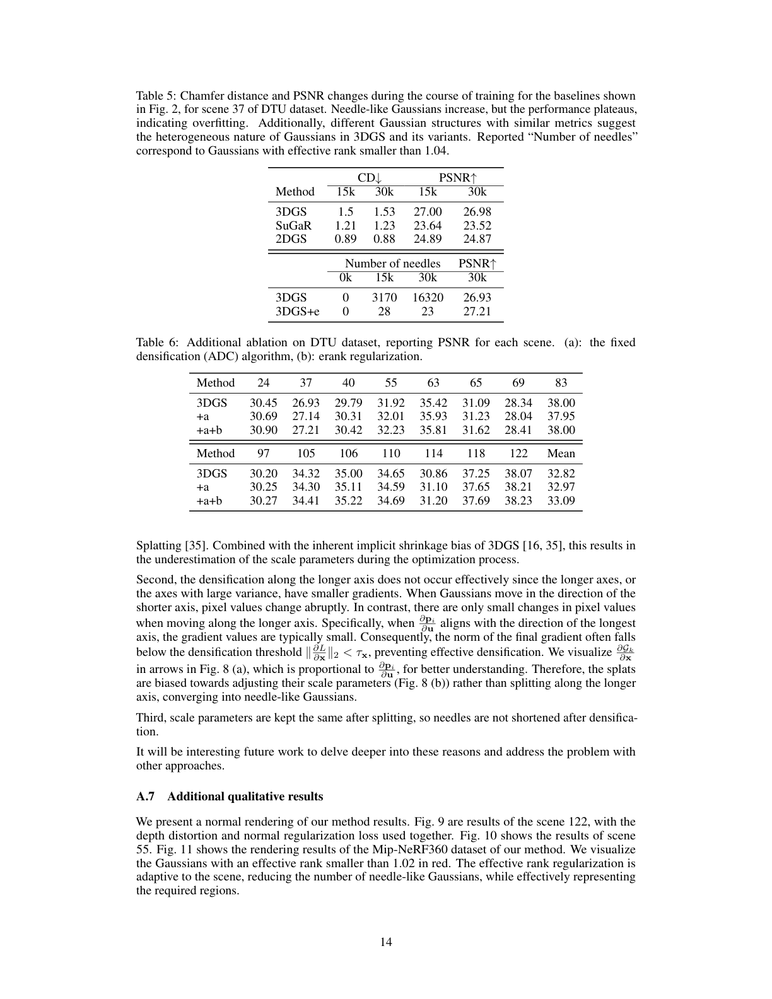
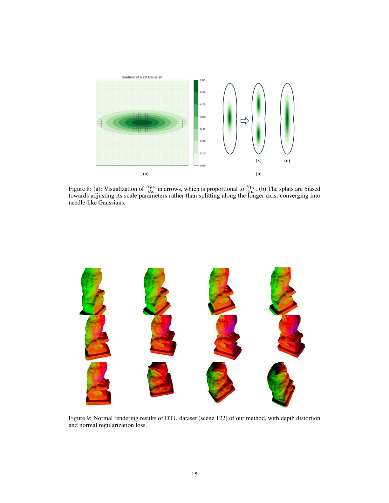

# Effective Rank Analysis and Regularization for Enhanced 3D Gaussian Splatting

## Paper
- 저자: Junha Hyung, Susung Hong, Sungwon Hwang, Jaeseong Lee, Jaegul Choo, Jin-Hwa Kim
- venue/version: NeurIPS 2024, arXiv:2406.11672v3, 2024-12-08
- 주제: 3D Gaussian Splatting에서 covariance spectrum의 effective rank를 분석하고 regularizer로 써서 needle-like artifact를 줄이는 방법
- PDF: `C:\Users\jinsw712\Desktop\Files\Research_WIKI\raw\papers\Effective Rank GS.pdf`

## Main Claim
이 논문의 핵심 주장은 3DGS의 geometry 실패가 단순히 Gaussian이 충분히 flat하지 않아서가 아니라, flat해 보이는 Gaussian 중 상당수가 surface를 덮는 disk-like primitive가 아니라 한 축만 지배적인 needle-like primitive로 수렴하기 때문에 생긴다는 것이다. 저자들은 covariance singular value distribution의 entropy로 effective rank를 계산해 이 현상을 측정하고, `erank ~= 1` Gaussian을 강하게 벌주면서 `erank < 2`의 surface-friendly flatness는 허용하는 regularizer를 제안한다. 이 regularizer는 3DGS, SuGaR, 2DGS, GOF에 add-on으로 붙어 normal/mesh/novel-view artifact를 줄이면서 PSNR을 거의 희생하지 않는다.

## Paper Says: Motivation and Previous Work
3DGS는 NeRF식 MLP query 없이 learnable 3D Gaussian primitive와 tile-based splatting으로 빠른 novel view synthesis를 만든다. 그러나 primitive마다 명시적 geometry constraint가 약하기 때문에 training view에는 맞아도 novel/extreme view에서 spiky, noisy, needle-like artifact가 생길 수 있다. (p.1)

기존 surface reconstruction 계열은 density가 surface 근처에 집중되어야 한다는 관점에서 Gaussian을 flat하게 만들려 했다. SuGaR는 3D Gaussian을 surface-aligned하게 regularize하고, 2DGS는 2D disk primitive를 직접 사용한다. 하지만 논문은 flatness만으로는 충분하지 않다고 주장한다. `s3` 하나가 거의 0인 disk-like Gaussian과 `s2`, `s3` 둘이 작고 `s1`만 큰 needle-like Gaussian은 둘 다 flat해 보일 수 있지만, 전자는 surface area를 덮고 후자는 surface에서 무시할 만큼 작은 면적만 덮는다. (p.2)

## Paper Says: Method
### Effective rank analysis
논문은 각 Gaussian covariance `Sigma_k = R_k S_k S_k^T R_k^T`의 singular value spectrum을 본다. scale을 내림차순으로 두면 `s1^2 >= s2^2 >= s3^2 > 0`이고, normalized spectrum `q_i = s_i^2 / sum_j s_j^2`에 대해 Shannon entropy를 계산한다. effective rank는 `exp(H(q))`이므로 세 축이 비슷하면 3에 가깝고, 두 축이 의미 있게 남아 있으면 2에 가까우며, 한 축만 지배하면 1에 가까워진다. (p.5-6)

이 분석으로 저자들은 3DGS, SuGaR, 2DGS가 training 후반에 많은 `erank ~= 1` Gaussian을 만든다고 보인다. 흥미로운 점은 2DGS도 초기에는 정확히 rank 2 disk로 시작하지만 최적화가 진행되면 needle-like 2D Gaussian으로 무너지는 경우가 많다는 것이다. (Fig. 2, p.3, p.6)

### Effective rank regularization
Regularizer의 목표는 Gaussian을 surface-friendly하게 유지하면서 needle collapse를 막는 것이다. 저자들은 `erank(G_k)`가 1에 가까워질 때 `-log(erank(G_k) - 1 + eps)`가 급격히 커지는 형태를 사용하고, 여기에 가장 작은 scale `s3`를 더해 flatness를 유지한다. Regularizer는 7000 iteration 이후 적용한다. 이는 early stage에서 `erank > 2`인 coarse Gaussian이 안정적으로 shape를 잡을 시간을 주기 위한 coarse-to-fine schedule이다. (p.6)

### Densification fix
기존 Adaptive Density Control은 pixel gradient들을 합친 뒤 norm을 취한다. Disk-like Gaussian은 더 넓은 pixel 영역을 덮기 때문에 서로 다른 방향의 signal이 cancel될 수 있고, 그 결과 split criterion을 만족하지 못할 수 있다. 논문은 Revising Densification / GOF식 수정처럼 각 pixel gradient norm을 먼저 계산해 합산하는 기준을 채택한다. 이 변경은 erank regularizer와 결합될 때 disk-like Gaussian도 잘 split되게 하는 중요한 구현 요소다. (p.7, Appendix A.4 p.12)

## Visual Evidence
### Fig. 1: novel view artifact 감소


Fig. 1은 DTU normal reconstruction과 Mip-NeRF360/DTU novel view rendering에서 vanilla 3DGS와 `+erank regularization`을 비교한다. baseline top row에는 spiky/needle artifact가 보이고, regularized bottom row에서는 같은 scene에서 artifact가 줄어든다. 이 그림은 논문 주장이 photometric metric이 아니라 실제 novel-view geometry artifact와 연결된다는 출발 증거다. (p.2)

### Fig. 2: 3DGS, SuGaR, 2DGS 모두 needle mode로 수렴


Fig. 2의 green histogram은 training iteration이 진행되면서 baseline들의 effective rank 분포가 `erank ~= 1` 쪽으로 몰리는 현상을 보여준다. Purple histogram은 regularizer를 붙였을 때 분포가 `erank ~= 2` 쪽으로 유지되고 needle collapse가 줄어드는 것을 보여준다. 특히 2DGS도 시작은 rank 2지만 후반에 needle-like로 무너진다는 점이 중요하다. (p.3, p.6)

### Fig. 3: rank 값이 shape intuition과 어떻게 연결되는가


Fig. 3은 sphere, disk, elongated disk의 real-scale visualization과 erank 값을 나란히 보여준다. `erank 3`은 volumetric/sphere-like, `erank 2`는 planar disk-like, `erank 1.x`는 점점 line/needle-like shape로 해석된다. 이 그림은 covariance rank를 discrete label이 아니라 continuous shape statistic으로 읽을 수 있음을 보여준다. (p.4)

### Fig. 4-5: mesh hole과 normal artifact 감소


Fig. 4는 TSDF mesh extraction에서 baseline이 빈 hole을 만들고, erank regularization이 disk-like Gaussian을 유도해 surface reconstruction을 개선한다고 보여준다. Fig. 5는 pear normal reconstruction에서 needle-like Gaussian이 transparent/hollow region을 만들고, GOF+erank가 이를 완화하는 예다. (p.8)

### Fig. 6-7: needle 시각화와 thin object 보존


Fig. 6은 `erank(G_k) < 1.02` Gaussian을 red로 표시해 needle 위치를 직접 보여준다. Regularizer는 red needles를 줄이고 novel-view artifact를 완화한다. Fig. 7은 Mip-NeRF360 thin object에서 필요한 elongated Gaussian은 완전히 제거하지 않고 보존한다는 점을 보인다. 논문의 의도는 모든 anisotropy를 없애는 것이 아니라 불필요한 `rank ~= 1` collapse를 제한하는 것이다. (p.8-9)

### Table 3-5 and Fig. 8: 효율성과 needle 원인 분석


Table 3은 Mip-NeRF360에서 3DGS+e가 outdoor PSNR/SSIM/LPIPS를 `24.64/0.731/0.234`에서 `24.93/0.757/0.221`로 개선하고, indoor도 `31.13/0.920/0.189`에서 `31.16/0.953/0.181`로 개선한다고 보고한다. Table 4는 DTU storage를 113MB에서 98MB, Mip-NeRF360을 734MB에서 646MB로 줄이면서 runtime overhead가 거의 없다고 제시한다. (p.13)



Table 5는 DTU scene 37에서 vanilla 3DGS needle count가 15k iteration의 3170개에서 30k iteration의 16320개로 증가하지만 PSNR은 27.00에서 26.98로 plateau된다고 보인다. 3DGS+e는 30k에서 needle이 23개 수준이고 PSNR은 27.21이다. 이는 needle 증가가 표현력 개선이 아니라 overfitting에 가까울 수 있다는 근거다. (p.14)



Fig. 8은 긴 축 방향 gradient가 작아 기존 split 기준이 긴 축 split을 유도하지 못하고, Gaussian이 split보다 scale 조절로 대응하면서 needle-like shape로 수렴한다는 원인 분석을 시각화한다. (p.15)

## Key Equations
### Eq. 1: 3D Gaussian primitive
```text
G_k(x) = exp(-1/2 (x - mu_k)^T Sigma_k^{-1} (x - mu_k))
Sigma_k = R_k S_k S_k^T R_k^T
```
3DGS의 primitive는 mean, covariance, opacity, SH color를 가진다. Effective Rank GS는 renderer 자체를 바꾸는 것이 아니라 covariance spectrum에 shape prior를 넣는다. (p.4)

### Eq. 2: alpha compositing
```text
c(u) = sum_k c_k alpha_k prod_{j=1}^{k-1} (1 - alpha_j G_j^{2D}(u))
```
논문은 기존 depth-ordered alpha blending 기반 splatting을 유지한다. 즉 contribution은 representation/optimization regularization 쪽이지 새로운 rendering equation이 아니다. (p.5)

### Eq. 4-6: effective rank
```text
q_i = sigma_i / ||sigma||_1
H(q) = - sum_i q_i log q_i
erank(A) = exp(H(q))
```
Effective rank는 singular value distribution의 entropy exponent다. Integer rank와 달리 real-valued, differentiable이어서 gradient 기반 Gaussian optimization에 직접 들어갈 수 있다. (p.5)

### Eq. 8-9: 3D Gaussian covariance의 effective rank
```text
q = (s1^2 / S, s2^2 / S, s3^2 / S)
S = sum_i s_i^2
erank(G_k) = exp(H(G_k))
```
Rotation `R_k`는 singular values를 바꾸지 않으므로 scale spectrum만 보면 Gaussian shape의 intrinsic dimensionality를 측정할 수 있다. (p.6)

### Eq. 10: effective rank regularizer
```text
L_erank = sum_k lambda_erank max(-log(erank(G_k) - 1 + eps), 0) + s3
```
`-log(erank - 1 + eps)`는 erank가 1에 가까울수록 크게 증가하므로 needle-like Gaussian을 강하게 벌준다. `s3` 항은 가장 작은 축을 줄여 surface-aligned flatness를 유지한다. `lambda_erank = 0.01`, `eps = 1e-5`이며 7000 iteration 이후 적용된다. (p.6-7)

### Eq. 11-13: structure-aware regularization과 ADC fix
Appendix는 depth distortion loss와 normal regularization을 추가 regularization으로 소개하고, ADC fix는 다음 형태로 pixel별 gradient norm을 합산한다고 쓴다.

```text
sum_{i in P} || dL/dp_i * dp_i/du ||_2 > tau
```
이 변경은 disk-like Gaussian에서 gradient cancellation을 줄여 split을 유도한다. Effective rank regularizer가 개별 Gaussian shape prior라면, depth distortion/normal loss는 ray나 local surface 구조를 보는 보완 prior다. (p.12)

## Implementation
- `lambda_erank = 0.01`을 모든 training에 사용한다. (p.7)
- Regularization은 7000 iteration부터 적용한다. (p.6)
- Baselines는 3DGS, SuGaR, 2DGS, GOF이며 각각 원 논문 설정을 따른다. (p.7)
- Dataset: DTU 15 scenes, images downsampled to `800 x 600`; Mip-NeRF360 9 indoor/outdoor scenes. (p.7)
- COLMAP으로 baseline point cloud를 initialize한다. (p.7)
- Mesh extraction은 Open3D TSDF fusion과 Marching Cubes를 사용한다. (p.7, p.12)
- 실험 hardware는 Tesla V100 GPU다. (p.7)
- Appendix에 따르면 3DGS+e는 fewer Gaussians 때문에 added computation이 상쇄되어 DTU 평균 11.1분, Mip-NeRF360 평균 40분으로 baseline과 거의 같다. (p.13)

## Experiments
### DTU geometry reconstruction
Table 1에서 Chamfer distance mean은 3DGS `1.96`에서 3DGS+e `1.04`로, SuGaR `1.33`에서 SuGaR+e `1.00`으로, 2DGS `0.80`에서 2DGS+e `0.77`로, GOF `0.74`에서 GOF+e `0.66`으로 개선된다. PSNR도 3DGS `32.82`에서 `33.09`, GOF `32.88`에서 `33.01`처럼 유지 또는 소폭 개선된다. (Table 1, p.7)

### Ablation
Table 2는 3DGS baseline에서 fixed ADC만 넣으면 Chamfer mean이 `1.96 -> 1.26`, ADC+erank regularization이면 `1.03`까지 내려간다고 보인다. optional depth distortion/normal regularization까지 결합하면 `0.66`까지 개선된다. 따라서 성능은 ADC fix와 erank regularization 둘 다에 의존한다. (Table 2, p.7)

### Mip-NeRF360 novel view synthesis
Table 3에서 3DGS+e는 outdoor PSNR/SSIM/LPIPS를 모두 개선하고 indoor SSIM도 크게 개선한다. 논문은 geometry regularization이 visual quality를 망치는 흔한 trade-off를 보이지 않고 오히려 slight improvement를 낸다고 해석한다. (p.13)

### Efficiency
Table 4는 DTU에서 storage가 `113MB -> 98MB`, Mip-NeRF360에서 `734MB -> 646MB`로 감소한다고 보고한다. 저자 해석은 disk-like Gaussian이 surface reconstruction에서 needle보다 효율적이라 더 적은 primitive로 비슷하거나 더 나은 reconstruction을 만든다는 것이다. (p.13)

## Interpretation
### What is genuinely new
논문이 새롭게 정리한 포인트는 Gaussian shape를 single-axis flatness나 pairwise variance ratio가 아니라 covariance spectrum 전체의 entropy로 읽어야 disk-like와 needle-like를 분리할 수 있다는 점이다. 이 관점은 “anisotropy는 좋다/나쁘다”가 아니라 “어떤 intrinsic support dimension이 scene region에 맞는가”라는 질문으로 바꾼다.

### Relation to adaptive rank primitive ideas
이 논문은 rank를 continuous scalar로 다루지만 목표는 주로 `rank ~= 1` needle collapse를 억제하고 `rank ~= 2` surface-friendly Gaussian을 유도하는 데 있다. 따라서 3DGS/2DGS/triangle 같은 여러 primitive를 동시에 선택하는 hybrid renderer는 아니다. 다만 covariance spectrum을 differentiable하게 제어한다는 점은 adaptive-rank primitive splatting의 강한 선행 경계선이다. 새 아이디어가 이 논문과 구별되려면, 단순히 erank regularizer를 쓰는 것이 아니라 region별로 line/surface/volume/residual support를 어떻게 다르게 허용하고 그것이 어떤 failure mode를 줄이는지 보여야 한다.

### Why the densification fix matters
Regularizer만으로는 disk-like Gaussian을 만들 수 있어도, densification이 disk의 long axis를 제대로 split하지 못하면 optimization이 다시 나쁜 shape로 흐를 수 있다. 이 논문은 loss regularization과 optimizer-side primitive lifecycle, 특히 split criterion이 함께 설계되어야 한다는 좋은 사례다.

## Limitations
- 논문이 직접 언급한 한계: regularizer는 개별 Gaussian만 constraint하고 local/global scene structure를 직접 보지 않는다. 따라서 depth distortion loss처럼 ray 전체나 surface consistency를 보는 structure-aware prior와 결합하는 것이 유리하다. (p.9, p.12)
- `lambda_erank`는 manual hyperparameter이며, thin object가 많은 extreme scene에서는 최적값이 달라질 수 있다. (p.10)
- method는 needle-like artifact의 원인 후보를 분석하지만, dilation, shrinkage bias, split rule, post-split scale 유지 중 어느 요소가 얼마나 지배적인지는 완전히 분해하지 않는다. (p.13-14)
- 모델 측 추론: erank regularization은 surface reconstruction에는 유리하지만, hair/foliage/fuzzy volume처럼 실제로 elongated or volumetric support가 필요한 region에서는 과도한 disk prior가 표현을 제한할 수 있다. 논문은 Fig. 7로 thin object preservation을 보이지만, scene category별 failure boundary는 더 필요하다.

## Open Questions
- Effective rank target을 고정된 `below 2 but away from 1`이 아니라 scene region별로 adaptive하게 학습할 수 있는가?
- `erank ~= 1` Gaussian 중 진짜 thin structure 표현과 overfitting needle artifact를 자동으로 구분하려면 어떤 signal이 필요한가?
- Densification, pruning, opacity reset, scale initialization 같은 primitive lifecycle 전체를 rank-aware하게 재설계하면 regularizer보다 더 근본적으로 needle collapse를 줄일 수 있는가?
- Surface component와 fuzzy/volumetric residual component를 분리하는 hybrid representation에서 erank는 selector, loss, diagnostic 중 어떤 역할이 가장 적합한가?
- Structure-aware loss(depth distortion, normal consistency)와 effective-rank loss 사이의 conflict를 어떻게 조율해야 하는가?

## Evidence Anchors
- p.1: abstract, problem definition, needle-like artifact motivation, NeurIPS/arXiv metadata
- p.2: Fig. 1, flatness vs disk-like/needle-like distinction, effective rank motivation
- p.3: Fig. 2, 3DGS/SuGaR/2DGS histogram and contribution list
- p.4: Fig. 3, 3DGS representation and covariance definition
- p.5: alpha compositing, ADC Eq. 3, effective rank Definition 1
- p.6: Gaussian erank Eq. 8-9, analysis of needle convergence, erank regularizer Eq. 10
- p.7: Table 1-2, ADC fix, implementation, datasets, baselines
- p.8: Fig. 4-5, mesh holes and normal artifacts
- p.9: Fig. 6-7, novel-view needles, thin object preservation, limitations start
- p.12: depth distortion/normal regularization Eq. 11-12, ADC fix Eq. 13
- p.13: Table 3-4, Mip-NeRF360 and storage/runtime
- p.14: Table 5-6, needle count over training and PSNR plateau, causes of needles
- p.15: Fig. 8, gradient visualization and densification failure mode

## Related WIKI Pages
- [Anisotropy-Regularized Gaussian Reconstruction](../concepts/anisotropy-regularized-gaussian-reconstruction.md)
- [Effective Rank Gaussian Shape Analysis](../concepts/effective-rank-gaussian-shape-analysis.md)
- [Needle-Like Gaussian Artifacts](../concepts/needle-like-gaussian-artifacts.md)
- [Rank-Aware Gaussian Densification](../concepts/rank-aware-gaussian-densification.md)
- [Adaptive Rank Primitive Splatting](../claims/adaptive-rank-primitive-splatting.md)
