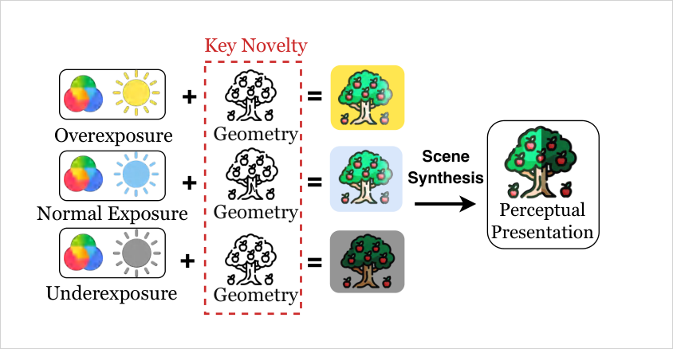
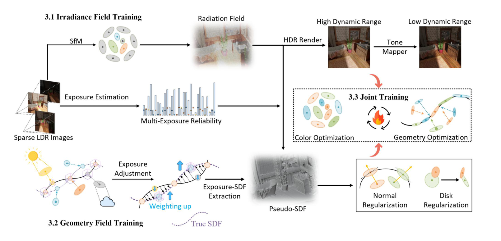
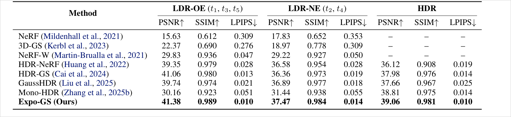
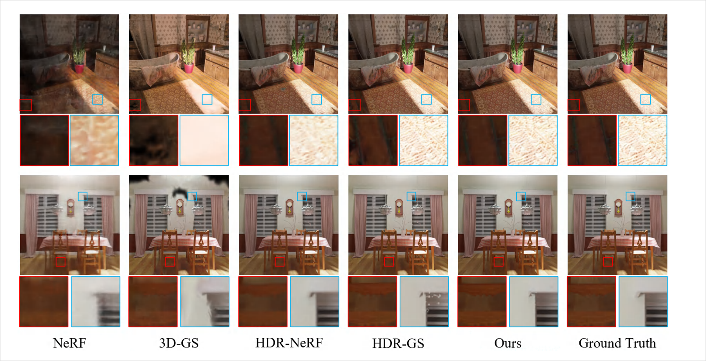
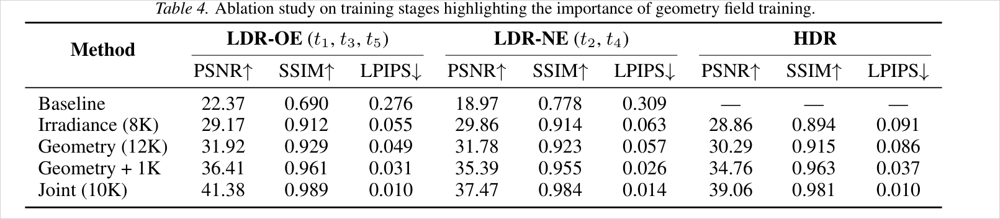
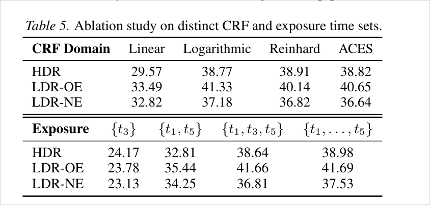
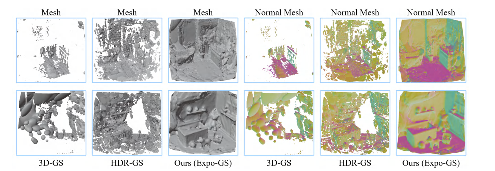
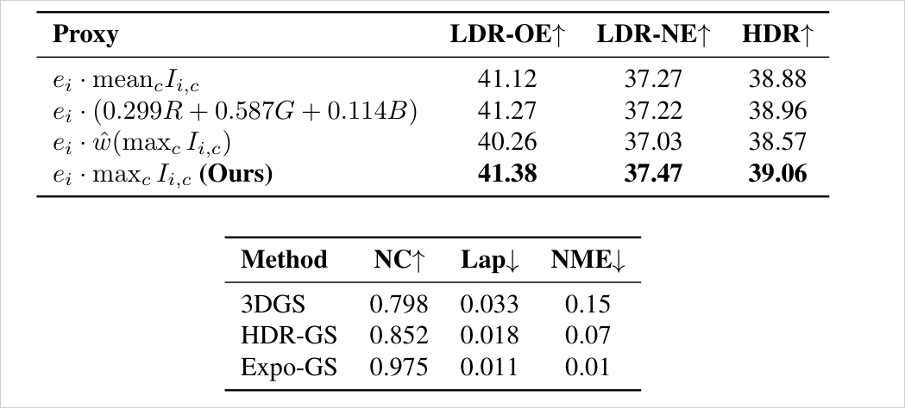

# Expo-GS: Exposure-Aware Signed Distance Function in Gaussian Splatting for High Dynamic Range

**게재: ICML 2026 accept 확정** (PDF 1페이지 각주 `Proceedings of the 43rd International Conference on Machine Learning, Seoul, South Korea. PMLR 306, 2026` — camera-ready 완본, 22p). 저자: Chaoda Song, Yiren Lu, Xinpeng Li, Yunlai Zhou, Yanyan Zhang, Yu Yin, Vipin Chaudhary (Case Western Reserve Univ.).
⚠ 이력: **ICLR 2026 제출본은 리젝** (OpenReview forum `PxMtWs9bet`, "incremental" 비판) 후 ICML 2026 재제출로 accept (forum `2itDye7kPO`). OpenReview에 남아 있는 ICLR 리뷰는 이 논문 계열(reliability-reweighted supervision)에 대한 예상 비판 목록으로 재사용 가치가 있음 (2026-07-28 확인).

> multi-exposure HDR 재구성에서 색 residual만으로 geometry를 최적화하면 과노출/저노출 픽셀의 gradient가 죽거나 불안정해져 표면이 무너진다. Expo-GS는 **픽셀별 노출 신뢰도(e_i·max_c RGB)로 Gaussian density를 나눠 pseudo-SDF를 만들고, 그 SDF로 geometric supervision과 densify/prune을 재가중**하는 3단계(복사→기하→합동) 파이프라인으로 HDR PSNR 39.06을 달성한다.

## 한눈에

| 항목 | 내용 |
| --- | --- |
| 문제 | multi-exposure LDR 입력의 HDR-NVS에서 색 회귀 단독 최적화는 포화/암부 픽셀의 zero·unstable gradient 때문에 hallucinated geometry·ghosting을 만든다 |
| 핵심 아이디어 | 픽셀 노출 신뢰도 proxy(E=e·max_c RGB)로 Gaussian opacity를 정규화한 density → pseudo-Expo-SDF 추출 → SDF가 geometric loss와 densification/pruning을 모두 조향 |
| 입력 | posed sparse multi-view LDR 이미지(뷰당 노출 1개 무작위) + 노출 시간 metadata |
| 출력 | HDR/LDR novel view + Expo-SDF 기반 표면(mesh 시각화 가능) |
| 주요 결과 | 합성 HDR PSNR 39.06(HDR-GS +1.08), LDR-OE 41.38; 실측 LDR-OE 35.59; NC 0.975; 학습 36분·추론 131fps |
| 한 줄 novelty | **exposure 신뢰도를 geometry supervision의 가중치로 격상** — "HDR-NVS를 color·geometry·exposure 3요소로 분해해 multi-exposure radiometric+geometric 모델링을 통합한 첫 프레임워크" (First-to-X형 claim) |
| 안 푸는 것 | 동적 장면(정적 전제), 단일 노출 입력, 대규모 outdoor 벤치마크, tone mapper 자체의 개선 |



## 1. 문제와 동기 (Paper Says)

기존 HDR-NVS(HDR-NeRF, HDR-GS 등)는 irradiance field 모델링과 **색 회귀 중심**이다. 이 단일 모달 학습의 두 한계를 지적한다: (i) 색 cue만으로는 노출 차이가 유발하는 기하 변형을 못 잡고, (ii) 명암 경계처럼 luminance가 급변하는 영역은 구조 prior가 없어 radiance field가 왜곡된다. (p.2)

Appendix D가 실패 메커니즘을 더 구체화한다: **포화/저노출 픽셀의 gradient는 0이거나 불안정**해서 density가 무분별하게 팽창하고 표면이 드리프트하며, 뷰마다 노출 시간이 달라 CRF(camera response function) 통과 후 residual 크기가 불균형해져 depth 불일치가 가중된다. RawNeRF의 highlight/shadow 실패, Gaussian-DK의 고대비 ghosting을 방증으로 인용. (p.16)

SDF 계열(SuGaR, GSDF, NeuS 등)은 표면 sharpness를 개선하지만 **고정 노출 LDR을 가정한 exposure-agnostic 설계**라 과노출/저노출 영역에서 부정확한 geometry를 만든다는 것이 이 논문이 겨냥하는 공백. (p.8)

동기 프레임은 HVS(인간 시각계): 색(parvocellular)과 구조(magnocellular)를 분리 처리한 뒤 상위에서 통합한다는 "먼저 분해, 나중 통합" 원리를 파이프라인 설계(분리 학습→joint 학습)의 근거로 쓴다. (p.1-2, p.15)

## 2. 핵심 방법 (Paper Says)



### 2.1 Stage 1 — Irradiance Field (8k iter)
3DGS warm-up으로 이산 radiance field를 만든다. 각 Gaussian은 HDR radiance를 SH로 인코딩하고(Eq.2, exp로 양수 보장), **학습형 tone mapper M_θ가 log 도메인에서 HDR→LDR 변환**을 담당한다(Eq.3): `c_LDR = M_θ(log c_HDR + log Δt)`. 노출 시간 Δt가 log-공간 offset으로 들어가므로 임의 노출의 LDR을 합성할 수 있다. 렌더링은 표준 front-to-back alpha blending(Eq.4-5), loss는 L1+λ·D-SSIM(Eq.6, HDR/LDR 겸용). tone mapper는 HDR-GS 것을 채택. (p.2-3, p.6)

### 2.2 Stage 2 — Geometry Field / Expo-SDF (12k iter, 핵심 기여)
1. **노출 추정 proxy** (Eq.7): 픽셀 q의 노출값을 `E_i(q) = e_i · max_c I_i,c(q)`로 정의 (e_i=노출 시간, max는 RGB 채널 최대). Debevec&Malik(1997)의 bell-shape 픽셀 가중과 같은 정신 — 절대 밝기가 아니라 "신뢰 가능한 노출 범위인지"의 빠른 판별이 목적. (p.4, p.16)
2. **노출 정규화 density** (Eq.8): Gaussian 중심을 이미지에 투영해 E(µ_j)를 얻고, opacity를 `α_j / (E(µ_j)+ε)`로 나눈 density ḋ(p)를 정의. **과노출 영역은 E가 커서 기여가 눌리고, 극저노출 영역은 학습된 α 자체가 0에 가까워 자동으로 눌린다** — 즉 양끝단이 모두 down-weight되는 구조 (Appendix B.4 뒤 노트, p.15).
3. **pseudo-Expo-SDF** (Eq.9): `f_HDR(p) = ±s_g* · sqrt(−2 log ḋ(p))`. 지배 Gaussian g* 가정 하에 −2 log ḋ는 Mahalanobis 이차형식이 되므로 거리처럼 읽을 수 있다(Appendix B 증명). s_g*·normal은 해석용 국소 scale/방향일 뿐이고 구현은 ḋ에서 직접 미분 — hard nearest-Gaussian 선택을 통과하는 gradient는 없다. (p.4, p.13-15)
4. **SDF supervision** (Eq.10): mesh 렌더/투영 depth로 얻은 참조 SDF f̂와의 L1. 여기에 **normal 정렬**(Eq.11, ∇f_HDR ↔ 지배 normal cosine)과 **disk 정규화**(Eq.12, 최소축 직접 최소화 대신 softmin으로 3축 scale을 눌러 판형 유도)를 더한다. (p.4)

### 2.3 Stage 3 — Interactive Joint Training (10k iter)
SDF가 densification/pruning을 조향한다:
- **성장 score** (Eq.13): `ε_g = ∇_g + ω_s·exp(−f²/2σ²) + ω_n·(1−‖∇f‖)` — 기존 누적 gradient에 "zero-level 근접 보너스"와 "gradient norm 안정성 보너스"를 더해 표면 근처만 duplicate.
- **제거 score** (Eq.14): `ε_p = σ_a − ω_p·(1−exp(−f²/2σ²))` — 누적 opacity에서 표면 이탈 페널티를 빼 zero-level에서 먼 Gaussian을 정리 → 노출 경계의 hallucinated floater 억제.
- 합동 loss (Eq.15): `L_render + λ_SDF·L_SDF + λ_normal·L_normal + λ_disk·L_disk` (stage 3에서 λ들을 stage 2의 절반으로 완화: 0.2/0.2/0.1 → 0.1/0.1/0.05, Table 6). (p.4-5, p.17)

## 3. 핵심 수식

**Eq. 7 — 노출 신뢰도 proxy**
```text
E_i(q) = e_i · max_{c∈{R,G,B}} I_i,c(q)
```
노출 시간 × 채널 최대 강도. 역할: 픽셀별 radiometric 신뢰도의 값싼 지표. p.19 ablation에서 mean/luminance 가중합/bell-shape ŵ보다 max_c가 전 설정 최고. (p.4)

**Eq. 8 — 노출 정규화 Gaussian density**
```text
ḋ(p) = Σ_j [ α_j / (E(µ_j)+ε) ] · exp(−½ (p−µ_j)ᵀ Σ_j⁻¹ (p−µ_j))
```
opacity를 노출로 나눈 밀도장. 양수·C∞·유계·E에 단조 감소(Appendix B 증명). 역할: 신뢰도 낮은 Gaussian의 기하 기여 감쇠. (p.4, p.13)

**Eq. 9 — pseudo-Expo-SDF**
```text
f_HDR(p) = ± s_g* · sqrt(−2 log ḋ(p))
```
log-density를 거리형 스칼라장으로 변환(지배 Gaussian 가정 시 Mahalanobis 거리, 부호는 국소 normal 내적). 역할: 노출 불안정 영역에서도 매끄럽고 미분가능한 기하 surrogate — mesh 초기화·SDF 정렬·supervision pruning에 사용. (p.4, p.13-14)

**Eq. 13-14 — SDF 조향 density control**
```text
ε_g = ∇_g + ω_s·exp(−f_HDR(c)²/2σ²) + ω_n·(1−‖∇f_HDR(c)‖)   (ε_g > τ_g → duplicate)
ε_p = σ_a − ω_p·(1−exp(−f_HDR(c)²/2σ²))                      (ε_p < τ_p → prune)
```
역할: 성장은 zero-level 표면 근처로 유도, 제거는 표면 이탈 Gaussian 우선 — appearance·structure 정합 유지. (p.5)

## 4. 실험 근거

Dataset: HDR-NeRF 벤치마크(합성 8 + 실측 4 장면, 뷰 35개 × 노출 5단계, train 18뷰에 {t1,t3,t5} 중 무작위 1노출, eval 17뷰). 3-stage 총 30k iter, RTX A6000 1장. (p.6)

### 4.1 합성 벤치마크 (Table 1)




### 4.2 실측 벤치마크 (Table 2-3)
LDR-OE: PSNR 35.59 / SSIM 0.981 / LPIPS 0.020 (HDR-GS 34.94/0.962/0.031 대비 전항목 우위). **LDR-NE는 PSNR 32.17로 HDR-NeRF(32.71)에 뒤지고** SSIM 0.972·LPIPS 0.033만 best — 본문은 "highest PSNR"로 서술하지만 표 수치와 모순(아래 6. 한계 참고). (p.6)

### 4.3 단계별 ablation (Table 4)


### 4.4 CRF·노출 다양성 ablation (Table 5)


### 4.5 기하 품질 (Fig. 8, p.19 표)




### 4.6 부록의 방어용 실험 (ICLR 리뷰 대응 흔적으로 추정)
- **Vanilla SDF 대조** (Table 8): 같은 파이프라인에 exposure 가중 없는 SDF를 넣으면 41.38→36.59 (−4.79dB). exposure 가중이 delta의 본체임을 보이는 핵심 대조군. (p.17-18)
- **SDF 계열 비교** (Table 9): SuGaR 36.10 / GSDF 38.76 / PulledGS 39.69 < 41.38 — 균일 가중 dense surface guiding은 multi-exposure에서 spurious geometry 생성. (p.18)
- **metadata 강건성**: 노출 시간 metadata 없이(e=1) 41.05, +20% 노이즈 41.33 — proxy의 max_c 항만으로도 대부분 동작. (p.20 표)
- **극한 노출 일반화** (Table 11): {1/32s, 32s} 두 노출만으로도 32-35dB. (p.19-20)
- **stage 2 길이 민감도** (Table 12): 9K에서 포화(41.41), 12K와 동급. (p.21)
- **효율** (Table 13): 학습 36분(8/21/7 분배), GPU 6-11GB, 추론 131fps (HDR-GS 33분/122fps와 동급, HDR-NeRF 517분/0.128fps 압도). (p.21)

## 5. 해석 (Interpretation, model-side)

### 진짜 새로운 지점
개별 부품은 모두 기존 것이다(3DGS, 학습형 tone mapper=HDR-GS, density→SDF 변환=Gaussian 밀도 기반 표면 추출 계열, SDF 유도 densify/prune=GSDF류). 실제 delta는 **"픽셀 신뢰도 추정 → 기하 supervision 가중"이라는 배선**이고, 신뢰도의 원천으로 exposure라는 물리 metadata를 쓴 것이 신선한 부분. Vanilla SDF 대조(−4.79dB)가 이 배선의 기여를 분리 증명한다. ICLR 리뷰가 "incremental"이라 친 것도 이 구조 때문으로 보이며, ICML 판은 부록의 방어 실험(proxy ablation, metadata 강건성, SDF 계열 비교)으로 살아남은 그림.

### 내 연구와의 연결 — confidence 계보의 세 번째 표본
관측 신뢰도로 supervision을 조절하는 계보에서 Expo-GS는 CoMe·AmbiSuR와 정확히 대비되는 위치다:

```text
CoMe     : a-posteriori — 학습 중 residual에서 confidence를 "배움"      (신호 = 학습 부산물)
AmbiSuR  : a-priori(표현 내재) — SH norm으로 모호 primitive를 "공짜 식별" (신호 = 표현 통계)
Expo-GS  : a-priori(물리 metadata) — 노출 시간×강도로 픽셀 신뢰도 "계산"  (신호 = 촬영 조건)
내 방향   : a-priori(기하 관측) — SfM 관측장으로 under-constrained 영역 식별 (신호 = 시점 커버리지)
```
넷 다 "**모든 픽셀/primitive를 균일하게 믿지 말라**"는 같은 문장의 변주다. Expo-GS가 보여주는 유용한 사실 두 가지: (1) 신뢰도 신호가 값싼 휴리스틱(max RGB)이어도 배선만 맞으면 큰 delta가 난다, (2) **신뢰도를 loss 가중에만 쓰지 않고 densify/prune까지 밀어넣으면 hallucinated floater가 직접 줄어든다** — 내 H1a(observation field)도 loss 가중에서 멈추지 말고 density control까지 확장하는 설계를 검토할 가치. 반면 이 논문의 신뢰도는 "노출"이라는 단일 축이라, multi-view 관측 부족(내 문제)과는 직교 — 겹침 위협은 낮고 인용 근거로 쓰기 좋다.

### First-to-X claim의 전형
"first HDR-NVS framework that unifies multi-exposure radiometric and geometric modeling" (p.8) — 교집합 novelty 선언의 교과서적 사례. 부품 재사용을 인정하면서 교집합의 첫 점유를 주장하고, 그 교집합이 실益(­−4.79dB 대조군)을 낳음을 보였다. 내 novelty 문장 구성 시 참고할 포맷.

### 수식의 실체에 대한 주의
Eq.9의 pseudo-SDF는 "지배 Gaussian 가정 + 대각 공분산"에서만 거리 해석이 성립하고, 구현은 결국 −log ḋ(p)라는 **밀도 potential을 SDF라고 부르는 것**에 가깝다(부록 B도 s_g*·normal을 "analytical device"라고 명시). 겹치는 Gaussian이 많은 영역·얇은 구조에서 거리 해석이 깨질 수 있다는 점은 논문이 다루지 않는다.

## 6. 한계

논문 명시:
- 3-stage 스케줄 + Expo-SDF 정제로 학습 오버헤드 증가(주로 stage 2, 전체 36분 중 21분). (p.9)
- multi-exposure 입력이 필수라 **엄밀한 정적 장면 전제** — 동적 장면 불가. (p.9)

모델 추론(inference, 명시 아님):
- **본문-표 모순**: 실측 LDR-NE PSNR을 "highest"로 서술하지만 Table 3에서 HDR-NeRF 32.71 > Expo-GS 32.17. 합성 쪽 본문("sole exception being PSNR under LDR-NE")과도 서로 안 맞음 — camera-ready에 남은 서술 불일치로 보임. (p.6)
- 평가가 HDR-NeRF 벤치마크(장면 12개, object-centric/실내 위주) 단일 — 대규모 outdoor·unbounded 장면에서의 proxy(max RGB) 유효성 미검증.
- 노출 proxy는 saturation 근처의 비선형(클리핑)을 무시하는 휴리스틱. bell-shape보다 낫다는 ablation이 있으나 왜 max_c가 이기는지 분석은 없음.
- geometry 지표(NC/Lap/NME)는 p.19 표 하나뿐이고 GT mesh 대비 Chamfer류 표준 지표 부재 — "geometry가 좋다"의 정량 근거는 상대적으로 얇다.
- reference SDF f̂(Eq.10)의 출처("mesh-based rendering or camera-projected depth")가 모호 — 자체 추정 depth면 자기참조 supervision 위험.
- ICLR 2026 리젝 이력: "incremental" 비판을 받은 바 있음 — 부품 조립형 novelty라는 시각이 리뷰어 사이에 실재.

## 7. Open Questions
- 노출 신뢰도(Eq.7)와 SfM 관측 커버리지를 **곱한 합성 신뢰도장**을 쓰면 under-constrained 배경에서 어떤 추가 이득이 있는가? (내 H1a와의 직접 교차 실험 후보)
- pseudo-SDF의 거리 해석이 깨지는 얇은 구조/투명체에서 Eq.13-14 density control이 오히려 표면을 깎아먹지 않는가?
- max_c proxy가 bell-shape ŵ를 이기는 이유 — 저노출단에서 α가 이미 신뢰도를 흡수하므로 상단만 눌러도 충분하다는 부록 B 논리가 맞다면, **신뢰도 신호의 절반은 학습된 opacity가 공짜로 제공**하는 것인가?
- 노출 대신 다른 물리 metadata(ISO, 셔터, focus)로 같은 배선을 재사용할 수 있는가 — "metadata-conditioned reliability"의 일반화 가능성.
- ICLR 리뷰 원문의 구체 비판 항목 확인 필요 (OpenReview `PxMtWs9bet`, 봇 검증 때문에 본인 브라우저로 열람).

## Evidence Anchors
- p.1: 제목/저자/ICML PMLR 306 각주, Fig.1 HVS 모티프, Fig.2 파이프라인 요약
- p.2: 색 단독 학습의 2한계, 기여 3항목
- p.3: Fig.3 상세 파이프라인, Eq.2-6 (SH radiance, tone mapper, blending, render loss)
- p.4: Eq.7-12 (노출 proxy, 정규화 density, pseudo-SDF, SDF/normal/disk loss)
- p.5: Eq.13-15 (density control, joint loss), Table 1 합성 벤치마크, Fig.4 정성
- p.6: Table 2-3 실측, dataset/3-stage 학습 설정 (8k/12k/10k, A6000)
- p.7: Table 4 단계 ablation, Table 5 CRF/노출 ablation, Fig.6 specular
- p.8: Fig.7-8 mesh 비교, related work, "first HDR-NVS to unify" claim
- p.9: Limitations (stage 2 오버헤드, 정적 장면), 131fps
- p.13-15: Appendix B — Eq.8/9 성질 증명, 양끝단 down-weight 메커니즘 노트
- p.16: Appendix D — 실패 메커니즘, Debevec&Malik 정신, 빨간 화분 사례
- p.17: Table 6 hyperparameter (λ 0.2/0.2/0.1→0.1/0.1/0.05, lr 2.5e-3/1e-3/5e-4)
- p.17-18: Table 7-10 — LTM-NeRF/Plenoxels, vanilla SDF 대조(−4.79dB), SDF 계열, relightable 계열
- p.19: proxy ablation + NC/Lap/NME 표, Fig.10, 극한 노출 일반화
- p.20-21: metadata 강건성, Table 12 stage2 민감도, Table 13 효율

## Related WIKI Pages
- [Exposure-Reliability-Weighted Geometric Supervision](../concepts/exposure-reliability-weighted-geometric-supervision.md)
- [Gaussian Density Pseudo-SDF](../concepts/gaussian-density-pseudo-sdf.md)
- [SDF-Guided Density Control](../concepts/sdf-guided-density-control.md)
- [Learned Confidence Balancing of Photometric and Geometric Loss](../concepts/learned-confidence-photometric-geometric-balancing.md)
- [SH Norm Ambiguity Indicator](../concepts/sh-norm-ambiguity-indicator.md)
- [Confidence-Steered Densification](../concepts/confidence-steered-densification.md)
- [Photometric-Primary Geometry Underconstraint](../concepts/photometric-primary-geometry-underconstraint.md)
