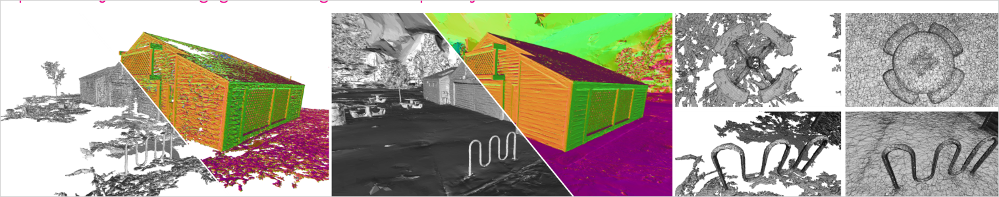
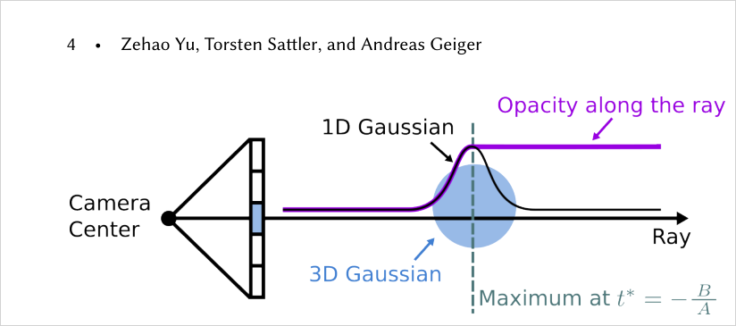
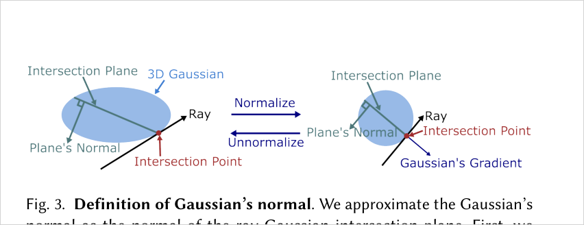
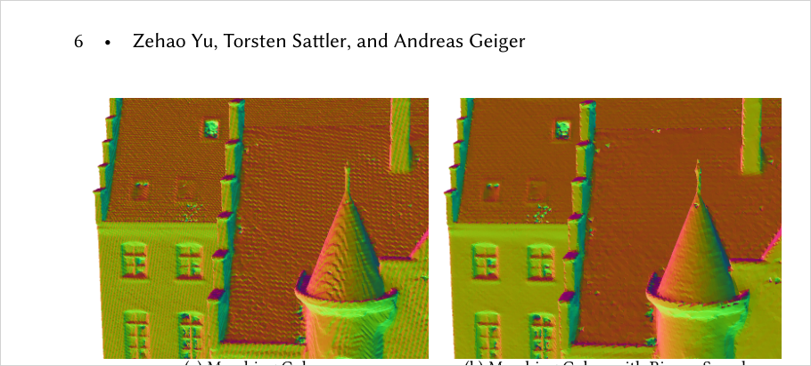
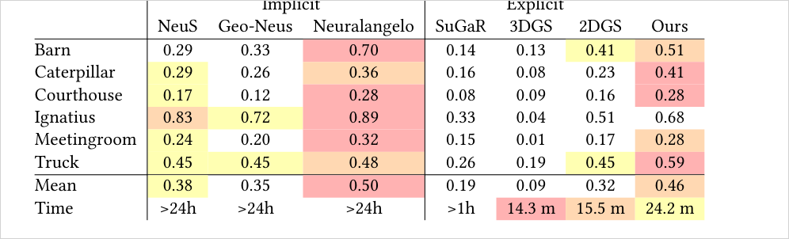
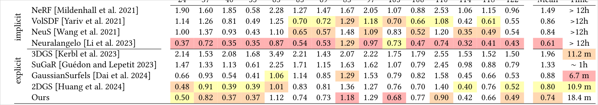
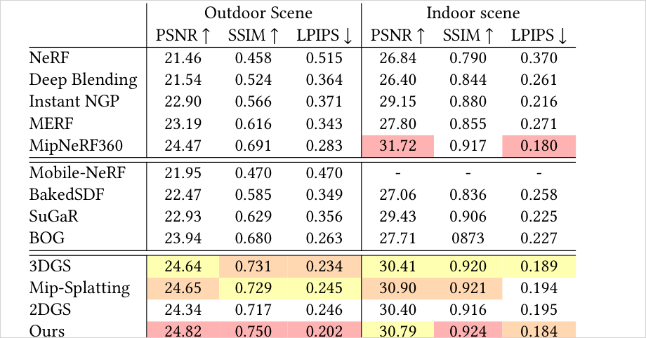

# Gaussian Opacity Fields: Efficient Adaptive Surface Reconstruction in Unbounded Scenes

> 3D Gaussian을 2D로 projection하지 않고 explicit ray-Gaussian intersection으로 임의의 3D 점 opacity를 평가해, "모든 view에서의 최소 opacity" = opacity field(GOF)를 정의한다. Poisson/TSDF 없이 level set을 바로 뽑고, Gaussian이 유도하는 tetrahedral grid + Marching Tetrahedra + binary search로 scene-adaptive mesh를 unbounded 배경까지 복원한다.

## 한눈에

| 항목 | 내용 |
| --- | --- |
| 문제 | 3DGS는 explicit·disconnected primitive라 surface 추출이 어렵다. SuGaR(Poisson)·2DGS(TSDF)는 rendered depth에 의존해 volume rendering과 불일치하고, background/thin structure/unbounded scene에서 mesh가 noisy하거나 비어버린다 |
| 핵심 아이디어 | 3D Gaussian을 ray와의 explicit intersection으로 평가 → ray 위 임의 점의 opacity를 closed-form으로 계산. 이를 모든 training view에 대해 min 취하면 view-independent opacity field(GOF)가 되고, 그 level set을 직접 surface로 추출 |
| 입력 | posed multi-view images + SfM sparse point cloud |
| 출력 | 3D Gaussian scene + level-set으로 추출한 adaptive/compact triangle mesh (foreground + unbounded background) |
| 주요 결과 | TnT F1 0.46(2DGS 0.32, 3DGS 0.09, Neuralangelo 0.50이지만 >24h vs GOF 24m), DTU Chamfer 0.74(explicit 최고), Mip-NeRF360 outdoor LPIPS 0.202(SOTA) |
| 한 줄 novelty | **projection이 아니라 ray-Gaussian intersection으로 3D 임의 점 opacity를 정의하고, min-over-views opacity field의 level set을 Poisson/TSDF 없이 직접 추출** + Gaussian-유도 tetrahedral grid의 non-linear level set을 binary search로 정확히 찾기 |
| 안 푸는 것 | Delaunay triangulation 병목(bicycle 8분), SH 기반 view-dependent appearance 한계(반사를 geometry로 오인), mesh-based real-time rendering은 future work |

- 저자: Zehao Yu, Torsten Sattler, Andreas Geiger (University of Tübingen / Czech Technical University)
- 버전: arXiv:2404.10772v2 (2024-09-11), ACM ToG 43(6), SIGGRAPH Asia 2024
- 프로젝트: https://niujinshuchong.github.io/gaussian-opacity-fields
- PDF: `C:\Users\jinsw712\Desktop\Files\Research_WIKI\raw\papers\GOF_Gaussian Opacity Fields - Efficient Adaptive Surface Reconstruction in Unbounded Scenes.pdf`



## 1. 문제와 동기 (Paper Says)

3D reconstruction의 두 축은 (1) neural implicit SDF(NeuS, Neuralangelo)와 (2) explicit 3DGS 계열이다. Implicit 방법은 정확하지만 대개 foreground만 복원하고 최적화가 매우 느리다(Neuralangelo는 scene당 ~128 GPU-hour). NeRF opacity field를 baking해 mesh를 뽑는 BOG(Binary Opacity Grids)는 unbounded detail은 잘 잡지만 marching cube로 수억 point·수십억 triangle을 만든 뒤 느린 simplification(~4h)이 필요하다. (p.1-2)

**3DGS를 surface로 쓸 때의 근본 문제.** 3DGS는 photorealistic NVS를 실시간으로 하지만 primitive가 explicit·disconnected라 surface가 정의되지 않는다. 후속 연구의 우회로는:
- **SuGaR / GaussianSurfels**: rendered depth map에서 Poisson surface reconstruction. Gaussian의 opacity·scale을 무시하고, rendered depth가 충분히 신뢰할 수 없다.
- **2DGS**: 3D Gaussian 대신 2D Gaussian으로 표현하고 TSDF fusion. thin structure·unbounded 배경 모델링에 약하고, 고해상도 grid TSDF는 다시 거대 mesh를 만든다.

공통 병폐는 **mesh extraction과 training-time volume rendering의 불일치**다. 학습은 volume rendering으로 하는데 mesh는 별도 depth·Poisson·TSDF 파이프라인으로 뽑으니 geometry가 어긋난다. GOF는 "3D Gaussian 자체에서 volume rendering과 consistent한 opacity field를 정의"해 이 불일치를 없앤다. (p.2-3)

## 2. 핵심 방법 (Paper Says)

### 2.1 Ray-Gaussian Intersection (projection을 버리는 이유)
3DGS는 3D Gaussian을 2D screen으로 projection한 뒤 2D에서 평가한다 — 이 과정에서 depth(3D 정보)가 소실되어 "ray 위 임의 점의 opacity"를 물을 수 없다. GOF는 대신 ray를 Gaussian local 좌표계로 옮겨(scale로 normalize) ray를 따라가는 값을 **1D Gaussian**으로 만든다. 1D Gaussian은 quadratic exponent라 최대가 되는 depth `t*`가 closed-form(`-B/A`)으로 나온다.



### 2.2 Gaussian Opacity Field (핵심 정의)
single Gaussian에 대해 ray 위 점의 opacity `O_k`를 "`t*`까지 1D Gaussian을 그대로, `t*` 이후는 `t*`의 값으로 고정"으로 둔다(단조 증가 후 saturate, Fig. 2 보라 곡선). 여러 Gaussian은 volume rendering(Eq. 8과 동일한 alpha-compositing)으로 합쳐 ray 위 opacity `O(o,r,t)`를 얻는다.

한 3D 점 `x`는 여러 view에서 보일 수 있으므로, GOF는 **모든 training view에서 계산한 opacity 중 최솟값**으로 그 점의 opacity를 정의한다(Eq. 10). min을 취하면 view에 무관한 순수 position 함수가 되고, visual hull / space carving과 유사한 성질을 가진다(단 silhouette 0/1이 아니라 volume rendering opacity). 이 `O(x)`가 GOF이며, **level set을 직접 뽑으면 그것이 surface** — Poisson도 TSDF도 필요 없다. (p.4)

### 2.3 Ray-intersection-plane Normal (3DGS에 normal reg 붙이기)
2DGS의 normal consistency를 3D Gaussian에 그대로 쓸 수 없다. 3D Gaussian의 gradient는 항상 center에서 바깥을 향해, 같은 Gaussian이라도 pixel마다 normal이 달라지고 center에서는 정의조차 안 된다. GOF는 normal을 **ray-Gaussian intersection plane의 normal**로 정의한다: normalized 좌표계에서 intersection plane은 ray에 수직 → normal은 `-r̂`, 이를 world로 되돌리면 `n = -R S⁻¹ r̂`(정규화). 이 정의로 depth-normal consistency regularization을 적용한다.



### 2.4 Improved Densification
3DGS densification은 view-space position gradient의 norm(Eq. 14: `‖Σ_p ∂L/∂x‖`)으로 clone/split을 고른다. 문제는 서로 다른 pixel의 gradient가 상쇄되면(예: blurry glass) 합산 norm이 작아져 densify가 안 된다. GOF는 **개별 pixel gradient norm을 먼저 취해 누적**(Eq. 15: `Σ_p ‖∂L/∂x‖_p`)한다. 이 metric이 under-reconstructed 영역을 훨씬 잘 찾아 NVS를 크게 개선한다(특히 outdoor·유리 영역). 추가로 clone된 Gaussian이 뭉치는 문제를 sampling 기반 clone으로 완화한다(부록 A). (p.5)

### 2.5 Tetrahedral-grid Marching Tetrahedra (adaptive mesh 추출)
Dense grid 평가는 resolution³로 폭발하고, 고해상도는 거대 mesh를 만든다. GOF의 통찰: **3D Gaussian의 위치·scale이 surface 위치의 신뢰할 만한 indicator**다. 그래서 각 Gaussian 주변에 3σ(scale의 3배) bounding box를 두고, box의 center·corner를 vertex로 삼아 CGAL Delaunay triangulation으로 tetrahedral cell을 만든다(Tetra-NeRF 영감). scale이 안 맞는(non-overlapping) Gaussian을 잇는 cell은 filtering. tile-based 알고리즘으로 vertex opacity를 평가하고 view별 min을 취한다. 결과 grid는 scene 복잡도에 adapt해 compact하다. (p.5-6)

### 2.6 Binary Search of Level Set (non-linear field 대응)
Marching Cubes/Tetrahedra는 field가 edge 위에서 **선형**이라 가정하고 linear interpolation으로 level set을 찾는다. 그러나 GOF opacity field는 non-linear라 step artifact가 생긴다(Fig. 5 좌). GOF는 linearity 가정을 "단조 증가"로 완화하고, edge 위에서 **binary search**로 정확한 level set을 찾는다. 8회 iteration ≈ 256 dense 평가에 해당하며, 몇 step만에 artifact가 사라진다. (p.6)



## 3. 핵심 수식

**Eq. 5-6 — ray 위 1D Gaussian과 closed-form 최대**
```text
G_1D(t) = exp( -1/2 (A t² + 2B t + C) ),   A = r̂·r̂,  B = ô·r̂,  C = ô·ô
t* = -B / A            (1D Gaussian이 최대가 되는 depth = ray-Gaussian intersection)
```
`ô = S⁻¹R(o-p)`, `r̂ = S⁻¹R r` (Gaussian scale로 normalize한 좌표). 역할: projection 없이 ray 위 어떤 depth에서든 Gaussian 값을 평가. (p.3-4)

**Eq. 9-10 — Gaussian Opacity Field**
```text
O(o,r,t) = Σ_k α_k O_k(G_k,o,r,t) · Π_{j<k} (1 - α_j O_j(G_j,o,r,t))
  where  O_k = G_1D(t)   if t ≤ t*     (단조 증가)
              G_1D(t*)   if t >  t*     (이후 saturate)
O(x) = min_{(o,r)} O(o,r,t)            ← GOF: 모든 view opacity의 최솟값
```
volume rendering(Eq. 8)과 동일 구조라 RGB 학습과 consistent. min-over-views가 view-independence를 만들어 level set = surface를 성립시킨다. (p.4)

**Eq. 11-13 — regularization과 최종 loss**
```text
L_d = Σ_{i,j} ω_i ω_j |t_i - t_j|        (depth distortion; weight ω는 gradient detach)
L_n = Σ_i ω_i (1 - n_iᵀ N),  n = -R S⁻¹ r̂   (depth-normal consistency)
L   = L_c + λ_d L_d + λ_n L_n            (L_c = L1 + D-SSIM)
```
`L_d`는 ray 위 Gaussian을 한 곳으로 모으되, weight 최소화가 floater를 만들지 않도록 weight gradient를 detach하고 거리만 최소화. λ_d=1000(bounded)/100(unbounded), λ_n=0.05. (p.4-5)

**Eq. 14-15 — densification metric 개선**
```text
(기존 3DGS) ‖Σ_p ∂L/∂x‖         ← pixel gradient가 상쇄되면 과소평가
(GOF)       Σ_p ‖∂L/∂x‖_p        ← pixel별 norm을 먼저 취해 누적
```
blurry/under-reconstructed 영역을 훨씬 잘 식별. (p.5)

## 4. 실험 근거

### 4.1 Tanks & Temples 표면 복원 (Table 1)
공식 script F1-score. Implicit(느림)과 Explicit 비교. GOF는 3DGS-계열을 큰 격차로 이기고 SOTA implicit에 근접하면서 훨씬 빠르다.



핵심: implicit(Neuralangelo)은 foreground만 복원하지만 GOF는 background까지 detailed mesh를 뽑는다 — mesh-based real-time rendering에 중요. (Fig. 6, p.7)

### 4.2 DTU Chamfer (Table 2)


### 4.3 Mip-NeRF360 Novel View Synthesis (Table 3)


### 4.4 Ablation (Table 4, TnT F1, 수치만)
| 구성 | F-score | 시사점 |
| --- | --- | --- |
| Mip-Splatting w/ TSDF (A) | 0.16 | 기준 |
| Mip-Splatting w/ GOF (B) | 0.36 | **mesh 추출을 TSDF→GOF만 바꿔도 0.16→0.36** |
| Ours w/o GOF (=TSDF) (C) | 0.39 | GOF 추출이 TSDF보다 우위 |
| Ours w/o normal consistency (D) | 0.37 | normal reg가 가장 큰 기여 (0.46→0.37) |
| Ours w/o decoupled appearance (E) | 0.43 | appearance 분리가 geometry 오염 방지 |
| Ours w/ minimal-axis normal (F) | 0.40 | ray-plane normal이 axis normal보다 우수 |
| Ours w/o improved densification (G) | 0.44 | densification도 geometry에 기여 |
| Ours (full, H) | **0.46** | — |

가장 결정적인 두 요소: **GOF 추출(TSDF 대비)** 과 **normal consistency**. 이 둘을 빼면 3DGS rasterization 수준으로 회귀한다. (p.8, Fig. 8/9/10)

### 4.5 부가 관찰
- 사전학습된 3DGS/Mip-Splatting에도 GOF 추출을 그대로 적용 가능(scene 표현이 3D Gaussian 집합이기만 하면 됨). Mip-Splatting+GOF > Mip-Splatting+TSDF (Fig. 8). (p.4, p.8)
- level set 값을 바꿔 multi-layer mesh 추출 가능(0.1~0.9); 작은 level일수록 finer이지만 mesh가 팽창(Fig. 10). (p.9)
- binary search step 0→7로 급격히 품질 개선(Fig. 9). (p.9)

## 5. 해석 (Interpretation, model-side)

### 진짜 새로운 지점
GOF의 핵심 delta는 "3DGS로 mesh 뽑기"가 아니라 **표현 방식(3D Gaussian)을 바꾸지 않고, 평가 방식(projection→ray intersection)만 바꿔 volume rendering과 consistent한 opacity field를 유도**한 것이다. 그 결과 surface가 별도 파이프라인(Poisson/TSDF)의 부산물이 아니라 학습된 field의 level set으로 직접 정의된다.
```text
SuGaR/2DGS : 3D/2D Gaussian → rendered depth → (Poisson/TSDF) → mesh   [훈련과 불일치]
GOF        : 3D Gaussian → ray-intersection opacity → min-over-views field → level set = mesh  [훈련과 consistent]
```

### 사용자 연구(usable-geometry / MILo)와의 연결
- **min-over-views opacity field**는 관측 수가 많은 영역에서만 신뢰도가 높다는 성질을 내장한다 — 저관측 배경에서는 min을 취해도 opacity가 애매해질 수 있고, 이것이 곧 [[photometric-primary-geometry-underconstraint]]의 GOF 판 표현이다. 배경 mesh 붕괴 문제(현재 메인)에서 "어느 3D 점이 충분히 관측되었나"를 opacity field 자체가 암시할 수 있는지 볼 가치가 있다.
- **Gaussian-유도 tetrahedral grid**는 MILo의 mesh-in-the-loop과 대비된다: MILo는 differentiable extraction을 학습 루프 안에 넣지만, GOF는 학습 후 grid를 만든다. adaptive resolution이라는 목표는 공유([[mesh-in-the-loop-differentiable-extraction]] 대비 post-hoc).
- **ray-intersection-plane normal**은 3DGS에 normal supervision을 붙이는 재사용 가능한 트릭. usable-geometry에서 normal prior를 쓸 때 primitive normal 정의 문제를 이 방식으로 우회할 수 있다.

### 왜 binary search가 본질적인가
opacity field를 level set으로 쓰는 순간 "field가 linear가 아니다"라는 사실이 mesh 품질을 좌우한다. GOF는 field를 linear로 강제(그러면 부정확)하는 대신 extraction 알고리즘을 field에 맞췄다 — representation을 바꾸지 않고 extraction을 non-linear-aware로 만드는 접근은 다른 opacity/SDF-like field에도 이식 가능하다.

## 6. 한계
- **Delaunay triangulation 병목**: CGAL O(n log n)이 point 수 증가 시 병목. bicycle scene tetrahedral cell 생성에 ~8분. GPU 병렬화·spatial locality 활용이 future work. (p.10)
- **Opacity 평가 중복**: binary search에서 모든 training view로 opacity를 평가 → 한 view가 min을 결정하는데도 redundant 계산. point-view 연관으로 최적화 여지. (p.10)
- **SH view-dependent appearance 한계**: 반사(specular)를 geometry feature로 오인 가능. Ref-NeRF류 appearance 모델이 개선 여지. DTU에서 implicit과의 격차 원인. (p.7, p.10)
- **Mesh-based rendering 미완**: 추출 mesh를 real-time rendering에 쓰는 것은 future work(현재는 recon·NVS에 집중). (p.10)
- (추론) 3σ box·min-opacity는 관측이 조밀한 영역을 전제 → 저관측/희소 배경에서 grid vertex 자체가 부족하면 adaptive mesh가 성길 수 있음(논문이 정량화하지 않음, 사용자 배경-붕괴 문제와 접점).

## 7. Open Questions
- min-over-views opacity가 낮은/애매한 영역을 "under-observed" 신호로 재활용해, 배경 mesh 신뢰도 진단에 쓸 수 있는가? (usable-geometry 층1 아이디어와 접점)
- Delaunay 대신 Gaussian-native 병렬 tetrahedralization을 쓰면 adaptivity를 유지하면서 병목을 없앨 수 있는가?
- ray-intersection-plane normal을 학습 루프의 differentiable mesh(MILo류)와 결합하면 normal consistency가 mesh 품질로 더 직접 전달되는가?
- multi-layer level set(0.1~0.9)을 semi-transparent/thin structure 표현에 활용할 수 있는가?
- binary search(monotone 가정)를 다른 non-linear neural field(SDF·density)의 정확한 level set 추출에 이식하면 이득이 있는가?

## Evidence Anchors
- p.1: title/abstract, Fig. 1 teaser (TSDF vs GOF mesh), 3-fold contribution
- p.2: related work, mesh-extraction/volume-rendering 불일치 문제 제기
- p.3: 3.1 modeling, ray-Gaussian intersection Eq. 1-6 (1D Gaussian, t*)
- p.4: Fig. 2 ray-tracing volume rendering, Fig. 3 normal 정의, Eq. 7-12 (contribution/opacity field/min/distortion/normal)
- p.5: Eq. 13 loss, improved densification Eq. 14-15, tetrahedral grid 생성
- p.6: Fig. 5 binary search, Table 1 TnT F1, efficient opacity evaluation, 8-iter binary search
- p.7: Fig. 6 TnT recon, Table 2 DTU Chamfer, Table 3 Mip-NeRF360 NVS
- p.8: Fig. 7 Mip-NeRF360 recon, Fig. 8 Mip-Splatting+GOF, Table 4 ablation, Table 5 densification NVS
- p.9: Fig. 9 binary search steps, Fig. 10 multi-layer level sets
- p.10: limitations (Delaunay, opacity redundancy, SH, mesh rendering)
- p.11-15: references, Algorithm 1-3 (tile-based opacity eval, MT+binary search), clone-with-sampling, TSDF-in-contraction 비교(Fig. 11-14)

## Related WIKI Pages
- [Ray-Gaussian Intersection Opacity](../concepts/ray-gaussian-intersection-opacity.md)
- [Min-View Opacity Field Level-Set Extraction](../concepts/min-view-opacity-field-levelset.md)
- [Gaussian-Induced Tetrahedral Mesh Extraction](../concepts/gaussian-induced-tetrahedral-mesh-extraction.md)
- [Accumulated Per-Pixel Gradient Densification](../concepts/accumulated-perpixel-gradient-densification.md)
- [Rendered Depth/Normal Map Supervision](../concepts/rendered-depth-normal-supervision.md)
- [Photometric-Primary Geometry Underconstraint](../concepts/photometric-primary-geometry-underconstraint.md)
- [Mesh-in-the-Loop Differentiable Extraction](../concepts/mesh-in-the-loop-differentiable-extraction.md)
