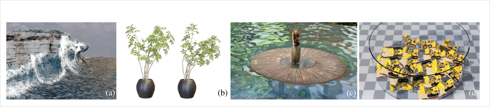
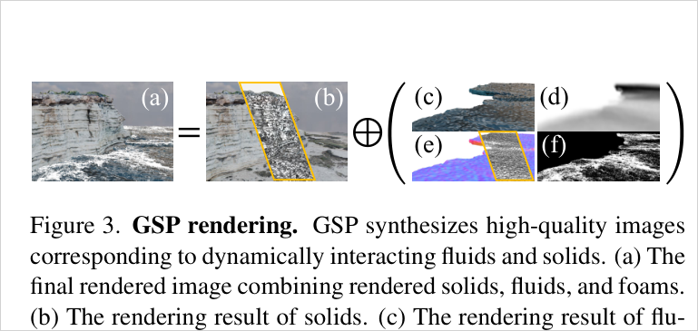
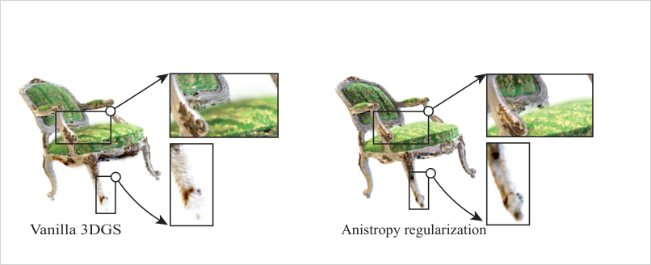
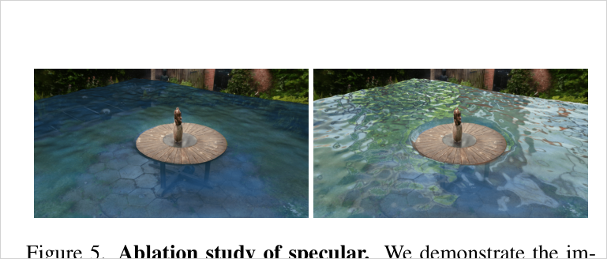
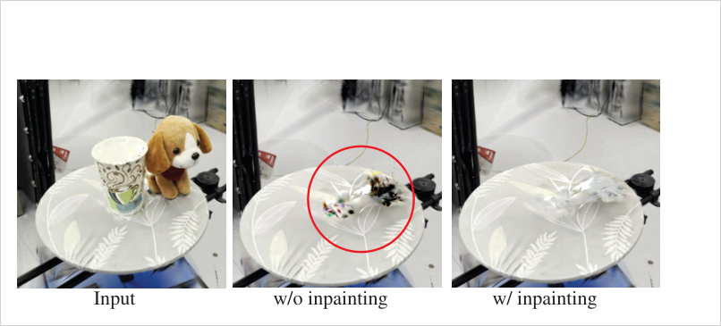
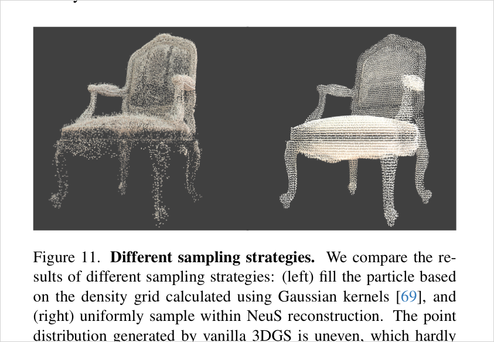

# Gaussian Splashing: Unified Particles for Versatile Motion Synthesis and Rendering

> 3DGS와 PBD/PBF가 모두 particle 기반 표현이라는 구조적 공통성을 이용해, 재구성된 3DGS 장면 안에서 고체·변형체·강체·유체의 two-way coupling을 시뮬레이션하고 다시 Gaussian splatting/PBR로 렌더링하는 시스템. 단순 Gaussian=particle 재사용은 artifact를 내므로, 고체는 rendering Gaussian과 simulation particle을 **분리**하고 유체는 PBF particle을 Gaussian으로 **통합**한다.

## 한눈에

| 항목 | 내용 |
| --- | --- |
| 문제 | 정적 3DGS의 Gaussian을 그대로 물리 시뮬레이션 입자로 쓰면 큰 회전 변형에서 spiky/fuzzy artifact가 나고, 유체의 반사·굴절·투명성은 baked light-field 3DGS로 표현하기 어렵다 |
| 핵심 아이디어 | 3DGS·PBD·PBF의 공통 particle 표현을 이어 붙이되, 고체는 rendering Gaussian↔simulation particle을 decouple(NeuS mesh + Poisson sampling + GMLS 보간)하고, 유체는 PBF particle을 spherical Gaussian으로 unified하게 사용. anisotropy loss·PBR specular·surface tension·thickness refraction·shadow·inpainting을 조합 |
| 입력 | posed multi-view images (foreground/background 분리, NeuS surface, environment map 학습) |
| 출력 | 3DGS 장면 위의 dynamic solid/fluid two-way coupling 시뮬레이션 + novel-view PBR 렌더링(specular/refraction/foam/shadow 포함) |
| 주요 결과 | Chair·Waves·Garden·Lego·Cup&dog·Headset·Can·Astronaut·Ficus·Bulldozers 등 다양한 scene demo. simulation ~0.8-8.1s/step, render component별 10⁻²s 수준 (Table 1) |
| 한 줄 novelty | 새 solver도 새 rasterizer도 아니라, **"simulation particle 분포와 rendering Gaussian 분포를 어디까지 통일하고 어디서 분리할지"라는 표현 설계**를 fluid-solid까지 확장해 구체화 (유체=unified, 고체=decoupled-hybrid) |
| 안 푸는 것 | 정확한 물리(PBD는 근사), 물리적으로 정확한 refraction/light transport, 정량 dynamics/rendering metric 비교, 완전 realtime simulation |

- 저자: Yutao Feng, Xiang Feng, Yintong Shang, Ying Jiang, Chang Yu, Zeshun Zong, Tianjia Shao, Hongzhi Wu, Kun Zhou, Chenfanfu Jiang, Yin Yang
- 버전: arXiv:2401.15318v2 (2024-07-23)
- PDF: `C:\Users\jinsw712\Desktop\Files\Research_WIKI\raw\papers\1_Gaussian Splashing; Unified Particles for Versatile Motion Synthesis and Rendering.pdf`



## 1. 문제와 동기 (Paper Says)

3DGS는 빠른 novel-view 렌더링에 강하지만, 정적 장면에서 학습된 Gaussian을 곧바로 물리 시뮬레이션 입자로 쓰기는 어렵다. 큰 회전 변형이 들어가면 splatting 결과가 뾰족하고 흐릿한 noise를 만들고, 유체는 입자가 내부와 외부를 크게 오가며 투명성·반사를 동시에 가져 vanilla 3DGS의 baked light-field 조합만으로는 표현이 어렵다. (p.1-2)

**기존 흐름과 차이.** Dynamic NeRF/GS 계열은 시간 축 deformation field나 canonical field를 학습해 관측된 동적 장면을 재현하는 쪽이 많다. PhysGaussian은 3DGS와 물리 시뮬레이션을 통합하는 중요한 선행이지만, GSP는 특히 PBD/PBF 기반 **fluid-solid coupling과 유체 표면 렌더링**까지 한 시스템 안에 넣는 데 초점을 둔다. 논문은 PBD가 물리 정확도 면에서 완벽하지는 않지만, 고체/변형체/강체/유체를 constraint projection이라는 공통 틀로 다룰 수 있어 interactive graphics 시스템에는 충분히 유용하다고 본다. (p.2-3, p.8)

**기여 요약.** (p.2, p.4-8)
- 3DGS 장면에서 PBD/PBF 기반 deformable·rigid·fluid dynamics와 solid-fluid two-way coupling을 합성하는 unified particle pipeline.
- GaussianShader식 material/PBR parameter를 Gaussian에 추가해 유체 표면 specular highlight를 동적으로 렌더링.
- 고체의 큰 회전 변형 artifact를 줄이는 anisotropy loss.
- 고체는 simulation particle과 rendering Gaussian을 분리하고 GMLS로 deformation을 보간.
- 유체는 PBF surface tension, surface normal, additive thickness splatting, Beer's law 기반 diffuse/refraction 근사를 결합.
- 객체 제거 후 드러나는 미관측 배경을 LaMa inpainting으로 보정.

## 2. 핵심 방법 (Paper Says)

전체 pipeline은 입력 multi-view image에서 foreground/background를 분리하고, foreground object의 surface를 추출한 뒤 3DGS/GaussianShader 학습과 PBD/PBF 시뮬레이션을 결합한다. **핵심 설계 축은 simulation↔rendering 표현을 고체와 유체에서 다르게 다룬다는 점**이다: 고체는 object Gaussian을 렌더링용으로 학습하되 시뮬레이션에는 별도 입자를 쓰고, 유체는 PBF particle을 곧 fluid Gaussian으로 재사용한다. (p.4)


### 2.1 Unified particle 표현: 왜 고체는 분리하고 유체는 통합하는가 (핵심)
논문의 이름은 "unified particles"이지만 실제로는 **유체는 unified, 고체는 decoupled-interpolated hybrid**다.
- **유체(unified).** PBF particle 자체가 moving volume/surface sample이므로, 각 particle에 spherical Gaussian을 얹어 simulation 입자와 rendering primitive를 그대로 통일한다.
- **고체(decoupled).** 3DGS kernel은 표면에 불균일하게 몰리고 rendering용 adaptive anisotropic 분포가 좋지만, simulation에는 내부까지 균일하게 채운 boundary/interior sampling이 필요하다. 그래서 segmented foreground에 NeuS로 SDF zero-level surface mesh를 만들고 그 내부에 Poisson disk sampling으로 simulation particle을 배치한다. 매 frame PBD로 움직인 particle의 displacement와 deformation gradient를 GMLS로 trained Gaussian kernel에 보간한다. (p.5, p.13-14)

### 2.2 Training: material-aware 3DGS와 anisotropy loss
GSP는 GaussianShader를 따라 각 Gaussian에 diffuse `d_p`, specular `s_p`, roughness `rho_p`, normal `n_p`와 environment map을 결합해 색을 diffuse+specular lighting으로 분해한다(§3 Eq.4). 학습 loss는 color loss, normal consistency, anisotropy regularization을 더한다(§3 Eq.5-6). anisotropy loss는 고체 Gaussian의 과도한 elongation/compression을 줄여 큰 회전 변형 후 spiky artifact를 억제한다. normal이 Gaussian 최소축 기반이라 최소축은 제약하지 않는다(제약 시 spherical Gaussian이 되어 normal ambiguity 발생). 실험값: `a = 1.1`, `lambda_n = 0.2`, `lambda_a = 10`. (p.4)

### 2.3 Position-Based Fluids: incompressibility·surface tension
유체는 PBF를 쓴다. 각 입자에 density constraint를 걸어 incompressibility를 유지한다(§3 Eq.7). 표면 장력을 위해 각 입자를 spherical screen으로 감싸고, neighbor projection 누적 면적이 threshold보다 작으면 surface particle로 판정한다. 표면 particle normal은 density constraint gradient에서 얻고(§3 Eq.8), surface neighbor를 normal에 수직인 plane에 투영·local triangulation해 area constraint(surface tension)를 정의하며(§3 Eq.9), 너무 가까운 입자는 distance constraint로 밀어낸다(§3 Eq.10). 원래 CPU였던 surface detection/tension 계산을 GPU 병렬화에 맞게 재구성했다. (p.5, p.12-13)

### 2.4 Rendering: solid deformation과 fluid PBR approximation
고체 Gaussian은 GMLS로 보간된 deformation gradient `F_p`로 covariance와 normal을 갱신한다(§3 Eq.11). 유체는 각 PBF particle에 spherical Gaussian을 두고 PBF surface normal을 가까운 surface particle에서 가져오며, 모든 유체 Gaussian에 specular material을 준다(실험 `s_p = 1`, `rho_p = 0.05`). 굴절/투명성은 실제 light transport를 풀지 않고, additive splatting으로 얻은 thickness `tau`와 Beer's law로 background color를 감쇠시키는 diffuse color로 근사한다(§3 Eq.12). background back-projection에는 refraction처럼 보이도록 `beta n_p` distortion을 더하고, transmission/refraction 대부분을 `d_p`에 넣었으므로 opacity는 `sigma_p = 1`로 둔다. (p.6)



### 2.5 Foam·spray·bubble·shadow·inpainting
Foam/spray/bubble은 별도 particle로 post-processing 합성하고 modified additive splatting을 쓴다. Shadow는 light-view splatting과 variance shadow mapping을 3DGS pipeline에 맞게 재구성해 nearly-soft shadow를 만든다. 객체를 이동/liquefy하면 원래 가려진 background가 검게 비므로, object Gaussian을 제거한 뒤 LaMa inpainting 결과를 ray hit Gaussian의 diffuse color에 기록한다. (p.6-7, p.14)

## 3. 핵심 수식

**Eq. 1-2 / Eq. 13-15 — XPBD constraint projection**
```text
[Delta t^2 ∇C(x) M^{-1} ∇C^T(x) + alpha] Delta lambda = -Delta t^2 C(x) - alpha lambda
Delta x = M^{-1} ∇C^T(x) Delta lambda
```
PBD/XPBD는 물리 시스템을 constraint projection 문제로 바꿔 위치를 직접 갱신한다. 이 공통 구조 덕분에 유체·강체·변형체를 같은 particle/constraint solver에 넣을 수 있다 — GSP의 unification이 성립하는 근거. (p.3, p.12)

**Eq. 3 — 3DGS alpha compositing**
```text
c_i = sum_k G_k(i) sigma_k c_k(r_i) prod_{j=1}^{k-1}(1 - G_j(i) sigma_j)
```
렌더링은 기존 3DGS compositing을 유지한다. 차이는 `c_k`가 GaussianShader식 material/PBR로 계산되고 dynamic solid/fluid 상태가 들어간다는 점. (p.3)

**Eq. 4 — GaussianShader color decomposition**
```text
c_p(r_i) = d_p + s_p ⊙ L_s(r_i, n_p, rho_p)
```
유체 표면 specular highlight를 살리려면 baked SH 대신 normal·roughness·environment light를 쓰는 material decomposition이 필요하다 — rendering 쪽 핵심. (p.4, p.7)

**Eq. 5-6 — anisotropy-regularized training**
```text
L = L_color + lambda_n L_normal + lambda_a L_aniso
L_aniso = (1 / |P|) sum_p max(S_p^1 / S_p^2 - a, 0)
```
`S_p^1`은 가장 큰 scaling, `S_p^2`는 두 번째 scaling. 고체 Gaussian의 과도한 elongation/compression을 줄여 큰 회전 변형 후 spiky artifact를 억제. 최소축은 normal ambiguity 때문에 제약하지 않음. (p.4, p.6)

**Eq. 7-10 / Eq. 16-24 — PBF density·surface tension·distance constraint**
```text
C_i^rho = sum_j (m_j / rho_0) W(p_i - p_j) - 1
n_i = normalize(-∇_{p_i} C_i^rho)
C_i^A = sum_{t in T(i)} 1/2 ||(p_t2 - p_t1) x (p_t3 - p_t1)||
C_ij^D = min(0, ||p_i - p_j|| - d_0)
```
density constraint는 incompressibility, area constraint는 surface tension, distance constraint는 표면 particle 과밀을 줄인다. 이 묶음이 물방울·overflow·puddle·splash의 형태감을 만드는 simulation 기반. (p.5, p.12-13)

**Eq. 11 — solid Gaussian deformation update**
```text
A_p^t = F_p A_p F_p^T
n_p^t = (F_p^{-T} n_p) / ||F_p^{-T} n_p||
```
GMLS로 보간된 deformation gradient로 rendering Gaussian의 covariance·normal을 갱신. PhysGaussian의 deformation-gradient kinematics와 연결되지만, GSP는 고체 simulation particle을 별도로 둔다는 점이 다르다. (p.5)

**Eq. 12 — thickness-dependent fluid diffuse color**
```text
d_p = exp(-k tau_p) c_p^bg
```
`k`는 color channel별 absorption coefficient, `tau_p`는 additive splatting thickness, `c_p^bg`는 back-projected background. path tracing 없이 Beer's law로 굴절/투과를 근사 — 논문 스스로 physical light transport 미처리를 한계로 인정. (p.6, p.8)

## 4. 실험 근거

논문은 정량 ground-truth dynamics benchmark보다 다양한 scene demonstration + engineering ablation을 중심으로 평가한다.

### 4.1 Anisotropy regularization (Fig. 4)


### 4.2 PBR material / specular (Fig. 5)


### 4.3 Inpainting (Fig. 7)


Shadow map(Fig. 6, p.7)도 ablation에 포함: dynamic shadow가 없으면 object가 background에 붙은 flat layer처럼 보여 depth감이 사라진다.

### 4.4 고체 sampling 전략 (Fig. 11)


### 4.5 Timing / scale (Table 1)


즉 GSP의 contribution은 완전 realtime simulation이 아니라, 3DGS 장면에서 물리적으로 그럴듯한 dynamic editing/rendering이 가능하다는 **feasibility와 engineering integration**에 가깝다. Evaluation scene(p.7-8, p.15-16): Chair(buoyancy/ripple), Waves(파도/foam/spray), Garden(물이 차오르며 table/plant 상호작용), Lego(two-way coupling surfing), Cup&dog·Astronaut(object-to-water state editing), Headset·Can(surface tension droplet/coalescence/overflow), Ficus·Bulldozers(변형체·강체 접촉). (p.8)

## 5. 해석 (Interpretation, model-side)

### 진짜 새로운 지점
GSP의 novelty는 새 fluid solver나 새 3DGS rasterizer 하나가 아니라, **3DGS 장면을 fluid-solid dynamics까지 포함하는 editable graphics system으로 확장하는 데 필요한 representation choice를 구체화**한 것이다. 특히 고체와 유체를 동일하게 취급하지 않는다.
```text
유체: PBF particle == fluid Gaussian            (unified: sim=render primitive)
고체: object Gaussian(render) ≠ Poisson particle(sim), GMLS로 연결  (decoupled-interpolated)
```
고체는 rendering Gaussian 분포와 simulation particle 분포의 최적 조건이 충돌하므로 분리하고, 유체는 PBF particle이 곧 moving surface sample이라 통합한다.

### PhysGaussian과의 관계
PhysGaussian은 "Gaussian 자체가 simulation particle이자 rendering primitive"라는 WS2 철학을 강하게 민다. GSP는 그 철학을 유체에는 유지하지만 고체에는 실용적으로 완화한다. 즉 WS2를 절대 원칙으로 보기보다, rendering fidelity와 simulation stability가 충돌하면 representation을 decouple하고 보간으로 잇는 쪽을 택한다. **시각적으로 좋은 primitive 분포가 곧 물리적으로 좋은 discretization은 아니다** — 사용자의 "Gaussian residual/mesh refinement/usable geometry" 방향과 맞닿는 지점.

### Research reuse perspective
가장 재사용하기 좋은 아이디어는 `simulation/rendering primitive alignment를 어디까지 유지하고 어디서 분리할 것인가`라는 설계 질문이다. 3DGS를 mesh/particle/surfel 기반 system으로 바꿔 쓰려면 rendering primitive의 adaptive density·anisotropy·opacity가 physics/geometry task의 sampling quality와 충돌할 수 있다. GSP는 이 충돌을 NeuS mesh sampling + GMLS interpolation으로 우회한다.

## 6. 한계
- PBD는 물리 정확도가 제한적이며, 더 정확한 meshless simulation으로 일반화할 필요가 있다(논문 명시). (p.8)
- 유체 렌더링은 실제 refraction/light transport를 물리적으로 풀지 않는다. Ellipsoid splatting은 PBF와 잘 맞지만 현실 유체 광학을 완전 처리하지 못함. (p.8)
- 평가가 대부분 qualitative demonstration 중심. Table 1은 시간/규모만, dynamics accuracy·rendering metric 정량 비교는 제한적. (p.7-8)
- 고체 pipeline이 segmentation·NeuS·Poisson sampling·GMLS·LaMa inpainting 등 여러 외부 module 품질에 의존 — 단계별 실패가 누적될 수 있음. (p.4-7, p.13-14)
- Inpainting은 hidden background를 그럴듯하게 채우지만 실제 3D geometry/appearance를 관측한 것은 아니라 novel-view consistency가 scene별로 약할 수 있음. (inference from p.6-7)
- Fluid opacity/refraction 근사가 background back-projection + normal distortion parameter에 의존해, 투명 유체의 multi-view 물리 일관성을 보장하지 않음. (inference from p.6)

## 7. Open Questions
- 고체 decoupling 전략을 mesh 없이 3DGS 자체의 uncertainty/density/residual로 더 직접 만들 수 있는가?
- Fluid Gaussian의 surface normal·thickness를 multi-view-consistent하게 학습/보정할 수 있는가?
- PBD 대신 MPM/SPH/FLIP 등 다른 solver를 쓰면 3DGS rendering primitive와 어떤 연결이 가장 안정적인가?
- Inpainting된 background color를 Gaussian에 기록하는 방식이 view consistency를 얼마나 유지하는가?
- Rendering Gaussian 분포와 simulation particle 분포의 mismatch를 줄이는 adaptive co-design objective를 만들 수 있는가?
- "object-to-water" state transform을 material parameter inference나 differentiable simulation과 연결해 video 기반 inverse problem으로 확장할 수 있는가?

## Evidence Anchors
- p.1: Abstract, Fig. 1 teaser, 3DGS+PBD 통합·fluid/solid interaction 목표
- p.2: 단순 3DGS+particle simulation artifact, GSP contribution, Lego example scale
- p.3: PBD/XPBD Eq. 1-2, 3DGS Eq. 3, GaussianShader Eq. 4
- p.4: Fig. 2 pipeline, training loss Eq. 5, anisotropy loss Eq. 6, hyperparameters
- p.5: solid sim/render decoupling, NeuS+Poisson sampling, GMLS, PBF Eq. 7-10, Gaussian deformation Eq. 11
- p.6: Fig. 3 rendering 분해, Fig. 4 anisotropy, Beer's law Eq. 12, foam/spray/bubble, inpainting, implementation
- p.7: Fig. 5-7 ablation, evaluation scene 설명
- p.8: Table 1 timing/scale, Fig. 8-9, conclusion·limitations
- p.12: supplementary XPBD/PBF equations, Algorithm 1
- p.13: Fig. 10 surface particle detection, Fig. 11 sampling 전략, Eq. 20-24
- p.14: GMLS interpolation, shadow/foam/bubble rendering, implementation details
- p.15-16: supplementary qualitative Fig. 12-21

## Related WIKI Pages
- [Deformation-Gradient Gaussian Kinematics](../concepts/deformation-gradient-gaussian-kinematics.md)
- [Anisotropy-Regularized Gaussian Reconstruction](../concepts/anisotropy-regularized-gaussian-reconstruction.md)
- [Simulation-Rendering Particle Decoupling](../concepts/simulation-rendering-particle-decoupling.md)
- [Position-Based Fluid Gaussian Rendering](../concepts/position-based-fluid-gaussian-rendering.md)
- [Thickness-Based Specular Fluid Splatting](../concepts/thickness-based-specular-fluid-splatting.md)
