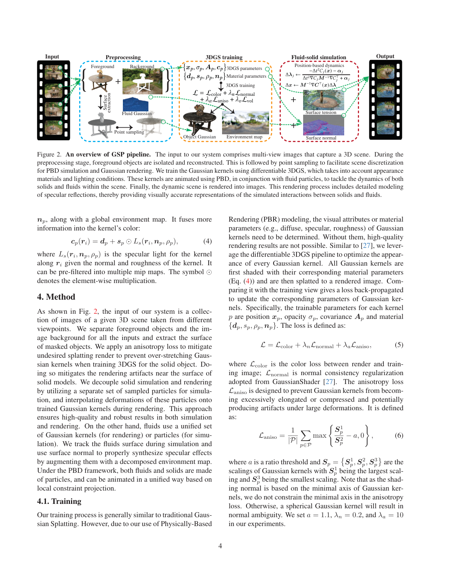
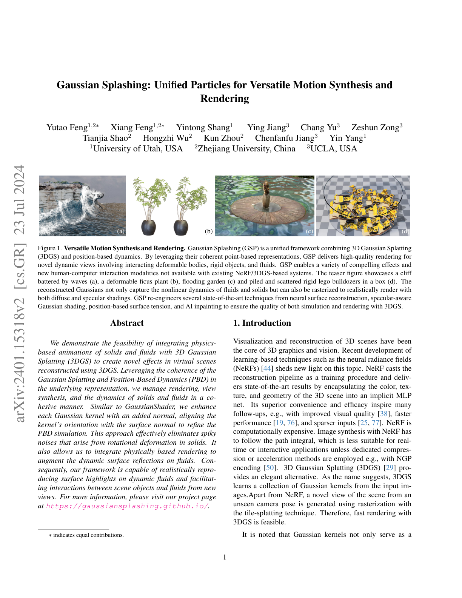
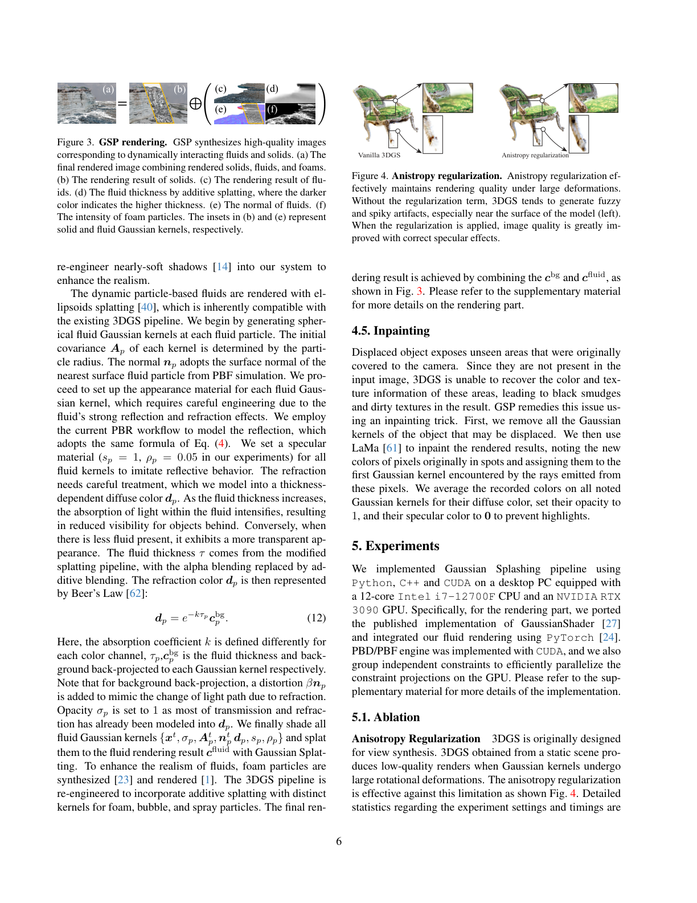
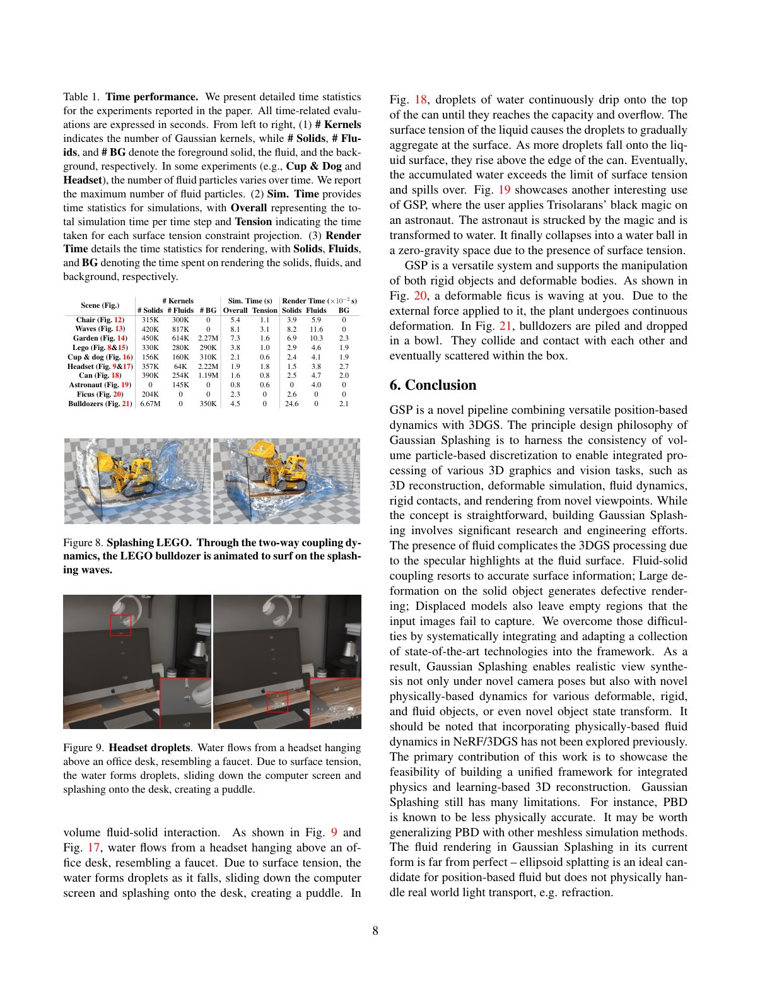
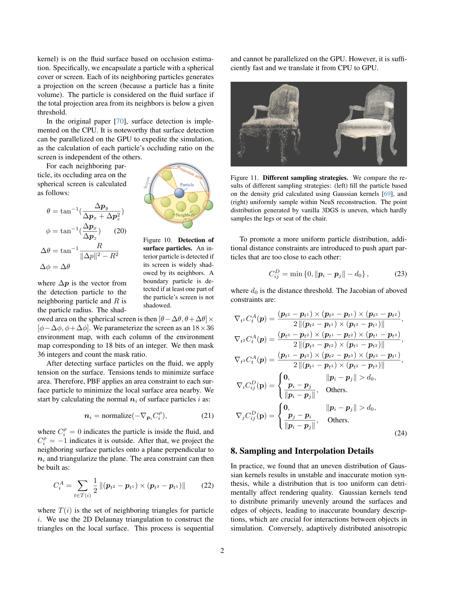

# Gaussian Splashing: Unified Particles for Versatile Motion Synthesis and Rendering

## Paper
- 저자: Yutao Feng, Xiang Feng, Yintong Shang, Ying Jiang, Chang Yu, Zeshun Zong, Tianjia Shao, Hongzhi Wu, Kun Zhou, Chenfanfu Jiang, Yin Yang
- 버전: arXiv:2401.15318v2, 2024-07-23
- 주제: 3D Gaussian Splatting 장면에 Position-Based Dynamics/PBF를 결합해 고체, 변형체, 유체, 유체-고체 상호작용을 novel view에서 합성하고 렌더링하는 시스템
- PDF: `C:\Users\jinsw712\Desktop\Files\Research_WIKI\raw\papers\1_Gaussian Splashing; Unified Particles for Versatile Motion Synthesis and Rendering.pdf`

## Main Claim
Gaussian Splashing(GSP)의 핵심 주장은 3DGS와 PBD/PBF가 모두 입자 기반 표현을 사용한다는 구조적 공통성을 이용하면, 재구성된 3DGS 장면 안에서 유체와 고체의 양방향 물리 상호작용을 만들고 이를 다시 Gaussian splatting/PBR로 렌더링할 수 있다는 것이다. 다만 단순히 Gaussian kernel을 시뮬레이션 입자로 재사용하면 고체 회전 artifact, 불균일한 표면 샘플링, 유체의 반사/굴절 표현 문제가 생기므로, 논문은 고체에는 렌더링 Gaussian과 시뮬레이션 입자를 분리하고, 유체에는 Gaussian 입자를 PBF와 rendering에 통합적으로 쓰며, anisotropy regularization, surface-tension normal, PBR specular/refraction, shadow, inpainting을 조합해 시스템을 완성한다.

## Paper Says: Motivation and Previous Work
### 문제 배경
3DGS는 빠른 novel-view 렌더링에는 강하지만, 정적 장면의 Gaussian은 곧바로 물리 시뮬레이션용 입자로 쓰기 어렵다. 큰 회전 변형이 들어가면 splatting 결과가 뾰족하고 흐릿한 noise를 만들고, 유체는 입자가 내부와 외부를 크게 오가며 투명성과 반사를 동시에 가져 vanilla 3DGS의 baked light-field 조합만으로는 표현하기 어렵다. (p.1-2)

### 기존 흐름과 차이
Dynamic NeRF/GS 계열은 시간 축 deformation field나 canonical field를 학습해 관측된 동적 장면을 재현하는 쪽이 많다. PhysGaussian은 3DGS와 물리 시뮬레이션을 통합하는 중요한 선행이지만, GSP는 특히 PBD/PBF 기반 fluid-solid coupling과 유체 표면 렌더링까지 한 시스템 안에 넣는 데 초점을 둔다. 논문은 PBD가 물리 정확도 면에서 완벽하지는 않지만, 고체/변형체/강체/유체를 constraint projection이라는 공통 틀로 다룰 수 있어 interactive graphics 시스템에는 충분히 유용하다고 본다. (p.2-3, p.8)

### 기여 요약
- 3DGS 장면에서 PBD/PBF 기반 deformable, rigid, fluid dynamics와 solid-fluid two-way coupling을 합성하는 unified particle pipeline.
- GaussianShader식 material/PBR parameter를 Gaussian에 추가해 유체 표면의 specular highlight를 동적으로 렌더링.
- 고체의 큰 회전 변형 artifact를 줄이기 위한 anisotropy loss.
- 고체는 시뮬레이션 입자와 렌더링 Gaussian을 분리하고 GMLS로 deformation을 보간.
- 유체는 PBF surface tension, surface normal, additive thickness splatting, Beer’s law 기반 diffuse/refraction approximation을 결합.
- 객체 제거 후 드러나는 미관측 배경을 LaMa inpainting으로 보정. (p.2, p.4-8)

## Paper Says: Method
### 전체 pipeline


Fig. 2의 pipeline은 입력 multi-view image에서 foreground/background를 분리하고, foreground object의 surface를 추출한 뒤, 3DGS/GaussianShader 학습과 PBD/PBF 시뮬레이션을 결합한다. 고체는 object Gaussian을 렌더링용으로 학습하지만 시뮬레이션에는 NeuS surface mesh 내부에 Poisson disk sampling한 별도 입자를 사용한다. 유체는 PBF 입자를 spherical fluid Gaussian으로도 사용한다. 최종 렌더링은 solid Gaussian, fluid Gaussian, foam/spray/bubble, background, shadow를 합성한다. (p.4)

### Training: material-aware 3DGS와 anisotropy loss
GSP는 GaussianShader를 따라 각 Gaussian에 diffuse `d_p`, specular `s_p`, roughness `rho_p`, normal `n_p`와 environment map을 결합한다. 색 함수는 다음처럼 diffuse와 specular lighting으로 분해된다. (p.3-4)

```text
c_p(r_i) = d_p + s_p ⊙ L_s(r_i, n_p, rho_p)
```

학습 loss는 색 손실, normal consistency, anisotropy regularization을 더한다. (p.4)

```text
L = L_color + lambda_n L_normal + lambda_a L_aniso
L_aniso = (1 / |P|) sum_{p in P} max(S_p^1 / S_p^2 - a, 0)
```

여기서 `S_p^1`은 가장 큰 scaling, `S_p^2`는 두 번째 scaling이다. 논문은 normal이 Gaussian의 최소축에 기반하므로 최소축까지 제약하면 spherical Gaussian이 되어 normal ambiguity가 생길 수 있다고 설명한다. 실험에서는 `a = 1.1`, `lambda_n = 0.2`, `lambda_a = 10`을 사용한다. (p.4)

### Solid simulation: 렌더링 Gaussian과 시뮬레이션 입자 분리
고체에 대해서는 3DGS kernel을 그대로 시뮬레이션 입자로 쓰지 않는다. 이유는 3DGS kernel이 표면에 불균일하게 몰리고, rendering에는 adaptive anisotropic 분포가 좋지만 simulation에는 균일하고 내부까지 채운 boundary/interior sampling이 필요하기 때문이다. GSP는 segmented foreground model에 대해 NeuS로 SDF zero-level surface mesh를 만들고, 그 내부에 Poisson disk sampling으로 simulation particles를 배치한다. 매 frame마다 PBD로 움직인 simulation particle의 displacement와 deformation gradient를 GMLS로 trained Gaussian kernels에 보간한다. (p.5, p.13-14)

### Position-Based Fluids
유체는 PBF를 사용한다. 각 입자에 density constraint를 걸어 incompressibility를 유지한다. (p.5)

```text
C_i^rho = rho_i / rho_0 - 1
        = sum_j (m_j / rho_0) W(p_i - p_j) - 1
```

표면 장력을 위해 각 입자를 spherical screen으로 감싸고 neighbor projection의 누적 면적이 threshold보다 작으면 surface particle로 판정한다. 표면 particle normal은 density constraint gradient에서 얻는다. (p.5, p.12-13)

```text
n_i = normalize(-∇_{p_i} C_i^rho)
```

이후 surface neighbor를 normal에 수직인 plane에 투영하고 local triangulation을 만들어 면적 constraint를 정의한다. 너무 가까운 입자는 distance constraint로 밀어낸다. 논문은 원래 CPU였던 surface detection/tension 계산을 GPU parallelization에 맞게 재구성했다고 설명한다. (p.5, p.13)

### Rendering: solid deformation과 fluid PBR approximation
고체 Gaussian은 simulation에서 보간된 deformation gradient `F_p`로 covariance와 normal을 갱신한다. (p.5)

```text
A_p^t = F_p A_p F_p^T
n_p^t = (F_p^{-T} n_p) / ||F_p^{-T} n_p||
```

유체는 각 PBF particle에 spherical Gaussian을 두고, PBF surface normal을 가까운 surface particle에서 가져온다. 모든 유체 Gaussian에는 specular material을 주며 실험에서는 `s_p = 1`, `rho_p = 0.05`를 사용한다. 굴절/투명성은 실제 light transport를 풀지 않고, additive splatting으로 얻은 thickness `tau`와 Beer’s law를 사용해 background color를 감쇠시키는 diffuse color로 근사한다. (p.6)

```text
d_p = exp(-k tau_p) c_p^bg
```

여기서 `k`는 color channel별 absorption coefficient이고, background back-projection에는 refraction처럼 보이도록 `beta n_p` distortion을 추가한다. transmission/refraction 대부분을 `d_p`에 넣었으므로 opacity는 `sigma_p = 1`로 둔다. (p.6)

### Foam, spray, bubble, shadow, inpainting
Fig. 3처럼 final render는 solid, fluid, fluid thickness, fluid normal, foam intensity를 합성한다. Foam/spray/bubble은 별도 particle로 post-processing 합성하고, modified additive splatting을 사용한다. Shadow는 light-view splatting과 variance shadow mapping을 3DGS pipeline에 맞게 재구성해 nearly-soft shadow를 만든다. 객체를 이동시키거나 liquefy하면 원래 가려져 있던 background가 검게 비기 때문에, GSP는 object Gaussian을 제거한 뒤 LaMa inpainting 결과를 ray hit Gaussian의 diffuse color에 기록한다. (p.6-7, p.14)

## Visual Evidence
### Fig. 1: GSP가 목표로 하는 효과 범위


Fig. 1은 waves, deformable ficus, flooding garden, rigid Lego bulldozers를 보여주며, GSP가 단일 fluid demo가 아니라 변형체/강체/유체/상호작용을 모두 3DGS 장면에서 다루려는 시스템임을 보여준다. (p.1)

### Fig. 2: 고체와 유체의 표현 전략 차이
Fig. 2는 foreground/background 분리, surface extraction, point sampling, 3DGS training, material/environment map, surface tension, PBD, fluid Gaussian으로 이어지는 pipeline을 보여준다. 중요한 점은 고체는 simulation particle과 object Gaussian이 분리되고, 유체는 fluid particle과 Gaussian이 통합된다는 점이다. (p.4)

### Fig. 3: 유체 렌더링의 분해


Fig. 3은 final render가 solid render, fluid render, additive thickness, normal, foam intensity의 조합이라는 것을 보여준다. 논문의 유체 rendering은 물리적으로 완전한 굴절/반사 해석이 아니라, 3DGS pipeline에 들어갈 수 있는 thickness/specular/foam approximation의 조립이다. (p.6)

### Fig. 4-7: artifact 제거용 engineering block
Fig. 4는 anisotropy regularization이 없으면 큰 변형에서 fuzzy/spiky artifact가 생기고, regularization을 넣으면 표면과 specular가 안정화된다는 evidence다. Fig. 5는 specular term이 없으면 물이 smoke처럼 보이고, specular highlight가 있어야 유체성이 살아난다는 점을 보여준다. Fig. 6은 shadow map이 물체를 background에 붙은 layer처럼 보이지 않게 해 depth감을 강화한다. Fig. 7은 object displacement 후 미관측 영역을 inpainting하지 않으면 black smudge/dirty texture가 생긴다는 것을 보여준다. (p.6-7)

### Table 1과 Fig. 8-21: 다양한 scene demonstration


Table 1은 Chair, Waves, Garden, Lego, Cup & dog, Headset, Can, Astronaut, Ficus, Bulldozers의 kernel 수와 simulation/render time을 보고한다. 예를 들어 Lego는 solid 330K, fluid 280K, background 290K Gaussian/particles를 쓰고 simulation overall 3.8s per step, render time은 solids 0.029s, fluids 0.046s, background 0.019s 수준이다. 이 표는 GSP가 interactive idea를 지향하지만 모든 simulation이 realtime인 것은 아니며, rendering은 상대적으로 빠르고 simulation은 scene별로 무겁다는 점을 보여준다. (p.8)

### Fig. 10-11: surface detection과 sampling 비교


Fig. 10은 neighbor occlusion으로 surface particle을 찾는 방식을 보여준다. Fig. 11은 Gaussian density grid 기반 sampling보다 NeuS mesh 내부 uniform sampling이 얇은 chair leg/seat를 더 잘 채운다는 점을 보여준다. 이 그림은 왜 고체에서 rendering Gaussian과 simulation particle을 분리해야 하는지를 직접적으로 설명한다. (p.13)

## Key Equations
### Eq. 1-2 / Eq. 13-15: XPBD constraint projection
```text
[Delta t^2 ∇C(x) M^{-1} ∇C^T(x) + alpha] Delta lambda
  = -Delta t^2 C(x) - alpha lambda

Delta x = M^{-1} ∇C^T(x) Delta lambda
```

PBD/XPBD는 물리 시스템을 constraint projection 문제로 바꾸어 위치를 직접 갱신한다. GSP는 이 구조 덕분에 유체, 강체, 변형체를 같은 particle/constraint solver 안에 넣을 수 있다. (p.3, p.12)

### Eq. 3: 3DGS alpha compositing
```text
c_i = sum_k G_k(i) sigma_k c_k(r_i) prod_{j=1}^{k-1}(1 - G_j(i) sigma_j)
```

GSP의 렌더링은 기존 3DGS compositing을 기본으로 유지한다. 차이는 `c_k`가 GaussianShader식 material/PBR parameter로 계산되고, dynamic solid/fluid 상태가 들어간다는 점이다. (p.3)

### Eq. 4: GaussianShader color decomposition
```text
c_p(r_i) = d_p + s_p ⊙ L_s(r_i, n_p, rho_p)
```

유체 표면의 specular highlight를 살리려면 color를 baked SH처럼 두기보다 normal, roughness, environment light를 쓰는 material decomposition이 필요하다는 것이 논문의 rendering 쪽 핵심이다. (p.4, p.7)

### Eq. 5-6: anisotropy-regularized training
```text
L = L_color + lambda_n L_normal + lambda_a L_aniso
L_aniso = (1 / |P|) sum_p max(S_p^1 / S_p^2 - a, 0)
```

고체 Gaussian의 과도한 elongation/compression을 줄여 큰 회전 변형 후 spiky artifact를 줄이는 loss다. 최소축은 normal ambiguity 때문에 제약하지 않는다. (p.4, p.6)

### Eq. 7-10 / Eq. 16-24: PBF density, surface tension, distance constraint
```text
C_i^rho = sum_j (m_j / rho_0) W(p_i - p_j) - 1
n_i = normalize(-∇_{p_i} C_i^rho)
C_i^A = sum_{t in T(i)} 1/2 ||(p_t2 - p_t1) x (p_t3 - p_t1)||
C_ij^D = min(0, ||p_i - p_j|| - d_0)
```

밀도 constraint는 incompressibility를, surface area constraint는 surface tension을, distance constraint는 표면 particle의 과밀을 줄인다. 이 묶음이 GSP에서 물방울, overflow, puddle, splash의 형태감을 만드는 simulation 쪽 기반이다. (p.5, p.12-13)

### Eq. 11: solid Gaussian deformation update
```text
A_p^t = F_p A_p F_p^T
n_p^t = F_p^{-T} n_p / ||F_p^{-T} n_p||
```

GMLS로 보간된 deformation gradient를 이용해 렌더링 Gaussian의 covariance와 normal을 갱신한다. PhysGaussian의 deformation-gradient Gaussian kinematics와 연결되지만, GSP는 고체 시뮬레이션 입자를 별도로 둔다는 점이 다르다. (p.5)

### Eq. 12: thickness-dependent fluid diffuse color
```text
d_p = exp(-k tau_p) c_p^bg
```

유체의 굴절/투과를 path tracing으로 풀지 않고, additive splatting thickness와 Beer’s law 기반 감쇠로 근사한다. 논문 스스로도 이 부분은 실제 light transport/refraction을 물리적으로 처리하지 못하는 한계라고 밝힌다. (p.6, p.8)

## Implementation
- 구현: Python, C++, CUDA.
- 하드웨어: 12-core Intel i7-12700F CPU, NVIDIA RTX 3090 GPU.
- Rendering: GaussianShader 공개 구현을 port하고 PyTorch로 fluid rendering 통합.
- Simulation: PBD/PBF engine을 CUDA로 구현하고 independent constraints를 group해 GPU에서 constraint projection 병렬화.
- 시간 step: supplementary 기준 simulation time step `0.005s`.
- Solver iteration: fluid `10`, solid `50` iterations.
- PBF surface particles는 매 2 time steps마다 update.
- Fluid material: 실험에서 `s_p = 1`, `rho_p = 0.05`, opacity `sigma_p = 1`.
- Training regularization: `a = 1.1`, `lambda_n = 0.2`, `lambda_a = 10`. (p.4, p.6, p.14)

## Experiments
### Ablation
- Anisotropy regularization: static 3DGS가 큰 회전 변형을 받으면 spiky/fuzzy artifact가 생기며, anisotropy loss가 이를 완화한다. (Fig. 4, p.6)
- PBR material/specular: diffuse-only fluid는 smoke-like하게 보이고, specular reflection을 넣어야 물 표면처럼 보인다. (Fig. 5, p.7)
- Shadow map: dynamic shadow가 없으면 object가 background에 붙은 flat layer처럼 보인다. (Fig. 6, p.7)
- Inpainting: object displacement/liquefaction 후 드러나는 미관측 배경은 black smudge와 dirty texture를 만들며, LaMa inpainting이 이를 완화한다. (Fig. 7, p.7)

### Evaluation scenes
논문은 정량적인 ground-truth dynamics benchmark보다 다양한 scene demonstration을 중심으로 평가한다. Chair는 soft chair가 물에 빠져 deformation/ripple/buoyancy를 보이고, Waves는 절벽과 파도/foam/spray 상호작용을, Garden은 물이 차오르며 table/plant와 상호작용하는 장면을, Lego는 bulldozer가 파도 위에서 two-way coupling으로 흔들리는 장면을 보인다. Cup & dog/Astronaut는 객체 상태를 물로 바꾸는 scene editing 예시이고, Headset/Can은 표면장력으로 droplet, coalescence, overflow를 보여준다. Ficus와 Bulldozers는 변형체와 강체 접촉을 보여준다. (p.7-8, p.15-16)

### Runtime interpretation
Table 1은 simulation이 scene별로 0.8-8.1s per step 수준까지 올라가고, rendering은 component별 `10^-2s` 단위임을 보여준다. 따라서 GSP의 contribution은 완전 realtime simulation이라기보다, 3DGS 기반 장면에서 물리적으로 그럴듯한 dynamic editing/rendering이 가능하다는 feasibility와 engineering integration에 가깝다. (p.8)

## Interpretation
### What is genuinely new
GSP의 novelty는 새로운 fluid solver나 새로운 3DGS rasterizer 하나가 아니라, 3DGS 장면을 fluid-solid dynamics까지 포함하는 editable graphics system으로 확장하기 위해 필요한 representation choices를 구체화한 데 있다. 특히 고체와 유체를 동일하게 취급하지 않는 점이 중요하다. 고체는 rendering Gaussian 분포와 simulation particle 분포의 최적 조건이 충돌하므로 분리하고, 유체는 PBF particle 자체가 moving volume/surface sample이므로 Gaussian rendering primitive로도 통합한다.

### PhysGaussian과의 관계
PhysGaussian은 “Gaussian 자체가 simulation particle이자 rendering primitive”라는 WS2 철학을 강하게 밀어붙인다. GSP는 그 철학을 유체에는 유지하지만, 고체에는 실용적으로 완화한다. 즉 GSP는 WS2를 절대 원칙으로 보기보다, rendering fidelity와 simulation stability가 충돌하면 representation을 decouple하고 보간으로 연결하는 쪽을 택한다. 이 차이는 사용자의 “Gaussian residual/mesh refinement/usable geometry” 방향과도 맞닿는다. 시각적으로 좋은 primitive 분포가 곧 물리적으로 좋은 discretization은 아니다.

### Research reuse perspective
이 논문에서 가장 재사용하기 좋은 아이디어는 `simulation/rendering primitive alignment를 어디까지 유지하고 어디서 분리할 것인가`라는 설계 질문이다. 3DGS를 mesh/particle/surfel 기반 system으로 바꿔 쓰려면, rendering primitive의 adaptive density, anisotropy, opacity가 physics/geometry task의 sampling quality와 충돌할 수 있다. GSP는 이 충돌을 NeuS mesh sampling + GMLS interpolation으로 우회한다.

### Model-side inference
GSP는 논문 제목처럼 “unified particles”를 말하지만, 실제 시스템은 완전한 단일 입자 표현이라기보다 유체는 unified, 고체는 decoupled-interpolated hybrid다. 이것은 약점이라기보다 현실적인 설계다. 물리 정확도가 필요한 부분에서는 별도 discretization을 쓰고, 시각 fidelity가 필요한 부분에서는 3DGS를 유지하는 것이 pipeline 전체 품질을 높인다.

## Limitations
- 논문이 직접 밝히듯 PBD는 물리 정확도가 제한적이며, 더 정확한 meshless simulation으로 일반화할 필요가 있다. (p.8)
- 유체 렌더링은 실제 refraction/light transport를 물리적으로 풀지 않는다. Ellipsoid splatting은 PBF와 잘 맞지만, 현실 세계 유체 광학을 완전하게 처리하지 못한다. (p.8)
- 평가가 mostly qualitative demonstration 중심이다. Table 1은 시간/규모를 보여주지만, dynamics accuracy나 rendering metric의 정량 비교는 제한적이다. (p.7-8)
- 고체 pipeline은 segmentation, NeuS reconstruction, Poisson sampling, GMLS interpolation, LaMa inpainting 등 여러 외부 module의 품질에 의존한다. 각 단계의 실패가 누적될 수 있다. (p.4-7, p.13-14)
- Inpainting은 hidden background를 그럴듯하게 채우지만, 실제 3D geometry/appearance를 관측한 것은 아니다. novel view consistency는 scene에 따라 약할 수 있다. (inference from p.6-7)
- Fluid opacity/refraction approximation은 background back-projection과 normal distortion parameter에 의존하므로, 투명한 유체를 여러 view에서 물리적으로 일관되게 보장하지 않는다. (inference from p.6)

## Open Questions
- GSP의 고체 decoupling 전략을 mesh 없이 3DGS 자체의 uncertainty/density/residual로 더 직접 만들 수 있는가?
- Fluid Gaussian의 surface normal과 thickness를 multi-view-consistent하게 학습하거나 보정할 수 있는가?
- PBD 대신 MPM/SPH/FLIP 등 다른 solver를 쓰면 3DGS rendering primitive와 어떤 연결 방식이 가장 안정적인가?
- Inpainting된 background color를 Gaussian에 기록하는 방식이 view consistency를 얼마나 유지하는가?
- Rendering Gaussian 분포와 simulation particle 분포의 mismatch를 줄이는 adaptive co-design objective를 만들 수 있는가?
- GSP의 “object-to-water” state transform을 material parameter inference나 differentiable simulation과 연결하면 실제 video 기반 inverse problem으로 확장할 수 있는가?

## Evidence Anchors
- p.1: Abstract, Fig. 1, 3DGS+PBD 통합과 fluid/solid interaction 목표
- p.2: 단순 3DGS+particle simulation의 artifact, GSP contribution, Lego example scale
- p.3: PBD/XPBD background Eq. 1-2, 3DGS Eq. 3, GaussianShader Eq. 4
- p.4: Fig. 2 pipeline, training loss Eq. 5, anisotropy loss Eq. 6, hyperparameters
- p.5: solid simulation/rendering decoupling, NeuS+Poisson sampling, GMLS interpolation, PBF Eq. 7-10, Gaussian deformation Eq. 11
- p.6: Fig. 3 rendering decomposition, Beer’s law Eq. 12, foam/spray/bubble, inpainting, implementation overview
- p.7: Fig. 5-7 ablations, evaluation scene descriptions
- p.8: Table 1 timing/scale, Fig. 8-9, conclusion and stated limitations
- p.12: supplementary XPBD/PBF equations and Algorithm 1
- p.13: Fig. 10 surface particle detection, Fig. 11 sampling strategies, Eq. 20-24
- p.14: GMLS interpolation details, shadow/foam/bubble rendering details, implementation details
- p.15-16: supplementary qualitative results Fig. 12-21

## Related WIKI Pages
- [Deformation-Gradient Gaussian Kinematics](../concepts/deformation-gradient-gaussian-kinematics.md)
- [Anisotropy-Regularized Gaussian Reconstruction](../concepts/anisotropy-regularized-gaussian-reconstruction.md)
- [Simulation-Rendering Particle Decoupling](../concepts/simulation-rendering-particle-decoupling.md)
- [Position-Based Fluid Gaussian Rendering](../concepts/position-based-fluid-gaussian-rendering.md)
- [Thickness-Based Specular Fluid Splatting](../concepts/thickness-based-specular-fluid-splatting.md)
