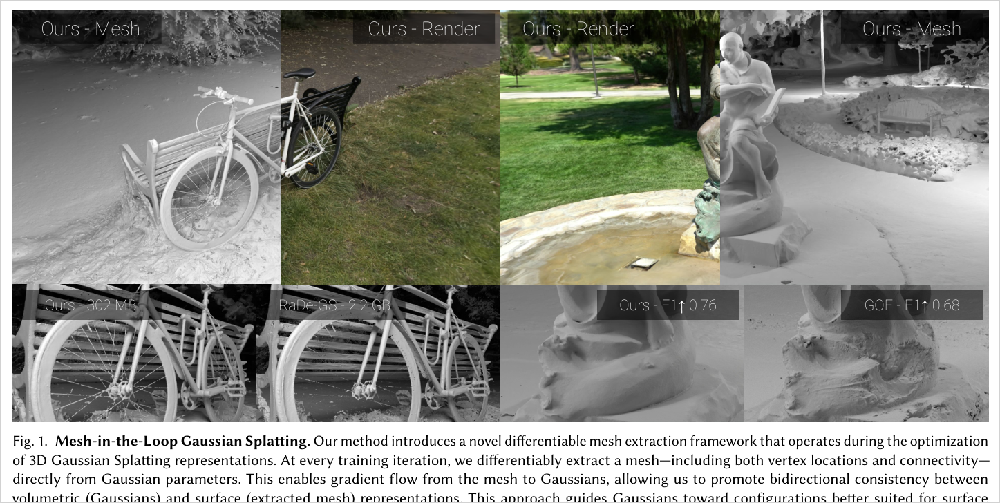
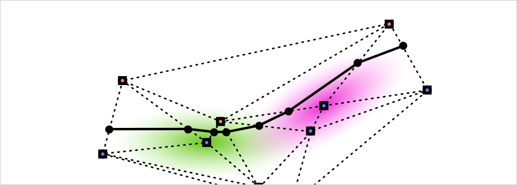
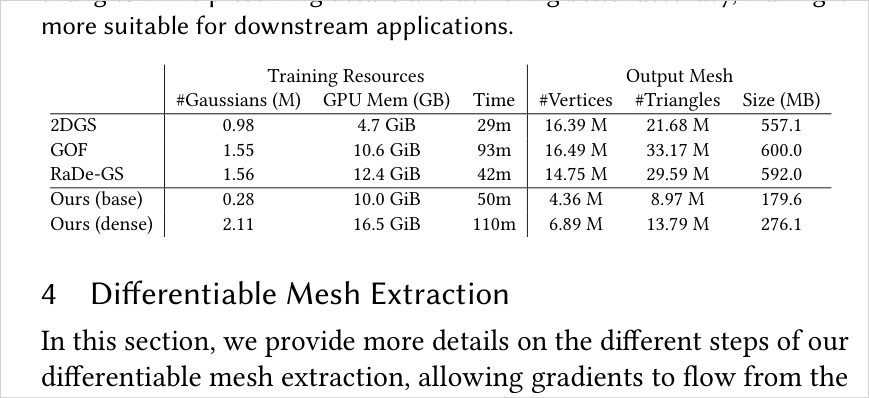
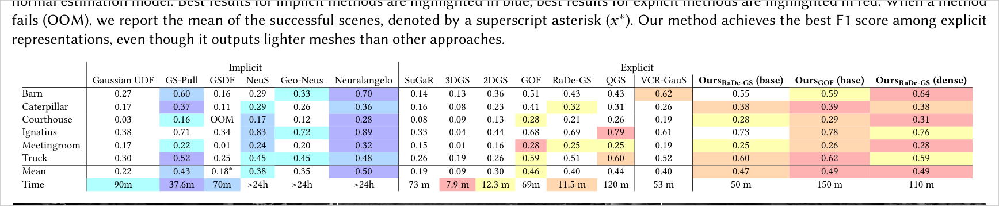
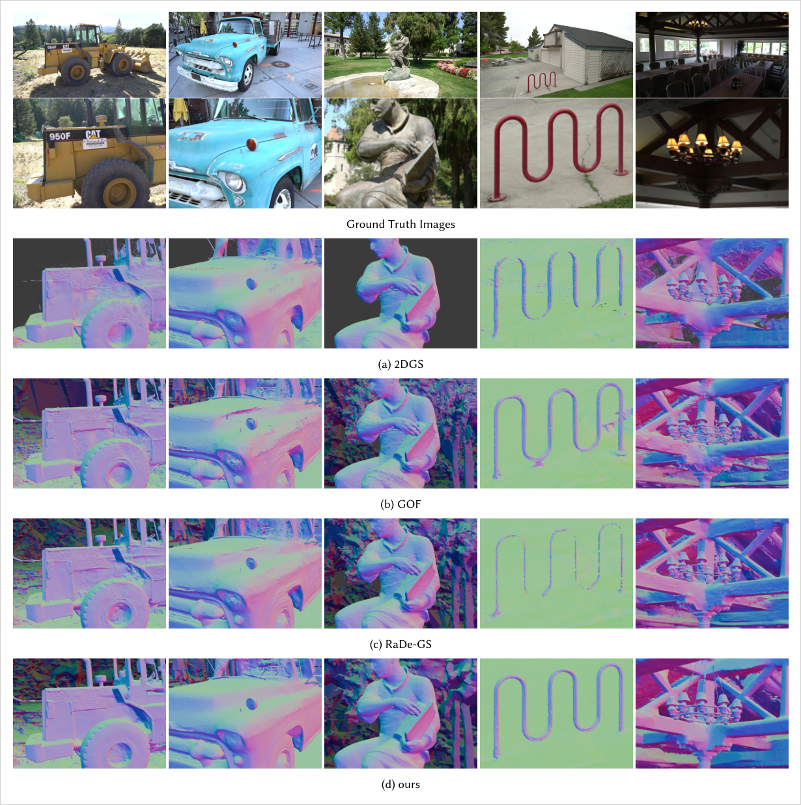
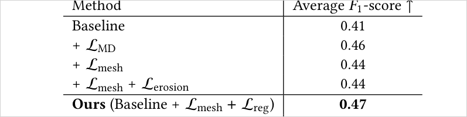
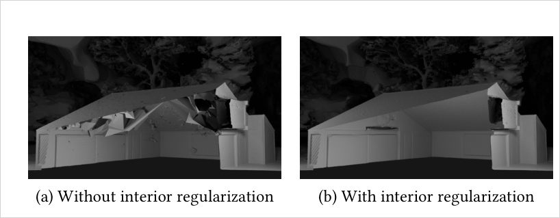
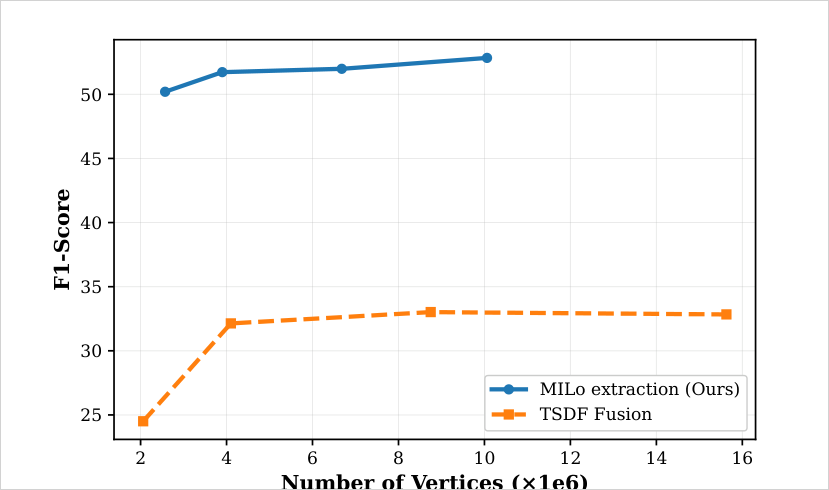

# MILo: Mesh-In-the-Loop Gaussian Splatting for Detailed and Efficient Surface Reconstruction

> Mesh 추출을 3DGS 최적화 loop 안으로 집어넣어, 매 iteration마다 Gaussian 파라미터에서 mesh(정점 위치 + 연결성)를 **미분가능하게** 뽑고 gradient를 Gaussian으로 되돌린다. volumetric(Gaussian)↔surface(mesh) 양방향 일관성을 강제해 기존 대비 **10배 적은 vertex**로 SOTA geometry를 얻는다.

## 한눈에

| 항목 | 내용 |
| --- | --- |
| 문제 | 기존 GS surface reconstruction은 학습이 끝난 뒤 post-processing으로 mesh를 뽑음 → volumetric과 mesh가 불일치하고, fine/thin detail이 손실되며, 수천만 vertex의 무거운 mesh가 나옴 |
| 핵심 아이디어 | mesh 추출을 **매 학습 iteration에 통합**. Gaussian을 Delaunay 정점의 미분가능 pivot으로 삼고(Gaussian Pivots), 각 정점에 learnable SDF 값을 붙여 differentiable Marching Tetrahedra로 mesh를 뽑은 뒤, mesh↔Gaussian의 depth/normal consistency로 양쪽을 동시에 정규화 |
| 입력 | posed multi-view images (표준 3DGS 파이프라인, SfM init). Gaussian 파라미터만 최적화 변수 |
| 출력 | watertight에 가까운 triangle mesh (vertex + connectivity) + 최적화된 Gaussian. base는 Gaussian 0.1–0.5M, mesh vertex ~4M |
| 주요 결과 | T&T F1 0.49(dense)로 explicit 계열 best, mesh vertex 4.36M로 경쟁군(14–16M) 대비 ~10배 적고, mesh 크기 180MB vs 550–600MB. DTU Chamfer 0.68로 RaDe-GS와 동급 |
| 한 줄 novelty | **mesh 추출을 최적화 loop 안에 넣어(mesh-in-the-loop), Gaussian을 explicit mesh의 implicit parameterization으로 삼고 mesh→Gaussian gradient를 흐르게 한 최초의 radiance field pipeline** |
| 안 푸는 것 | mesh로의 real-time rendering baking, dynamic scene, Gaussian 초기 분포 의존성 제거. 학습 시간도 표준 3DGS보다 김 |

- 저자: Antoine Guédon∗, Diego Gomez∗ (École Polytechnique), Nissim Maruani, George Drettakis (Inria, Université Côte d'Azur), Bingchen Gong, Maks Ovsjanikov (École Polytechnique). (∗ 공동 1저자)
- 버전: ACM TOG Vol.44 No.6 (SIGGRAPH Asia 2025), arXiv:2506.24096v2 (2025-10-29). 프로젝트: https://anttwo.github.io/milo/
- PDF: `C:\Users\jinsw712\Desktop\Files\Research_WIKI\raw\papers\MILo.pdf`



## 1. 문제와 동기 (Paper Says)

**Two-stage 파이프라인의 근본적 한계.** NeRF·3DGS 기반 mesh reconstruction은 대개 (1) differentiable rendering으로 volumetric representation을 최적화하고 (2) 학습 후 post-processing에서 isosurface로 mesh를 뽑는 2단계다. 이 방식은 **최적화 중 mesh를 전혀 고려하지 않으므로** 최종 mesh가 volumetric representation과 일치한다는 보장이 없다. rendering에서는 보이던 fine detail이 mesh 추출에서 사라질 수 있다. (p.2)

**Cheating과 isosurfacing artifact.** GS·NeRF는 geometry와 무관하게 opacity·view-dependent color를 조정해 training image를 잘 맞추지만, 그 대가로 floater·cavity 같은 hallucinated structure가 생긴다. volumetric representation이 이미 이 불일치를 흡수했기 때문에 mesh 추출 단계에서 고치기가 매우 어렵다. 또 Gaussian은 연속적이라 naive isosurfacing은 over-inflation(과팽창)이나 erosion(침식) 같은 geometric artifact를 낳는데, 특히 thin structure에서 두드러진다. (p.2–3)

**무거운 mesh와 background 평가 부재.** 기존 방법은 수천만(최대 tens of millions) vertex의 과도하게 dense한 mesh를 만들어 large scene에 확장하기 어렵다. 게다가 DTU·Tanks&Temples 같은 벤치마크는 foreground에만 GT geometry를 제공해 background 포함 full-scene 재구성을 평가하지 못한다. (p.2, p.9–10)

**MILo의 지향.** mesh 추출을 post-processing이 아니라 **최적화 loop의 일부**로 만든다. Gaussian과 얽힌 점 집합(Gaussian Pivots)에서 매 iteration mesh를 생성하고 mesh→Gaussian gradient를 흘려, mesh가 Gaussian을 정규화(cheating 억제)하고 Gaussian이 mesh를 파라미터화하는 **양방향 결합**을 만든다. "두 representation이 서로를 돕는다." (p.2)

## 2. 핵심 방법 (Paper Says)


매 iteration 5단계 (p.4):
1. Gaussian Pivots에서 학습가능한 Delaunay 정점을 fetch (§4.1)
2. Delaunay triangulation 갱신 (§4.1)
3. 각 Delaunay 정점의 학습가능 signed distance 값 fetch (§4.2)
4. GPU differentiable Marching Tetrahedra로 mesh 추출 (§4.3)
5. Gaussian과 mesh를 동시에 rendering해 image·consistency loss를 Gaussian으로 backprop (§5)

### 2.1 Gaussian Pivots — Delaunay 정점 샘플링 (§4.1)
Gaussian center를 그대로 Delaunay 정점으로 쓰면 두 문제가 있다: (1) center는 surface 위/근처에 몰려 있어 Marching Tetrahedra에 필요한 "surface를 사이에 두고 걸치는(straddling)" 정점이 안 됨, (2) 모든 Gaussian을 쓰면 large scene에서 너무 비쌈.

- **문제 (1) 해결:** GOF 방식대로 Gaussian 하나당 **9개 점**(center + principal axis 방향 bounding box 8 corner)을 뽑아 anisotropic 형태를 반영. `p_{k,i} = μ_k + R_k·(s_k ⊙ b_i)`.
- **문제 (2) 해결:** Mini-Splatting2의 **importance-weighted sampling**(모든 training view의 blending 계수 크기로 각 Gaussian의 rendering 기여도를 랭크)을 확률로 써서 surface 근처 Gaussian subset만 pivot으로 선택.

**Base vs Dense 두 변형:**
- **Base:** importance sampling으로 Gaussian subset(0.1–0.5M)만 남기고 나머지 제거 → 가벼운 Gaussian + 가벼운 mesh.
- **Dense:** 큰 Gaussian 집합(2–5M)을 유지하되 sampling된 것만 pivot으로 사용. Delaunay 정점 수는 base와 비슷(가벼운 mesh)하지만, Gaussian이 많아 정점의 SDF를 더 잘 학습 → 시간은 늘지만 성능↑. (p.5)

### 2.2 Learnable SDF 값 (§4.2)
Marching Tetrahedra는 각 정점의 scalar(SDF) 값이 필요하다. 각 Gaussian에 **9개의 최적화가능 SDF 값 f_k∈R⁹**(9개 Delaunay 정점에 하나씩)를 붙인다. 핵심은 이 SDF 값이 opacity·scale·rotation 등 **다른 Gaussian 파라미터와 분리(decoupled)**되어 있다는 점 — isosurface level을 국소적으로 제어할 수 있어 fine detail 포착과 mesh↔volumetric 일관성에 크게 유리하다. (참 SDF가 아니라서 편의상 "SDF 값"으로 부름.) 빠른 수렴을 위해 depth-fusion 기반 custom 초기화를 씀(supp.). (p.5, p.13)



### 2.3 Differentiable Marching Tetrahedra (§4.3)
Delaunay 정점 + SDF 값에 Marching Tetrahedra를 적용. 부호가 반대인 SDF를 가진 두 정점을 잇는 tetrahedron edge 위에서 선형보간으로 mesh 정점 `v_n`을 놓고 1~2개 triangle로 연결. gradient는 (a) learnable SDF 값과 (b) Gaussian mean·covariance에서 계산되는 Delaunay 정점 좌표, **두 경로**로 mesh 정점에서 Gaussian으로 흐른다. Delaunay triangulation 자체(CGAL)는 non-differentiable이지만 gradient가 pivot을 통해 흐르므로 문제 없고, 안정성을 위해 500 iteration마다만 갱신한다. (p.5, p.14)

### 2.4 Mesh-in-the-Loop Optimization (§5)
RaDe-GS/2DGS/GOF처럼 depth·normal map을 rasterize할 수 있는 어떤 GS 방법에도 plug-in. 두 종류 loss:
- **Volumetric loss** `L_vol`: photometric(L1 + D-SSIM) + normal consistency `L_N`(rendered normal vs depth의 finite-difference normal).
- **Volume-to-Surface consistency** `L_mesh`: Gaussian이 rendering한 depth/normal과 **mesh가 rasterize한** depth/normal을 비교(`L_MD`, `L_MN`) → 두 representation이 같은 geometry를 갖도록 강제.
- **Regularization** `L_reg`: erosion 방지(`L_erosion`)와 interior artifact 제거(`L_interior`). 아래 §3 참조.

## 3. 핵심 수식

**Eq. 1 — Gaussian Pivots (Delaunay 정점 생성)**
```text
p_{k,i} = μ_k + R_k × (s_k ⊙ b_i),   i = 0...8
```
`μ,R,s`는 Gaussian의 mean/rotation/scale, `b_i`는 unit bounding box의 center+8 corner, `⊙`는 Hadamard product. 역할: anisotropic Gaussian 하나를 surface를 걸치는 9개 Delaunay 정점으로 변환. (p.5)

**Eq. 2 — Marching Tetrahedra 정점 위치 (differentiable)**
```text
v_n = ( f_{k,i}·p_{k',j} − f_{k',j}·p_{k,i} ) / ( f_{k,i} − f_{k',j} )
```
부호 반대인 SDF `f`를 가진 두 Delaunay 정점 `p` 사이 선형보간. `f`(learnable SDF)와 `p`(Gaussian에서 유도) 둘 다에 대해 미분가능 → mesh→Gaussian gradient의 통로. (p.5)

**Eq. 3–4 — Volumetric rendering loss**
```text
L_vol = (1−λ_RGB)L1 + λ_RGB L_D-SSIM + λ_N L_N
L_N   = Σ_i ( 1 − N(i)·Ñ(i) )
```
`N`은 volumetric rendering의 expected normal, `Ñ`은 rendered depth의 finite difference normal. depth/normal의 noise를 크게 줄임. (p.6)

**Eq. 5–7 — Volume-to-Surface consistency**
```text
L_mesh = λ_MD L_MD + λ_MN L_MN
L_MD = Σ_i log(1 + |D(i) − D_M(i)|)        # Gaussian depth D vs mesh depth D_M
L_MN = Σ_i ( 1 − Ñ(i)·N_M(i) )             # depth-normal vs mesh face normal N_M
```
Gaussian rendering과 mesh rasterization의 depth·normal을 일치시켜 표면을 solid하게. (p.6)

**Eq. 8 — Anti-erosion regularization**
```text
L_erosion = Σ_{g∈G_Del} max(0, f_{μ_g})
```
Delaunay에 샘플된 Gaussian center의 SDF `f_{μ_g}`를 음수(=surface 내부)로 밀어, 한 tetrahedron 안 SDF가 전부 양수가 되어 geometry가 침식·소실되는 것을 방지. **center에만** 적용해 collapse를 피함. (p.7)

**Eq. 9 — Interior regularization (occlusion-aware)**
```text
L_interior = Σ_p H(σ(−f_p), o_p)·o_p
```
mesh로 각 Delaunay site `p`의 occupancy label `o_p∈{0,1}`(모든 depth map 뒤에 있으면 inside)을 만들고, inside로 판정된 정점의 SDF를 음수로 강제(cross-entropy `H`). occluded 내부가 chaotic cavity가 되지 않고 비게 함. label은 200 iteration마다 갱신. (p.7)

**Eq. 10–11 — 전체 loss**
```text
L = L_vol + L_mesh + L_reg,   L_reg = λ_erosion L_erosion + λ_interior L_interior
```
(p.7)

## 4. 실험 근거

### 4.1 Resource 요구 (Table 1)


핵심: 학습 시간(base 50m/dense 110m)은 늘지만 **output mesh가 극적으로 가벼움** — downstream(시뮬레이션·애니메이션)에 실용적. (p.4, p.9)

### 4.2 Tanks & Temples F1 (Table 2)


### 4.3 정성 비교 — erosion / cavity (Fig. 5)


### 4.4 Mesh-Based Novel View Synthesis (Table 4)
GT geometry가 없는 background까지 평가하기 위해, mesh를 nvdiffrast로 rasterize하고 **neural color field(TensoRF)**로 텍스처링해 test view를 렌더 후 GT image와 비교(vertex color 대신 neural field라 mesh 해상도와 색을 분리). "좋은 geometry면 mesh rendering도 좋다"는 직관.


### 4.5 Ablation (Table 5)


주의: normal loss는 F1 숫자상 손해로 보이나 정성적으로 mesh noise를 크게 줄여 depth+normal 조합이 필수라고 논문이 명시(Fig.7). (p.10–11)

### 4.6 Interior regularization (Fig. 8)


### 4.7 Mesh 추출 방식 비교 — TSDF fusion vs MILo (Fig. 9)


### 4.8 DTU / NVS 보조 결과
- **DTU Chamfer(Table 3):** Ours(base) mean 0.68로 RaDe-GS(0.68)·GOF(0.74)와 동급, 2DGS(0.80)보다 좋음. DTU는 통제된 object-centric이라 post-hoc 추출이 이미 잘 되는 셋 — MILo의 진짜 강점은 **complex full-scene**임을 논문이 명시. (p.9)
- **NVS(Table 6, MipNeRF360):** Ours(dense) indoor LPIPS 0.155·outdoor 0.229로 rendering 품질도 경쟁력 유지 → mesh-in-the-loop이 시각 품질을 해치지 않음. (p.14)

## 5. 해석 (Interpretation, model-side)

### 진짜 새로운 지점
"GS로 mesh를 뽑는다"가 전부가 아니라, **mesh 추출을 최적화 loop 안에 두어 Gaussian을 explicit mesh의 미분가능한 parameterization으로 만든 것**이 핵심이다. 기존은 `GS 최적화 → (동결) → mesh 추출`이고, MILo는 `GS ↔ mesh`가 매 iteration 서로에게 gradient를 준다.
```text
Two-stage:  images → optimize Gaussians → (freeze) → post-hoc isosurface → mesh  (불일치·erosion·dense)
MILo:       images → Gaussians ⇄ differentiable mesh (Pivots+learnable SDF+MT) → consistent·light mesh
```

### 왜 learnable SDF의 decoupling이 중요한가
SDF 값을 opacity/scale에서 분리했기 때문에, rendering을 맞추기 위한 Gaussian 형태 변화와 surface level 결정이 독립적으로 움직인다. 이것이 cheating(색·opacity로 image만 맞추기)이 곧바로 잘못된 surface로 번지지 않게 하는 지점 — surface 정의에 별도의 학습 자유도를 준 셈.

### 사용자 연구와의 연결
- MILo는 residual/geometry-prior 관점([[residual-guided-mesh-refinement-splatting]], [[geometry-prior-and-residual-layer-splatting]])의 강력한 반례이자 참고점: mesh(explicit surface)가 Gaussian(volumetric)을 **양방향**으로 정규화한다. Triangle Splatting이 primitive 자체를 mesh-호환으로 바꾼 것과 달리, MILo는 primitive는 Gaussian으로 두고 **추출 과정을 미분가능·loop-내부화**한다 → [[splatting-trends-2025h2-2026h1]], [[gs-mesh-extraction-reading-map]]에서 다른 축.
- "adaptive topology": Delaunay 연결성이 Gaussian 이동에 따라 매 iteration 갱신되므로 fixed-topology refinement(SuGaR류)와 대비. [[adaptive-rank-primitive-splatting]]의 topology 변화 논의와 연결.
- interior/erosion regularization은 downstream(물리 시뮬레이션)을 위한 watertight·empty-interior라는 명시적 목표에서 나온 것 → geometry의 "usable" 조건을 loss로 encode한 사례.

## 6. 한계
- **학습 시간 증가:** 매 iteration mesh 추출·rasterization 비용으로 표준 3DGS보다 느림(base 50m, dense 110m). baseline 대비로는 감당 가능 수준이라고 주장. (p.11)
- **초기 분포 의존:** 재구성 품질이 Gaussian 초기 분포에 의존(모든 scene에 최적은 아님). 단, densification/pruning을 8k iter에서 멈추므로 표준 3DGS 이상의 추가 민감도는 없다고 명시. (p.11, p.13)
- **normal loss의 metric-정성 불일치:** L_MN이 F1 숫자를 약간 낮추지만 시각적 noise 제거엔 필수 — 단일 metric으로 component 기여를 판단하기 어려움. (p.10–11)
- **평가 프로토콜의 미성숙(저자 인정):** mesh-based NVS는 dense test view를 가정하며 초기 시도일 뿐, surface-이미지 정렬을 재는 표준 protocol 부재를 지적. (p.12)
- (추론) mesh는 "watertight에 가깝다"고 하지만 진짜 watertight 보장이나 non-manifold 처리에 대한 이론적 보장은 제시되지 않음.
- (추론) real-time mesh rendering(baking)·dynamic scene은 future work로만 언급, 본 논문 범위 밖. (p.11–12)

## 7. Open Questions
- Delaunay site의 adaptive sampling·초기화를 개선하면 초기 분포 의존성을 얼마나 줄일 수 있나? (저자가 future work로 지목)
- mesh-in-the-loop이 여는 "학습 중 surface 처리 도구"(예: mesh 기반 remeshing, curvature/edge regularization)를 loss로 넣으면 얼마나 이득인가?
- learnable SDF의 decoupling이 specular/semi-transparent 영역의 cheating을 얼마나 억제하나?
- mesh-based NVS를 sparse-view까지 신뢰할 수 있게 만들려면 어떤 protocol 보정이 필요한가?
- Triangle Splatting류(primitive=triangle)와 MILo(primitive=Gaussian, 추출=loop) 중 downstream usable-geometry 관점에서 어느 경로가 더 유리한가?

## Evidence Anchors
- p.1: title/authors/abstract, Fig. 1 teaser(mesh 크기·F1·thin structure)
- p.2: introduction — two-stage 한계, cheating/floater, background 평가 부재, contributions
- p.3: related work — NVS, surface reconstruction, GS+implicit, Voronoi/Delaunay(GOF는 post-hoc, Radiant Foam은 view synthesis만)
- p.4: Fig. 2 pipeline, Table 1 resources, §3 5-step overview, §4.1 시작
- p.5: Eq. 1 Gaussian Pivots, base/dense, §4.2 learnable SDF, Fig. 3 2D pivots, Eq. 2 MT 정점
- p.6: Table 2 T&T F1, Fig. 4 recon 예시, Eq. 3–7 (L_vol, L_N, L_mesh, L_MD, L_MN)
- p.7: Eq. 8 L_erosion, Eq. 9 L_interior, Eq. 10–11 전체 loss, §6 실험 setup/datasets/metrics
- p.8: Fig. 5 qualitative(erosion/cavity/peripheral)
- p.9: Table 3 DTU Chamfer, Fig. 6 distance histogram, resource 상세
- p.10: Table 4 mesh-based NVS, §6.3 neural color field(TensoRF) 프로토콜, Fig. 7 normal supervision
- p.11: Table 5 ablation, Fig. 8 interior 단면, Fig. 9 TSDF vs MILo, §6.7 limitations
- p.12: conclusion, 평가 protocol 미성숙 지적, future work
- p.13–14: supp. — 3DGS/Delaunay 정의, optimization schedule(densify 3k, L_vol 5k, mesh-in-loop 8k→18k), CGAL, SDF tanh 정규화·depth-fusion init, nvdiffrast, Table 6 NVS

## Related WIKI Pages
- [Mesh-in-the-Loop Differentiable Extraction](../concepts/mesh-in-the-loop-differentiable-extraction.md)
- [Gaussian Pivots and Learnable SDF](../concepts/gaussian-pivots-learnable-sdf.md)
- [Volume-Surface Consistency Regularization](../concepts/volume-surface-consistency-regularization.md)
- [Mesh-Based Novel View Synthesis Evaluation](../concepts/mesh-based-nvs-evaluation.md)
- [GS Mesh Extraction Reading Map](../comparisons/gs-mesh-extraction-reading-map.md)
- [Residual-Guided Mesh Refinement Splatting](../claims/residual-guided-mesh-refinement-splatting.md)
