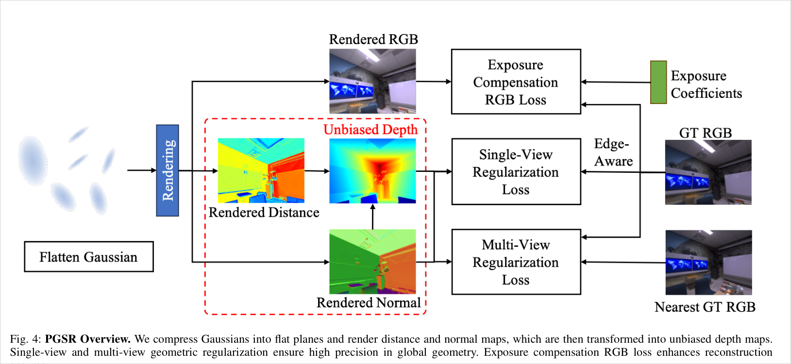
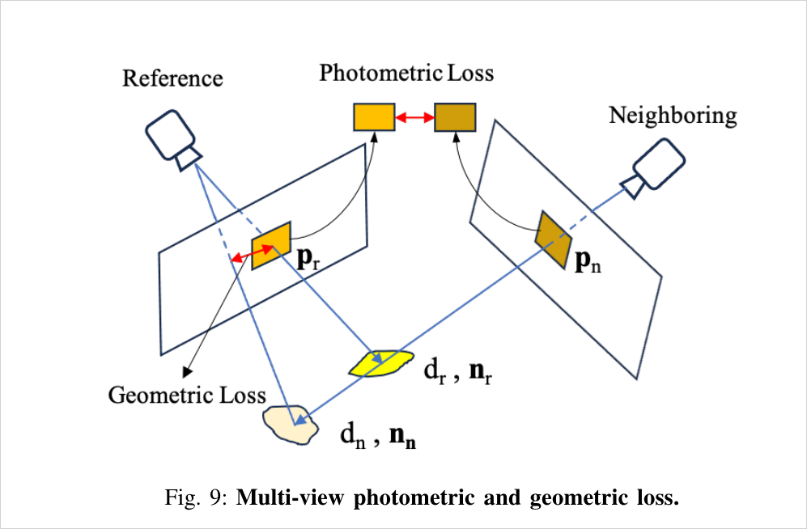
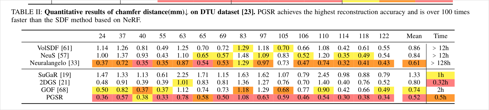
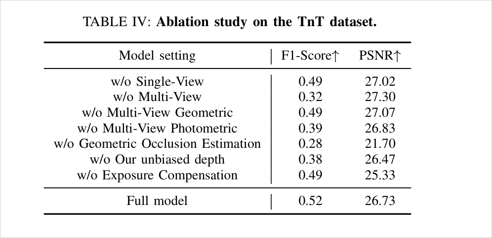
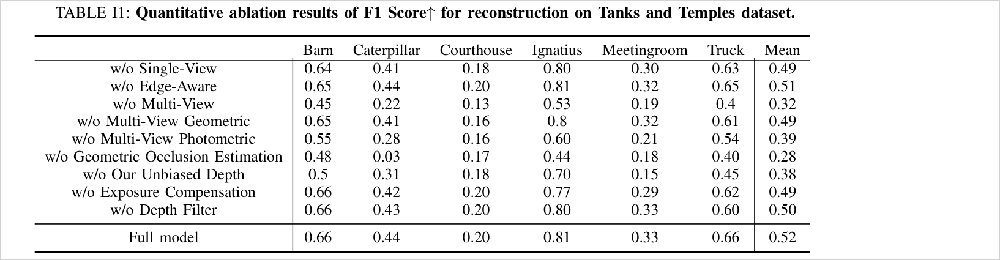
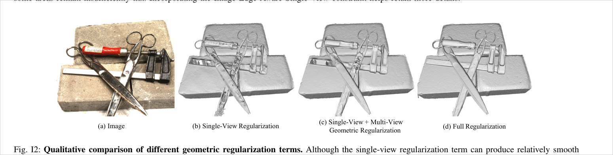

# PGSR: Planar-based Gaussian Splatting for Efficient and High-Fidelity Surface Reconstruction

> 3D Gaussian을 최소 축으로 눌러 평면으로 만들고, 거리·법선 맵을 렌더한 뒤 나눠서 **누적 가중치가 상쇄된 unbiased depth**를 얻는다. 그 평면 파라미터로 homography를 세워 single-view(로컬 평면)·multi-view(NCC 광도 + 전후방 사영 기하) 정규화를 걸고, **전후방 사영 오차로 가림을 판정해 감독에서 빼는 것**이 성능의 절반을 좌우한다 (TnT F1 0.52 → 0.28).

## 한눈에

| 항목 | 내용 |
| --- | --- |
| 문제 | 3DGS의 Gaussian이 실제 표면에 붙지 않아 mesh 품질이 나쁨. 이미지 재구성 loss만으로는 기하 정확도와 다중 뷰 일관성을 보장할 수 없음 |
| 핵심 아이디어 | Gaussian을 평면으로 압축 → 거리·법선 맵을 렌더 → **나눠서** unbiased depth → 그 평면 파라미터로 single-view·multi-view 정규화 |
| 입력 | 포즈가 주어진 다중 뷰 RGB만. **깊이·법선 prior 없음** ("without any geometric prior") |
| 출력 | 학습된 평면형 Gaussian + 뷰별 렌더 깊이 → **학습 후** TSDF Fusion → Marching Cubes mesh |
| 주요 결과 | DTU mean CD **0.52mm** (0.5h), TnT mean F1 **0.52** (0.75h), Mip-NeRF360 PSNR 27.25 / LPIPS 0.178 |
| 한 줄 novelty | **평면 파라미터를 먼저 렌더하고 나눠서 편향 없는 깊이를 얻는 것**, 그리고 그 깊이로 세운 homography의 **전후방 사영 오차를 가림 게이트로 쓰는 것** |
| 안 푸는 것 | 관측이 없거나 부족한 영역 (§VI 자인), 반사·거울면, floater 잔존. mesh는 loss에 없고 사후 추출 |



## 1. 문제와 동기 (Paper Says)

1. **비구조성 진단**: "due to the unstructured and irregular nature of Gaussian point clouds, it is difficult to guarantee geometric reconstruction accuracy and multi-view consistency simply by relying on image reconstruction loss" (Abstract). 원인을 Gaussian의 무질서함과 이미지 loss만의 국소 최적으로 지목한다 (p.2).
2. **기존 깊이 렌더의 두 결함** (p.2, p.6, Fig. 2): ① 종전 방식(`D = Σ T_i α_i z_i`)은 Gaussian의 z를 α-blend하므로 깊이가 **곡면**이 되어 평평한 Gaussian 모양과 충돌한다. ② 광선별 누적 가중치가 1보다 작을 수 있어 깊이가 **카메라 쪽으로 과소평가**된다.
3. **동시대 경쟁 지목** (p.4): 2DGS는 median/expected 깊이를 수동 선택해야 하고 median은 'disk-aliasing'을 겪으며, **다중 뷰 일관성 제약이 아예 없다**. GOF는 level set 추출이지만 고정밀 깊이를 못 낸다. SuGaR는 biased depth로 density field를 제약해 품질이 깊이 품질에 종속된다.

## 2. 핵심 방법 (Paper Says)

### 2-1. 평면화 (primitive 층)

공분산 `Σ_i = R_i S_i S_iᵀ R_iᵀ`에서 **최소 스케일 축을 직접 누르는** 방식으로 타원체를 평면으로 만든다 (Eq. 1, `L_s = ‖min(s1,s2,s3)‖₁`). 최소 축 방향이 그 Gaussian의 법선 `n_i`가 되고, 부호 모호성은 시선 방향과의 각이 90도를 넘도록 잡아 해소한다 (p.5). **λ1 = 100**으로 매우 강하게 건다.

> 2DGS처럼 표현 자체를 2D disk로 바꾸는 것이 아니라, 3D Gaussian을 유지한 채 **loss로 눌러** 평면화한다. 이 차이가 3DGS 래스터라이저 계열과의 구현 호환을 남긴다.

### 2-2. Unbiased depth (렌더 층)

법선 맵과 카메라–평면 거리 맵을 각각 α-blend한 뒤 (Eq. 2, 3), 광선–평면 교점으로 깊이를 만든다.

```
D(p) = D / (N(p) K⁻¹ p̃)        (Eq. 4)
```

거리 맵을 법선 맵으로 **나누는** 순간 두 맵에 공통으로 곱해져 있던 누적 가중치가 상쇄된다. 그래서 "unbiased" — 깊이가 추정된 평면 위에 정확히 떨어진다 (p.6). Fig. 2(b)의 통제 실험: 참 깊이로 두 렌더 방식을 똑같이 감독한 뒤 Gaussian 위치를 찍어보면 PGSR 쪽만 표면에 붙는다.

### 2-3. Single-view 정규화

**로컬 평면 가정**: 픽셀 p의 상하좌우 4점을 깊이로 3D 역투영해 외적으로 법선 `N_d(p)`를 만들고 (Eq. 5), 렌더 법선 `N(p)`와 맞춘다.

```
L_svgeom = (1/W) Σ_p (1 − ∇I)² ‖N_d(p) − N(p)‖₁     (Eq. 6)
```

`∇I`는 0~1로 정규화된 **이미지 gradient**. 기하 에지를 이미지 에지로 근사해, 에지에서는 로컬 평면 가정이 깨지므로 가중을 낮춘다.

### 2-4. Multi-view 정규화 — 가림 게이트가 사는 곳

reference 프레임의 픽셀 `p_r`을 그 픽셀의 **렌더된 평면 파라미터**(거리 `d_r`, 법선 `n_r`)로 만든 homography로 이웃 프레임에 보낸다.

```
H_rn = K_n (R_rn − T_rn n_rᵀ / d_r) K_r⁻¹          (Eq. 8)
```



**기하 일관성** (Eq. 9, 10): 전방(H_rn)·후방(H_nr) 사영을 왕복시킨 뒤의 픽셀 오차

```
φ(p_r) = ‖p_r − H_nr H_rn p_r‖
w(p_r) = 1/exp(φ)   if φ < 1
       = 0          if φ ≥ 1
L_mvgeom = (1/V) Σ w(p_r) φ(p_r)
```

**광도 일관성** (Eq. 11): 7×7 그레이스케일 패치를 homography로 warp해 NCC로 비교. 같은 `w(p_r)`이 곱해진다.

```
L_mvrgb = (1/V) Σ w(p_r) (1 − NCC(I_r(p_r), I_n(H_rn p_r)))
```

**이웃 프레임 집합**은 학습 전에 포즈만으로 만든다 (보충 §I-A, p.13): 상대 각도로 먼저 정렬하고 위치로 다시 정렬해, DTU·TnT·Mip360 공통으로 **최대 8 이웃, 최대 상대각 30도, 상대 위치 0.01~1.5**. 학습 중에는 그 집합에서 매 iteration 하나를 무작위로 뽑는다.

### 2-5. Exposure 보정과 총 loss

이미지마다 계수 `a_i, b_i`를 두어 `I_i^a = exp(a_i) I_i^r + b_i` (Eq. 13). SSIM이 0.5 미만일 때만 보정본을 L1에 쓴다 (Eq. 15). TnT에서만 사용.

```
L = L_rgb + λ1 L_s + L_geom                                (Eq. 16)
L_geom = λ2 L_svgeom + λ3 L_mvrgb + λ4 L_mvgeom            (Eq. 12)
λ1 = 100, λ = 0.2, λ2 = 0.015, λ3 = 0.15, λ4 = 0.03
```

### 2-6. Mesh 추출 경로 (학습 밖)

30k iteration 학습(densification은 **AbsGS** 전략) → 학습 뷰마다 깊이 렌더 → (TnT만) 깊이 필터 → TSDF Fusion → Marching Cubes (p.8). 깊이 필터는 깊이에서 만든 법선과 광선의 각 θ가 **80도 초과**면 노이즈로 버린다 (보충 Eq. I1, p.13). **mesh는 loss에 등장하지 않는다 — 완전한 사후 추출.**

## 3. 핵심 수식

| 식 | 역할 | 우리에게 중요한 점 |
| --- | --- | --- |
| Eq. 1 `L_s = ‖min(s)‖₁` | 평면화 강제 | λ1=100, 세 loss 중 가장 강한 계수 |
| Eq. 4 `D/(N K⁻¹p̃)` | unbiased depth | 나눗셈이 누적 가중치를 상쇄 |
| Eq. 6 `(1−∇I)² ‖N_d−N‖₁` | single-view | **이미 픽셀별 가중이 있다.** 재료가 이미지 gradient |
| Eq. 8 `H_rn = K_n(R_rn − T_rn n_rᵀ/d_r)K_r⁻¹` | homography | **평면 가정이 여기 박혀 있다** (n/d) |
| Eq. 9·10 `w(p_r)=1/exp(φ), 0 if φ≥1` | 가림 게이트 | 재료가 **자기 사영 오차**, 임계 1픽셀, gradient detach |
| Eq. 11 NCC 7×7 | multi-view 광도 | 같은 `w`를 공유 |

## 4. 실험 근거

### 4-1. 본 성적



TnT F1 (Table III, p.9): Barn 0.66 / Caterpillar 0.44 / Courthouse 0.20 / Ignatius 0.81 / Meetingroom 0.33 / Truck 0.66 → **mean 0.52**, 0.75h. Neuralangelo 0.50(>128h)을 근소하게 앞선다.

### 4-2. Ablation — 가림 추정이 절반이다



읽어야 할 두 가지가 표 안에 있다.

1. **multi-view 전체 제거(0.32)보다 가림 추정만 제거(0.28)가 더 나쁘다.** 즉 가림 처리 없는 multi-view 정규화는 안 하느니만 못하다. 논문도 그렇게 적는다 — "without incorporating potential occlusion estimation, the multi-view regularization term will have a negative effect" (p.10).
2. **렌더까지 무너진다** (PSNR −5.03dB). 다른 항들은 기하만 건드리고 PSNR을 26~27에 남긴다. 잘못된 대응을 강제로 맞추려 들면 외양 자체가 파괴된다는 뜻이다.



### 4-3. 모듈 이식성의 자체 선례

보충 Table I3 (p.14): PGSR의 multi-view 정규화를 **2DGS에 붙이면** TnT F1 0.32 → 0.41 (median depth), expected depth 판에서는 0.47. 자기 방법을 남의 base에 이식해 효과를 보인 실험을 논문 스스로 싣고 있다.

### 4-4. 정규화가 만드는 구멍 (오목 무대와 직결)



논문 서술: "the single-view regularization term ... tends to create **holes** on highly specular metallic objects" (Fig. I2 캡션).

## 5. 해석 (Interpretation)

### 5-1. 이건 "가림 추정"이 아니라 "기하 자기일관성 게이트"다

`φ(p_r)`이 재는 것은 **현재 추정된 평면 파라미터로 왕복 사영했을 때의 불일치**다. 가림이 있으면 이 값이 커지지만, 가림이 없어도 기하가 틀렸으면 똑같이 커진다. 논문 자신이 구분 불가를 인정한다 — "If these pixels are mistakenly identified as occluded due to geometric errors, it does not affect our final convergence" (p.8). 즉 **가림 판정의 정밀도를 포기하고 안전 배제로 대체**한 설계다.

우리 축과의 대조가 여기서 선명해진다.

| | PGSR | 본 연구 |
| --- | --- | --- |
| 시점 | 학습 중, 매 iteration | **학습 전, 1회** |
| 재료 | 자기가 방금 렌더한 깊이·법선 | 촬영 기하 + SfM 부산물 (포즈, track, 각) |
| 판정 대상 | 픽셀 쌍의 대응 신뢰도 | 공간 셀의 제약 조건성 |
| 실패 시 | 그 픽셀을 감독에서 **뺀다** | 그 영역에 감독·densification을 **더 준다** |
| 순환성 | 있음 (기하가 판정을, 판정이 기하를) | 없음 (외생 판별값) |

**부호가 반대**라는 점이 차별화의 핵심이다. PGSR은 못 믿을 곳을 빼서 나머지를 지키고, 우리는 못 믿을 곳을 표시해서 거기에 개입한다. 그리고 PGSR의 게이트는 순환적이다 — 기하가 틀린 곳에서 게이트가 닫히고, 게이트가 닫히면 그곳은 영영 고쳐지지 않는다. 논문은 single-view 항과 sparse Gaussian의 전파가 결국 메운다고 주장하지만 (p.8) 근거는 제시하지 않는다.

### 5-2. 평면 가정은 네 층에 박혀 있다

1. **primitive**: Eq. 1이 λ1=100으로 모든 Gaussian을 평면으로 누른다
2. **렌더**: Eq. 4의 깊이가 광선–평면 교점이다
3. **single-view**: 이웃 4픽셀 = 한 평면 (Eq. 5·6)
4. **multi-view**: homography 자체가 평면 유도 (Eq. 8의 `n_rᵀ/d_r`)

오목 무대에서 위험한 조합은 **3과 4**다.

- 3층: 완화 스위치가 **이미지 gradient**다. 텍스처 없는 매끈한 오목 접힘은 `∇I ≈ 0`이라 가중 `(1−∇I)² ≈ 1` — 완화가 안 걸리고 로컬 평면 가정이 그대로 걸려 **오목을 눌러 편다**. 반대로 텍스처가 강한 평면부는 완화가 걸린다. 기하 에지와 이미지 에지의 불일치가 그대로 실패로 이어진다.
- 4층: 오목·비평면 픽셀에서는 homography 자체가 부정확해 φ가 커진다 → `w → 0` → **그 픽셀이 두 multi-view 항 모두에서 빠진다.** 가림 게이트가 **오목 게이트로도 작동**한다는 뜻이다. Fig. I2의 "구멍"은 반사면 사례로 제시되지만 같은 기전이 오목에도 걸린다.

이건 우리 무대(hole·오목·내부)에서 PGSR이 구조적으로 불리한 이유이자, 동시에 **우리 개입의 자리**다. `w(p)`를 우리 confidence로 보정하거나, `w=0`으로 버려진 픽셀을 single-view 쪽에서 회수하는 설계가 자연스럽다.

### 5-3. 부착점 지도 (2번째 base 준비용)

우리 가중을 꽂을 수 있는 자리가 이미 **네 개** 열려 있다.

| 부착점 | 현재 재료 | 개입 형태 |
| --- | --- | --- |
| Eq. 6의 `(1−∇I)²` | 이미지 gradient | 픽셀 confidence를 곱하거나 대체 |
| Eq. 9·10·11의 `w(p_r)` | 왕복 사영 오차 | **우리 학습-전 confidence와 곱**해서 순환성 완화 |
| 이웃 프레임 집합 (보충 §I-A) | 상대각 ≤30도, 최대 8 | **각 기반 선택 자체가 우리 판별값과 같은 재료** |
| densification (AbsGS) | 화면공간 gradient 크기 | lever ④′ (conf 기반 clone 억제/촉진)의 부착점 |

두 번째 줄이 제일 깨끗하다. `w`는 이미 픽셀별 스칼라이고 gradient가 detach되어 있어, 곱셈 하나로 개입이 들어가고 미분 경로를 건드리지 않는다.

**주의할 재료 겹침**: 이웃 프레임 선정의 "상대각 30도 상한"은 PGSR이 **좁은 baseline만 골라 쓴다**는 뜻이다. 우리 최대 쌍각 판별값과 재료가 같고 방향이 반대다 — PGSR은 각이 넓은 쌍을 버려서 안전을 사고, 우리는 각이 좁은 셀을 위험으로 표시한다. 논문에 이 대비를 쓸 수 있으나 "PGSR도 각을 쓴다"는 반론의 씨앗이기도 하므로, **차이는 용도(쌍 선택 대 공간 판별)와 시점(학습 중 대 학습 전)에서 세워야 한다.**

### 5-4. 비 in-loop 생존 경로 (X7)

PGSR은 X7이 필요한 이유 그 자체다. 개입 → Gaussian → 렌더 깊이 → **깊이 필터(θ>80도 절단)** → TSDF Fusion → Marching Cubes. 중간에 씻길 수 있는 지점이 셋이다.

1. `w=0`으로 감독에서 빠진 픽셀은 개입해도 gradient가 없다 (게이트가 개입보다 먼저 닫힌다)
2. 깊이 필터가 비스듬한 면을 각도 기준으로 잘라낸다 — **오목 내부의 스치는 시선 면이 정확히 여기 걸린다**
3. TSDF voxel 해상도가 개선폭보다 크면 평균화로 사라진다

따라서 X7에서는 "F-score가 올랐다"가 아니라 **어느 단계에서 얼마가 남았는지**를 재야 한다. 렌더 깊이 단계와 mesh 단계를 따로 측정하는 설계가 필요하다.

### 5-5. 방법론 선례로서의 가치

Table I3(2DGS + PGSR multi-view 정규화)은 **"우리 모듈은 어떤 base에도 붙는다"를 어떻게 실험으로 보이는지**의 직접 선례다. base 하나에 붙여 mean만 보이면 충분하다는 전례로 인용할 수 있다. 다만 PGSR은 이식판(0.47)이 자기 원본(0.52)을 못 넘음을 함께 적는다 — 우리도 같은 정직성을 유지해야 한다.

## 6. 한계

**논문 자인 (§VI, p.10)**

1. "we cannot perform geometric reconstruction in regions with **missing or limited viewpoints**, leading to incomplete or less accurate geometry." 해법으로 prior 활용을 future work로 남긴다
2. 반사면·거울 미고려
3. floater 잔존. Scaffold-GS 같은 더 나은 baseline 통합을 제안
4. (ablation 논의, p.10) 기하 제약이 **렌더 품질을 소폭 떨어뜨린다** — full model PSNR 26.73이 w/o Multi-View 27.30보다 낮다. "incomplete image rendering model" 탓으로 추정하고 열어둔다

**추론된 한계 (모델 측 판단)**

- 가림 게이트의 **순환성**: 기하가 틀린 곳에서 닫히고, 닫히면 고쳐질 경로가 single-view 항 하나로 줄어든다. 회복 주장에 실험 근거가 없다
- 게이트 임계 **1픽셀 고정**: 해상도·씬 규모·물체 거리에 따라 의미가 달라지는데 민감도 분석이 없다
- 이웃 프레임 조건(30도·8장)이 세 데이터셋 공통 고정값이다. 유도도 민감도 분석도 없다 (COLMAP 원전의 임계값 상황과 동형)
- **Courthouse F1 0.20**은 어떤 ablation을 해도 0.13~0.20 사이다 — 이 씬에서는 방법 전체가 작동하지 않는데 논의가 없다
- mesh 품질 지표가 Chamfer/F1뿐이다. 내각 분포·sliver·위상 같은 mesh 자체 품질은 보고하지 않는다

## 7. Open Questions

1. `w=0`으로 배제된 픽셀의 **비율과 공간 분포**는? 오목·hole 부위에 몰려 있는지 실측 가능한가 (PGSR 학습 시 w 맵을 덤프하면 바로 나온다 — X 실험 후보)
2. 우리 학습-전 confidence와 PGSR의 `w`가 **어디서 일치하고 어디서 갈리는지**. 일치하면 "학습 전에 미리 알 수 있었다"의 직접 증거, 갈리면 상보성의 증거다. 어느 쪽이든 그림 하나가 나온다
3. 깊이 필터 θ>80도가 오목 내부를 얼마나 잘라내는가. 필터를 끄면 F1이 어떻게 변하는가 (Table I1의 w/o Depth Filter는 0.50 대 0.52로 소폭이지만 씬 평균이라 부위별로는 다를 수 있다)
4. 이웃 프레임 상대각 30도 상한을 넓히면 무슨 일이 나는가. PGSR의 성능이 좁은 baseline 선택에 얼마나 의존하는가
5. Caterpillar가 0.03으로 붕괴한 이유는? 이 씬의 무엇이 가림 게이트를 필수로 만드는가

## Evidence Anchors

- p.2: Abstract 비구조성 진단, Fig. 2 편향 깊이 통제 실험
- p.4: Fig. 4 파이프라인 전경, 2DGS·GOF 대비 서술
- p.5: Eq. 1 평면화 loss, Eq. 2 법선 α-blend
- p.6: Eq. 3 거리 맵, Eq. 4 unbiased depth, §IV-B-1 로컬 평면 가정, Eq. 5·6 edge-aware single-view
- p.7: Eq. 7·8 homography, Eq. 9·10 **가림 가중 w(p_r)**
- p.8: Fig. 9 multi-view loss 도해, Eq. 11 NCC, Eq. 12 L_geom, Eq. 16 총 loss, 하이퍼파라미터, TSDF 추출 경로, AbsGS densification
- p.9: Table I Mip360, **Table II DTU CD 0.52**, Table III TnT F1 0.52, **Table IV ablation 0.52→0.28 / PSNR 26.73→21.70**
- p.10: §V-C ablation 논의("negative effect"), **§VI 한계 — "missing or limited viewpoints"**
- p.13: 보충 §I-A **이웃 프레임 그래프 (8장·30도·0.01~1.5)**, §I-B 깊이 필터 θ>80도
- p.14: **Table I1 씬별 ablation (Caterpillar 0.03)**, Table I2 PSNR, Table I3 **2DGS + multi-view 이식 (0.32→0.41/0.47)**, Fig. I2 정규화별 구멍

## Related WIKI Pages

- [[unbiased-plane-distance-depth-rendering]]
- [[reprojection-error-gated-occlusion-weighting]]
- [[homography-patch-ncc-multiview-consistency]]
- [[image-edge-aware-local-plane-assumption]]
- [[photometric-primary-geometry-underconstraint]]
- [[rendered-depth-normal-supervision]]
- [[confidence-steered-densification]]
- [[gs-failure-mode-taxonomy]]
- [[milo]]
- [[ambisur-photometric-ambiguity]]
- [[come-confidence-based-mesh-extraction]]
