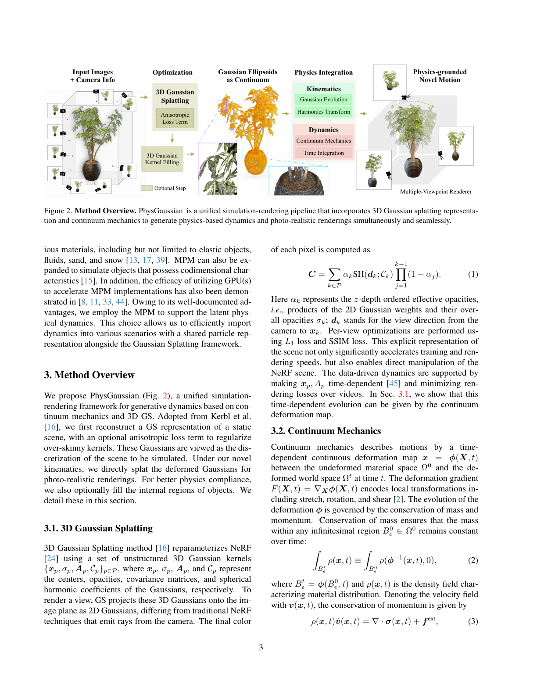
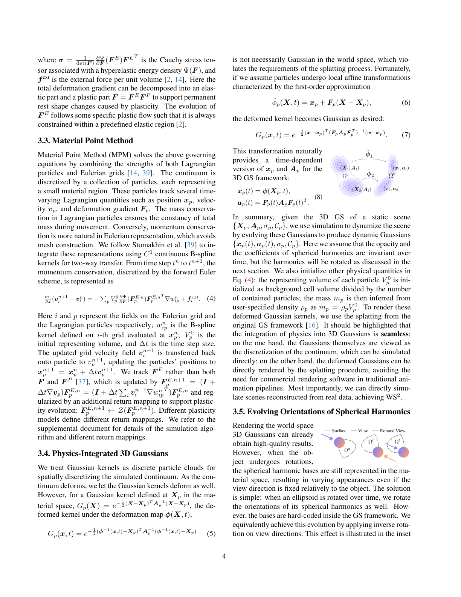
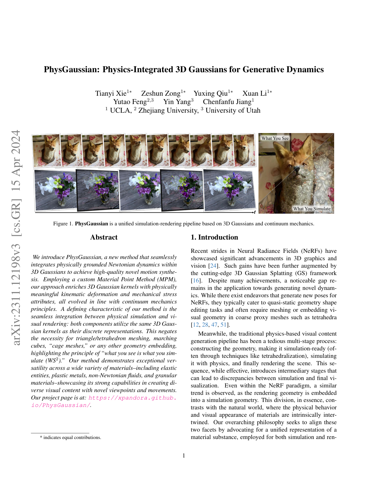
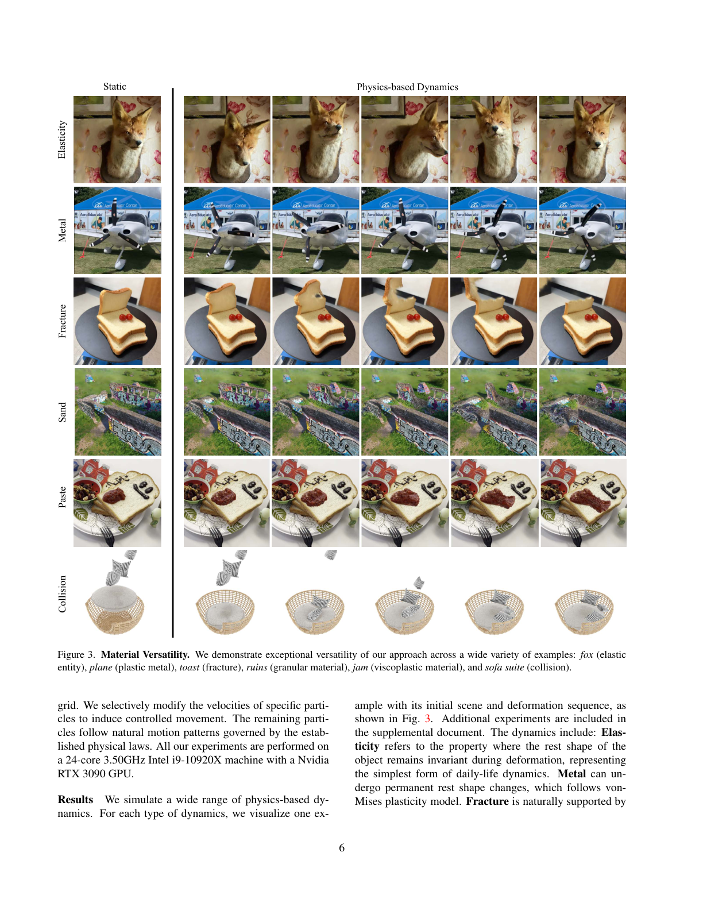
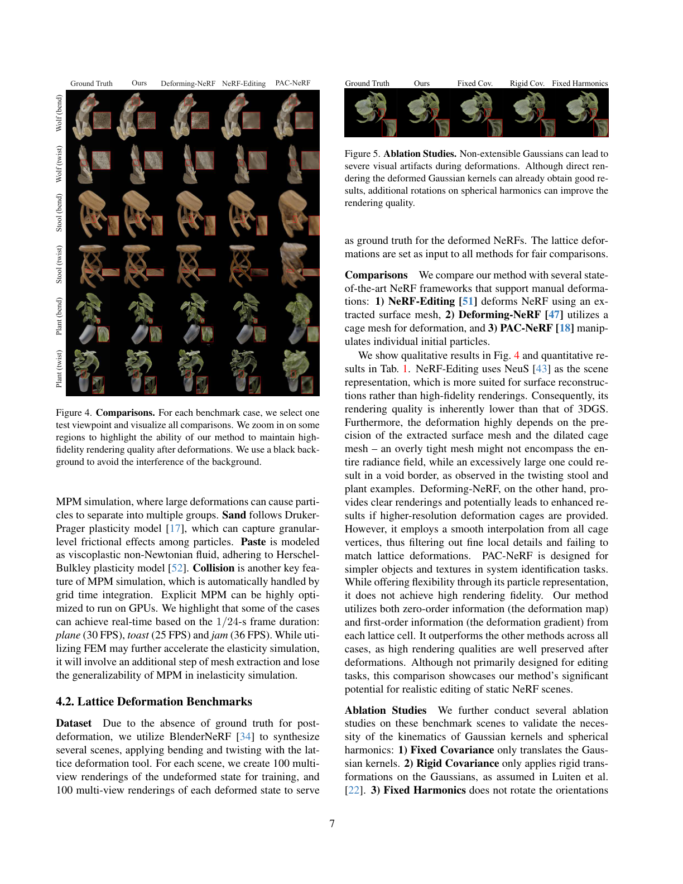
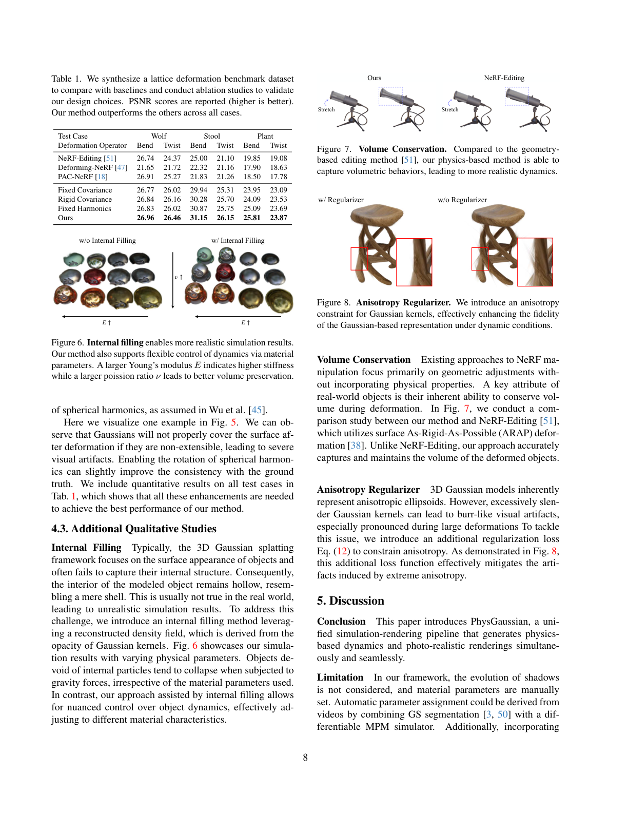

# PhysGaussian: Physics-Integrated 3D Gaussians for Generative Dynamics

## Paper
- 저자: Tianyi Xie, Zeshun Zong, Yuxing Qiu, Xuan Li, Yutao Feng, Yin Yang, Chenfanfu Jiang
- 버전: arXiv:2311.12198v3, 2024-04-15
- 주제: 3D Gaussian Splatting 표현을 물리 시뮬레이션 particle로 직접 사용해 novel motion을 생성하는 unified simulation-rendering pipeline
- PDF: `C:\Users\jinsw712\Desktop\Files\Research_WIKI\raw\papers\Physics-Integrated 3D Gaussians for Generative Dynamics.pdf`

## Main Claim
PhysGaussian의 중심 주장은 정적 3D Gaussian Splatting(3DGS) 장면의 Gaussian kernel을 단순 렌더링 primitive가 아니라 continuum mechanics의 discrete material particle로도 사용하면, mesh extraction, tetrahedralization, cage mesh, geometry embedding 없이 physics-based novel motion과 photorealistic novel-view rendering을 같은 representation 위에서 동시에 수행할 수 있다는 것이다. 핵심 기여는 3D Gaussian의 center, covariance ellipsoid, spherical harmonics orientation을 deformation map과 deformation gradient로 시간 진화시키는 kinematics이며, 논문은 이를 “what you see is what you simulate (WS2)” 원리로 설명한다.

## Paper Says: Motivation and Previous Work
### 문제 배경
NeRF와 3DGS는 정적 장면 재구성과 novel-view rendering에서는 강하지만, 새로운 물리 기반 동작을 생성하려면 보통 별도의 simulation-ready geometry가 필요하다. 기존 physics-based visual content pipeline은 geometry construction, tetrahedralization 같은 simulation preparation, physics simulation, rendering을 순차적으로 거치므로 simulation representation과 rendering representation 사이에 mismatch가 생긴다. NeRF editing 계열도 rendering geometry를 coarse tetrahedral mesh나 cage mesh 등에 embedding하는 경향이 있어, 실제 시각적 물질과 물리적 물질이 동일하다는 관점과 어긋난다. (p.1)

### 기존 dynamic/physics NeRF-GS와의 차이
Dynamic NeRF/GS 계열은 temporal neural field, inverse displacement, learned deformation, video rendering loss 등을 통해 관측된 동작을 재구성하는 쪽에 가깝다. PhysGaussian은 정적 image+camera로 학습한 3DGS scene에 사용자가 지정한 material parameter와 MPM dynamics를 부여해 새로운 동작을 생성한다. 특히 기존 dynamic GS가 Gaussian shape을 유지하거나 data-driven하게 바꾸는 반면, PhysGaussian은 displacement map의 first-order information인 deformation gradient를 사용해 Gaussian covariance 자체를 물리적으로 변형한다. (p.2)

### 기여 요약
- Continuum mechanics 기반 3D Gaussian kinematics: PDE-driven displacement field 속에서 Gaussian kernel과 spherical harmonics를 진화시킨다.
- Unified simulation-rendering pipeline: 같은 Gaussian kernel을 simulation particle과 rendering primitive로 공유한다.
- Material versatility: elastic object, metal, fracture, granular material, viscoplastic paste, collision 등 여러 material behavior를 MPM으로 보인다. (p.2, p.6-7)

## Paper Says: Method
### 전체 pipeline


Fig. 2의 pipeline은 다음 순서다. 입력은 multi-view images와 camera information이다. 먼저 3DGS optimization으로 정적 Gaussian set `{X_p, A_p, sigma_p, C_p}`를 재구성한다. 선택적으로 anisotropic loss term으로 지나치게 가느다란 Gaussian을 억제하고, 선택적으로 Gaussian kernel filling으로 내부 particle을 보강한다. 이후 Gaussian ellipsoid를 continuum particle로 보고 MPM time integration을 수행하며, 변형된 Gaussian을 다시 multiple-viewpoint renderer로 splatting한다. (p.3)

### 3DGS representation
3DGS는 scene을 unstructured Gaussian kernel 집합 `{x_p, sigma_p, A_p, C_p}`로 표현한다. 여기서 `x_p`는 center, `sigma_p`는 opacity, `A_p`는 covariance matrix, `C_p`는 spherical harmonic coefficient다. Rendering은 3D Gaussian을 image plane의 2D Gaussian으로 project하고, z-depth order에 따른 alpha compositing으로 pixel color를 만든다. PhysGaussian은 이 explicit representation이 direct manipulation에 유리하다는 점을 물리 시뮬레이션과 연결한다. (p.3)

### Continuum mechanics + MPM
논문은 material space `Omega_0`와 deformed world space `Omega_t` 사이의 deformation map `x = phi(X,t)`를 사용한다. Deformation gradient `F(X,t) = nabla_X phi(X,t)`는 local stretch, rotation, shear를 담는다. Momentum conservation은 stress divergence와 external force로 기술되고, MPM은 Lagrangian particles와 Eulerian grid를 오가며 이 운동방정식을 푼다. Particle은 position, velocity, deformation gradient를 추적하고, grid는 momentum update를 안정적으로 처리한다. (p.3-4)

### Physics-integrated Gaussian kinematics


Gaussian kernel을 material space에서 `G_p(X)`로 두고 전체 nonlinear deformation map을 그대로 적용하면 world space에서 더 이상 정확한 Gaussian 형태가 아닐 수 있다. Splatting은 Gaussian primitive를 요구하므로 문제가 된다. 저자들은 particle 주변에서 local affine approximation `x_p + F_p(X-X_p)`을 사용하면 deformed kernel이 다시 Gaussian이 되며, covariance가 `F_p A_p F_p^T`로 변환된다고 보인다. 따라서 정적 3DGS의 `{X_p, A_p, sigma_p, C_p}`는 시간에 따라 `{x_p(t), a_p(t), sigma_p, C_p}`가 되고, `x_p(t)=phi(X_p,t)`, `a_p(t)=F_p(t) A_p F_p(t)^T`로 갱신된다. (p.4)

### Spherical harmonics orientation
Object가 회전할 때 world-space Gaussian만 변형하고 spherical harmonic basis를 material space에 고정하면, object 기준 view direction이 같아도 appearance가 일관되지 않을 수 있다. PhysGaussian은 deformation gradient의 polar decomposition `F_p = R_p S_p`에서 local rotation `R_p`를 얻고, view direction에 inverse rotation을 적용하는 식으로 SH orientation을 같이 회전시킨다. 기존 4DGS류가 고려하지 않은 orientation update를 deformation gradient에서 자연스럽게 얻는 점이 중요하다. (p.4-5)

### Incremental Gaussian evolution
Total deformation gradient `F_p`에 의존하지 않는 updated Lagrangian-friendly 대안도 제시한다. Covariance rate form `dot a = (nabla v)a + a(nabla v)^T`를 discretize해 `a_p^{n+1}`을 update한다. 이 방식은 `F`를 strain measure로 쓰지 않는 material model에도 연결될 수 있다. SH rotation도 `(I + Delta t nabla v_p)R_p^n`의 polar decomposition으로 incrementally update한다. (p.5)

### Internal filling
3DGS reconstruction은 대체로 surface appearance에 집중해 object 내부가 hollow shell처럼 남는다. Volumetric object를 시뮬레이션할 때 내부 particle이 없으면 gravity 등에서 부자연스럽게 collapse할 수 있다. PhysGaussian은 Gaussian opacity field `d(x)`를 3D grid로 discretize하고, threshold crossing과 ray intersection test로 내부 candidate cell을 찾아 particle을 추가한다. 추가 particle은 가까운 Gaussian에서 opacity와 SH coefficient를 상속하고, covariance는 particle volume 기반 isotropic radius로 초기화한다. (p.5, p.8)

### Anisotropy regularizer
3DGS의 anisotropic ellipsoid는 표현 효율을 높이지만, 지나치게 가느다란 kernel은 큰 deformation에서 surface 밖으로 튀어나와 burr/plush artifact를 만들 수 있다. 논문은 Gaussian scaling `S_p`의 장축/단축 비율이 threshold `r`을 넘는 경우 penalize하는 `L_aniso`를 reconstruction training loss에 optional하게 추가한다. (p.5, p.8)

## Visual Evidence
### Fig. 1: WS2 principle


Fig. 1은 “What You Simulate”와 “What You See”가 같은 Gaussian 기반 pipeline 위에 놓인다는 논문 철학을 한 장으로 보여준다. 이 그림은 PhysGaussian이 simulation mesh를 따로 만들지 않고, 3D Gaussian kernel을 simulation과 rendering의 공통 primitive로 삼는다는 주장을 시각적으로 고정한다. (p.1)

### Fig. 2: method overview
Fig. 2는 정적 reconstruction, optional anisotropic regularization, optional internal filling, physics integration, Gaussian evolution, harmonics transform, renderer가 하나의 pipeline으로 이어짐을 보여준다. 특히 “Gaussian Ellipsoids as Continuum” 박스가 이 논문의 핵심 representation shift다. (p.3)

### Fig. 3: material versatility


Fig. 3은 fox(elasticity), plane(metal plasticity), toast(fracture), ruins(sand/granular), jam(viscoplastic paste), sofa suite(collision)를 보여준다. 논문의 claim은 단일 learned deformation field가 아니라 MPM constitutive model을 바꿔 여러 material behavior를 생성할 수 있다는 것이다. Plane 30 FPS, toast 25 FPS, jam 36 FPS처럼 단순 dynamics 일부는 1/24초 frame 기준 real-time에 도달한다고 보고한다. (p.6-7)

### Fig. 4 and Table 1: lattice deformation benchmark




Fig. 4와 Table 1은 BlenderNeRF로 만든 Wolf/Stool/Plant bend/twist benchmark에서 NeRF-Editing, Deforming-NeRF, PAC-NeRF와 비교한다. PhysGaussian은 모든 PSNR case에서 가장 높은 값을 보고한다. 예를 들어 Stool bend는 `31.15`, Plant bend는 `25.81`, Wolf twist는 `26.46`으로, zero-order deformation map과 first-order deformation gradient를 모두 사용하는 설계가 high-fidelity rendering preservation에 기여한다고 해석한다. (p.7-8)

### Fig. 5: ablation
Fig. 5와 Table 1의 ablation은 Fixed Covariance, Rigid Covariance, Fixed Harmonics를 비교한다. Fixed Covariance는 Gaussian을 translation만 하므로 deformation 후 surface coverage가 무너질 수 있다. Rigid Covariance는 rigid transform만 반영해 stretch/shear를 놓친다. Fixed Harmonics는 SH orientation을 회전시키지 않아 appearance consistency가 떨어진다. Full method가 가장 높지만, 일부 case에서는 차이가 작아 qualitative artifact 해석도 함께 봐야 한다. (p.7-8)

### Fig. 6-8: internal filling, volume conservation, anisotropy
Fig. 6은 internal filling이 없는 hollow object가 gravity 아래 무너지는 반면, filling이 있으면 Young's modulus `E`와 Poisson ratio `nu` 변화에 따라 stiffness와 volume preservation을 제어할 수 있음을 보인다. Fig. 7은 NeRF-Editing의 surface ARAP deformation보다 PhysGaussian이 volume behavior를 잘 보존한다고 주장한다. Fig. 8은 anisotropy regularizer가 large deformation에서 burr-like artifact를 줄인다는 qualitative evidence다. (p.8)

## Key Equations
### Eq. 1: 3DGS alpha compositing
```text
C = sum_{k in P} alpha_k SH(d_k; C_k) prod_{j=1}^{k-1}(1-alpha_j)
```
`alpha_k`는 depth-ordered effective opacity이고, `SH(d_k; C_k)`는 view direction `d_k`와 SH coefficient로 계산한 색이다. PhysGaussian은 이 rendering equation 자체를 바꾸기보다, 시간에 따라 변형된 Gaussian state를 이 splatting 절차에 넣는다. (p.3)

### Eq. 2-3: continuum conservation laws
Eq. 2는 mass conservation, Eq. 3은 momentum conservation을 적는다. 중요한 점은 Gaussian이 단지 visual point가 아니라 density, velocity, stress, external force의 continuum mechanics 안에 들어가는 material discretization으로 재해석된다는 것이다. (p.3)

### Eq. 4 and Eq. 13-15: MPM update
Eq. 4는 forward Euler로 discretized momentum equation을 보여준다. Appendix Eq. 13-15는 particle-to-grid mass/momentum transfer, grid velocity update, grid-to-particle transfer와 particle state update를 요약한다. PhysGaussian은 APIC-style transfer와 return mapping을 포함한 MPM을 사용해 elasticity/plasticity/fracture/granular/paste behavior를 처리한다. (p.4, p.11)

### Eq. 5-8: Gaussian deformation under local affine map
```text
x_p(t) = phi(X_p,t)
a_p(t) = F_p(t) A_p F_p(t)^T
```
이 수식들이 논문의 핵심이다. Nonlinear deformation map을 Gaussian kernel 전체에 적용하면 Gaussianity가 깨질 수 있지만, `X_p` 주변 local affine approximation을 쓰면 deformed kernel이 다시 covariance `F_p A_p F_p^T`를 가진 Gaussian으로 유지된다. 이 때문에 MPM의 deformation gradient가 3DGS covariance update와 직접 연결된다. (p.4)

### Eq. 9: SH basis rotation
```text
f^t(d) = f^0(R^T d)
```
Polar decomposition `F_p = R_p S_p`에서 얻은 local rotation을 view direction에 inverse로 적용한다. 이 방식은 hard-coded SH basis 자체를 바꾸지 않고도 object rotation에 맞춘 appearance consistency를 얻으려는 구현적 선택이다. (p.5)

### Eq. 10: incremental covariance update
```text
a_p^{n+1} = a_p^n + Delta t (nabla v_p a_p^n + a_p^n nabla v_p^T)
```
Total deformation gradient가 없어도 velocity gradient만으로 covariance를 incrementally update하는 rate-form kinematics다. Updated Lagrangian framework나 `F`를 직접 strain measure로 쓰지 않는 material model에 더 잘 맞을 수 있다. (p.5)

### Eq. 11: opacity field for internal filling
```text
d(x) = sum_p sigma_p exp(-1/2 (x-x_p)^T A_p^{-1}(x-x_p))
```
이 continuous opacity field를 grid에 샘플링하고 threshold crossing 기반 ray intersection으로 내부 grid를 찾는다. Visual opacity를 volume occupancy 추정에 재사용한다는 점이 흥미롭지만, open surface나 noisy opacity에서는 failure 가능성이 있다. (p.5)

### Eq. 12: anisotropy regularizer
```text
L_aniso = 1/|P| sum_{p in P} max{max(S_p)/min(S_p), r} - r
```
논문의 설명에 따르면 Gaussian scaling의 major/minor axis ratio가 threshold `r`을 넘지 않도록 제한한다. PDF의 식 표기는 `max{ratio, r} - r`처럼 읽히는데, 설명상 의도는 threshold 초과분을 penalize하는 regularizer다. 구현에서는 `max(ratio - r, 0)`류인지 확인이 필요하다. (p.5)

## Implementation
- Static reconstruction: input images와 camera info로 3DGS를 학습하고, COLMAP으로 initial point cloud와 camera parameter를 얻는다. Real-world toast/jam dataset은 iPhone으로 각 scene 150 photos를 수집했다고 한다. (p.5)
- Simulation setup: simulation region을 수동 선택하고 edge length 2 cube로 normalize한다. Cuboid domain은 dense 3D grid로 discretize한다. (p.5-6)
- Dynamics control: 특정 particle velocity를 selectively modify해 controlled movement를 유도하고, 나머지는 physical laws에 따라 자연스럽게 움직인다. (p.6)
- Hardware: 24-core 3.50GHz Intel i9-10920X, Nvidia RTX 3090 GPU. (p.6)
- Constitutive models: fixed corotated elasticity, Neo-Hookean, von Mises plasticity, Drucker-Prager plasticity, Herschel-Bulkley plasticity 등을 scene별로 사용한다. Table 2는 fox/ficus/vasedeck 등 elastic scene은 fixed corotated, plane/can은 von Mises, ruins/wolf는 Drucker-Prager, jam/cake는 Herschel-Bulkley를 사용한다고 적는다. (p.12)
- Material parameters: Young's modulus `E`, Poisson ratio `nu`, shear modulus `mu`, Lame modulus `lambda`, bulk modulus `kappa`를 정리한다. `E`가 클수록 stiffness가 커지고, `nu`가 클수록 volume preservation이 좋아진다고 설명한다. (p.8, p.12)

## Experiments
### Generative dynamics demonstration
실험은 synthetic sofa suite, Instant-NGP fox, Nerfstudio plane, DroneDeploy ruins, iPhone-captured toast/jam 등 여러 source를 사용한다. Fig. 3은 elasticity, metal plasticity, fracture, sand/granular, viscoplastic paste, collision을 한 pipeline에서 생성할 수 있음을 qualitative하게 보인다. 이는 논문의 “versatile materials” claim을 지지하지만, ground-truth dynamics 비교는 제한적이다. (p.5-7)

### Lattice deformation benchmark
Ground truth post-deformation이 부족하기 때문에 BlenderNeRF로 synthetic scenes를 만들고 lattice deformation tool로 bend/twist를 적용한다. Undeformed state는 scene별 100 multi-view renderings로 training하고, deformed state도 100 multi-view renderings를 ground truth로 사용한다. Baseline은 NeRF-Editing, Deforming-NeRF, PAC-NeRF다. Table 1에서 PhysGaussian은 Wolf/Stool/Plant의 bend/twist 6개 case 모두 PSNR 최고값을 보고한다. (p.7-8)

| Case | NeRF-Editing | Deforming-NeRF | PAC-NeRF | Ours |
| --- | ---: | ---: | ---: | ---: |
| Wolf bend | 26.74 | 21.65 | 26.91 | 26.96 |
| Wolf twist | 24.37 | 21.72 | 25.27 | 26.46 |
| Stool bend | 25.00 | 22.32 | 21.83 | 31.15 |
| Stool twist | 21.10 | 21.16 | 21.26 | 26.15 |
| Plant bend | 19.85 | 17.90 | 18.50 | 25.81 |
| Plant twist | 19.08 | 18.63 | 17.78 | 23.87 |

### Ablation
Ablation은 three weakened variants를 비교한다. Fixed Covariance는 center만 이동, Rigid Covariance는 rigid transform만 적용, Fixed Harmonics는 SH orientation을 고정한다. Full method가 모든 case에서 best지만, Wolf bend처럼 margin이 매우 작은 case도 있다. 그럼에도 Fig. 5의 qualitative artifact는 non-extensible Gaussian이 surface를 제대로 덮지 못한다는 설계상의 이유를 뒷받침한다. (p.7-8)

### Additional qualitative studies
Internal filling은 hollow shell issue를 완화하고 material parameter control을 가능하게 한다. Volume conservation 비교에서는 NeRF-Editing의 surface ARAP deformation보다 PhysGaussian이 volumetric behavior를 더 잘 유지한다고 주장한다. Anisotropy regularizer는 extreme Gaussian anisotropy로 인한 burr-like artifact를 줄이는 데 쓰인다. (p.8)

## Interpretation
### What is genuinely new
PhysGaussian의 새로움은 “3DGS를 물리적으로 움직인다” 자체보다, rendering primitive와 simulation particle을 같은 Gaussian kernel로 통일하고 deformation gradient를 covariance/SH update에 밀어 넣은 데 있다. 즉 center trajectory만 바꾸는 dynamic point/Gaussian 방식과 달리, local affine deformation의 first-order structure가 visual ellipsoid shape와 view-dependent appearance에 반영된다.

### Research reuse perspective
이 논문은 explicit neural representation을 downstream physical state로 재해석하는 좋은 예다. 연구 아이디어로는 “렌더링 표현이 곧 시뮬레이션 상태인가?”라는 질문을 3DGS 외의 surfel, point cloud, neural particles, voxel primitive에도 적용할 수 있다. 특히 differentiable simulation, inverse material parameter estimation, generative scene editing과 잘 연결된다.

### Model-side inference
논문은 material parameters를 수동 지정한다. 따라서 현재 형태는 video에서 실제 물성을 추정하는 system identification이라기보다, static captured appearance에 사용자가 물리 law와 parameter를 입혀 plausible novel dynamics를 생성하는 방법에 가깝다. 이 점은 창작/편집에는 장점이지만, 실제 물리 정확성 평가에서는 별도 검증이 필요하다.

## Limitations
- 논문이 직접 언급한 limitation: shadow evolution을 고려하지 않고, material parameters가 manually set된다. Automatic parameter assignment는 GS segmentation과 differentiable MPM을 결합해 video에서 유도할 수 있다고 제안한다. (p.8-9)
- Liquid 등 더 다양한 material handling과 더 직관적인 user control은 future work로 남긴다. (p.9)
- Static multi-view reconstruction으로 얻은 Gaussian 분포가 실제 mass distribution을 얼마나 잘 근사하는지는 명확하지 않다. Surface-biased Gaussian은 internal filling으로 보정하지만, 내부 구조/밀도/질량이 실제와 일치한다는 보장은 없다. (p.5, p.8)
- Internal filling은 opacity threshold, ray intersection, nearest Gaussian inheritance에 의존하므로 thin/open/noisy geometry에서 실패할 수 있다. 논문도 generative model 기반 internal filling을 대안으로 언급한다. (p.5)
- Table 1 benchmark는 synthetic lattice deformation 중심이라 실제 physics ground truth와의 정량 비교라기보다는 deformation/rendering fidelity 비교에 가깝다. (p.7-8)
- Eq. 12의 regularizer 표기와 설명 사이에 구현 확인이 필요한 부분이 있다. 설명상 threshold 초과를 penalize하지만 수식의 `max{ratio, r} - r`는 ratio가 작아도 0이 되고 ratio가 크면 초과분이 되는 형태로 해석된다.

## Open Questions
- Static 3DGS Gaussian의 opacity/covariance를 mass, density, volume으로 매핑하는 더 원칙적인 방법은 무엇인가?
- Internal filling을 generative prior나 learned occupancy/density estimator로 대체하면 hollow-shell artifact와 exposed-inner-texture 문제를 줄일 수 있는가?
- Material parameter를 video observation에서 differentiable MPM으로 추정할 때, rendering loss만으로 elasticity/plasticity/friction parameter가 identifiability를 갖는가?
- Dynamic 3DGS처럼 observed motion을 학습하는 방법과 PhysGaussian처럼 physics law를 주입하는 방법을 결합하면, 관측 기반 fidelity와 생성 가능한 counterfactual dynamics를 동시에 얻을 수 있는가?
- Deformation gradient가 covariance와 SH orientation을 갱신하는 아이디어를 anisotropic surfel, oriented point, neural particle representation에도 적용할 수 있는가?

## Evidence Anchors
- p.1: Abstract, WS2 principle, 기존 simulation-rendering mismatch 문제 제기
- p.2: contributions, dynamic NeRF/GS와 차이, MPM 선택 이유
- p.3: Fig. 2 method overview, 3DGS Eq. 1, continuum mechanics Eq. 2-3
- p.4: MPM Eq. 4, Gaussian deformation Eq. 5-8, WS2 구현 논리
- p.5: SH rotation Eq. 9, incremental covariance Eq. 10, internal filling Eq. 11, anisotropy regularizer Eq. 12, dataset/setup 시작
- p.6: Fig. 3 material versatility, hardware, FPS examples
- p.7: Fig. 4 comparison, Fig. 5 ablation, benchmark construction and baseline discussion
- p.8: Table 1 PSNR, Fig. 6-8 internal filling/volume conservation/anisotropy, stated limitations 시작
- p.9: stated limitations and future work
- p.11: Appendix MPM algorithm Eq. 13-15
- p.12: Table 2 constitutive model settings, Table 3 material parameters, elasticity/plasticity equations

## Related WIKI Pages
- [What You See Is What You Simulate](../concepts/what-you-see-is-what-you-simulate.md)
- [Deformation-Gradient Gaussian Kinematics](../concepts/deformation-gradient-gaussian-kinematics.md)
- [Opacity-Field Internal Filling](../concepts/opacity-field-internal-filling.md)
- [Anisotropy-Regularized Gaussian Reconstruction](../concepts/anisotropy-regularized-gaussian-reconstruction.md)
