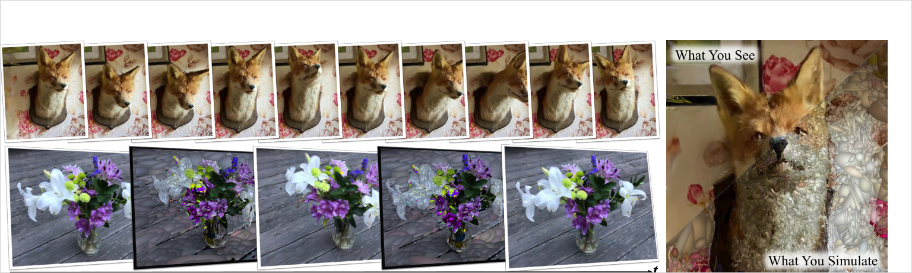
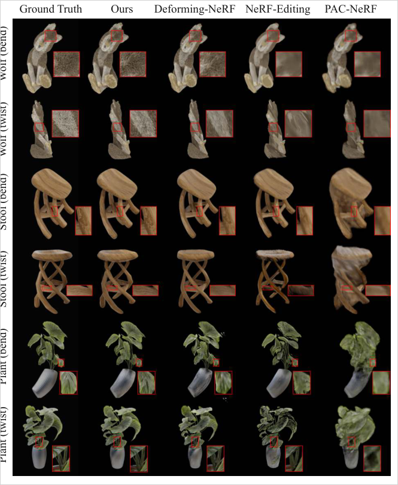

# PhysGaussian: Physics-Integrated 3D Gaussians for Generative Dynamics

> 정적 3DGS scene의 Gaussian kernel을 렌더링 primitive이자 continuum mechanics의 material particle로 동시에 사용해, mesh/tetrahedralization/cage 없이 MPM 시뮬레이션과 photorealistic rendering을 같은 표현 위에서 수행한다. 핵심은 MPM deformation gradient `F_p`로 Gaussian center·covariance·SH orientation을 함께 진화시키는 kinematics — "what you see is what you simulate (WS2)". lattice deformation benchmark에서 NeRF-Editing/Deforming-NeRF/PAC-NeRF 대비 모든 case PSNR 최고.

## 한눈에

| 항목 | 내용 |
| --- | --- |
| 문제 | NeRF/3DGS는 정적 재구성엔 강하지만, 물리 기반 novel motion에는 별도 simulation-ready geometry(tetrahedralization, cage mesh, embedding)가 필요해 simulation 표현과 rendering 표현이 어긋남 |
| 핵심 아이디어 | Gaussian ellipsoid를 continuum의 discrete material particle로 재해석. MPM으로 시간 적분하되, particle 주변 local affine approximation `x_p + F_p(X-X_p)`으로 deformed kernel의 Gaussianity를 유지 → covariance를 `F_p A_p F_p^T`로, SH orientation을 `F_p`의 rotation part로 함께 변형 |
| 입력 | multi-view images + camera info (COLMAP), 사용자 지정 material parameter/constitutive model, dynamics 조건 |
| 출력 | 같은 Gaussian set 위의 physics-grounded novel motion + 임의 viewpoint photorealistic rendering |
| 주요 결과 | lattice bend/twist benchmark 6개 case 전부 PSNR 최고(Stool bend 31.15, Plant bend 25.81, Wolf twist 26.46). elastic/metal/fracture/sand/paste/collision을 한 pipeline에서 생성. 단순 dynamics 일부 real-time(plane 30 / toast 25 / jam 36 FPS) |
| 한 줄 novelty | "3DGS를 물리적으로 움직인다"가 아니라, **rendering primitive와 simulation particle을 같은 Gaussian kernel로 통일하고 MPM deformation gradient를 covariance/SH update에 직접 밀어 넣은 것** |
| 안 푸는 것 | material parameter는 manual 지정(video로부터 system identification 아님), shadow evolution 미고려, liquid 등 일부 material·직관적 user control은 future work |

- 저자: Tianyi Xie, Zeshun Zong, Yuxing Qiu, Xuan Li, Yutao Feng, Yin Yang, Chenfanfu Jiang
- 버전: arXiv:2311.12198v3 (2024-04-15), UCLA / Zhejiang Univ. / Univ. of Utah
- PDF: `C:\Users\jinsw712\Desktop\Files\Research_WIKI\raw\papers\Physics-Integrated 3D Gaussians for Generative Dynamics.pdf`



## 1. 문제와 동기 (Paper Says)

NeRF·3DGS는 정적 장면 재구성과 novel-view rendering에 강하지만, 새로운 물리 기반 동작을 생성하려면 보통 별도의 simulation-ready geometry가 필요하다. 전통적 physics-based visual content pipeline은 geometry construction → tetrahedralization 등 simulation preparation → physics simulation → rendering을 순차적으로 거치므로, simulation 표현과 rendering 표현 사이에 mismatch가 생긴다. NeRF editing 계열도 rendering geometry를 coarse tetrahedral mesh나 cage mesh에 embedding하는 경향이 있어, "실제로 보이는 물질 = 시뮬레이션되는 물질"이라는 관점과 어긋난다. (p.1)

**기존 dynamic/physics NeRF-GS와의 차이.** Dynamic NeRF/GS 계열은 temporal neural field, inverse displacement, learned deformation, video rendering loss로 *관측된* 동작을 재구성하는 쪽이다. PhysGaussian은 정적 image+camera로 학습한 3DGS scene에 사용자가 지정한 material parameter와 MPM dynamics를 부여해 *새로운* 동작을 생성한다. 특히 기존 dynamic GS가 Gaussian shape을 유지하거나 data-driven하게 바꾸는 반면, PhysGaussian은 displacement map의 first-order 정보인 deformation gradient로 Gaussian covariance 자체를 물리적으로 변형한다. (p.2)

**왜 MPM인가.** MPM은 large deformation, fracture, granular/viscoplastic material, collision을 자연스럽게 다루고 codimensional/GPU 가속에도 잘 확장된다. 논문은 이런 versatility 때문에 latent physics import 도구로 MPM을 택했다고 밝힌다. (p.2)

**기여 요약.**
- Continuum mechanics 기반 3D Gaussian kinematics: PDE-driven displacement field 안에서 Gaussian kernel과 SH를 함께 진화.
- Unified simulation-rendering pipeline: 같은 Gaussian kernel을 simulation particle과 rendering primitive로 공유.
- Material versatility: elastic, metal plasticity, fracture, granular, viscoplastic paste, collision을 MPM constitutive model 교체만으로 생성. (p.2, p.6-7)

## 2. 핵심 방법 (Paper Says)

### 2.1 전체 pipeline (MPM-on-Gaussians)


파이프라인 순서: (1) 3DGS optimization으로 정적 Gaussian set `{X_p, A_p, sigma_p, C_p}` 재구성. (2) optional anisotropic loss로 지나치게 가느다란 kernel 억제. (3) optional Gaussian kernel filling으로 내부 particle 보강. (4) Gaussian ellipsoid를 continuum particle로 보고 MPM time integration. (5) 변형된 Gaussian을 multiple-viewpoint splatting. 렌더링 방정식 자체는 바꾸지 않고, 시간에 따라 변형된 Gaussian state를 원래 splatting 절차에 넣는다. (p.3)

### 2.2 3DGS representation
Scene을 unstructured Gaussian kernel `{x_p, sigma_p, A_p, C_p}`로 표현한다(center, opacity, covariance, SH coefficient). Rendering은 3D Gaussian을 image plane의 2D Gaussian으로 project하고 z-depth order alpha compositing으로 pixel color를 만든다. 이 explicit representation이 direct manipulation에 유리하다는 점이 물리 시뮬레이션과 연결되는 지점이다. (p.3)

### 2.3 Continuum mechanics + MPM
Material space `Omega_0`와 deformed world space `Omega_t` 사이 deformation map `x = phi(X,t)`를 쓰고, deformation gradient `F(X,t) = ∇_X phi`가 local stretch·rotation·shear를 담는다. Mass/momentum conservation을 MPM으로 푼다: Lagrangian particle이 position·velocity·deformation gradient `F_p`를 추적하고, Eulerian grid가 momentum update를 안정적으로 처리한다(APIC-style transfer, return mapping 포함). 이 `F_p`가 곧 Gaussian update의 재료가 된다. (p.3-4)

### 2.4 Physics-integrated Gaussian kinematics (핵심)
Material space의 Gaussian `G_p(X)`에 전체 nonlinear deformation map을 그대로 적용하면 world space에서 더 이상 정확한 Gaussian이 아닐 수 있어 splatting 요구조건을 위반한다. 저자들은 particle 주변 **local affine approximation** `phi_p(X,t) ≈ x_p + F_p(X - X_p)`을 가정하면 deformed kernel이 다시 Gaussian이 되고 covariance가 `F_p A_p F_p^T`로 변환됨을 보인다. 따라서 정적 `{X_p, A_p, sigma_p, C_p}`는 시간에 따라

- `x_p(t) = phi(X_p, t)` (center는 deformation map)
- `a_p(t) = F_p(t) A_p F_p(t)^T` (covariance는 deformation gradient로 push-forward)

로 갱신되고, opacity와 SH coefficient는 시간 불변으로 둔다. 즉 MPM의 strain 정보가 3DGS covariance/orientation update에 직접 연결된다. (p.4)

### 2.5 Spherical harmonics orientation evolution
Object가 회전할 때 world-space Gaussian만 변형하고 SH basis를 material space에 고정하면, object 기준 view direction이 같아도 appearance가 어긋난다. PhysGaussian은 `F_p`의 polar decomposition `F_p = R_p S_p`에서 local rotation `R_p`를 얻어, view direction에 inverse rotation을 적용하는 방식으로 SH orientation을 함께 회전시킨다. hard-coded SH basis를 바꾸지 않고도 rotation-consistent appearance를 얻는 구현적 선택이며, 4DGS류가 놓친 orientation update를 deformation gradient에서 자연스럽게 얻는다.


### 2.6 Incremental (rate-form) Gaussian evolution
Total `F_p`에 의존하지 않는 updated-Lagrangian 친화 대안도 제시한다. Covariance rate form `ȧ = (∇v)a + a(∇v)^T`를 discretize해 `a_p^{n+1}`을 갱신하고, SH rotation도 `(I + Δt ∇v_p)R_p^n`의 polar decomposition으로 incrementally 갱신한다. `F`를 strain measure로 직접 쓰지 않는 material model에 더 잘 맞는다. (p.5)

### 2.7 Internal filling
3DGS 재구성은 surface appearance에 집중해 object 내부가 hollow shell로 남는다. Volumetric object를 gravity 아래 시뮬레이션할 때 내부 particle이 없으면 부자연스럽게 collapse한다. PhysGaussian은 Gaussian opacity field `d(x)`를 3D grid로 discretize하고, threshold crossing + ray intersection test로 내부 candidate cell을 찾아 particle을 추가한다. 추가 particle은 가까운 Gaussian에서 opacity·SH를 상속하고, covariance는 particle volume 기반 isotropic radius로 초기화한다. representing volume `V_p^0`은 cell volume/포함 particle 수로, mass `m_p = ρ_p V_p^0`는 user density로 정한다. (p.5, p.8)

### 2.8 Anisotropy regularizer
3DGS의 anisotropic ellipsoid는 표현 효율을 높이지만, 지나치게 가느다란 kernel은 큰 deformation에서 surface 밖으로 튀어나와 burr/plush artifact를 만든다. Gaussian scaling `S_p`의 장축/단축 비율이 threshold `r`을 넘으면 penalize하는 `L_aniso`를 reconstruction training loss에 optional하게 더한다. (p.5, p.8)

## 3. 핵심 수식

**Eq. 1 — 3DGS alpha compositing (rendering, 불변)**
```text
C = sum_{k in P} alpha_k SH(d_k; C_k) prod_{j=1}^{k-1} (1 - alpha_j)
```
`alpha_k`는 depth-ordered effective opacity, `SH(d_k; C_k)`는 view direction·SH color. PhysGaussian은 이 식을 바꾸지 않고 변형된 Gaussian state만 갈아 끼운다. (p.3)

**Eq. 2-3 — continuum conservation laws**
Eq. 2 mass conservation, Eq. 3 momentum conservation `ρ v̇ = ∇·σ + f^ext`. Gaussian이 visual point가 아니라 density·velocity·stress를 갖는 continuum discretization으로 재해석된다. (p.3)

**Eq. 4 / Eq. 13-15 — MPM update**
Eq. 4는 forward-Euler로 discretize한 momentum equation(particle-grid transfer). Appendix Eq. 13-15는 particle→grid mass/momentum, grid velocity update, grid→particle transfer + particle state update를 요약한다. `F_p^{E,n+1} = (I + Δt ∇v_p) F_p^{E,n}`로 elastic deformation gradient를 갱신하고 return mapping으로 plasticity를 처리한다. (p.4, p.11)

**Eq. 5-8 — local affine map 하 Gaussian deformation (핵심)**
```text
x_p(t) = phi(X_p, t)
a_p(t) = F_p(t) A_p F_p(t)^T
G_p(x,t) = exp( -1/2 (x - x_p)^T (F_p A_p F_p^T)^{-1} (x - x_p) )
```
Nonlinear map 전체를 kernel에 적용하면 Gaussianity가 깨지지만, `X_p` 주변 local affine approximation(Eq. 6)을 쓰면 deformed kernel이 covariance `F_p A_p F_p^T`인 Gaussian으로 유지된다(Eq. 7-8). MPM deformation gradient ↔ 3DGS covariance update를 잇는 다리. (p.4)

**Eq. 9 — SH basis rotation**
```text
f^t(d) = f^0(R^T d)
```
polar decomposition `F_p = R_p S_p`의 local rotation을 view direction에 inverse로 적용. hard-coded SH basis를 안 바꾸고 rotation consistency를 얻는다. (p.5)

**Eq. 10 — incremental covariance update (rate form)**
```text
a_p^{n+1} = a_p^n + Delta t (nabla v_p a_p^n + a_p^n nabla v_p^T)
```
total `F` 없이 velocity gradient만으로 covariance를 갱신. updated-Lagrangian 및 `F`를 strain으로 안 쓰는 model에 적합. (p.5)

**Eq. 11 — opacity field for internal filling**
```text
d(x) = sum_p sigma_p exp( -1/2 (x - x_p)^T A_p^{-1} (x - x_p) )
```
연속 opacity field를 grid에 샘플링, threshold crossing 기반 ray intersection으로 내부 grid 판정. visual opacity를 volume occupancy 추정에 재사용 — open surface/noisy opacity에서는 실패 가능. (p.5)

**Eq. 12 — anisotropy regularizer**
```text
L_aniso = 1/|P| sum_{p in P} ( max{ max(S_p)/min(S_p), r } - r )
```
scaling major/minor ratio가 threshold `r`을 넘지 않도록 제한. PDF 표기는 `max{ratio, r} - r`로 읽히는데, 설명상 의도는 초과분(`max(ratio - r, 0)`류) penalize — 구현 확인 필요. (p.5)

## 4. 실험 근거

### 4.1 Material versatility (Fig. 3)
Ground-truth dynamics 비교가 제한적인 대신, 단일 pipeline이 constitutive model 교체만으로 다양한 material behavior를 생성함을 정성적으로 보인다.


### 4.2 Lattice deformation benchmark (Fig. 4 / Table 1)
Post-deformation ground truth가 없어 BlenderNeRF로 synthetic scene을 만들고 lattice tool로 bend/twist를 적용. undeformed/deformed 각각 100 multi-view rendering으로 training/GT를 구성. baseline은 NeRF-Editing, Deforming-NeRF, PAC-NeRF.



Table 1 (PSNR, higher better) — 6개 case 전부 Ours 최고:

| Case | NeRF-Editing | Deforming-NeRF | PAC-NeRF | Ours |
| --- | ---: | ---: | ---: | ---: |
| Wolf bend | 26.74 | 21.65 | 26.91 | **26.96** |
| Wolf twist | 24.37 | 21.72 | 25.27 | **26.46** |
| Stool bend | 25.00 | 22.32 | 21.83 | **31.15** |
| Stool twist | 21.10 | 21.16 | 21.26 | **26.15** |
| Plant bend | 19.85 | 17.90 | 18.50 | **25.81** |
| Plant twist | 19.08 | 18.63 | 17.78 | **23.87** |

zero-order deformation map(`x_p`)과 first-order deformation gradient(`F_p` → covariance/SH)를 모두 사용하는 설계가 high-fidelity rendering 보존에 기여한다고 해석한다. (p.7-8)

### 4.3 Ablation (Fig. 5 / Table 1)
Three weakened variant 비교: **Fixed Covariance**(center만 이동), **Rigid Covariance**(rigid transform만, stretch/shear 무시), **Fixed Harmonics**(SH orientation 고정). Full method가 모든 case에서 best. Wolf bend처럼 margin이 매우 작은 case도 있으나, Fig. 5의 qualitative artifact는 non-extensible Gaussian이 deformation 후 surface를 제대로 덮지 못한다는 설계상의 이유를 뒷받침한다. (p.7-8)

### 4.4 Internal filling / volume conservation / anisotropy (Fig. 6-8)


Fig. 7은 NeRF-Editing의 surface ARAP deformation보다 PhysGaussian이 volumetric behavior를 잘 보존한다고 주장하고, Fig. 8은 anisotropy regularizer가 large deformation에서 burr-like artifact를 줄인다는 qualitative evidence다. (p.8)

### 4.5 구현/셋업
COLMAP으로 initial point cloud·camera를 얻어 3DGS 학습(real-world toast/jam은 iPhone으로 scene당 150 photo). simulation region을 수동 선택 후 edge length 2 cube로 normalize하고 dense 3D grid로 discretize. 특정 particle velocity를 selectively modify해 controlled movement를 유도하고 나머지는 physical law로 움직인다. Hardware: 24-core i9-10920X + RTX 3090. constitutive model은 scene별(elastic=fixed corotated/Neo-Hookean, metal=von Mises, sand=Drucker-Prager, paste=Herschel-Bulkley; Table 2-3). (p.5-6, p.12)

## 5. 해석 (Interpretation, model-side)

### 진짜 새로운 지점
"3DGS를 물리적으로 움직인다" 자체보다, **rendering primitive와 simulation particle을 같은 Gaussian kernel로 통일하고 deformation gradient를 covariance/SH update에 직접 밀어 넣은 것**이 핵심이다.
```text
기존 physics-visual: geometry -> tetra/cage mesh -> simulate -> embed & render   (표현 mismatch)
dynamic point/GS:    center trajectory만 갱신 (shape/appearance는 data-driven or 고정)
PhysGaussian:        static 3DGS -> MPM particle -> F_p로 center·covariance·SH 동시 진화 -> 그대로 splat (WS2)
```

### window/first-order가 중요한 이유
center만 옮기는(zero-order) 방식은 large deformation에서 surface coverage가 무너진다. Eq. 5-8의 first-order structure(local affine `F_p`)가 visual ellipsoid shape와 view-dependent appearance에 반영되기 때문에, "보이는 것"과 "시뮬레이션되는 것"이 kinematically 일치한다. ablation(Fixed/Rigid Covariance, Fixed Harmonics)이 이 주장을 직접 검증한다.

### 사용자 연구와의 연결
이 논문은 explicit neural representation을 downstream physical state로 재해석하는 좋은 예다. "렌더링 표현이 곧 시뮬레이션 상태인가?"라는 질문을 surfel/oriented point/neural particle/voxel primitive로도 확장할 수 있고, differentiable simulation·inverse material estimation·generative editing과 잘 연결된다. → [[what-you-see-is-what-you-simulate]], [[deformation-gradient-gaussian-kinematics]].

### Model-side inference
material parameter를 수동 지정하므로, 현재 형태는 video에서 물성을 추정하는 system identification이라기보다 static appearance에 물리 law/parameter를 입혀 plausible novel dynamics를 생성하는 방법이다. 창작/편집에는 강점이지만 실제 물리 정확성 평가에는 별도 검증이 필요하다.

## 6. 한계
- shadow evolution 미고려, material parameter가 manually set. 저자는 GS segmentation + differentiable MPM으로 video에서 자동 유도하는 방향을 제안. (p.8-9)
- liquid 등 더 다양한 material handling과 더 직관적 user control은 future work. (p.9)
- static multi-view Gaussian 분포가 실제 mass distribution을 얼마나 근사하는지 불명확. surface-biased Gaussian을 internal filling으로 보정하지만 내부 구조/밀도/질량이 실제와 일치한다는 보장은 없음. (p.5, p.8)
- internal filling은 opacity threshold·ray intersection·nearest Gaussian inheritance에 의존 → thin/open/noisy geometry에서 실패 가능. 저자도 generative model 기반 filling을 대안으로 언급. (p.5)
- Table 1 benchmark는 synthetic lattice deformation 중심이라 physics ground truth 정량 비교라기보다 deformation/rendering fidelity 비교에 가깝다. (p.7-8)
- Eq. 12 regularizer의 표기와 설명 사이에 구현 확인 필요(threshold 초과분 penalize 의도로 읽힘).

## 7. Open Questions
- static 3DGS의 opacity/covariance를 mass/density/volume으로 매핑하는 더 원칙적인 방법은?
- internal filling을 generative prior나 learned occupancy/density estimator로 대체하면 hollow-shell·exposed-inner-texture 문제를 줄일 수 있는가?
- video observation에서 differentiable MPM으로 material parameter를 추정할 때 rendering loss만으로 elasticity/plasticity/friction의 identifiability가 확보되는가?
- observed-motion 학습(dynamic 3DGS)과 physics-law 주입(PhysGaussian)을 결합하면 관측 fidelity와 counterfactual dynamics를 동시에 얻는가?
- deformation gradient로 covariance/SH를 갱신하는 아이디어를 anisotropic surfel, oriented point, neural particle에도 적용할 수 있는가?

## Evidence Anchors
- p.1: Abstract, WS2 principle, Fig. 1 teaser, simulation-rendering mismatch 문제 제기
- p.2: contributions, dynamic NeRF/GS와 차이, MPM 선택 이유
- p.3: Fig. 2 method overview, 3DGS Eq. 1, continuum mechanics Eq. 2-3
- p.4: MPM Eq. 4, Gaussian deformation Eq. 5-8, WS2 구현 논리, SH orientation inset
- p.5: SH rotation Eq. 9, incremental covariance Eq. 10, internal filling Eq. 11, anisotropy regularizer Eq. 12, dataset/setup 시작
- p.6: Fig. 3 material versatility, hardware, FPS examples
- p.7: Fig. 4 comparison, Fig. 5 ablation, benchmark construction and baseline discussion
- p.8: Table 1 PSNR, Fig. 6-8 internal filling/volume conservation/anisotropy, stated limitations 시작
- p.9: stated limitations and future work
- p.11: Appendix MPM algorithm Eq. 13-15
- p.12: Table 2 constitutive model settings, Table 3 material parameters, elasticity/plasticity equations

## Related WIKI Pages
- [What You See Is What You Simulate](../concepts/what-you-see-is-what-you-simulate.md)
- [Deformation-Gradient Gaussian Kinematics](../concepts/deformation-gradient-gaussian-kinematics.md)
- [Opacity-Field Internal Filling](../concepts/opacity-field-internal-filling.md)
- [Anisotropy-Regularized Gaussian Reconstruction](../concepts/anisotropy-regularized-gaussian-reconstruction.md)
