# Structure-from-Motion Revisited (COLMAP)

> Incremental SfM의 각 단계(scene graph 검증 · 다음 뷰 선택 · triangulation · BA)를 "robustness/completeness를 최대화하는 결정"으로 다시 설계해, Bundler/VisualSFM 대비 등록 이미지 수·track 길이·pose 정확도를 모두 끌어올린 시스템 논문. 결과물이 오픈소스 COLMAP이고, 오늘날 거의 모든 3DGS/NeRF 파이프라인의 입력(포즈 + sparse point cloud)이 여기서 나온다.

## 한눈에

| 항목 | 내용 |
| --- | --- |
| 문제 | Incremental SfM은 널리 쓰이지만 robustness·accuracy·completeness·scalability가 여전히 부족해 general-purpose 시스템이 못 됨. 특히 "등록 가능해 보이는 이미지를 대량으로 등록 실패"하거나 mis-registration/drift로 모델이 깨짐 |
| 핵심 아이디어 | 단일 새 수식이 아니라 **incremental 루프의 결정 지점 5곳을 각각 robust하게 재설계**: (1) scene graph augmentation(two-view 모델 분류·WTF 제거), (2) multi-resolution pyramid 기반 next best view, (3) recursive RANSAC multi-view triangulation, (4) BA↔re-triangulation↔filtering 반복, (5) redundant view mining으로 BA 파라미터 축소 |
| 입력 | 순서 없는(unordered) 이미지 컬렉션 (인터넷 사진 포함), 보정 정보 없어도 됨 |
| 출력 | 등록된 카메라 pose `P = {P_c ∈ SE(3)}` + sparse 3D point `X = {X_k ∈ R³}` + feature track (관측 그래프) |
| 주요 결과 | 17개 데이터셋 144,953장. Rome 74K장 중 20,918장 등록(VSFM 14,797 / Bundler 13,455). 평균 track 길이 전 데이터셋에서 최고(예: Alamo 11.6 vs VSFM 8.9). Quad pose 오차 0.85m(VSFM 0.89 / Bundler 1.01 / DISCO 1.16). Bundler 대비 50배 이상 빠름 |
| 한 줄 novelty | "새 기하 이론"이 아니라, **incremental SfM의 각 결정을 '나중 단계가 실패하지 않도록' 하는 robustness 기준으로 통일하고, 그 전체를 재현 가능한 오픈소스로 낸 것** |
| 안 푸는 것 | dense reconstruction/MVS, global SfM 대안, correspondence search(매칭) 자체의 효율(실험 타이밍에서 제외됨), 학습 기반 요소 |

- 저자: Johannes L. Schönberger (UNC Chapel Hill / ETH Zürich), Jan-Michael Frahm (UNC Chapel Hill)
- 발표: CVPR 2016 (PDF 생성일 2016-08-26)
- 코드: COLMAP — https://github.com/colmap/colmap
- PDF: `raw/papers/SfM.pdf`

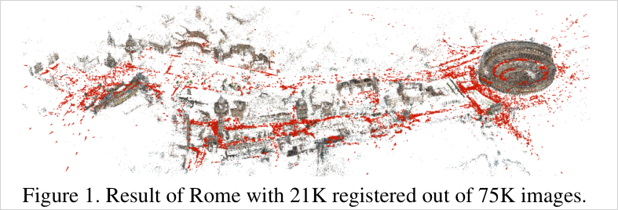

## 1. 문제와 동기 (Paper Says)

### 1.1 왜 아직도 general-purpose가 아닌가
SfM은 self-calibrating metric reconstruction → 인터넷 사진 컬렉션 → 수억 장 규모까지 진화했고, incremental / hierarchical / global 전략이 모두 제안됐다. 그중 incremental이 unordered photo collection에서 가장 널리 쓰인다. 그럼에도 robustness, accuracy, completeness, scalability가 여전히 핵심 미해결 문제로 남아 있다. (p.1)

### 1.2 실패의 두 갈래
논문이 §3에서 진단하는 실패 원인은 두 가지다. (p.3)

1. **Correspondence search가 불완전한 scene graph를 만든다.** 근사 매칭 때문에 연결성이 빠지고, 그러면 완전한 모델을 만들 연결도 없고 신뢰할 추정에 필요한 redundancy도 없다.
2. **Reconstruction 단계가 등록에 실패한다.** structure가 없거나 부정확해서다.

### 1.3 핵심 구조: registration ↔ triangulation의 공생 관계
> "images can only be registered to existing scene structure and scene structure can only be triangulated from registered images" (p.3)

이미지는 이미 있는 structure에만 등록할 수 있고, structure는 등록된 이미지에서만 triangulate된다. 즉 두 단계가 서로의 입력이라, **매 스텝에서 둘 다의 정확도와 완전성을 최대화하는 것**이 incremental SfM의 핵심 난제가 된다. 한 번의 나쁜 결정이 카메라 mis-registration과 잘못된 triangulation의 연쇄로 번진다. 이 공생 구조가 논문 전체 기여의 통일된 동기다.

### 1.4 비교 대상
Bundler(오픈소스)와 VisualSFM(클로즈드소스)을 state of the art로 놓고 각 컴포넌트를 대조한다. (p.3)

## 2. 핵심 방법 (Paper Says)

전체 파이프라인은 correspondence search(feature extraction → matching → geometric verification)와 incremental reconstruction(initialization → image registration → triangulation → BA → outlier filtering)의 2단 구조다.

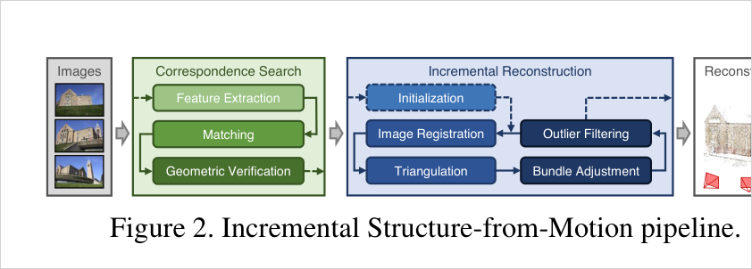

### 2.1 Scene Graph Augmentation (§4.1)
Geometric verification을 "통과/실패"가 아니라 **관계의 종류를 라벨링하는 단계**로 바꾼다. (p.3-4)

1. Fundamental matrix `F` 추정 → inlier `N_F ≥ N_F^min`이면 geometrically verified.
2. 같은 쌍에 homography `H` 추정 → `N_H`. `N_H/N_F < ε_HF`이면 "general scene에서 움직이는 카메라"로 본다 (GRIC 같은 model selection의 저비용 근사).
3. calibrated면 essential matrix `E` 추정 → `N_E/N_F > ε_EF`이면 calibration이 맞다고 본다.
4. calibration이 맞고 `N_H/N_F < ε_HF`이면 `E`를 분해해 inlier를 triangulate하고 **median triangulation angle `α_m`** 을 구해 순수 회전(panoramic)과 평면 장면(planar)을 구분한다.
5. **WTF(watermarks, timestamps, frames) 제거**: 이미지 경계에서 similarity transform inlier `N_S`를 세어 `N_S/N_F > ε_SF ∨ N_S/N_E > ε_SE`이면 서로 다른 랜드마크를 잘못 잇는 쌍으로 보고 scene graph에 넣지 않는다.
6. 유효 쌍은 모델 타입(general / panoramic / planar)과 최대 support 모델의 inlier로 라벨링된다.

**라벨이 하는 일 두 가지.** (a) initialization을 non-panoramic이고 가급적 calibrated인 쌍에서만 seed한다. (b) **panoramic 쌍에서는 triangulate하지 않는다** — degenerate point를 막아 이후 triangulation과 image registration의 robustness를 올린다.

### 2.2 Next Best View Selection (§4.2)
다음에 등록할 이미지를 고르는 문제. PnP pose 정확도는 (i) 관측 개수와 (ii) 이미지 내 분포에 의존한다는 Lepetit et al.의 실험 결과가 출발점이다. 관측이 많으면 intrinsic 추정에 redundancy가 생기고, 고르게 퍼져 있으면 나쁜 configuration을 피할 수 있다. (p.4)

Haner et al.식 covariance propagation은 후보마다 매 스텝 계산해야 해서 인터넷 데이터셋(후보가 매우 많음)에서는 불가능하다. 그래서 **multi-resolution 근사**를 쓴다.

```text
이미지를 K_l × K_l 격자로 분할 (l = 1...L, K_l = 2^l)
각 셀 상태 ∈ {empty, full}
empty 셀에 점이 처음 보이면 -> full로 바뀌고 점수 S_i += w_l  (w_l = K_l²)
셀은 한 번만 기여 -> 뭉친 분포보다 고른 분포가 유리
모든 level에 대해 누적
```

한 해상도만 쓰면 점 개수가 `N_t ≪ K_l²`일 때 모든 점이 서로 다른 셀에 떨어져 분포를 못 잡는다. 그래서 피라미드로 확장한다. **점이 적을 때는 개수가, 많을 때는 분포가 점수를 지배**하도록 자연스럽게 넘어간다. 온라인 갱신이 가능하다. 후보는 triangulate된 점을 `N_t > 0`개 이상 보는 미등록 이미지들이다.

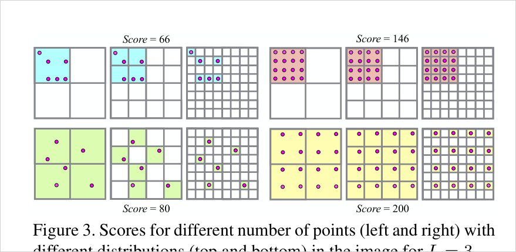

### 2.3 Robust and Efficient Triangulation (§4.3)
**문제 정의.** Two-view correspondence를 이어 붙여 feature track을 만들면 baseline이 큰 쌍까지 연결돼 triangulation이 정확해진다. 그러나 track은 outlier 비율이 매우 높다. epipolar line을 따라 애매한 매치가 잘못 검증되면 **한 번의 mismatch가 서로 다른 두 점의 track을 병합**한다. 길이가 같은 4개 track이 잘못 합쳐지면 outlier 비율이 75%가 된다. 부정확한 pose도 track 원소를 무효화한다. (p.5)

**Bundler의 방식과 한계.** track 원소의 모든 쌍 조합을 two-view triangulate해서 triangulation angle이 충분한 해가 하나라도 있으면 전체 track으로 multi-view triangulation을 하고 cheirality를 검사한다. → outlier에 강하지 않고(합쳐진 독립 점을 분리 못 함) 조합 폭발로 비싸다.

**제안: recursive RANSAC.** track `T = {T_n}`을 사전 inlier 비율 미상인 measurement 집합으로 보고 RANSAC을 돌린다.

1. minimal set 크기 2를 뽑아 two-view triangulation `X_ab ~ τ(x̄_a, x̄_b, P_a, P_b)` (τ = DLT). panoramic 쌍은 제외.
2. well-conditioned 조건 두 개: 충분한 triangulation angle `α`, 그리고 두 뷰에서 양의 depth(cheirality).
3. 각 measurement는 양의 depth와 reprojection error `e_n < t`면 consensus로 인정.
4. `N_T`가 작으면 같은 minimal set을 반복 추출하므로 **unique sample만 생성하는 sampler**를 쓴다. 사전 inlier 비율을 모르니 작은 초기값 `ε_0`에서 시작해 더 큰 consensus set을 찾을 때마다 반복 횟수 `K`를 적응적으로 줄인다.
5. **Recursion**: consensus set을 빼고 남은 measurement로 다시 수행. 남은 집합 크기가 3 미만이면 정지. → 잘못 병합된 track에서 여러 독립 점을 복원한다.

### 2.4 Bundle Adjustment: 반복 정제 (§4.4)
- **국소/전역 분리**: image registration마다 most-connected 이미지 집합에 local BA, 모델이 일정 비율 커졌을 때만 global BA (VisualSFM과 동일) → amortized linear runtime.
- **파라미터화**: local BA에서 robust loss `ρ_j`로 Cauchy 함수. 수백 카메라 이하는 sparse direct solver, 그 이상은 PCG. Ceres Solver 사용. 인터넷 사진에는 radial distortion 1개짜리 단순 카메라 모델(순수 self-calibration이므로).
- **Filtering**: reprojection error가 큰 관측 제거 + 점마다 모든 viewing ray 쌍에 최소 triangulation angle 강제. global BA 후에는 degenerate 카메라(파노라마·인위적 보정 이미지 등) 제거 — focal length와 distortion을 사전 범위로 묶지 않고 자유롭게 최적화시킨 뒤 **비정상 FOV나 큰 distortion 계수를 가진 카메라를 사후 필터링**한다. principal point는 ill-posed라서 uncalibrated 카메라에서는 이미지 중심 고정.
- **Re-triangulation(RT)**: VisualSfM처럼 global BA 직전에 pre-BA RT. **추가로 post-BA RT를 제안** — BA가 pose/point를 크게 개선하므로, 이전에 부정확한 pose 때문에 triangulate 실패했던 track을 이어 붙인다. 임계값을 올리는 게 아니라, **filtering 임계값 아래인 관측만 이어 붙인다**. track 병합도 시도해 다음 BA의 redundancy를 늘린다.
- **Iterative Refinement (핵심)**: Bundler/VisualSfM은 BA+filtering을 한 번만 한다. drift나 pre-BA RT 때문에 BA에 들어가는 관측 중 상당수가 outlier이고 이후 필터링되는데, BA 자체가 outlier에 취약하므로 **BA → RT → filtering을 필터링 관측 수와 post-BA RT 점 수가 줄어들 때까지 반복**한다. 보통 두 번째 반복에서 크게 좋아지고 수렴한다.

### 2.5 Redundant View Mining (§4.5)
BA가 성능 병목이다. 인터넷 컬렉션은 관심 지점의 인기 차이로 visibility 패턴이 매우 비균질하고, 많은 이미지가 거의 중복된 시점을 갖는다. incremental SfM은 최신 확장에 영향받은 부분/아닌 부분으로 나뉘고, 대부분의 장면은 영향받지 않는다. (p.6)

```text
영향받은 이미지 (최근 등록됐거나, 관측의 비율 ε_r 이상이 reprojection error > r)
  -> 개별 파라미터화 (표준 BA, Eq.1)
영향받지 않은 이미지
  -> 겹침이 큰 소규모 그룹 G_r로 묶고, 그룹 전체를 카메라 하나로 파라미터화 (Eq.7)
```

그룹 만들기: 이미지 `i`를 binary visibility vector `v_i ∈ {0,1}^{N_X}`로 표현하고 겹침 정도를 `V_ab`(Eq.6)로 잰다. `‖v_i‖` 내림차순 정렬 후 첫 이미지를 빼서 그룹을 시작하고 `V_ab`를 최대화하는 `I_b`를 찾는다. `V_ab > V` 이고 `|G_r| < S`면 그룹에 넣고, 아니면 새 그룹을 연다. 탐색 비용을 줄이려고 **공통 시선 방향 ±β도 이내의 공간적 최근접 이웃 `K_r`개로 후보를 제한**한다.

Ni et al. 대비 세 가지 차별점: (1) 비싼 graph-cut 대신 SfM 고유 성질을 쓰는 값싼 그룹핑, (2) 큰 submap 하나가 아니라 **작고 겹침이 큰 그룹 다수**로 분할해 reduced camera system을 줄임, (3) 그 결과로 separator 변수 최적화(교대 스킴)를 아예 생략.

## 3. 핵심 수식

**Eq. 1 — Bundle adjustment 목적함수**
```text
E = Σ_j ρ_j( ‖π(P_c, X_k) − x_j‖²₂ )
```
`π`는 scene point를 이미지 공간으로 투영하는 함수, `ρ_j`는 outlier를 낮게 가중하는 loss. Levenberg-Marquardt로 푼다. 파라미터 구조 덕에 Schur complement trick(reduced camera system 먼저 풀고 point는 back-substitution)이 쓰인다. exact(dense/sparse factorization, 공간 `O(N_P²)`·시간 `O(N_P³)`) vs inexact(PCG, `O(N_P)`)의 선택 문제로 이어진다. (p.2-3)

**Eq. 2 — two-view triangulation 모델 생성**
```text
X_ab ~ τ(x̄_a, x̄_b, P_a, P_b),  a ≠ b
```
`τ`는 임의의 triangulation 방법(여기선 DLT). RANSAC의 minimal-set 모델. (p.5)

**Eq. 3 — triangulation angle (well-conditioned 조건 1)**
```text
cos α = (t_a − X_ab)/‖t_a − X_ab‖₂ · (t_b − X_ab)/‖t_b − X_ab‖₂
```
두 카메라 중심에서 점을 바라보는 방향 사이 각. 작으면 depth가 불안정 → 모델 자체를 기각. 실험에서 `α = 2°`. (p.5)

**Eq. 4 — depth / cheirality (well-conditioned 조건 2)**
```text
d = [p₃₁ p₃₂ p₃₃ p₃₄] · [X_ab^T, 1]^T
```
`P`의 3번째 행과 동차좌표의 내적. `d > 0`이어야 카메라 앞에 있다. (p.5)

**Eq. 5 — measurement 적합 판정(reprojection error)**
```text
e_n = ‖ x̄_n − (x'/z', y'/z') ‖₂,   [x' y' z']^T = P_n [X_ab; 1]
e_n < t 이고 d_n > 0 이면 consensus set에 포함
```
실험에서 `t = 8px`. (p.5)

**Eq. 6 — 이미지 간 겹침 정도(IoU)**
```text
V_ab = ‖v_a ∧ v_b‖ / ‖v_a ∨ v_b‖
```
visibility bit-vector의 비트연산 IoU. redundant view mining의 그룹핑 기준이자, "두 이미지가 얼마나 상호작용하는가"의 척도. (p.6)

**Eq. 7 — grouped BA 비용**
```text
E_g = Σ_j ρ_j( ‖π_g(G_r, P_c, X_k) − x_j‖²₂ )
P_cr = P_c G_r   (그룹 pose와 이미지 pose의 합성; 회전은 quaternion으로 합성)
```
`G_r ∈ SE(3)`만 최적화하고 그룹 내 `P_c`는 고정. 전체 비용 `Ē`는 grouped + ungrouped의 합. 그룹 크기가 2여도 이득이 있고, direct method(3제곱)에서 indirect(1제곱)보다 이득이 크다. (p.7)

## 4. 실험 근거

**설정**: 17개 데이터셋 총 144,953장의 unordered 인터넷 사진, 넓은 지역에 카메라 밀도 편차 큼. Quad는 ground-truth 카메라 위치 보유. 전 실험에서 RootSIFT + vocabulary tree 기반 100-NN 매칭. **correspondence search는 타이밍에서 제외**. 2.7GHz / 256GB RAM. 비교: Bundler, VisualSFM(incremental), DISCO, Theia(global). (p.7)

### 4.1 Next Best View Selection
합성 실험은 점수 `S`가 개수와 분포를 제대로 반영하는지 본다(`L = 6`, Gaussian 분포 점을 spread `σ`, 위치 `µ`로 생성).

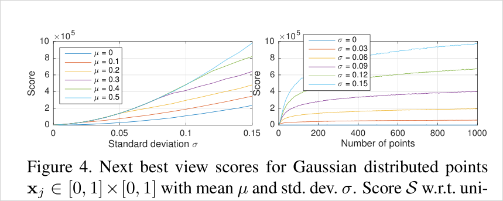

실제 비교는 Quad에서 세 전략 — Pyramid(제안), Number(triangulate된 점 개수 최대, Bundler 방식), Ratio(가시/잠재가시 비율 최대) — 를 재구성 오차로 겨룬다.

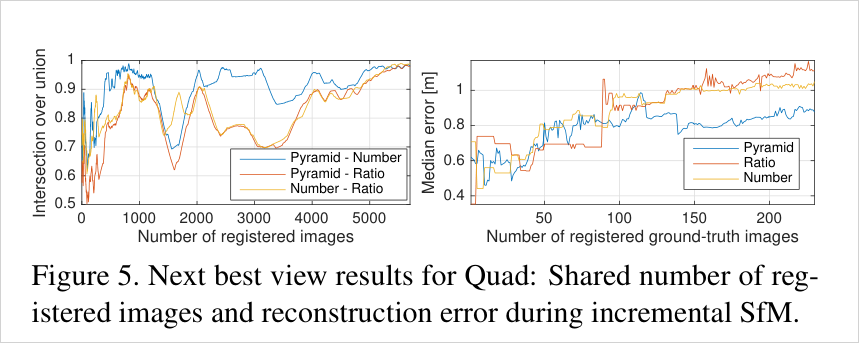

이 실험이 가장 해석적으로 중요하다. 최종 등록 집합은 같은데 오차가 다르다 → NBV의 이득은 completeness가 아니라 **누적 오차 억제**에서 온다.

### 4.2 Robust and Efficient Triangulation
Dubrovnik: 47M verified match에서 만든 2.9M feature track. `α = 2°`, `t = 8px`, `ε_0 = 0.03`. exhaustive는 조합 폭발을 피하려 10K iteration으로 제한(`η = 0.999`에서 `ε_min ≈ 0.02`).

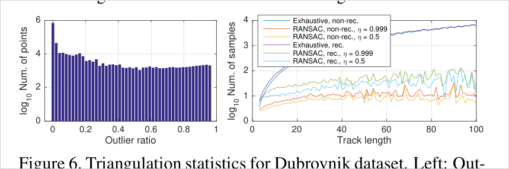

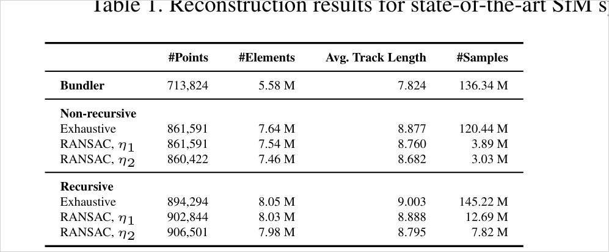

읽는 법 세 가지.
1. **Recursive의 이득**: Exhaustive 기준 non-rec 861,591점 → rec 894,294점. 잘못 병합된 track에서 독립 점을 실제로 복원한다.
2. **RANSAC의 이득**: 샘플 수 120.44M → 3.89M(non-rec), 145.22M → 12.69M(rec). 논문 표현으로 10–40배 빠르고 track은 "marginally inferior".
3. **η로 속도/완전성 조절**: `η`를 낮추면(0.5) 샘플이 더 줄고 track 길이가 살짝 짧아진다. 흥미롭게도 recursive에서는 `η₂`가 점 개수는 가장 많다(906,501) — 짧아진 track이 더 잘게 쪼개진 결과.

### 4.3 Redundant View Mining
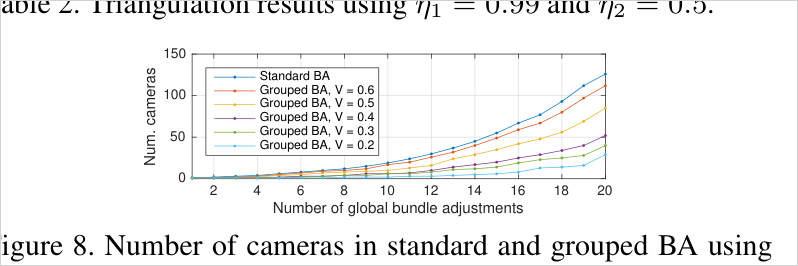

전체 런타임 단축은 V=0.6에서 5%, V=0.3에서 14%, V=0.1에서 32%. 평균 reprojection error는 표준 BA 0.26px에서 각각 0.27 / 0.28 / 0.29px로 악화. **V > 0.3이면 품질이 사실상 동등**하고 그 아래로는 급격히 나빠진다. Colosseum에서 V=0.4로 전체 파이프라인 런타임이 36% 줄면서 재구성은 동등했다. (p.8)

### 4.4 전체 시스템
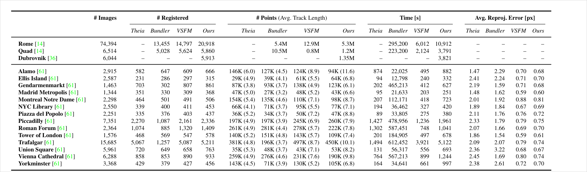

숫자 요약:
- **Completeness**: Rome 74,394장 중 20,918장 등록 (VSFM 14,797 / Bundler 13,455). 큰 모델일수록 격차가 커진다.
- **Track 길이(= BA redundancy)**: Alamo 11.6 (VSFM 8.9 / Bundler 4.5), Trafalgar 10.1 (VSFM 8.7 / Bundler 3.7). 논문이 "increased track lengths result in higher redundancy in BA"라고 명시.
- **Pose 정확도(Quad, GT 존재)**: Ours 0.85m < VSFM 0.89m < Bundler 1.01m < DISCO 1.16m.
- **속도**: Theia(global)가 가장 빠름, Ours는 VSFM보다 약간 느림, Bundler보다 50배 이상 빠름.

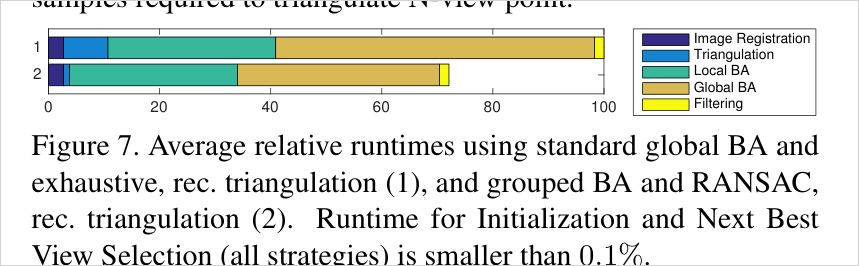

NBV selection이 런타임의 0.1% 미만이라는 점은 중요하다 — **정확도 이득(Fig. 5)이 사실상 공짜**라는 뜻이다.

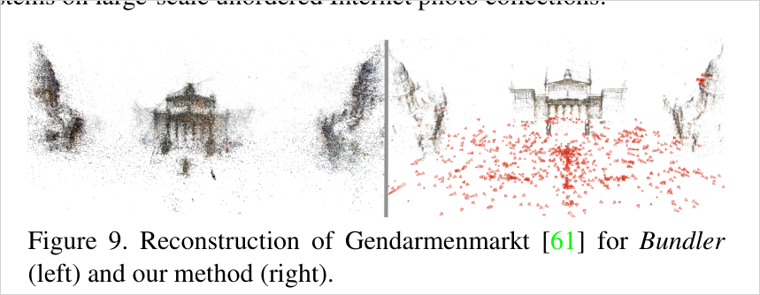

## 5. 해석 (Interpretation)

### 5.1 이 논문의 진짜 기여 형태
개별 아이디어는 대부분 기존 개념의 **robust化 + 저비용 근사**다: GRIC → inlier 비율 임계, covariance propagation → 격자 피라미드, multi-view triangulation → recursive RANSAC, out-of-core BA(Ni et al.) → 값싼 covisibility 그룹핑. novelty가 각 조각에 있는 게 아니라, **"모든 결정을 다음 단계의 실패 확률을 낮추는 방향으로 정렬"했다는 시스템 수준 일관성**과, 그것이 실제로 재현 가능한 코드로 나왔다는 데 있다. 시스템 논문이 어떻게 novelty를 확보하는지의 교과서적 사례.

### 5.2 나(3DGS/mesh reconstruction)와의 접점 — 가장 중요한 부분
3DGS/MILo 계열은 COLMAP 출력을 "주어진 것"으로 받는다. 이 논문을 읽으면 그 출력이 사실 **관측 신뢰도에 대한 풍부한 부산물**을 함께 만들어낸다는 게 드러난다.

1. **Feature track = 이미 존재하는 관측 카운트 필드.** 내 메인 연구(H1a)의 "SfM observation field"가 바로 여기서 나온다. Table 1이 track 길이를 핵심 품질 지표로 취급한다는 사실 자체가, **track 길이 = 그 3D 점이 받은 constraint의 개수**라는 해석에 논문 수준의 근거를 준다. 3DGS에서 track 길이가 짧은 초기점 주변이 곧 under-constrained 영역이라는 가설의 상류 근거로 쓸 수 있다.
2. **Triangulation angle은 "관측이 있음"과 "관측이 유용함"을 가르는 기준.** COLMAP은 `α = 2°` 미만이면 점을 만들지도 유지하지도 않는다. 배경/원거리 영역이 GS에서 무너지는 이유를 "관측 개수 부족"이 아니라 "**baseline 부족으로 depth constraint가 약함**"으로 재정의할 수 있는 지점이다. 카운트 필드보다 각도 가중 필드가 더 정확한 confidence proxy일 가능성이 있다 — 검증할 만한 가설.
3. **Scene graph의 panoramic/planar 라벨 = 상류에서 이미 계산된 degeneracy 정보.** COLMAP은 panoramic 쌍에서 triangulate하지 않는다. 즉 "이 영역은 신뢰할 만한 3D 구조를 못 만든다"는 판정이 GS 학습이 시작되기도 전에 이미 내려져 있다. 이 정보를 GS로 넘기는 파이프라인은 내가 아는 한 표준이 아니다.
4. **CoMe/AmbiSuR 계보와의 위치.** CoMe는 a-posteriori(학습 후 잔차 기반), AmbiSuR는 표현 통계(SH norm), Expo-GS는 물리 metadata(노출), CoMapGS는 dense correspondence 카운트. COLMAP track/angle은 **가장 상류의, 추가 계산이 0인 a-priori 신호**다. "이미 파일에 있는데 아무도 안 쓰는 신호"라는 프레이밍이 가능하다. → [[covisibility-count-weighted-supervision]], [[learned-confidence-photometric-geometric-balancing]] 와의 대조축.
5. **NBV의 교훈 = view sampling.** Fig. 5의 "같은 집합, 다른 오차"는 [[observation-weighted-view-sampling]] 질문에 직접 답한다. 최종에 보는 데이터가 같아도 **순서/빈도가 최종 정확도를 바꾼다**는 실증이 SfM 쪽에는 이미 있다. 3DGS의 view sampling 순서 문제와 구조가 같고, 심지어 "무엇을 볼지"를 관측 개수 × 공간 분포로 점수화한다는 구체적 형태까지 재사용 가능하다. Schmidt 튜토리얼의 "신경망에는 importance sampling이 별 도움 안 되더라"는 결론에 대한 반대 사례로 인용할 수 있는 후보다(단 도메인이 다르므로 직접 근거는 아님).

### 5.3 왜 이 논문이 10년째 표준인가
COLMAP이 대체되지 않는 이유는 정확도보다 **실패하지 않음**에 최적화됐기 때문이다. Table 1에서 Theia가 더 빠르고 점도 많지만 reproj. error가 2–3배다. 학습 기반 SfM(DUSt3R/MASt3R 계열)이 등장한 지금도 GS 파이프라인이 COLMAP을 못 놓는 이유는 이 "조용한 robustness"에 있다 — 이 논문의 기여가 정확히 그 지점이다.

## 6. 한계

**논문이 명시한 것**
- Redundant view mining은 `V`가 작아지면 재구성 품질이 저하된다(`V ≤ 0.3`).
- 다수 임계값(`ε_HF`, `ε_EF`, `ε_SF`, `ε_SE`, `α`, `t`, `ε_0`, `V`, `S`, `ε_r`, `K_r`, `β`)에 의존하는데 대부분의 구체적 값이 본문에 없다.
- 속도는 VisualSFM보다 약간 느리고 Theia보다 확실히 느리다.

**추론된 한계 (model-side inference)**
- **Correspondence search가 타이밍에서 제외됐다.** 실제 대규모 파이프라인에서 매칭이 지배적 비용인 경우가 많으므로, 보고된 속도 우위는 시스템 전체가 아니라 reconstruction 단계에 한정된 비교다.
- **Incremental 전략 자체의 한계는 그대로다.** drift를 억제할 뿐 없애지 못하고, initialization 선택에 여전히 의존한다(§2.2에서 스스로 "may never recover from a bad initialization"이라고 인정).
- **Ablation이 컴포넌트 단위로 분리돼 있지 않다.** Table 1은 전체 시스템 비교이고, 개별 기여는 각각 별도 실험(Fig. 5, Table 2, Fig. 8)으로만 검증된다. "5개 기여의 상호작용/기여도 분해"는 없다.
- **평가가 인터넷 사진 컬렉션에 강하게 편향돼 있다.** 오늘날 GS/mesh reconstruction이 쓰는 통제된 캡처(Mip-NeRF360, T&T, DTU)에서 이 설계 결정들이 얼마나 유효한지는 이 논문으로 알 수 없다.

## 7. Open Questions

- Track 길이와 median triangulation angle 중 어느 쪽이 3DGS의 under-constrained 영역을 더 잘 예측하는가? 둘의 결합은?
- COLMAP이 이미 계산해 버리는 정보(panoramic/planar 라벨, per-point track, per-observation reprojection error, filtering으로 버린 관측)를 GS 학습에 넘기면 무엇이 개선되는가? 버려진 관측이야말로 "애매한 영역"의 지표 아닌가?
- NBV의 pyramid score를 3DGS의 training view sampling에 그대로 옮기면(현재 등록 대신 "현재까지 supervise된 Gaussian의 이미지 내 분포"로) 배경 붕괴가 완화되는가?
- Iterative refinement(BA→RT→filter 반복)의 사고방식 — "1회 최적화 후 필터링은 outlier에 오염돼 있으니 반복하라" — 는 3DGS densification/pruning 스케줄에 그대로 번역되는가?
- 학습 기반 dense matcher(MASt3R 등)로 track을 만들면 outlier 비율 분포(Fig. 6 좌)가 어떻게 바뀌고, recursive RANSAC이 여전히 필요한가?

## Evidence Anchors

- p.1: Fig. 1 Rome 21K/75K teaser, Abstract의 4대 문제(robustness/accuracy/completeness/scalability)
- p.2: Fig. 2 파이프라인 다이어그램, Eq. 1 BA 목적함수, §2.1 correspondence search 3단계
- p.3: §3 실패 원인 2갈래 + registration↔triangulation 공생 문장, §4 기여 5개 요약, §4.1 scene graph augmentation(H/E/F 비율, WTF)
- p.4: Fig. 3 NBV 점수 예시(L=3), §4.2 multi-resolution pyramid 정의(`K_l = 2^l`, `w_l = K_l²`)
- p.5: Eq. 2–5 triangulation RANSAC 정식화, track 병합 outlier 75% 예시, Bundler 방식 비판, §4.4 BA 파라미터화
- p.6: post-BA RT / iterative refinement 제안, §4.5 redundant view mining, Eq. 6 visibility IoU
- p.7: Eq. 7 grouped BA cost, §5 실험 설정(17 datasets / 144,953장 / RootSIFT / 100-NN), Fig. 4·5 NBV, Fig. 6 triangulation 통계, Fig. 7 런타임 분해
- p.8: Table 1 전체 시스템 결과, Table 2 triangulation 결과, Fig. 8 grouped BA, Fig. 9 Gendarmenmarkt 정성 비교, Quad pose 오차(0.85/0.89/1.01/1.16m)

## Related WIKI Pages

- [Scene Graph Augmentation과 Two-View 기하 모델 선택](../concepts/scene-graph-augmentation-two-view-model-selection.md)
- [Multi-Resolution Visibility Pyramid Score (Next Best View)](../concepts/multiresolution-visibility-pyramid-score.md)
- [Recursive RANSAC Multi-View Triangulation](../concepts/recursive-ransac-multiview-triangulation.md)
- [Covisibility 기반 Grouped Bundle Adjustment](../concepts/covisibility-grouped-bundle-adjustment.md)
- [Descriptor Matching](../concepts/descriptor-matching.md)
- [Covisibility Count 가중 Supervision](../concepts/covisibility-count-weighted-supervision.md)
- [Photometric-Primary Geometry Underconstraint](../concepts/photometric-primary-geometry-underconstraint.md)
- [Observation-Weighted View Sampling](../questions/observation-weighted-view-sampling.md)

## Uncertainty Log

- Fig. 3의 구체적 점수(66 / 80 / 146 / 200)를 본문 규칙(`K_l = 2^l`, `w_l = K_l²`, `L = 3`)으로 산술 재현하지 못했다. 66은 4의 배수가 아니어서 `4a + 16b + 64c` 형태로 나오지 않는다. 그림의 정성적 순서(고른 분포 > 뭉친 분포, 많은 점 > 적은 점)는 명확하므로 그 부분만 사용했다. 가중치 정의를 잘못 읽었을 가능성 있음 — COLMAP 소스(`incremental_mapper`)로 확인 필요.
- Table 2 캡션은 `η₁ = 0.99`인데 §5 본문은 exhaustive 제한을 설명하며 `η = 0.999`를 쓴다. Fig. 6 범례도 `η = 0.999`다. 캡션 오타일 가능성이 높지만 확정하지 못했다.
- Redundant view mining의 "V=0.3에서 14% 단축"과 "Colosseum에서 V=0.4로 36% 단축"은 서로 다른 측정(전자는 실험 컬렉션의 총 런타임, 후자는 Colosseum 전체 파이프라인)으로 보이나 논문이 명시적으로 구분하지 않는다.
- `N_F`(geometric verification 최소 inlier 수), `ε_HF`, `ε_EF`, `ε_SF`, `ε_SE`, `V`의 기본값 등 다수 임계값의 구체적 수치가 본문에 없다. 실제 값은 COLMAP 구현에서 확인해야 한다.
- Supplementary material(추가 정성 비교)은 이 PDF에 포함돼 있지 않다.
