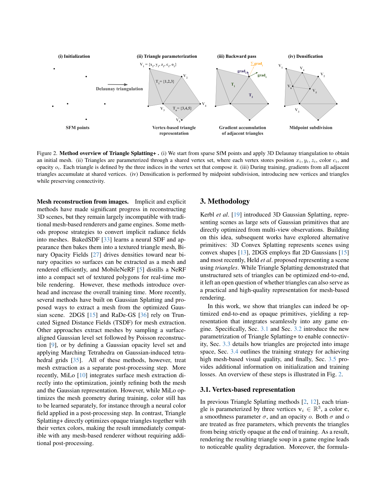
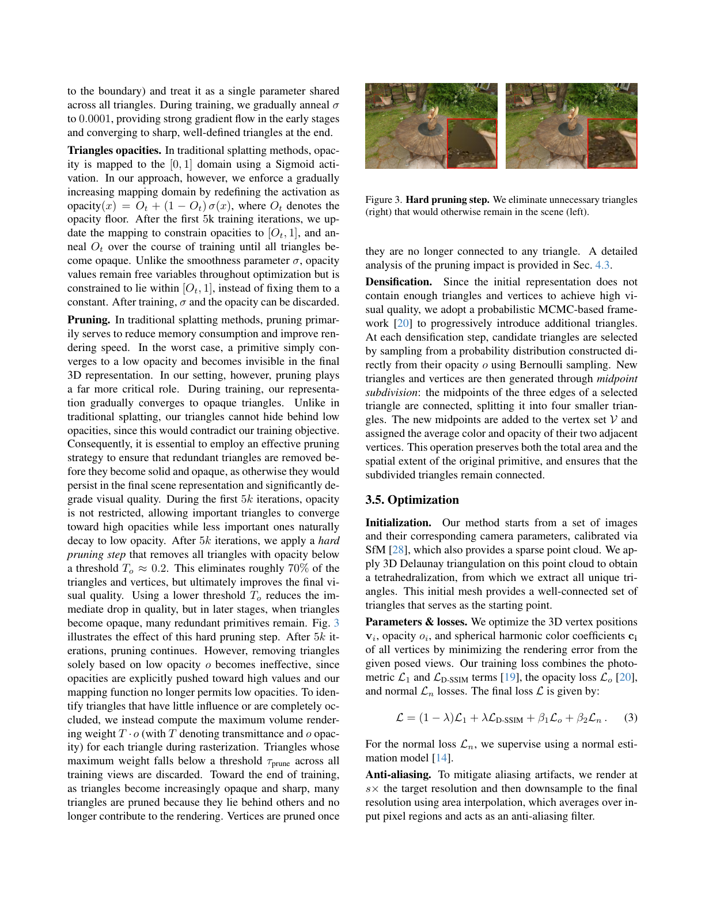
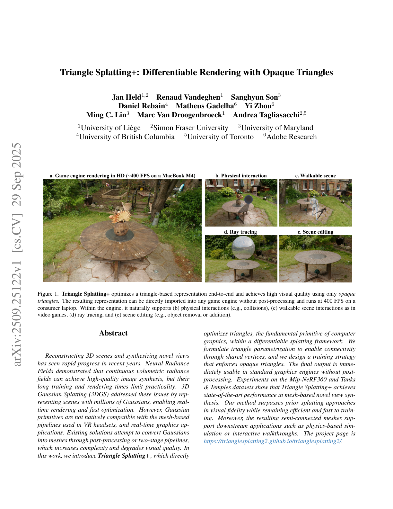
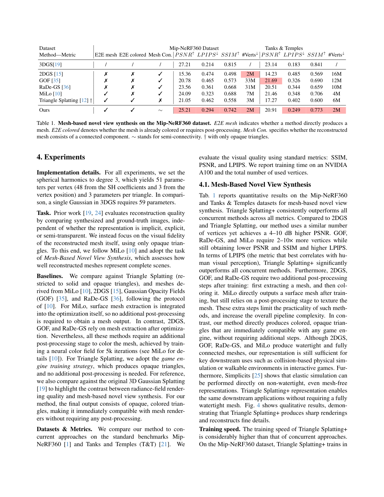
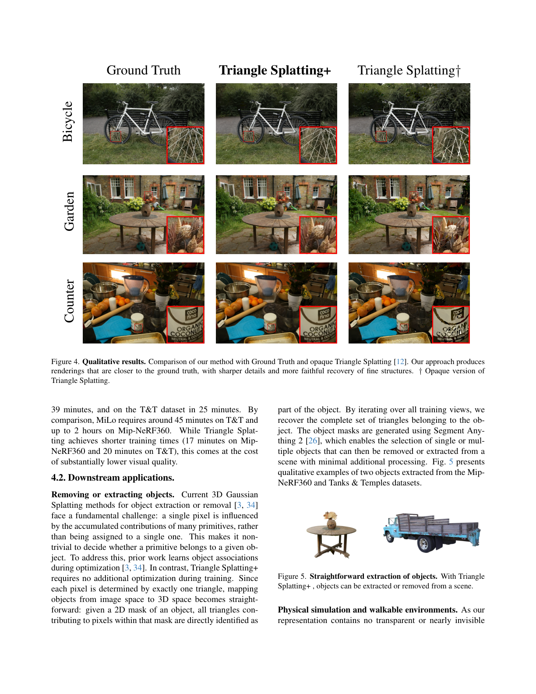
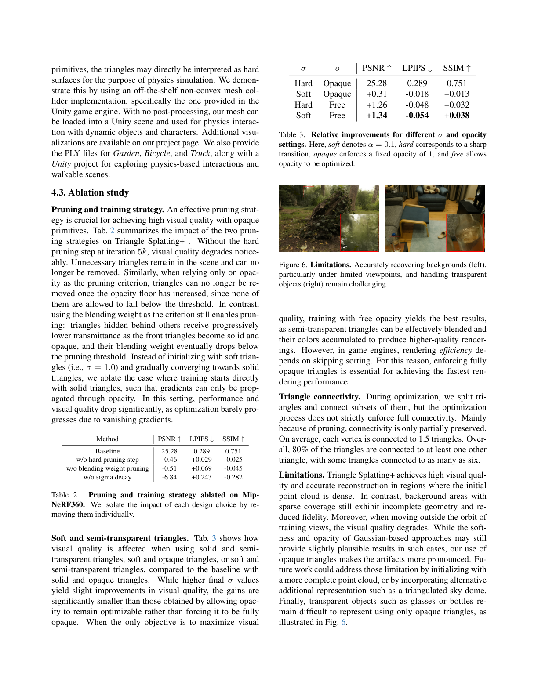

# Triangle Splatting+: Differentiable Rendering with Opaque Triangles

## Paper
- 저자: Jan Held, Renaud Vandeghen, Sanghyun Son, Daniel Rebain, Matheus Gadelha, Yi Zhou, Ming C. Lin, Marc Van Droogenbroeck, Andrea Tagliasacchi
- 버전: arXiv:2509.25122v1, 2025-09-29
- 주제: differentiable triangle splatting을 opaque, semi-connected mesh representation으로 바꾸어 mesh renderer/game engine에서 바로 쓰는 novel-view synthesis
- PDF: `C:\Users\jinsw712\Desktop\Files\Research_WIKI\raw\papers\Triangle Splatting Plus.pdf`

## Main Claim
Triangle Splatting+의 중심 주장은 기존 Triangle Splatting이 triangle primitive를 differentiable하게 최적화하긴 했지만, 최종 결과가 soft/semi-transparent triangle soup라서 game engine rendering 품질과 downstream mesh 활용성이 떨어진다는 것이다. 이 논문은 triangle을 공유 vertex set과 index triplet으로 재파라미터화하여 partial connectivity를 만들고, 학습 중에는 soft/semi-transparent 상태로 gradient flow를 확보하다가 마지막에는 sharp/opaque triangle로 anneal하는 training strategy를 제안한다. 그 결과 최종 표현은 post-processing 없이 colored opaque triangle mesh처럼 standard renderer에 들어가며, Mip-NeRF360/Tanks & Temples의 mesh-based novel view synthesis에서 기존 mesh 추출/색칠 파이프라인보다 높은 품질을 보인다고 주장한다.

## Paper Says: Motivation and Previous Work
### 문제
NeRF는 고품질 novel-view synthesis를 보였지만 학습/렌더링이 느리고, 3DGS는 빠른 학습과 실시간 렌더링을 가능하게 했지만 Gaussian primitive는 VR headset, game engine, mesh renderer 같은 기존 그래픽스 파이프라인의 기본 primitive가 아니다. 따라서 Gaussian을 직접 지원하도록 엔진을 바꾸거나, 2DGS/RaDe-GS/GOF처럼 optimized representation에서 mesh를 후처리로 뽑고 다시 색을 입히는 단계가 필요하다. 이 후처리는 파이프라인을 복잡하게 하고 품질 손실을 낳는다. (p.1-3)

### 기존 Triangle Splatting과 차이
Triangle Splatting은 triangle을 splatting primitive로 최적화해 triangle comeback을 보였지만, 최종 결과가 unstructured triangle soup이며, training objective가 opaque triangle을 강제하지 않아 game engine에서 soft/semi-transparent triangle을 solid mesh처럼 렌더링할 때 품질 저하가 생긴다. 또한 각 triangle이 독립 vertex를 가지므로 공간적으로 겹치거나 색 분포가 비슷해도 vertex를 공유하지 못한다. Triangle Splatting+는 이 두 한계를 각각 shared-vertex representation과 opaque training schedule로 겨냥한다. (p.2-4)

## Paper Says: Method
### 1. Shared vertex 기반 triangle representation
논문은 vertex set `V = {v_i}`를 두고 각 vertex를 `(x_i, y_i, z_i, c_i, o_i)`로 둔다. 여기서 위치, vertex color, vertex opacity가 모두 학습 대상이다. Triangle은 더 이상 독립된 세 vertex 좌표가 아니라 `T_m = (i, j, k)`라는 vertex index triplet으로 정의된다. Triangle opacity는 `o_Tm = min(o_i, o_j, o_k)`로 계산하고, triangle 내부 color는 barycentric coordinate로 vertex color를 보간한다. 이 구조 덕분에 인접 triangle들이 vertex를 공유할 수 있고, backward pass에서 여러 triangle의 gradient가 공유 vertex에 누적된다. (Fig. 2, p.3-4)



### 2. Differentiable rasterization
3D vertex는 pinhole camera model `q_i = K(Rv_i + t)`로 image plane에 투영된다. Pixel `p`에 대한 triangle contribution은 기존 Triangle Splatting의 2D triangle SDF window를 사용한다. 2D triangle edge의 outward normal과 offset으로 SDF `phi(p)`를 만들고, incenter `s`에서 정규화한 window `I(p)`를 사용한다. 이 window는 triangle 중심에서 1, boundary와 outside에서 0이 된다. (Eq. 1, p.4)

### 3. Training strategy: soft에서 opaque로
가장 중요한 설계는 처음부터 solid/opaque triangle로 학습하지 않는다는 점이다. Solid/opaque 상태에서는 경계 밖으로 gradient가 거의 흐르지 않아 geometry optimization이 막히기 쉽다. 그래서 초반에는 `sigma=1.0`의 soft transition과 자유로운 opacity로 gradient flow를 확보하고, 학습이 진행되며 shared smoothness parameter `sigma`를 `0.0001`까지 anneal해 sharp triangle로 만든다. Opacity는 `opacity(x)=O_t+(1-O_t) sigmoid(x)` 형태의 opacity floor를 두고, 첫 5k iteration 이후 `O_t`를 점차 올려 모든 triangle을 opaque하게 만든다. (p.4-5)



### 4. Pruning과 densification
Opaque triangle 학습에서는 pruning이 단순 메모리 최적화가 아니라 품질 핵심이다. 투명 splat은 낮은 opacity로 숨어 있을 수 있지만, 이 논문에서는 끝에 모든 triangle이 opaque해지므로 불필요한 triangle을 제때 제거하지 않으면 최종 mesh artifact가 된다. 첫 5k iteration 후 opacity threshold `T_o ~= 0.2` 아래 triangle을 hard-pruning하며, 이 단계에서 약 70%의 triangle/vertex를 제거한다고 보고한다. 이후에는 opacity가 이미 floor에 의해 올라가므로 opacity만으로 pruning할 수 없다. 대신 rasterization 중 최대 volume rendering weight `T * o`를 보고, 모든 training view에서 contribution이 낮은 triangle을 제거한다. Densification은 MCMC-style sampling으로 opacity 기반 후보 triangle을 고르고, midpoint subdivision으로 한 triangle을 네 개로 나누어 connectivity를 보존한다. (Fig. 3, p.5; Table 2, p.8)

### 5. Optimization
초기화는 SfM camera/point cloud에서 시작한다. 논문은 sparse SfM point cloud에 3D Delaunay triangulation을 적용하고, unique triangle을 추출해 초기 connected-ish mesh를 만든다. 학습 변수는 vertex position, opacity, spherical harmonic color coefficients이며, loss는 photometric `L1`, `L_D-SSIM`, opacity loss `L_o`, normal loss `L_n`을 결합한다. Normal loss는 외부 normal estimation model로 supervise한다고 설명한다. Anti-aliasing은 목표 해상도보다 `s`배 크게 렌더링한 뒤 area interpolation으로 downsample한다. (p.5-6)

## Visual Evidence
### Fig. 1: game engine에서 바로 쓰이는 opaque triangles

Fig. 1은 이 논문이 단순히 rendering metric만 높이는 것이 아니라, final representation을 game engine에 import해 HD 약 400 FPS on MacBook M4, collision/physical interaction, walkable scene, ray tracing, scene editing에 쓰는 것을 핵심 사용 시나리오로 삼는다는 점을 보여준다. (p.1)

### Fig. 2: Triangle Splatting+ pipeline
Fig. 2는 `SfM points -> Delaunay triangulation -> shared vertex/index triangle -> accumulated gradients -> midpoint subdivision` 흐름을 한 장에 보여준다. 기존 Triangle Splatting과 달리 densification이 isolated primitive duplication이 아니라 connectivity를 보존하는 subdivision으로 설계된 것이 중요하다. (p.3)

### Fig. 3: hard pruning
Fig. 3은 5k iteration hard pruning 전후를 보여준다. 논문 해석상 이 pruning은 opaque representation에서 필수적이다. semi-transparent splat에서는 불필요 primitive가 투명해져 숨어도 되지만, opaque final mesh에서는 숨어 있을 수 없기 때문이다. (p.5)

### Table 1: mesh-based novel view synthesis

Table 1은 이 논문이 일반 radiance-field image rendering이 아니라 mesh-based NVS를 평가한다는 점을 분명히 한다. Mip-NeRF360에서 Ours는 PSNR `25.21`, LPIPS `0.294`, SSIM `0.742`, `2M` vertices를 보고한다. Opaque Triangle Splatting baseline은 PSNR `21.05`, LPIPS `0.462`, SSIM `0.558`, `3M` vertices다. Tanks & Temples에서는 Ours가 PSNR `20.91`, LPIPS `0.249`, SSIM `0.773`, `2M` vertices이고, opaque Triangle Splatting은 PSNR `17.27`, LPIPS `0.402`, SSIM `0.600`, `6M` vertices다. MiLo는 mesh connected는 가능하지만 E2E colored가 아니며, Ours는 semi-connectivity(`~`)와 E2E colored output을 갖는 것으로 정리된다. (p.6)

### Fig. 4-5: qualitative quality and object extraction

Fig. 4는 Bicycle/Garden/Counter에서 Ours가 opaque Triangle Splatting보다 ground truth에 가까운 fine detail을 복원한다고 제시한다. Fig. 5는 pixel이 사실상 하나의 front triangle에 대응하기 때문에 2D mask에서 3D triangle set을 직접 회수해 object extraction/removal을 할 수 있다는 downstream 장점을 보여준다. (p.7)

### Table 2-3 and Fig. 6: ablation and limits

Table 2는 hard pruning 제거 시 PSNR `-0.46`, LPIPS `+0.029`, blending weight pruning 제거 시 PSNR `-0.51`, LPIPS `+0.069`, sigma decay 제거 시 PSNR `-6.84`, LPIPS `+0.243`의 악화를 보인다. 즉 sigma annealing이 가장 큰 stability/quality factor다. Table 3은 free opacity와 soft window를 허용하면 visual quality 자체는 더 좋아지지만, game engine에서 sorting을 건너뛰고 빠르게 렌더링하려면 최종 opaque constraint가 필요하다는 trade-off를 보여준다. Fig. 6은 sparse background와 transparent objects가 여전히 어렵다는 한계를 제시한다. (p.8)

## Key Equations
### Eq. 1: bounded triangle window
```text
phi(p) = max_i L_i(p)
L_i(p) = n_i · p + d_i
I(p) = ReLU(phi(p) / phi(s))^sigma
```
- `phi(p)`: projected 2D triangle의 signed distance field. outside는 양수, inside는 음수, boundary는 0이다.
- `s`: projected triangle의 incenter.
- `sigma`: boundary-to-center transition의 sharpness/smoothness를 조절한다.
- 역할: training 초반에는 smooth window로 gradient flow를 만들고, 끝에는 `sigma -> 0.0001`로 sharp triangle에 가깝게 만든다. (p.4-5)

### Eq. 2: alpha-style front-to-back accumulation
```text
C(p) = sum_n c_Tn o_Tn I(p) prod_{i=1}^{n-1}(1 - o_Ti I(p))
```
- `c_Tn`: triangle color. vertex color의 barycentric interpolation으로 얻는다.
- `o_Tn`: triangle opacity. 세 vertex opacity의 minimum.
- `I(p)`: Eq. 1 window.
- 역할: training 중에는 semi-transparent/soft triangle들을 depth order로 누적한다. 최종 opaque/sharp 상태에서는 front triangle 중심의 단순 평가로 줄어들어 mesh renderer와 잘 맞는다. (p.4)

### Opacity floor mapping
```text
opacity(x) = O_t + (1 - O_t) sigmoid(x)
```
- `O_t`: opacity floor. 첫 5k iteration 뒤부터 증가시켜 opacity domain을 `[O_t, 1]`로 제한한다.
- 역할: opacity를 고정하지 않고 계속 최적화하되, 최종적으로 triangle이 transparent하게 남지 못하게 한다. (p.5)

### Eq. 3: training loss
```text
L = (1 - lambda) L1 + lambda L_D-SSIM + beta_1 L_o + beta_2 L_n
```
- `L1`, `L_D-SSIM`: posed view rendering reconstruction loss.
- `L_o`: opacity loss.
- `L_n`: normal estimation model을 이용한 normal supervision.
- 역할: visual fidelity, opacity behavior, geometry/normal consistency를 함께 맞춘다. (p.5)

## Implementation
- 초기화: SfM으로 camera parameter와 sparse point cloud를 얻고, sparse point cloud에 3D Delaunay triangulation을 적용해 tetrahedralization 후 unique triangle을 추출한다. (p.5)
- Parameterization: SH degree 3을 사용한다. 논문은 vertex당 51 parameters(48 SH coefficients + 3 position), triangle당 3 parameters라고 비교하며, 3DGS Gaussian 하나는 59 parameters라고 적는다. (p.6)
- Rendering: differentiable splatting 중에는 depth-order alpha accumulation을 사용하고, anti-aliasing을 위해 supersampling 후 area interpolation downsample을 사용한다. (p.4-6)
- Training schedule: `sigma=1.0`에서 시작해 `0.0001`까지 anneal한다. 첫 5k iteration 뒤 opacity floor를 적용하고 높여 최종 opacity를 강제한다. 5k hard pruning threshold는 `T_o ~= 0.2`이며 약 70% triangle/vertex를 제거한다. 이후 contribution이 낮은 triangle은 maximum blending weight `T*o` 기준으로 pruning한다. (p.5, p.8)
- Densification: opacity 기반 Bernoulli sampling으로 candidate triangle을 선택하고 midpoint subdivision으로 4개 triangle을 만든다. 새 midpoint vertex는 양 끝 vertex의 color/opacity 평균을 받는다. (p.5)
- Hardware/speed: A100 기준 Mip-NeRF360 39분, T&T 25분 학습으로 보고한다. 비교로 MiLo는 T&T 약 45분, Mip-NeRF360 최대 2시간이고, Triangle Splatting은 더 빠르지만 품질이 낮다. (p.7)

## Experiments
### Task setting
논문은 일반 NVS가 아니라 `Mesh-Based Novel View Synthesis`를 평가한다. 즉 최종 mesh 자체의 visual fidelity가 기준이며, opaque triangle만 사용한다. 비교 대상은 opaque Triangle Splatting, MiLo, 2DGS, GOF, RaDe-GS이고, 3DGS는 reference로 포함된다. 2DGS/GOF/RaDe-GS는 mesh extraction과 coloring post-processing이 필요하고, MiLo도 mesh geometry는 end-to-end지만 color field/texturing post-processing이 필요하다고 정리한다. (p.6)

### Quantitative results
- Mip-NeRF360: Ours `25.21` PSNR, `0.294` LPIPS, `0.742` SSIM, `2M` vertices. Opaque Triangle Splatting은 `21.05` PSNR, `0.462` LPIPS, `0.558` SSIM, `3M` vertices. MiLo는 `24.09` PSNR, `0.323` LPIPS, `0.688` SSIM, `7M` vertices. (Table 1, p.6)
- Tanks & Temples: Ours `20.91` PSNR, `0.249` LPIPS, `0.773` SSIM, `2M` vertices. Opaque Triangle Splatting은 `17.27` PSNR, `0.402` LPIPS, `0.600` SSIM, `6M` vertices. MiLo는 `21.46` PSNR으로 PSNR은 Ours보다 높지만 LPIPS `0.348`, SSIM `0.706`으로 Ours보다 낮고, E2E colored가 아니다. (Table 1, p.6)

### Ablation
- `w/o hard pruning step`: PSNR `-0.46`, LPIPS `+0.029`, SSIM `-0.025`.
- `w/o blending weight pruning`: PSNR `-0.51`, LPIPS `+0.069`, SSIM `-0.045`.
- `w/o sigma decay`: PSNR `-6.84`, LPIPS `+0.243`, SSIM `-0.282`.
이 결과는 opaque triangle에서는 pruning과 sigma decay가 단순 부가 요소가 아니라 core optimization mechanism임을 보여준다. (Table 2, p.8)

### Downstream applications
논문은 Triangle Splatting+의 opaque semi-connected representation이 object extraction/removal, Unity non-convex mesh collider 기반 physical interaction, walkable environment에 바로 쓰인다고 주장한다. 특히 object extraction은 Gaussian처럼 한 pixel에 많은 primitive가 누적되는 경우와 달리, front triangle assignment가 명확해 2D object mask를 triangle set으로 옮기기 쉽다는 점을 강조한다. (Fig. 5, p.7-8)

## Interpretation
이 논문은 기존 Triangle Splatting의 직접적인 후속으로, novelty가 “triangle primitive를 쓰자”가 아니라 “triangle primitive를 실제 mesh pipeline에 넣을 수 있게 훈련하자”에 있다. 핵심은 세 가지다. 첫째, representation 쪽에서는 independent triangle soup를 shared vertex/index mesh-like structure로 바꾼다. 둘째, optimization 쪽에서는 soft/semi-transparent splatting의 gradient 장점과 opaque mesh의 deployment 장점을 schedule로 연결한다. 셋째, evaluation 쪽에서는 radiance-field renderer quality가 아니라 mesh-based NVS와 downstream engine usability를 전면에 둔다.

사용자의 adaptive primitive 관점에서 보면, Triangle Splatting+는 “surface/solid branch”의 강한 후보 primitive다. Gaussian이나 soft splat이 fuzzy residual, transparency, uncertain background를 담당하고, Triangle Splatting+류 primitive가 solid geometry, collision, editing, engine export를 담당하는 hybrid decomposition이 자연스럽다. 다만 논문 자체는 hybrid primitive selection을 하지는 않으며, opaque triangle 하나로 끝까지 밀어붙이기 때문에 transparent object와 sparse background에서 한계가 드러난다.

## Limitations
- 논문이 직접 말한 한계: sparse initial point cloud가 있는 background 영역은 geometry와 fidelity가 떨어진다. Training view orbit 밖으로 나가면 opaque triangle artifact가 Gaussian류보다 더 뚜렷해질 수 있다. Transparent objects such as glasses/bottles는 opaque triangle만으로 표현하기 어렵다. (Fig. 6, p.8)
- Semi-connectivity 한계: pruning 때문에 full connectivity는 보장되지 않는다. 평균 vertex 연결 triangle 수는 1.5이고, 전체 triangle의 80%가 최소 하나의 다른 triangle과 연결되며 일부는 최대 6개 triangle과 연결된다고 보고한다. 즉 watertight mesh가 아니라 semi-connected mesh다. (p.8)
- 추론한 한계: normal estimation model supervision과 SfM/Delaunay initialization에 의존하므로, 입력 pose/point cloud 품질이 나쁘거나 textureless/transparent/specular 장면이면 triangle topology가 잘못 고정될 위험이 있다. 이 부분은 논문이 완전한 failure analysis를 제공하지는 않는다.

## Open Questions
- Opaque triangle branch와 Gaussian/soft residual branch를 함께 쓰면 transparent object와 sparse background 한계를 줄일 수 있는가?
- Shared vertex connectivity를 pruning 이후에도 더 강하게 유지하려면 edge collapse, remeshing, topology regularization이 필요한가?
- Normal supervision 없이 purely photometric/geometry-consistency loss만으로 비슷한 mesh-based NVS 품질을 얻을 수 있는가?
- Pixel-to-front-triangle assignment를 object editing뿐 아니라 semantic editing, material editing, physics property assignment까지 확장할 수 있는가?
- Mesh-based NVS metric에서 PSNR/LPIPS와 실제 game-engine usability, collision quality, walkability quality 사이의 상관은 충분한가?

## Evidence Anchors
- p.1: Fig. 1, game engine rendering, physical interaction, walkable scene, ray tracing, scene editing examples.
- p.2: 기존 NeRF/3DGS/mesh extraction pipeline 한계와 Triangle Splatting의 soft/semi-transparent/isolated triangle 문제.
- p.3: Fig. 2 method overview, SfM points, Delaunay triangulation, shared vertex representation, gradient accumulation, midpoint subdivision.
- p.4: vertex/triangle representation, SDF window Eq. 1, alpha accumulation Eq. 2, training strategy motivation.
- p.5: sigma annealing, opacity floor mapping, 5k hard pruning, blending-weight pruning, midpoint subdivision, Delaunay initialization, loss Eq. 3.
- p.6: Table 1 mesh-based NVS quantitative comparison and task/baseline definitions.
- p.7: Fig. 4 qualitative comparison, Fig. 5 object extraction/removal, training speed claims.
- p.8: Unity collider/walkable environment, Table 2-3 ablations, Fig. 6 limitations, connectivity statistics.
- p.9: conclusion.

## Related WIKI Pages
- [[triangle-splatting]]
- [[triangle-soup-differentiable-rendering]]
- [[bounded-triangle-window-function]]
- [[primitive-lifecycle-for-splatting]]
- [[mesh-compatible-radiance-field]]
- [[shared-vertex-triangle-splatting]]
- [[opaque-triangle-training-schedule]]
- [[mesh-based-novel-view-synthesis]]
