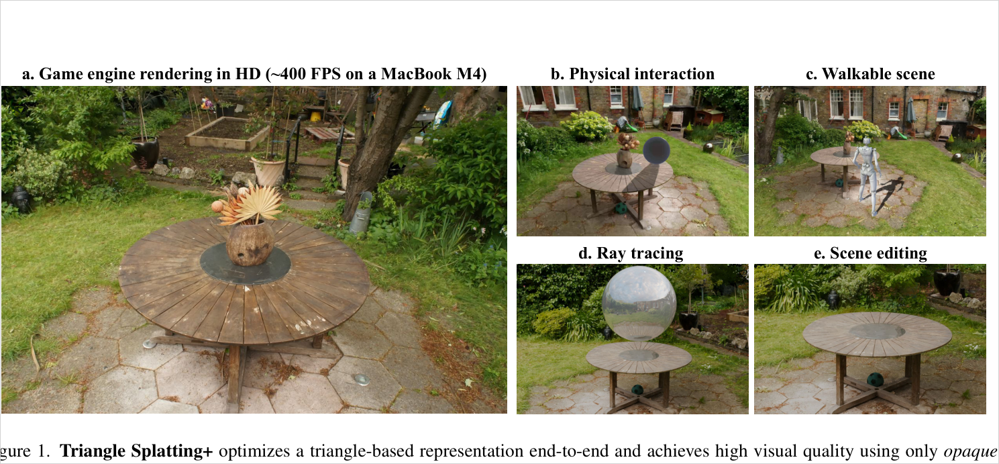
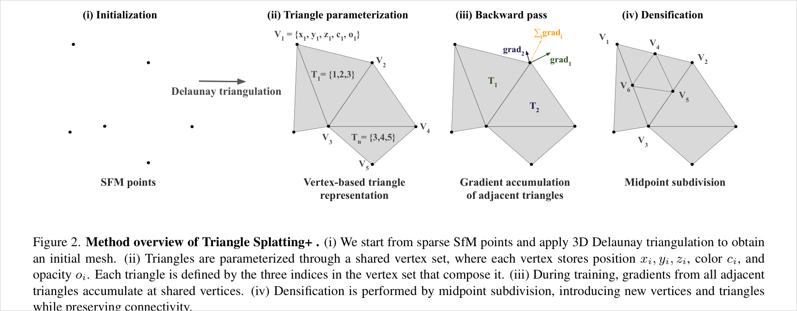
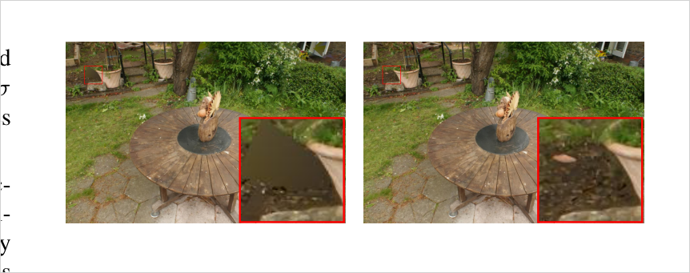
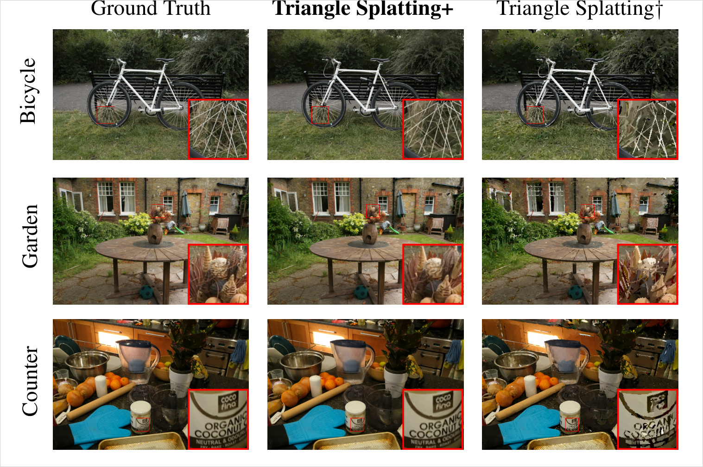
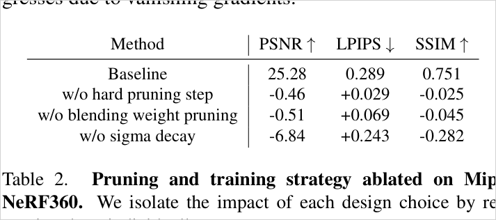
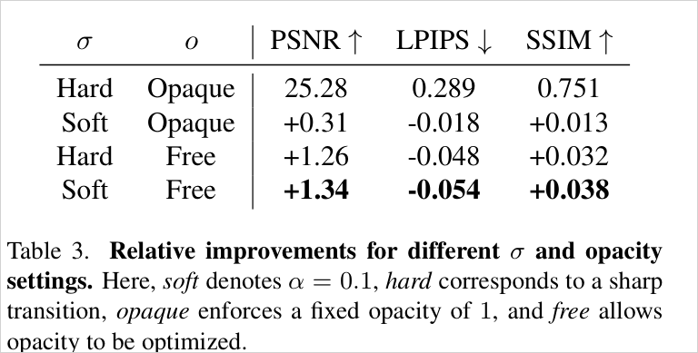
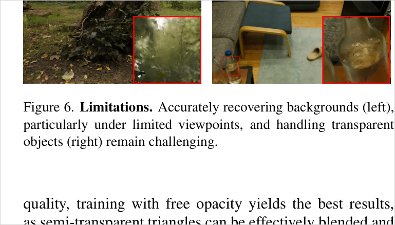

# Triangle Splatting+: Differentiable Rendering with Opaque Triangles

> Triangle Splatting의 soft/semi-transparent triangle soup를 shared-vertex mesh 구조 + soft→opaque anneal schedule로 바꿔, post-processing 없이 game engine에 바로 import되는 colored opaque triangle mesh를 학습한다. Mip-NeRF360/T&T mesh-based NVS에서 opaque Triangle Splatting·MiLo·2DGS/GOF/RaDe-GS 대비 LPIPS 우위, 2M vertices로 MacBook M4 HD ~400 FPS.

## 한눈에

| 항목 | 내용 |
| --- | --- |
| 문제 | 3DGS/Triangle Splatting의 primitive는 mesh renderer·game engine의 기본 primitive가 아니며, 기존 mesh 추출 파이프라인(2DGS/GOF/RaDe-GS)은 mesh extraction + re-coloring 후처리가 필요해 복잡하고 품질이 떨어진다 |
| 핵심 아이디어 | (1) triangle을 shared vertex set + index triplet으로 재파라미터화해 partial connectivity를 만들고, (2) 학습 초반엔 soft/semi-transparent로 gradient flow를 확보하다가 sigma·opacity를 anneal해 최종적으로 sharp/opaque triangle mesh로 수렴시킨다 |
| 입력 | posed multi-view images + SfM camera + sparse point cloud (3D Delaunay triangulation으로 초기 mesh 생성) |
| 출력 | post-processing 없이 standard renderer에 들어가는 colored opaque semi-connected triangle mesh |
| 주요 결과 | Mip-NeRF360 PSNR 25.21 / LPIPS 0.294 / SSIM 0.742 / 2M verts, T&T LPIPS 0.249 / SSIM 0.773 / 2M verts. game engine에서 MacBook M4 HD ~400 FPS |
| 한 줄 novelty | "triangle을 쓰자"가 아니라, **soft splatting의 gradient 이점과 opaque mesh의 deployment 이점을 shared-vertex 구조 + soft→opaque schedule로 연결**해 후처리 없는 mesh-ready 표현을 학습 |
| 안 푸는 것 | full watertight connectivity(semi-connected에 그침), transparent object(유리/병), sparse background geometry, hybrid primitive selection(opaque triangle 하나로 끝까지) |

- 저자: Jan Held, Renaud Vandeghen, Sanghyun Son, Daniel Rebain, Matheus Gadelha, Yi Zhou, Ming C. Lin, Marc Van Droogenbroeck, Andrea Tagliasacchi
- 버전: arXiv:2509.25122v1 (2025-09-29)
- PDF: `C:\Users\jinsw712\Desktop\Files\Research_WIKI\raw\papers\Triangle Splatting Plus.pdf`



## 1. 문제와 동기 (Paper Says)

NeRF는 고품질 novel-view synthesis를 보였지만 학습·렌더링이 느리고, 3DGS는 빠른 학습·실시간 렌더링을 얻었지만 Gaussian primitive는 VR headset·game engine·mesh renderer 같은 표준 그래픽스 파이프라인의 기본 primitive가 아니다. 따라서 Gaussian을 직접 지원하도록 엔진을 개조하거나, 2DGS/RaDe-GS/GOF처럼 optimized representation에서 mesh를 후처리로 추출하고 다시 색을 입혀야 한다. 이 후처리 단계는 파이프라인을 복잡하게 하고 품질 손실을 낳는다. (p.1-3)

**기존 Triangle Splatting과의 차이.** Triangle Splatting은 triangle을 splatting primitive로 최적화해 "triangle comeback"을 보였지만, 최종 결과가 unstructured triangle soup이고 training objective가 opaque triangle을 강제하지 않는다. 그래서 game engine이 soft/semi-transparent triangle을 solid mesh처럼 렌더링하면 품질이 눈에 띄게 저하되고, 각 triangle이 독립 vertex를 가지므로 공간적으로 겹치거나 색이 비슷해도 vertex를 공유하지 못한다. Triangle Splatting+는 이 두 한계를 각각 **shared-vertex representation**과 **opaque training schedule**로 정면 겨냥한다. (p.2-4)

## 2. 핵심 방법 (Paper Says)

전체 흐름은 `SfM points → 3D Delaunay triangulation → shared vertex/index triangle → adjacent gradient accumulation → midpoint subdivision`이다. 기존 Triangle Splatting과 달리 densification이 isolated primitive duplication이 아니라 **connectivity를 보존하는 subdivision**이라는 점이 핵심이다.



### 2.1 Shared vertex 기반 triangle representation (핵심 기여 1)
vertex set `V = {v_i}`를 두고 각 vertex를 `(x_i, y_i, z_i, c_i, o_i)`로 둔다. 위치, vertex color `c_i`, vertex opacity `o_i`가 모두 학습 대상이다. Triangle은 더 이상 독립 세 vertex 좌표가 아니라 `T_m = (i, j, k)`라는 vertex index triplet으로 정의된다. Triangle opacity는 `o_Tm = min(o_i, o_j, o_k)`, triangle 내부 color는 vertex color의 barycentric interpolation으로 얻는다. 이 구조 덕에 인접 triangle이 vertex를 공유하고, backward pass에서 여러 triangle의 gradient가 공유 vertex에 누적된다. (Fig. 2, p.3-4)

### 2.2 Differentiable rasterization
3D vertex는 pinhole camera model `q_i = K(R v_i + t)`로 image plane에 투영된다. Pixel `p`의 triangle contribution은 기존 Triangle Splatting의 2D triangle SDF window를 재사용한다. 2D triangle edge의 outward normal·offset으로 SDF `phi(p)`를 만들고 incenter `s`에서 정규화한 window `I(p)`를 쓴다. 이 window는 triangle 중심에서 1, boundary·outside에서 0이다. (Eq. 1, p.4)

### 2.3 Training strategy: soft에서 opaque로 (핵심 기여 2)
가장 중요한 설계는 **처음부터 solid/opaque로 학습하지 않는다**는 점이다. solid/opaque 상태에서는 경계 밖으로 gradient가 거의 흐르지 않아 geometry optimization이 막힌다. 그래서 초반에는 `sigma=1.0`의 soft transition과 자유로운 opacity로 gradient flow를 확보하고, 학습이 진행되며 shared smoothness `sigma`를 `0.0001`까지 anneal해 sharp triangle로 만든다. Opacity는 `opacity(x) = O_t + (1 - O_t) sigmoid(x)` 형태의 opacity floor를 두고, 첫 5k iteration 이후 `O_t`를 점차 올려 모든 triangle을 opaque하게 만든다. (p.4-5)

### 2.4 Pruning과 densification
Opaque 학습에서 pruning은 단순 메모리 최적화가 아니라 품질의 핵심이다. semi-transparent splat은 낮은 opacity로 숨을 수 있지만, 여기서는 끝에 모든 triangle이 opaque해지므로 불필요한 triangle을 제때 제거하지 않으면 그대로 mesh artifact가 된다. 첫 5k iteration 후 opacity threshold `T_o ≈ 0.2` 아래 triangle을 hard-pruning하며 이 단계에서 약 70%의 triangle/vertex를 제거한다. 이후엔 opacity가 floor에 의해 올라가 opacity만으로 pruning할 수 없으므로, rasterization 중 maximum volume rendering weight `T·o`를 보고 모든 training view에서 기여가 낮은 triangle을 제거한다. Densification은 MCMC-style opacity 기반 Bernoulli sampling으로 후보 triangle을 고르고, midpoint subdivision으로 한 triangle을 네 개로 나눠 connectivity를 보존한다. 새 midpoint vertex는 양 끝 vertex의 color/opacity 평균을 받는다. (Fig. 3, p.5; Table 2, p.8)



### 2.5 Optimization
초기화는 SfM camera/point cloud에서 시작한다. sparse point cloud에 3D Delaunay triangulation(tetrahedralization)을 적용하고 unique triangle을 추출해 초기 connected-ish mesh를 만든다. 학습 변수는 vertex position, opacity, SH color coefficients이며, loss는 photometric `L1`, `L_D-SSIM`, opacity loss `L_o`, normal loss `L_n`을 결합한다. Normal loss는 외부 normal estimation model로 supervise한다. Anti-aliasing은 목표 해상도보다 `s`배 크게 렌더링한 뒤 area interpolation으로 downsample한다. (p.5-6)

## 3. 핵심 수식

**Eq. 1 — bounded triangle window**
```text
phi(p) = max_i L_i(p),   L_i(p) = n_i · p + d_i
I(p)   = ReLU( phi(p) / phi(s) )^sigma
```
`phi(p)`는 projected 2D triangle의 SDF(외부 +, 내부 −, boundary 0), `s`는 incenter, `sigma`는 boundary-to-center transition의 sharpness. training 초반엔 smooth window로 gradient flow를 만들고, 끝에는 `sigma → 0.0001`로 sharp triangle에 가깝게 만든다. (p.4-5)

**Eq. 2 — alpha-style front-to-back accumulation**
```text
C(p) = sum_n c_Tn o_Tn I(p) prod_{i=1}^{n-1} (1 - o_Ti I(p))
```
`c_Tn`은 triangle color(vertex color의 barycentric interpolation), `o_Tn`은 triangle opacity(세 vertex opacity의 minimum). training 중엔 semi-transparent triangle을 depth order로 누적하고, 최종 opaque/sharp 상태에서는 front triangle 중심의 단순 평가로 줄어들어 mesh renderer와 잘 맞는다. (p.4)

**Opacity floor mapping**
```text
opacity(x) = O_t + (1 - O_t) sigmoid(x)
```
`O_t`는 opacity floor. 첫 5k iteration 뒤부터 증가시켜 opacity domain을 `[O_t, 1]`로 제한한다. opacity를 고정하지 않고 계속 최적화하되 최종적으로 transparent하게 남지 못하게 한다. (p.5)

**Eq. 3 — training loss**
```text
L = (1 - lambda) L1 + lambda L_D-SSIM + beta_1 L_o + beta_2 L_n
```
`L1`·`L_D-SSIM`은 posed view reconstruction, `L_o`는 opacity loss, `L_n`은 normal estimation model 기반 normal supervision. visual fidelity·opacity behavior·geometry consistency를 함께 맞춘다. (p.5)

## 4. 실험 근거

### 4.1 Mesh-based NVS 벤치마크 (Table 1)
논문은 일반 radiance-field image rendering이 아니라 **Mesh-Based Novel View Synthesis**를 평가한다. 즉 최종 mesh 자체의 visual fidelity가 기준이며 opaque triangle만 사용한다. 비교군은 opaque Triangle Splatting, MiLo, 2DGS, GOF, RaDe-GS이고 3DGS는 reference다. 2DGS/GOF/RaDe-GS는 mesh extraction + coloring 후처리가 필요하고, MiLo는 geometry는 end-to-end지만 color field/texturing 후처리가 필요하다. Ours만 E2E colored이고 semi-connectivity(`~`)를 갖는다.


핵심: PSNR 단독이 아니라 LPIPS(인간 지각과 상관 높음)에서 concurrent 전부를 앞서면서, 후처리 없이 E2E colored mesh를 낸다는 점이 차별점이다. (p.6)

### 4.2 정성 비교 (Fig. 4)


### 4.3 Downstream: object extraction (Fig. 5)
pixel이 사실상 하나의 front triangle에 대응하므로, 2D object mask(Segment Anything 2)에서 3D triangle set을 직접 회수해 object extraction/removal을 할 수 있다. Gaussian처럼 한 pixel에 여러 primitive가 누적되는 경우와 달리 front triangle assignment가 명확하다는 downstream 장점. (p.7-8)


### 4.4 Ablation: pruning·sigma decay (Table 2)
opaque triangle에서는 pruning과 sigma decay가 부가 요소가 아니라 core optimization mechanism이다. 특히 sigma decay 제거는 치명적이다.



### 4.5 Trade-off: soft/free vs opaque (Table 3)
free opacity + soft window를 허용하면 visual quality 자체는 더 좋아진다(Soft/Free가 최고). 그러나 game engine에서 sorting을 건너뛰고 빠르게 렌더링하려면 최종 opaque constraint가 필요하다 — quality와 engine deployability 사이의 명시적 trade-off.



### 4.6 Training speed / connectivity
- 학습 속도: A100 기준 Mip-NeRF360 39분, T&T 25분. MiLo는 T&T ~45분·Mip-NeRF360 최대 2시간. 원조 Triangle Splatting은 더 빠르지만(17/20분) 품질이 낮다. (p.7)
- Connectivity: 평균 vertex 연결 triangle 수 1.5, 전체 triangle의 80%가 최소 하나의 다른 triangle과 연결되며 일부는 최대 6개와 연결. 즉 watertight가 아니라 **semi-connected** mesh. (p.8)
- Parameterization: SH degree 3. vertex당 51 parameters(48 SH + 3 position), triangle당 3 parameters. 비교로 3DGS Gaussian 하나는 59 parameters. (p.6)

### 4.7 한계 시각화 (Fig. 6)


## 5. 해석 (Interpretation, model-side)

### 진짜 새로운 지점
novelty는 "triangle primitive를 쓰자"가 아니라 **"triangle primitive를 실제 mesh pipeline에 넣을 수 있게 훈련하자"**에 있다. 세 축으로 정리된다.
```text
Triangle Splatting:  SfM pts -> independent triangle soup -> soft/semi-transparent -> mesh renderer에서 품질 저하
Triangle Splatting+: SfM pts -> Delaunay -> shared-vertex mesh -> soft(gradient)→opaque(deploy) anneal -> 후처리 없는 E2E colored mesh
```
- representation: independent triangle soup → shared vertex/index mesh-like structure(partial connectivity).
- optimization: soft/semi-transparent splatting의 gradient 이점 + opaque mesh의 deployment 이점을 schedule로 연결.
- evaluation: radiance-field renderer quality가 아니라 mesh-based NVS + downstream engine usability를 전면에.

### 사용자 연구와의 연결
adaptive primitive 관점에서 Triangle Splatting+는 "surface/solid branch"의 강한 후보 primitive다. Gaussian/soft splat이 fuzzy residual·transparency·uncertain background를 담당하고, Triangle Splatting+류가 solid geometry·collision·editing·engine export를 담당하는 hybrid decomposition이 자연스럽다. 단 이 논문은 hybrid selection을 하지 않고 opaque triangle 하나로 끝까지 밀기에, transparent object·sparse background에서 한계가 드러난다. → [[adaptive-rank-primitive-splatting]], [[residual-guided-mesh-refinement-splatting]]와 대비.

### schedule이 중요한 이유
soft→opaque anneal은 gradient flow와 deployment의 절충이다. 초반 soft window로 geometry를 자유롭게 움직이게 하고, opacity floor·sigma decay로 최종적으로 sorting-free·post-processing-free한 opaque mesh를 강제한다. Table 3의 trade-off와 Table 2의 sigma decay 붕괴가 이 설계가 우연이 아님을 뒷받침한다.

## 6. 한계
- 논문이 직접 말한 한계: sparse initial point cloud가 있는 background는 geometry·fidelity가 떨어지고, training view orbit 밖으로 나가면 opaque triangle artifact가 Gaussian류보다 뚜렷하다. 유리/병 같은 transparent object는 opaque triangle만으로 표현 곤란. (Fig. 6, p.8)
- Semi-connectivity: pruning 때문에 full connectivity 미보장(평균 1.5, 80% ≥1 연결). watertight mesh가 아님. (p.8)
- 추론한 한계: normal estimation model supervision과 SfM/Delaunay initialization에 의존하므로, pose/point cloud 품질이 나쁘거나 textureless/specular 장면이면 triangle topology가 잘못 고정될 위험. 논문이 완전한 failure analysis를 제공하지는 않음.

## 7. Open Questions
- Opaque triangle branch와 Gaussian/soft residual branch를 함께 쓰면 transparent object·sparse background 한계를 줄일 수 있는가?
- Shared vertex connectivity를 pruning 이후에도 더 강하게 유지하려면 edge collapse, remeshing, topology regularization이 필요한가?
- Normal supervision 없이 순수 photometric/geometry-consistency loss만으로 비슷한 mesh-based NVS 품질을 얻을 수 있는가?
- Pixel-to-front-triangle assignment를 object editing을 넘어 semantic/material editing, physics property assignment까지 확장할 수 있는가?
- Mesh-based NVS의 PSNR/LPIPS와 실제 game-engine usability(collision·walkability quality) 사이의 상관은 충분한가?

## Evidence Anchors
- p.1: Fig. 1 teaser — game engine rendering, physical interaction, walkable scene, ray tracing, scene editing
- p.2: NeRF/3DGS/mesh extraction pipeline 한계, Triangle Splatting의 soft/semi-transparent/isolated triangle 문제
- p.3: Fig. 2 method overview — SfM points, Delaunay, shared vertex representation, gradient accumulation, midpoint subdivision
- p.4: vertex/triangle representation, SDF window Eq. 1, alpha accumulation Eq. 2, training strategy motivation
- p.5: Fig. 3 hard pruning, sigma annealing, opacity floor mapping, 5k hard pruning(T_o≈0.2, ~70%), blending-weight pruning, Delaunay init, loss Eq. 3
- p.6: Table 1 mesh-based NVS 정량 비교, task/baseline 정의, 51/3/59 parameters
- p.7: Fig. 4 qualitative, Fig. 5 object extraction/removal, training speed(39분/25분)
- p.8: Table 2 pruning/sigma ablation, Table 3 sigma/opacity trade-off, Fig. 6 limitations, Unity collider/walkable, connectivity 통계(1.5 / 80%)
- p.9: conclusion

## Related WIKI Pages
- [[triangle-splatting]]
- [[triangle-soup-differentiable-rendering]]
- [[bounded-triangle-window-function]]
- [[primitive-lifecycle-for-splatting]]
- [[mesh-compatible-radiance-field]]
- [[shared-vertex-triangle-splatting]]
- [[opaque-triangle-training-schedule]]
- [[mesh-based-novel-view-synthesis]]
