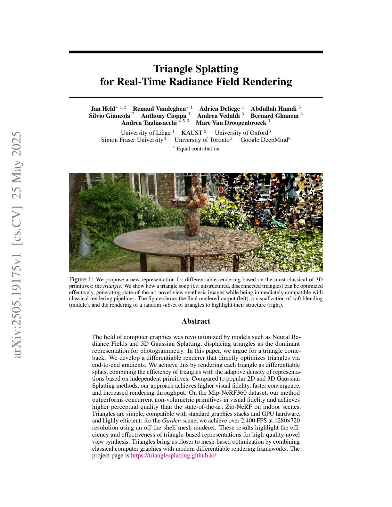
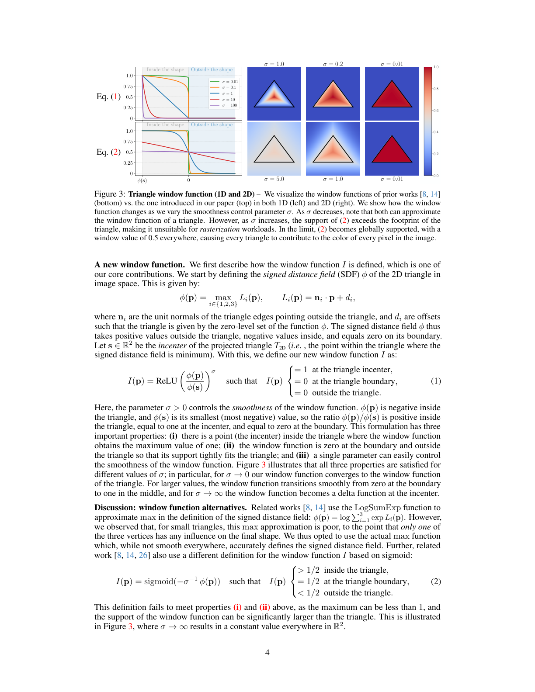
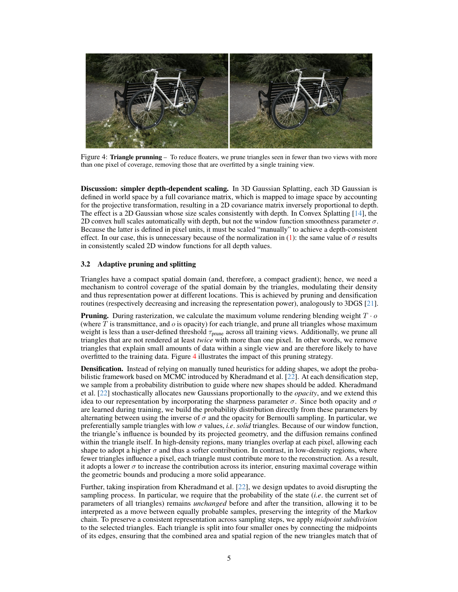
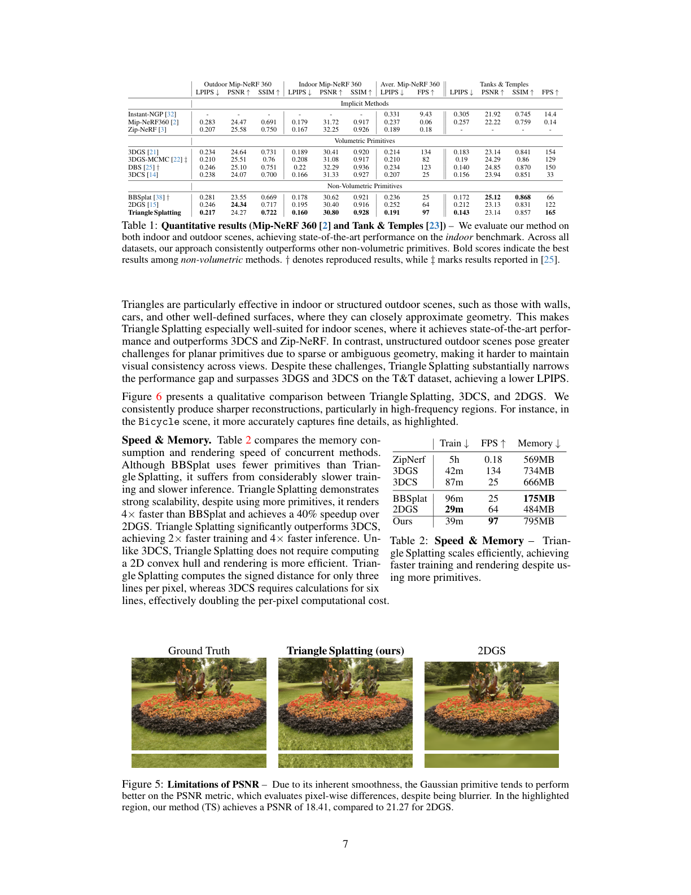
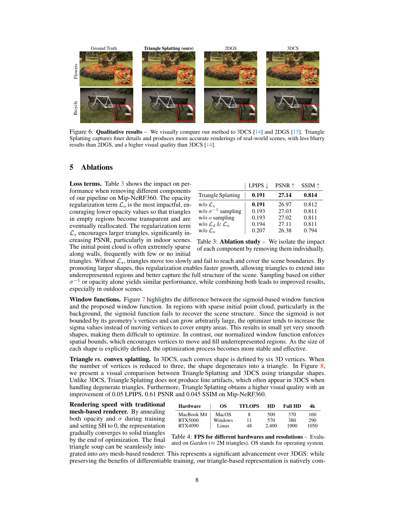
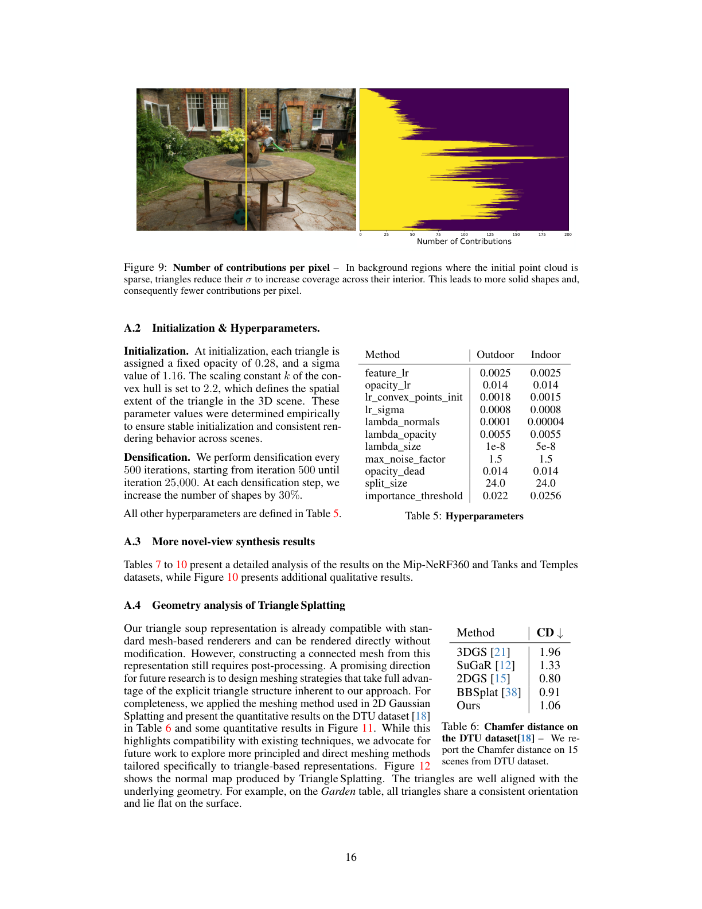

# Triangle Splatting for Real-Time Radiance Field Rendering

## Paper
- 저자: Jan Held, Renaud Vandeghen, Adrien Deliege, Abdullah Hamdi, Silvio Giancola, Anthony Cioppa, Andrea Vedaldi, Bernard Ghanem, Andrea Tagliasacchi, Marc Van Droogenbroeck
- 버전: arXiv:2505.19175v1, 2025-05-25
- 주제: triangle soup를 differentiable splatting primitive로 직접 최적화해 novel-view synthesis와 표준 mesh renderer 호환성을 동시에 얻는 방법
- PDF: `C:\Users\jinsw712\Desktop\Files\Research_WIKI\raw\papers\Triangle Splatting.pdf`

## Main Claim
Triangle Splatting의 중심 주장은 radiance field 재구성에서 triangle을 다시 1급 primitive로 사용할 수 있다는 것이다. 논문은 unstructured/disconnected triangle soup를 화면 공간에서 bounded differentiable splat으로 렌더링하고, vertex, opacity, sharpness, SH color를 end-to-end로 최적화한다. 핵심은 triangle 내부에만 support를 갖는 normalized window function과 pruning/splitting 기반 primitive lifecycle이다. 이 설계는 Gaussian류의 adaptive independent primitive 장점과 triangle의 GPU/mesh pipeline 호환성을 결합해, 2DGS/3DGS/3DCS 대비 LPIPS와 렌더링 속도에서 강점을 보인다고 주장한다.

## Paper Says: Motivation and Previous Work
### 문제
NeRF와 3DGS는 photogrammetry와 novel-view synthesis에서 강력하지만, NeRF류는 volume integration 비용이 크고, 3D Gaussian은 infinite support와 smooth fall-off 때문에 sharp edge, watertight surface, 명확한 surface 정의에 약하다. 2DGS와 convex splatting은 surface 구조를 일부 회복하지만, 여전히 triangle mesh처럼 표준 graphics stack에 바로 들어가는 형태는 아니다. (p.2-3)

### 왜 triangle인가
Triangle은 전통 그래픽스에서 가장 표준적인 primitive이며 GPU hardware, game engine, mesh processing 도구와 자연스럽게 맞는다. 그러나 기존 differentiable mesh renderer는 보통 template mesh나 known topology를 요구한다. 이 논문은 topology를 미리 주지 않고 SfM sparse point에서 시작한 triangle soup를 직접 최적화한다는 점을 차별점으로 둔다. (p.2)

### 관련 방법과의 경계
- 3DGS: adaptive independent primitives와 빠른 optimization은 강하지만 surface가 fuzzy하고 Gaussian support가 무한하다.
- 2DGS/BBSplat: non-volumetric/planar primitive지만 표준 triangle renderer와 동일한 호환성은 아니다.
- 3DCS: convex primitive로 hard edge를 더 잘 다루지만, convex hull 계산과 더 많은 line distance 때문에 느리고 memory footprint가 크다.
- Soft rasterizer류: boundary를 부드럽게 만들어 gradient를 보내지만 template mesh 의존성이 남는다. (p.2-4)

## Paper Says: Method
### Representation
각 primitive는 3D triangle `T_3D`이며 세 vertex `v_i in R^3`, color/SH coefficient `c`, smoothness parameter `sigma`, opacity `o`를 가진다. 세 vertex는 optimization 중 자유롭게 움직인다. 카메라 projection으로 2D triangle `T_2D`를 만들고, pixel `p`에 대해 window function `I(p)`를 opacity처럼 사용해 depth order로 alpha compositing한다. (p.3)

### Differentiable triangle window
논문의 핵심은 2D triangle의 signed distance field `phi(p)`를 만들고, triangle incenter `s`에서의 최솟값 `phi(s)`로 정규화한 window function이다. 이 함수는 triangle boundary와 외부에서 0, incenter에서 1이며, `sigma`가 smoothness를 조절한다. Sigmoid 기반 window는 support가 triangle 밖으로 퍼지고 `sigma -> infinity`에서 전역적으로 0.5에 가까워지는 문제가 있지만, 제안 함수는 support가 triangle projection에 묶인다. (Fig. 3, p.4)

### Depth-consistent scaling
`I(p)`가 `phi(p) / phi(s)` 비율에만 의존하므로, projection scale이 바뀌어도 같은 `sigma`가 같은 모양의 window를 만든다. Supplementary는 triangle이 평면상에서 `a`배 scale되면 `phi`와 `min phi`가 둘 다 `a`배가 되어 ratio가 보존됨을 Eq. 4로 보인다. (p.5, p.15)

### Adaptive pruning and splitting
Triangle은 compact support를 가지므로 scene coverage를 제어하는 lifecycle이 중요하다. 논문은 낮은 maximum blending weight를 가진 triangle을 prune하고, 두 view 이상에서 1 pixel 초과로 보이지 않는 triangle을 제거해 single-view overfit floater를 줄인다. Densification은 3DGS-MCMC에서 영감을 받아 opacity와 inverse sharpness `sigma^-1` 기반 Bernoulli sampling으로 split 대상을 고른다. 선택된 triangle은 midpoint subdivision으로 4개 작은 triangle로 나뉘며, 너무 작은 triangle은 split 대신 plane 방향 noise를 더해 clone한다. (p.5-6)

### Optimization
초기화는 SfM sparse point cloud에서 각 3D point마다 triangle 하나를 만든다. point `q` 주변 세 nearest neighbor 평균 거리 `d`를 이용해, unit sphere에서 뽑은 세 vertex를 `v_i = q + k d u_i`로 배치한다. 최적화 변수는 vertex positions, `sigma`, opacity, SH color coefficient다. Loss는 photometric `L1`, `L_D-SSIM`, opacity loss `L_o`, distortion `L_d`, normal `L_n`, size regularization `L_s`를 합친다. SH degree는 3이며, triangle당 parameter 수를 3DGS Gaussian 하나와 같은 59개로 맞춘다. (p.6)

## Visual Evidence
### Fig. 1: triangle soup가 실제 scene primitive가 되는 모습

Fig. 1은 최종 rendering, soft blending 시각화, random subset triangle 구조를 함께 보여준다. 논문이 말하는 triangle은 connected watertight mesh가 아니라 unstructured triangle soup라는 점이 중요하다. (p.1)

### Fig. 3: window function이 triangle 내부 support를 보존

Fig. 3은 제안 window와 sigmoid 계열 window의 차이를 1D/2D로 보여준다. 제안 함수는 `sigma`가 바뀌어도 triangle footprint를 넘지 않지만, sigmoid 함수는 large `sigma`에서 support가 triangle 밖으로 커지고 결국 모든 pixel에 기여하는 형태가 된다. 이 그림은 논문의 differentiable renderer가 왜 rasterization workload에 맞는지 설명하는 핵심 증거다. (p.4)

### Fig. 4: single-view overfit triangle pruning

Fig. 4는 두 view 이상에서 충분히 보이지 않는 triangle을 제거하면 floaters가 줄어든다는 점을 시각화한다. Non-volumetric primitive는 보이는 각도가 제한되므로 large outdoor scene에서 single-view overfit이 특히 중요하다. (p.5)

### Table 1-2 and Fig. 5: fidelity/speed trade-off

Table 1에서 Triangle Splatting은 Mip-NeRF360 average LPIPS `0.191`, FPS `97`, T&T LPIPS `0.143`, FPS `165`를 보고한다. 2DGS는 Mip-NeRF360 LPIPS `0.252`, FPS `64`, 3DCS는 LPIPS `0.207`, FPS `25`다. Table 2에서는 training time이 `39m`으로 3DCS `87m`, BBSplat `96m`보다 빠르며, 3DGS `42m`와 비슷하다. Fig. 5는 Triangle Splatting이 더 sharp해 보여도 PSNR은 smooth Gaussian reconstruction을 더 높게 줄 수 있음을 보여준다. (p.7)

### Fig. 6-8 and Table 3-4: qualitative and ablation evidence

Fig. 6은 Bicycle/Flowers에서 2DGS보다 덜 blurry하고 3DCS보다 visual quality가 높은 예를 제시한다. Table 3은 opacity loss `L_o` 제거가 LPIPS를 `0.191 -> 0.207`로 악화시켜 empty-region triangle reallocation이 중요함을 보인다. Fig. 7은 sigmoid window가 sparse background를 복원하지 못하는 반면 normalized window가 coverage를 유도함을 보인다. Table 4는 final triangle soup가 mesh renderer에서 RTX4090 기준 HD 2400 FPS, Full HD 1900 FPS, 4K 1050 FPS를 낸다고 보고한다. (p.8-9)

### Supplementary Fig. 9, Table 5-6, Fig. 11-13

Fig. 9는 sparse background에서 triangle이 낮은 `sigma`로 더 solid해지고 contribution 수가 줄어드는 현상을 보여준다. Table 5는 opacity init `0.28`, sigma init `1.16`, scale constant `k=2.2`, densification every 500 iterations from 500 to 25000, shape count +30% 등을 제공한다. Table 6은 DTU Chamfer에서 Triangle Splatting `1.06`으로 2DGS `0.80`, BBSplat `0.91`보다는 나쁘지만 3DGS `1.96`, SuGaR `1.33`보다는 좋다고 보고한다. Fig. 11-13은 TSDF fusion mesh extraction, normal alignment, game-engine conversion을 보여준다. (p.16-18)

## Key Equations
### Eq. 1: normalized bounded triangle window
```text
phi(p) = max_i L_i(p)
L_i(p) = n_i · p + d_i
I(p) = ReLU(phi(p) / phi(s))^sigma
```
- `L_i`: triangle edge의 outside-facing line equation
- `phi(p)`: 2D projected triangle의 signed distance field; 외부 positive, 내부 negative, boundary zero
- `s`: projected triangle incenter, `phi(s)`는 triangle 내부에서 가장 작은 값
- 역할: triangle 내부에서만 differentiable opacity-like contribution을 만들고, boundary와 외부에서는 contribution을 0으로 제한한다. (p.4)

### Eq. 2: 기존 sigmoid window와의 대비
```text
I(p) = sigmoid(-sigma^-1 phi(p))
```
이 방식은 boundary에서 0.5이고 triangle 밖에서도 0보다 큰 값을 가지므로 support가 geometry 밖으로 번진다. 논문은 이 점이 rasterization workload와 sparse region optimization에 부적합하다고 본다. (p.4, Fig. 3, Fig. 7)

### Eq. 3: final training loss
```text
L = (1 - lambda) L1 + lambda L_D-SSIM
    + beta1 L_o + beta2 L_d + beta3 L_n + beta4 L_s
```
`L_o`는 opacity regularization, `L_d`와 `L_n`은 2DGS에서 온 distortion/normal loss, `L_s`는 triangle size를 키우는 regularizer다. `L_s = 2 ||(v1 - v0) x (v2 - v0)||_2^-1` 형태로 작은 triangle에 penalty를 주어 wall/background 같은 sparse initial point 영역을 더 빨리 덮도록 돕는다. (p.6, p.8)

### Eq. 4: depth-dependent scaling invariance
```text
phi'(p') / min phi' = a phi(p) / (a min phi) = phi(p) / min phi
I'(p') = I(p)
```
projected triangle이 scale `a`만큼 커져도 ratio가 보존되므로, 같은 `sigma`가 depth와 무관하게 일관된 window shape를 만든다. (p.15)

### Eq. 5-6: tile assignment bounding box tightening
```text
tau_cutoff = (d / L(s))^sigma · o
d = L(s) · (tau_cutoff / o)^(1/sigma)
```
opacity가 낮거나 `sigma`가 커져 실제 contribution region이 triangle vertex까지 닿지 않을 때, 이 식으로 더 tight한 tile bounding box를 만들 수 있다. (p.15)

## Implementation
- 입력: posed multi-view images + SfM camera parameters + sparse point cloud. (p.6)
- 초기 primitive: SfM 3D point 하나당 triangle 하나. (p.6)
- 초기 opacity: `0.28`; 초기 sigma: `1.16`; scale constant `k=2.2`. (p.16)
- SH degree: 3, triangle당 59 parameters로 3DGS Gaussian 하나와 맞춤. (p.6)
- Densification: 500 iteration부터 25000 iteration까지 500 iteration마다 수행, shape 수를 30% 증가. (p.16)
- Pruning: low maximum `T · o` 및 two-view visibility 조건 미달 triangle 제거. (p.5)
- Indoor/outdoor hyperparameter는 별도 설정: 예컨대 `lambda_normals`는 outdoor `0.0001`, indoor `0.00004`, `lambda_size`는 outdoor `1e-8`, indoor `5e-8`. (Table 5, p.16)
- Mesh renderer 전환: 마지막 5000 iteration에서 low opacity triangle을 prune하고 high opacity/low sigma를 유도해 mostly solid opaque triangle로 만든 뒤 standard mesh renderer format으로 변환한다. (p.18)

## Experiments
### Benchmarks and baselines
실험은 Mip-NeRF360 indoor/outdoor, Tanks and Temples를 중심으로 하고, implicit method(Instant-NGP, Mip-NeRF360, Zip-NeRF), volumetric primitive(3DGS, 3DGS-MCMC, DBS, 3DCS), non-volumetric primitive(BBSplat, 2DGS)와 비교한다. metric은 LPIPS, PSNR, SSIM, FPS, training time, memory다. FPS와 training time은 NVIDIA A100에서 측정했다. (p.6)

### Main results
- Mip-NeRF360 average: Triangle Splatting LPIPS `0.191`, FPS `97`; 2DGS LPIPS `0.252`, FPS `64`; 3DCS LPIPS `0.207`, FPS `25`; Zip-NeRF LPIPS `0.189`, FPS `0.18`. (Table 1, p.7)
- Indoor Mip-NeRF360: Triangle Splatting LPIPS `0.160`, PSNR `30.80`, SSIM `0.928`, 논문은 Zip-NeRF보다 LPIPS가 낮고 3DCS보다 LPIPS가 낮다고 강조한다. (Table 1, p.7)
- T&T: Triangle Splatting LPIPS `0.143`, PSNR `23.14`, SSIM `0.857`, FPS `165`; 3DGS LPIPS `0.183`, FPS `154`; 3DCS LPIPS `0.156`, FPS `33`; 2DGS LPIPS `0.212`, FPS `122`. (Table 1, p.7)
- Speed/memory: Triangle Splatting train `39m`, FPS `97`, memory `795MB`; 3DGS train `42m`, FPS `134`, memory `734MB`; 3DCS train `87m`, FPS `25`, memory `666MB`. (Table 2, p.7)

### Ablations
- `L_o` 제거가 가장 큰 악화: LPIPS `0.191 -> 0.207`, PSNR `27.14 -> 26.38`, SSIM `0.814 -> 0.794`. 이는 transparency/reallocation이 floaters와 empty-region handling에 중요하다는 근거다. (Table 3, p.8)
- `sigma^-1` sampling 또는 opacity sampling만 쓰면 LPIPS `0.193`으로 소폭 악화된다. 둘을 결합하는 것이 특히 outdoor에 유리하다고 설명한다. (p.8)
- `L_s` 제거는 LPIPS는 거의 같지만 PSNR과 SSIM을 낮춘다. 논문은 sparse point cloud가 wall/background를 충분히 덮지 못하므로 larger triangle regularization이 필요하다고 본다. (p.8)
- Sigmoid window는 sparse background에서 vertices를 움직이기보다 sigma를 키워 작은 smooth shape에 머물기 쉬워 복원 실패를 만든다. (Fig. 7, p.9)
- 3DCS convex를 triangle처럼 3 vertices로 줄이면 line artifact가 생기지만 Triangle Splatting은 이를 피한다. (Fig. 8, p.9)

### Geometry and mesh compatibility
DTU Chamfer distance에서는 Triangle Splatting `1.06`으로 2DGS `0.80`, BBSplat `0.91`보다 나쁘다. 이는 논문의 핵심 강점이 connected mesh extraction quality 자체가 아니라 mesh-renderer-compatible triangle soup와 visual rendering quality에 있음을 보여준다. Normal map에서는 triangle orientation이 local geometry와 잘 맞는 사례를 보인다. (p.16-18)

## Interpretation
### What is genuinely new
이 논문의 핵심 novelty는 “triangle mesh를 differentiable하게 렌더링한다”만이 아니라, topology-free triangle soup를 3DGS식 independent primitive optimization으로 다루면서도 support를 triangle 내부로 제한하는 window를 만든 점이다. 즉, mesh template 없이 시작하지만 결과 primitive는 표준 triangle이다.

```text
3DGS 계열:
SfM points -> independent Gaussian primitives -> differentiable splatting -> fuzzy/non-mesh-compatible scene

Triangle Splatting:
SfM points -> independent triangle soup -> bounded differentiable splatting -> mesh-renderer-compatible triangle soup
```

### Modern perspective
Triangle Splatting은 NeRF/3DGS 이후 radiance field 연구가 다시 “renderer compatibility”와 “surface primitive”로 돌아가는 흐름을 잘 보여준다. 사용자가 생각하는 hybrid surface/residual splatting 관점에서는 triangle이 hard explicit surface 담당 primitive가 될 수 있고, Gaussian/2DGS는 fuzzy residual 또는 surface-friendly soft component가 될 수 있다. 다만 논문 자체는 hybrid primitive selection이 아니라 triangle 단일 primitive를 끝까지 밀어붙인다.

### Why the window matters
제안 window function은 gradient flow와 rasterizer semantics 사이의 절충이다. boundary는 hard하게 0 support를 유지하면서 내부는 smooth contribution을 주므로, triangle이 Gaussian처럼 무한 support로 흐르지 않는다. 이 때문에 tile assignment, game-engine conversion, standard mesh renderer compatibility가 논문의 다른 claim과 연결된다.

### What this paper does not solve
Triangle soup가 곧 connected watertight mesh는 아니다. 논문은 standard mesh renderer에서 render 가능하다고 하지만, physical simulation, collision, editing, path tracing에 쓰기 좋은 clean mesh를 얻으려면 추가 meshing/post-processing이 필요하다. DTU Chamfer도 2DGS보다 낮지 않으므로 geometry extraction paper로만 읽으면 claim이 약해진다.

## Limitations
- Connected mesh 생성은 아직 별도 post-processing이 필요하다. Triangle soup는 renderable하지만 topology가 없다. (p.9, p.16)
- large-scale outdoor scenes에서 floaters가 가끔 발생한다. 논문은 non-volumetric shape가 volumetric shape보다 적은 viewpoint supervision을 받아 single-view overfit되기 쉽다고 설명한다. (p.9)
- depth sorting은 현재 triangle center 기준이라 view rotation 중 popping/blending artifact가 생길 수 있다. Supplementary는 per-pixel sorting을 future work로 제안한다. (p.15)
- DTU Chamfer는 2DGS/BBSplat보다 나쁘다. 즉 explicit triangle이라는 이름만으로 superior geometry를 보장하지는 않는다. (Table 6, p.16)
- game-engine visual은 shader 없이 렌더링했고, game-engine fidelity에 맞춘 training은 아직 future work다. (p.18)
- 메모리는 Table 2에서 `795MB`로 비교군 중 높은 편이다. 빠른 renderer compatibility와 primitive 수 증가 사이 trade-off가 있다. (p.7)

## Open Questions
- Triangle soup를 connected/watertight mesh로 만들기 위한 가장 자연스러운 post-processing 또는 training prior는 무엇인가?
- Triangle Splatting과 Gaussian residual을 함께 쓰면, surface 영역은 triangle이 담당하고 fuzzy/transparent/detail residual은 Gaussian이 담당하는 분해가 가능한가?
- Center-depth sorting 대신 per-pixel sorting을 넣으면 quality/FPS/memory trade-off가 어떻게 변하는가?
- `sigma`와 opacity annealing으로 solid triangle을 만들 때, visual quality와 standard renderer compatibility 사이의 최적 schedule은 무엇인가?
- DTU Chamfer에서 2DGS보다 낮은 geometry 성능을 개선하려면 normal/depth supervision, connectivity prior, edge regularization 중 무엇이 가장 중요한가?

## Evidence Anchors
- p.1: title, authors, arXiv version, abstract, Fig. 1 triangle soup overview
- p.2: motivation, triangle as standard graphics primitive, template-free triangle soup claim, Fig. 2 game-engine compatibility
- p.3: related work, primitive comparison, method overview, projected triangle rasterization
- p.4: Eq. 1-2, Fig. 3 window function comparison
- p.5: depth-dependent scaling discussion, pruning, densification design, Fig. 4
- p.6: initialization, loss Eq. 3, experiment setup, SH degree 3 and 59 parameters
- p.7: Table 1-2 benchmark, speed, memory, PSNR limitation Fig. 5
- p.8: Fig. 6 qualitative results, Table 3 ablations, window and triangle-vs-convex discussion
- p.9: Fig. 7-8, Table 4 hardware FPS, conclusion and limitations
- p.15: Supplementary Eq. 4-6, tile assignment, center-depth sorting limitation, densification explanation
- p.16: Fig. 9, Table 5 hyperparameters, Table 6 DTU Chamfer and mesh analysis
- p.17: Tables 7-10 per-scene results, Fig. 10 additional qualitative results
- p.18: Fig. 11-13 mesh extraction, normal map, mesh-based renderer transformation

## Related WIKI Pages
- [Triangle Soup Differentiable Rendering](../concepts/triangle-soup-differentiable-rendering.md)
- [Bounded Triangle Window Function](../concepts/bounded-triangle-window-function.md)
- [Primitive Lifecycle for Splatting](../concepts/primitive-lifecycle-for-splatting.md)
- [Mesh-Compatible Radiance Field](../concepts/mesh-compatible-radiance-field.md)
- [Adaptive Rank Primitive Splatting](../claims/adaptive-rank-primitive-splatting.md)
