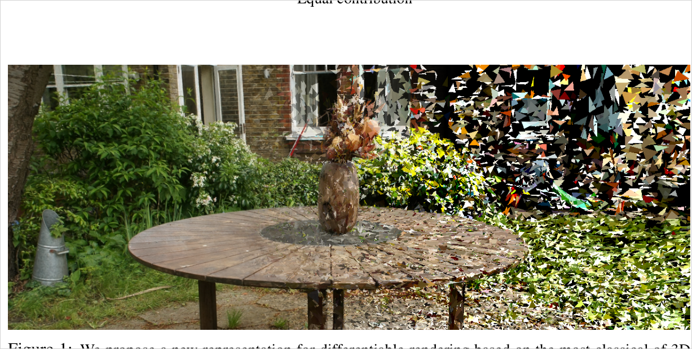
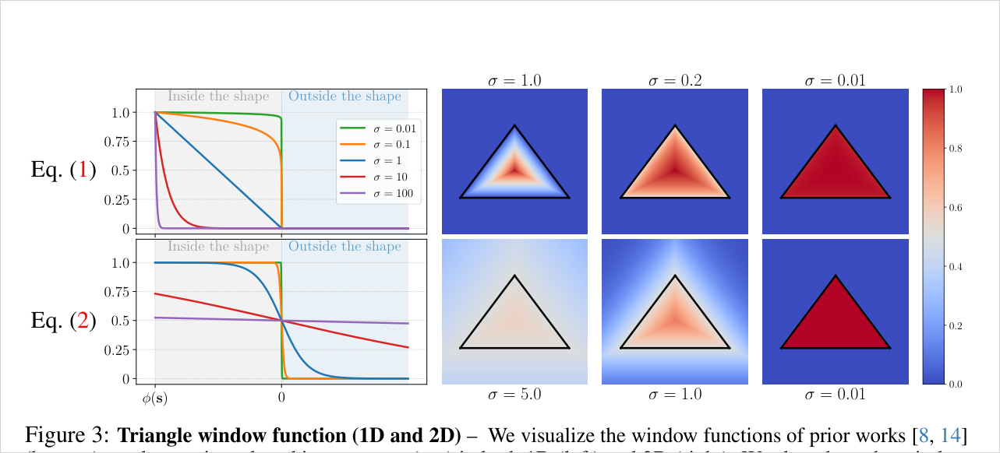
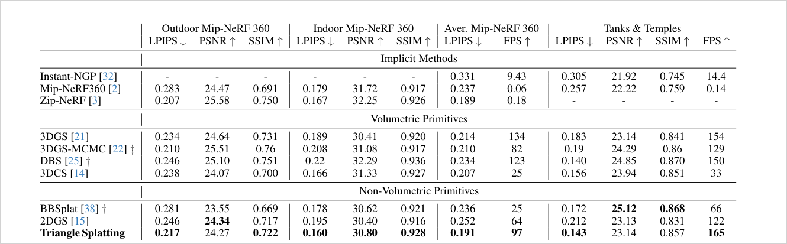
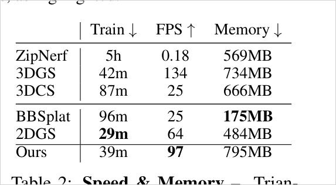
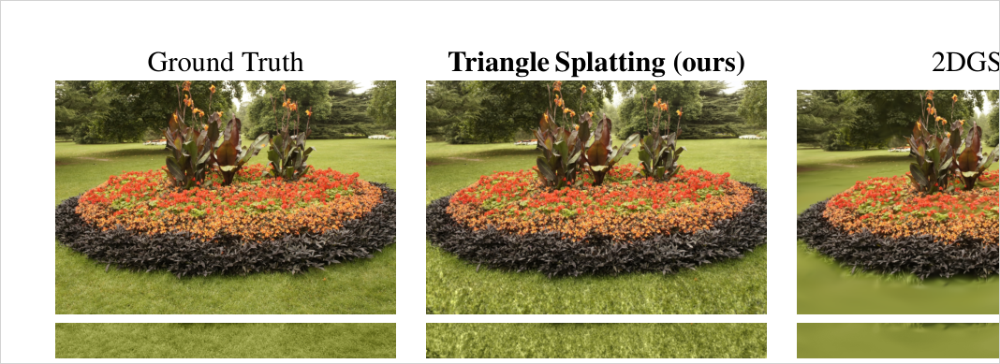
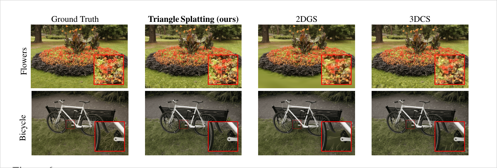
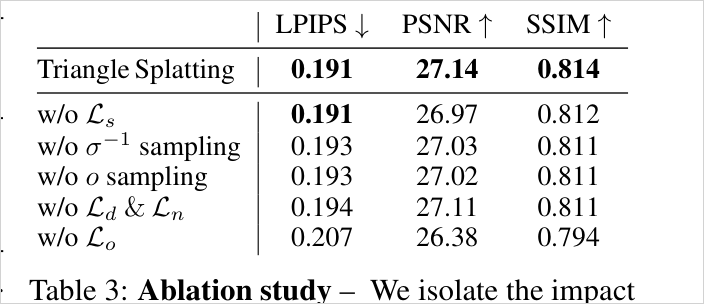
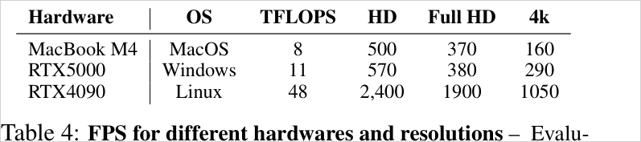

# Triangle Splatting for Real-Time Radiance Field Rendering

> Topology 없는 triangle soup를 3DGS식 independent primitive처럼 최적화하되, support를 triangle 내부로 묶는 bounded window function을 도입해 표준 mesh renderer와 호환되는 결과를 얻는다. Mip-NeRF360/T&T에서 2DGS·3DCS 대비 LPIPS·속도 우위.

## 한눈에

| 항목 | 내용 |
| --- | --- |
| 문제 | 3DGS는 fuzzy·infinite support라 sharp surface/mesh 호환이 약하고, 기존 differentiable mesh renderer는 template topology를 요구함 |
| 핵심 아이디어 | SfM point당 triangle 하나로 시작하는 triangle soup를 vertex/opacity/sharpness/SH까지 end-to-end 최적화. 핵심은 triangle 내부에만 support를 갖는 normalized window function |
| 입력 | posed multi-view images + SfM camera + sparse point cloud |
| 출력 | mesh-renderer 호환 triangle soup (connected/watertight mesh는 아님) |
| 주요 결과 | Mip-NeRF360 avg LPIPS 0.191 / FPS 97, T&T LPIPS 0.143 / FPS 165. 최종 soup는 mesh renderer에서 RTX4090 기준 4K 1050 FPS |
| 한 줄 novelty | "triangle을 미분가능 렌더링"이 아니라, **template-free triangle soup를 independent-primitive로 최적화 + support를 triangle 내부로 bound** |
| 안 푸는 것 | connectivity/watertightness (별도 post-processing 필요), geometry 정확도(DTU Chamfer는 2DGS보다 나쁨) |

- 저자: Jan Held, Renaud Vandeghen, Adrien Deliege, Abdullah Hamdi, Silvio Giancola, Anthony Cioppa, Andrea Vedaldi, Bernard Ghanem, Andrea Tagliasacchi, Marc Van Droogenbroeck
- 버전: arXiv:2505.19175v1 (2025-05-25)
- PDF: `C:\Users\jinsw712\Desktop\Files\Research_WIKI\raw\papers\Triangle Splatting.pdf`



## 1. 문제와 동기 (Paper Says)

NeRF·3DGS는 novel-view synthesis에 강하지만, NeRF류는 volume integration 비용이 크고 3D Gaussian은 infinite support·smooth fall-off 때문에 sharp edge, watertight surface, 명확한 surface 정의에 약하다. 2DGS·convex splatting은 surface 구조를 일부 회복하지만 여전히 표준 graphics stack에 그대로 들어가는 triangle mesh 형태는 아니다. (p.2-3)

**왜 triangle인가.** Triangle은 GPU hardware·game engine·mesh 도구와 자연스럽게 맞는 표준 primitive다. 그러나 기존 differentiable mesh renderer는 대개 template mesh나 known topology를 요구한다. 이 논문은 topology를 미리 주지 않고 SfM sparse point에서 시작한 triangle soup를 직접 최적화한다는 점을 차별점으로 둔다. (p.2)

**경계에 있는 방법들.**
- 3DGS: adaptive independent primitive와 빠른 최적화는 강하지만 surface가 fuzzy, support가 무한.
- 2DGS/BBSplat: planar/non-volumetric이지만 표준 triangle renderer와 동일 호환은 아님.
- 3DCS: convex로 hard edge를 잘 다루나 convex hull 계산·line distance가 많아 느리고 memory가 큼.
- Soft rasterizer류: boundary를 부드럽게 해 gradient를 보내지만 template mesh 의존이 남음. (p.2-4)

## 2. 핵심 방법 (Paper Says)

### 2.1 Representation
각 primitive는 3D triangle `T_3D`이며 세 vertex `v_i in R^3`, SH color `c`, smoothness `sigma`, opacity `o`를 가진다. 카메라 projection으로 2D triangle `T_2D`를 만들고, pixel `p`의 window 값 `I(p)`를 opacity처럼 써서 depth order로 alpha compositing한다. 세 vertex는 최적화 중 자유롭게 움직인다. (p.3)

### 2.2 Bounded differentiable window (핵심 기여)
2D triangle의 signed distance field `phi(p)`를 만들고, incenter `s`에서의 최솟값 `phi(s)`로 정규화한다. 결과 window는 boundary·외부에서 0, incenter에서 1이며 `sigma`가 smoothness를 조절한다. 아래 Fig. 3 상단(Eq.1, 제안)은 `sigma`가 커져도 support가 triangle 안에 머무는 반면, 하단(Eq.2, sigmoid 계열)은 큰 `sigma`에서 support가 삼각형 밖으로 번져 결국 모든 pixel에 0.5로 기여한다.



### 2.3 Depth-consistent scaling
`I(p)`가 `phi(p)/phi(s)` 비율에만 의존하므로 projection scale이 바뀌어도 같은 `sigma`가 같은 모양의 window를 만든다. 즉 depth에 무관하게 일관된 window shape(§3 Eq.4). (p.5, p.15)

### 2.4 Adaptive pruning / splitting
Triangle은 compact support라 coverage lifecycle이 중요하다. maximum blending weight가 낮은 triangle과, 두 view 이상에서 1 pixel 초과로 보이지 않는 triangle을 prune해 single-view overfit floater를 줄인다. Densification은 3DGS-MCMC에서 영감을 받아 opacity와 inverse sharpness `sigma^-1` 기반 Bernoulli sampling으로 split 대상을 고르고, midpoint subdivision으로 4개로 쪼갠다. 너무 작은 triangle은 split 대신 plane 방향 noise를 더해 clone한다. (p.5-6)

### 2.5 Optimization
초기화는 SfM point당 triangle 하나: point `q`의 3-NN 평균거리 `d`로, unit sphere에서 뽑은 세 vertex를 `v_i = q + k d u_i`로 배치. 최적화 변수는 vertex, `sigma`, opacity, SH(degree 3). triangle당 parameter 59개로 3DGS Gaussian 하나와 동일하게 맞춘다. Loss는 photometric `L1`+`L_D-SSIM`에 opacity `L_o`, distortion `L_d`, normal `L_n`, size `L_s`를 더한다. (p.6)

## 3. 핵심 수식

**Eq. 1 — normalized bounded triangle window**
```text
phi(p) = max_i L_i(p),   L_i(p) = n_i · p + d_i
I(p)   = ReLU( phi(p) / phi(s) )^sigma
```
`L_i`는 각 edge의 outside-facing line, `phi`는 2D projected triangle의 SDF(외부 +, 내부 −, boundary 0), `s`는 incenter. 역할: triangle 내부에서만 opacity-like contribution을 만들고 boundary/외부는 0으로 bound. (p.4)

**Eq. 2 — 기존 sigmoid window (대비군)**
```text
I(p) = sigmoid( -sigma^-1 phi(p) )
```
boundary에서 0.5, 삼각형 밖에서도 >0 → support가 geometry 밖으로 번짐. rasterization workload·sparse region 최적화에 부적합. (p.4)

**Eq. 3 — training loss**
```text
L = (1 - lambda) L1 + lambda L_D-SSIM + beta1 L_o + beta2 L_d + beta3 L_n + beta4 L_s
L_s = 2 / ||(v1 - v0) x (v2 - v0)||_2
```
`L_o`는 opacity regularization, `L_d`·`L_n`은 2DGS 계열 distortion/normal, `L_s`는 작은 triangle에 penalty를 줘 sparse init 영역(벽·배경)을 빨리 덮게 한다. (p.6, p.8)

**Eq. 4 — depth scaling invariance**
```text
phi'(p')/min phi' = a·phi(p) / (a·min phi) = phi(p)/min phi  =>  I'(p') = I(p)
```
projected triangle이 `a`배 커져도 ratio 보존 → 같은 `sigma`가 depth 무관하게 일관된 window. (p.15)

## 4. 실험 근거

### 4.1 Benchmarks (Table 1)
Mip-NeRF360 indoor/outdoor + Tanks&Temples. metric은 LPIPS/PSNR/SSIM/FPS. non-volumetric 계열 중 bold가 best.



핵심: indoor/구조적 outdoor(벽·차·평면)에서 특히 강하고, unstructured outdoor는 sparse geometry 때문에 상대적으로 어렵다고 논문이 밝힌다. (p.7)

### 4.2 Speed / Memory (Table 2)


### 4.3 PSNR의 함정 (Fig. 5)
sharp해 보이는 재구성이 PSNR에서는 손해일 수 있다 — smooth한 Gaussian이 pixel-wise 차이에서 유리하기 때문. 아래 highlight 영역에서 TS는 PSNR 18.41, 2DGS는 21.27이지만 시각적으로는 TS가 더 또렷하다. 즉 LPIPS/시각 품질과 PSNR이 어긋난다.



### 4.4 정성 비교 (Fig. 6)


### 4.5 Ablation (Table 3)


### 4.6 Mesh renderer 호환 FPS (Table 4)
최종 soup를 standard mesh renderer로 변환했을 때의 속도. shader 없이 렌더한 결과다.



### 4.7 Geometry 한계
DTU Chamfer는 TS `1.06`으로 2DGS `0.80`·BBSplat `0.91`보다 나쁘고 3DGS `1.96`·SuGaR `1.33`보다는 좋다(Table 6, p.16). 즉 강점은 connected mesh extraction 품질이 아니라 **mesh-renderer 호환 soup + 시각 품질**에 있다.

## 5. 해석 (Interpretation, model-side)

### 진짜 새로운 지점
"triangle mesh를 미분가능하게 렌더"가 전부가 아니라, **template 없이 시작한 topology-free triangle soup를 3DGS식 independent-primitive 최적화로 다루면서 support를 triangle 내부로 bound**한 것이 핵심이다.
```text
3DGS:              SfM pts -> independent Gaussians -> diff. splatting -> fuzzy / non-mesh-compatible
Triangle Splatting: SfM pts -> independent triangle soup -> bounded diff. splatting -> mesh-renderer-compatible soup
```

### 사용자 연구와의 연결
hybrid surface/residual 관점에서 triangle은 hard explicit surface 담당 primitive가 될 수 있고, Gaussian/2DGS는 fuzzy residual/soft component가 될 수 있다. 단 이 논문은 hybrid selection이 아니라 triangle 단일 primitive를 끝까지 민다. → [[adaptive-rank-primitive-splatting]], [[residual-guided-mesh-refinement-splatting]]와 대비.

### window가 중요한 이유
제안 window는 gradient flow와 rasterizer semantics의 절충이다. boundary를 hard 0으로 유지하면서 내부는 smooth contribution → triangle이 Gaussian처럼 무한 support로 흐르지 않는다. 이 성질이 tile assignment·game-engine 변환·표준 renderer 호환 claim과 직접 연결된다.

## 6. 한계
- connected/watertight mesh는 별도 post-processing 필요. soup는 renderable하지만 topology가 없다. (p.9, p.16)
- large outdoor에서 floater가 가끔 발생(non-volumetric은 supervision viewpoint가 적어 single-view overfit되기 쉬움). (p.9)
- depth sorting이 triangle center 기준이라 view rotation 중 popping/blending artifact 가능. per-pixel sorting은 future work. (p.15)
- DTU Chamfer가 2DGS/BBSplat보다 나쁨 → explicit triangle이라는 이름만으로 우월한 geometry를 보장하지 않음. (Table 6, p.16)
- game-engine 렌더는 shader 없이 측정, engine fidelity 학습은 future work. (p.18)
- memory 795MB로 비교군 중 높은 편(primitive 수 ↔ renderer 호환 trade-off). (Table 2, p.7)

## 7. Open Questions
- triangle soup를 connected/watertight mesh로 만드는 가장 자연스러운 post-processing 또는 training prior는?
- triangle(surface) + Gaussian(fuzzy/transparent residual) 역할 분해가 가능한가?
- center-depth sorting → per-pixel sorting 시 quality/FPS/memory trade-off는?
- solid triangle을 만드는 `sigma`·opacity annealing에서 시각 품질↔renderer 호환의 최적 schedule은?
- DTU Chamfer 개선에 normal/depth supervision, connectivity prior, edge regularization 중 무엇이 가장 중요한가?

## Evidence Anchors
- p.1: title/authors/abstract, Fig. 1 triangle soup overview
- p.2: motivation, template-free triangle soup claim, Fig. 2 game-engine compatibility
- p.3: related work, primitive 비교, projected triangle rasterization
- p.4: Eq. 1-2, Fig. 3 window function 비교
- p.5: depth scaling, pruning, densification, Fig. 4
- p.6: initialization, loss Eq. 3, 실험 setup, SH degree 3 / 59 parameters
- p.7: Table 1-2 benchmark/speed/memory, Fig. 5 PSNR limitation
- p.8: Fig. 6 qualitative, Table 3 ablation, Table 4 mesh-renderer FPS
- p.9: Fig. 7-8, conclusion·limitations
- p.15: Supplementary Eq. 4-6, tile assignment, center-depth sorting 한계
- p.16: Fig. 9, Table 5 hyperparameters, Table 6 DTU Chamfer
- p.18: Fig. 11-13 mesh extraction, normal map, mesh-based renderer 변환

## Related WIKI Pages
- [Triangle Soup Differentiable Rendering](../concepts/triangle-soup-differentiable-rendering.md)
- [Bounded Triangle Window Function](../concepts/bounded-triangle-window-function.md)
- [Primitive Lifecycle for Splatting](../concepts/primitive-lifecycle-for-splatting.md)
- [Mesh-Compatible Radiance Field](../concepts/mesh-compatible-radiance-field.md)
- [Adaptive Rank Primitive Splatting](../claims/adaptive-rank-primitive-splatting.md)
